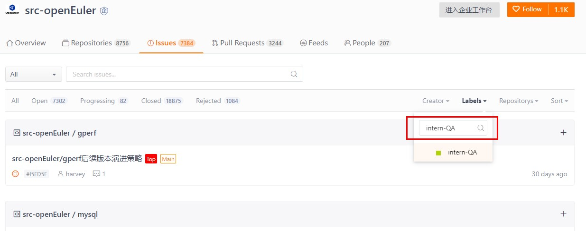
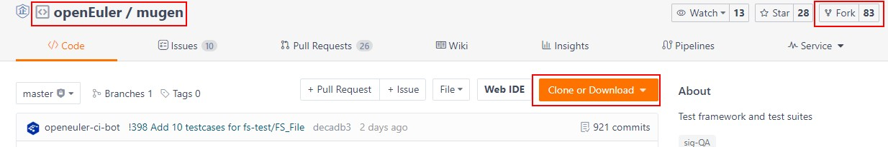
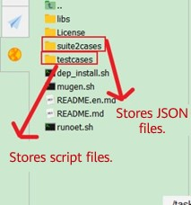
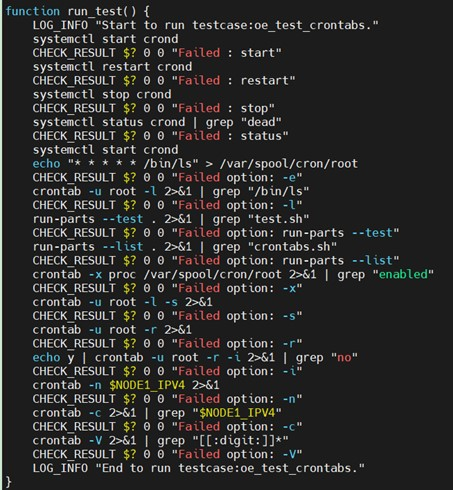

*Author: Qin Haiqi, a junior student majoring in Computer Science and Technology at Northeastern University at Qinhuangdao, participated in the open source internship program of the openEuler community. The following shares her experience in the hardening test of openEuler software packages in the QA SIG.*

## About the QA SIG

As a popular operating system, openEuler releases a large number of software packages. However, the released software may not be complete and may have quality and security problems. To reduce software development costs and risks, hardening tests on software packages must be performed.  
The openEuler community is organized into various special interest groups (SIGs) to better manage and improve workflows. The QA SIG is responsible for the software package hardening test. The SIG tests the software that forms the openEuler releases and improve the quality and test capability of the openEuler community. The team releases software package hardening tasks in the [src-openeuler](https://gitee.com/src-openeuler) repository. You can use the **intern-QA** label to locate all software package hardening test tasks and claim the tasks that you are interested in.

## Skills Required for Software Package Hardening Tests

The most important skill is to be familiar with the Linux commands and shell scripting language. The software runs on openEuler. Therefore, Linux commands are required to deploy the environment and execute the software packages. Besides, we need to compile shell scripts to execute test cases and submit the code to the repository. In a few cases, we may need to write code in other languages to verify the functionality of a software package, depending on the software to be tested.

## Test Procedure

1. Preparing the system environment

    Check the environment requirements in the task and select the correct OS version. The process of setting up the system environment is not described here. For details, see relative documents in the repository.

2. Deploying the test environment — mugen framework

    After deploying the system environment, deploy the test environment. The mugen test framework is used. The framework can be obtained from [https://gitee.com/openeuler/mugen](https://gitee.com/openeuler/mugen).

   

mugen framework

 

3. Learning the mugen framework

    The mugen framework is the right tool for us to complete the tasks. The framework specifies how to execute test cases and how to compile shell scripts. In addition, it can be used to invoke various public functions directly. After we are familiar with the mugen framework, we can learn how to write and run a test case through the **README.md** file in the mugen repository.

    The mugen framework has two important folders: **suite2cases** and **cli-test** under **testcases**. In **suite2cases**, we need to write a JSON file to store the test case names (script file names). When the JSON file contains multiple test cases, we can use commands to determine whether to execute one or more test cases at a time. **cli-test** stores script files. Learn more by reading documents in the mugen repository and watching online tutorial videos.

   

Important folders of mugen

 

4. Performing tests on software

   After preparing the environment, we can test software. First, we need to be familiar with the functions and commands of the software to be tested, for example, cron. The test objective is to verify all commands of the software CLI. Only after fully understanding the functions of the software can we achieve the objective with half the effort. To learn the functions, we can read documents about commands and even source code of the software.

   

   

   crontab commands to be tested
   
   

   For the software package test, the test points include but are not limited to whether the software can be normally downloaded, installed, started, closed, and uninstalled, whether each command of the software can be normally executed, and whether expected execution results can be obtained. After the test, ensure that all files related to the software are cleared and restored. In this way, the test on the software package is complete. If any problem is found during the test, submit issues to the corresponding software package repository for developers to solve the problem.

   

Function test example

   

5. Submitting test results

   After the code is compiled and all commands are tested, submit the code. After the mugen repository is configured, redundant files are generated. These files do not need to be submitted and must be deleted before submission. We can compare the files with those in the mugen repository to determine files to be deleted. When submitting a PR, we need to link the PR to our task and attach the screenshot of the successful running of the test case. 

   During the test, if we encounter problems that we cannot handle by ourselves, we can ask our mentor who is responsible for the task. The mentor will help us deal with them. After the PR is submitted, the mentor will leave a message about problems in the PR. Reply to the message in time and make modifications based on the message.

## Gains and Suggestions

Participation in the open source internship program of the openEuler community is of great significance to my personal development. After completing the software package hardening test task, I am more familiar with the use of Linux commands and the compilation of shell scripts. The process of testing the software package is actually a process of learning the software. In future learning or work, the software may be used to solve problems in a certain scenario. For example, cron can be used in scenarios related to scheduled tasks, which I am not clear before participating in the task of testing it.

It is a nice try to participate in QA SIG tasks. Do not feel timid due to insufficient knowledge in a certain field. On the contrary, it is a good opportunity to improve ourselves. Try and explore it, and you can find a solution.
