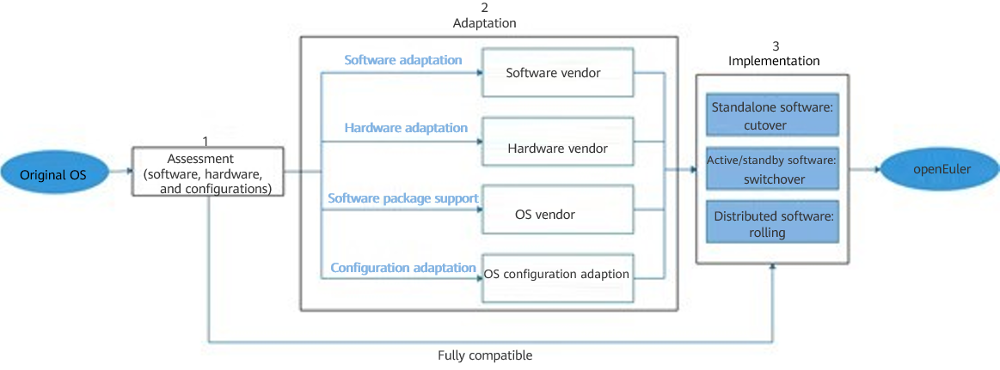
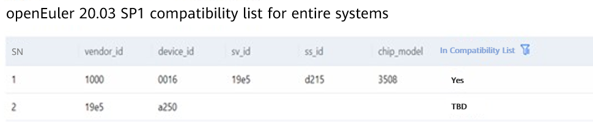

## Background

At the end of 2021, CentOS 8 was discontinued, which attracted great attention in the industry. Porting CentOS is not an easy task. In addition to replacing, adapting, porting, and rebuilding the OS and its application software and service systems, you need to consider the stability, security, and flexibility of the OS, porting costs, and partner ecosystem.

After some surveys, we decided to port CentOS to openEuler. The reason was that the openEuler kernel originates from Linux, supports various scenarios, and is stable and easy to use. It has a relatively complete compatibility assessment tool, reducing some of our work. In addition, its partner ecosystem is well developed, covering processors, completely built units, base software, application software, and industry customers. More than 10 mainstream OSVs have released openEuler-base commercial distributions. Developers in the community are also active and can provide some support for questions or requirements. openEuler is open source, rendering a low porting cost.

The following is my experience in porting CentOS to openEuler. I hope it is helpful to you.


## 1. **Overview**

### 1.1 Precautions

Key issues:

From CentOS to openEuler, both the kernel and base software packages are changed. According to our analysis, there are three key issues in OS porting:

   1. Can the existing software run on the new OS? Are there any problems with software installation and functions?
   2. Is the hardware compatible with the new OS?
   3. Can the existing configurations be inherited by the new OS?

Precautions for porting implementation:
   1. Services on the live network may be affected. Plan the porting time window and resources in advance.
   2. Back up the data on the live network.
   3. You are advised to strictly follow the process described in this article.
   4. It is recommended that professional personnel port services on the live network. You are advised to contact the O&M personnel of the OS vendor for technical support.

### 1.2 Solution


The main procedure for the porting of the OS and application software is as follows:

1. Assessment (software, hardware, and configurations)

2. Adaptation (software, hardware, dependencies, and configurations)

3. Implementation (standalone software, active/standby software, and distributed software)

You can use the x2openEuler tool provided by the openEuler community to assess the software and hardware compatibility. If there are compatibility issues, perform adaptation by referring to chapter 3 "Adaptation" in this article. After you complete the adaptation, perform porting. If there is no compatibility issue, perform the porting directly. The general solution includes three scenarios: new deployment, capacity expansion, and in-place replacement, and supports software forms such as standalone software, active/standby software, and distributed software.



## 2. Assessment

[x2openEuler](https://repo.oepkgs.net/openEuler/rpm/openEuler-20.03-LTS-SP1/stable/contrib/x2openEuler/noarch/Packages/) can be used to analyze and generate a compatibility assessment report covering the following aspects:

- Software assessment

  Scans and assesses RPM, TAR, ZIP, GZIP, JAR, PY, PYC, SH, and BIN packages by identifying the list of software packages on which the applications depend, and generates an assessment report in the HTML format.

- Configuration collection and assessment

  Collects user environment configurations in the JSON format. 

  Collects information about hardware configurations, configuration interfaces, kernel option configuration parameters, system configuration parameters (**sysctl**, **proc**, and **sys**), environment variables, services, processes, ports, command interfaces, system call items, and device driver interfaces.

  Analyzes and assesses the configuration information.

- Hardware assessment

  Checks whether the entire system (x86/AArch64) and server boards (RAID/NIC/FC/IB/GPU/SSD/TPM) in the operating environment are in the openEuler compatibility list.

For details about how to use the tool and its functions, see the [x2openEuler User Guide](https://docs.openeuler.org/en/docs/20.03_LTS_SP1/docs/thirdparty_migration/x2openEuleruserguide.html).


### 2.1 x2openEuler

Download the tool of the latest version suited for the architecture.

```
wget https://repo.oepkgs.net/openEuler/rpm/openEuler-20.03-LTS-SP1/contrib/x2openEuler/x86_64/Packages/x2openEuler-2.0.0-430.x86_64.rpm
```

Install x2openEuler.

```
yum install x2openEuler-x.x-x.x86_64.rpm
```

### 2.2 Application Software Compatibility

The following describes how to assess the **read-os-1.0.0-1.el7.aarch64.rpm** application package and generate a software assessment report. You should replace the package with the actual software package or software package directory to be scanned.

```
x2openEuler scan read-os-1.0.0-1.el7.aarch64.rpm
```

According to the report, incompatible dependency packages and interfaces exist. To address this issue, perform adaption by referring to sections 3.1 and 3.2.

### 2.3 Hardware Compatibility

The following uses local hardware resource information as an example. You can choose to analyze local hardware resource information or import external hardware information based on your requirements.

```
x2openEuler hardware-analyse
```

According to the report, incompatible hardware exists. To address this issue, perform adaption by referring to section 3.3.

### 2.4 Configuration Compatibility

The following uses the local configurations as an example. You can replace the configurations with those of the external system to be assessed.

```
x2openEuler conf-analyse 
```
According to the report, changed configurations exist. To address this issue, perform adaption by referring to section 3.4.

## 3. Adaptation

The porting adaptation is performed based on the assessment report. Choose an adaptation solution based on the error details in the report.

### 3.1 Application Software

The **read-os-1.0.0-1.el7.aarch64.rpm** assessment report in section 2.2 shows that the invoked interface changes, that is, a deprecated interface is invoked.

To solve this problem, contact the software vendor or the software owner for support.

Compatible software can be directly used.

### 3.2 OS Software Packages

The **read-os-1.0.0-1.el7.aarch64.rpm** assessment report in section 2.2 shows that the following dependency package is missing:



In this case, you need to import the package by referring to the [software compatibility adaptation process](https://gitee.com/openeuler/oec-application/blob/master/doc/openEuler%E7%A4%BE%E5%8C%BA%E5%BC%80%E6%BA%90%E8%BD%AF%E4%BB%B6%E9%80%82%E9%85%8D%E6%B5%81%E7%A8%8B.md). After the adaptation is complete, import the software package to the software repository and update the software compatibility list as required.

Compatible software can be directly used.

### 3.3 Hardware

The hardware assessment report in section 2.3 shows that the hardware type to be confirmed exists in the compatibility list.

You need to cooperate with the hardware vendor or community to perform adaptation by referring to the [hardware compatibility test procedure](https://www.openeuler.org/en/compatibility/hardware/). After the adaptation is complete, release the adapted drivers to the software repository and update the compatibility list.

If **In Compatibility List** is **Yes**, the hardware has passed the compatibility check. You can go to the next step.

### 3.4 Configurations

According to the configuration assessment report, the x2openEuler tool automatically classifies system configurations into static and dynamic configurations. You only need to compare the differences based on actual service requirements and tuning policies, select the configurations to be modified, and compile automation scripts to implement one-click configuration synchronization.

## 4. Implementation (Existing System Replacement)

Before the porting, familiarize yourself with the software deployment architecture and networking and design a porting solution. Currently, openEuler provides porting solutions for mainstream scenarios, such as big data, distributed storage, virtualization, container, and database software, successfully supporting the porting for multiple industry users. For porting support, contact openEuler O&M personnel. The porting implementation process includes services shutdown, backup isolation, system deployment, configuration synchronization, application deployment, and service cutover.

### 4.1 Services Shutdown

Before the porting, apply for a shutdown window and make preparations. Access the shutdown window based on the service scenario and cutover difficulty. In common standalone software, active/standby software, and distributed cluster software scenarios, services of different application software can proceed without interruption or be interrupted for a short period of time. The specific scenarios need to be analyzed based on the application software.

- Standalone software: Services will be interrupted for *x* hours.

- Active/standby software: no shutdown

- Distributed cluster software: no shutdown

### 4.2 Backup Isolation

To ensure service application security and prevent information loss, you are advised to back up data before the porting. Isolating the backup prevents the porting from affecting other services. DR, backup, and network isolation can be implemented based on service software features in different service scenarios. For example, in the MySQL database scenario, tools such as XtraBackup can be used to quickly back up and restore data.

### 4.3 System Deployment

The system deployment tool can be used to automatically deploy systems in batches, greatly improving deployment efficiency. During the deployment, you can use the gkit tool to set up a PXE server. After the configuration file is synchronized, the installation can be quickly completed.

1) Configure PXE server information.   

2) Import the configured template and click **Install** to automatically configure the PXE server.   

3) If the PXE service status is green, the PXE server has been set up.   

4) Log in to the KVM of the server, set the server to boot from PXE, and restart the server.   

5) The subsequent steps are automatically completed. The IP address is configured synchronously. The OS installation is complete.

### 4.4 Configuration Synchronization

Complete adaptation by referring to section 3.4. Use the configuration tool integrated in x2openEuler to implement one-click synchronization of system parameter configuration and service status configuration. This ensures that the basic running environment and status are synchronized and ported, and the system running environment status can be retained after service cutover.

### 4.5 Application Deployment

Before deploying an application, you can pack the application to be deployed into an RPM package, compile the application deployment and installation script, and verify the script in the lab environment to ensure the accuracy of the deployment script. After basic verification, copy the script to the servers to be deployed in batches and execute the script to complete automatic application deployment. For mainstream open source software in the fields of big data, databases, virtualization, and containers, openEuler provides complete RPM packages, which can be directly applied and deployed.

### 4.6 Service Cutover

During service cutover, the features of application software must be considered to minimize service interruption and implement efficient and smooth cutover. For standalone, active/standby, and distributed cluster software, the service cutover processes are as follows:

1. Standalone software

    During the cutover of this type of software, the OS needs to be switched, which interrupts services. Therefore, you need to consider the impact of the porting and select a proper window. You can use the standby server to perform the cutover. After the cutover is complete, retain the original node for *x* days and observe the service running of the new node during the period of time. If the service runs properly, destroy the original node.

2. Active/Standby software

  During the cutover of this type of software, services are not interrupted. The standby node is ported first and then the active node. The cutover is smooth based on the active/standby status synchronization mechanism. Isolate the standby node, re-deploy the OS and services on the standby node, and implement active/standby synchronization. Then, perform an active/standby switchover to switch the standby node whose OS has been upgraded to the active node, and upgrade the OS on the other node in the same way. After the active/standby switchover, observe the service running of the new active node. After x days, replace the standby node.

3. Distributed cluster software

  During the cutover of this type of software, services are not interrupted. Smooth cutover can be achieved through the capacity scaling mechanism of the distributed software and rolling replacement. Isolate the node to be replaced, deploy a new OS, and add the node to the original cluster. After one third of the nodes are switched, observe the service running of the new node. After x days, replace the old node.

## 5. Implementation (New Deployment and Capacity Expansion)

### 5.1 System Deployment

The system deployment tool can be used to automatically deploy systems in batches, greatly improving deployment efficiency. During the deployment, you can use the gkit tool to set up a PXE server. After the configuration file is synchronized, the installation can be quickly completed.

1. Configure PXE server information.

2. Import the configured template and click **Install** to automatically configure the PXE server.

3. If the PXE service status is green, the PXE server has been set up.

4. Log in to the KVM of the server, set the server to boot from PXE, and restart the server.

5. The subsequent steps are automatically completed. The IP address is configured synchronously. The OS installation is complete.

### 5.2 Configuration Synchronization

Complete adaptation by referring to the porting adaptation chapter. Use the configuration tool integrated in x2openEuler to implement one-click synchronization of system parameter configuration and service status configuration. This ensures that the basic running environment and status are synchronized and ported, and the system running environment status can be retained after service porting.

### 5.3 Application Deployment

Before deploying an application, you can pack the application to be deployed into an RPM package, compile the application deployment and installation script, and verify the script in the lab environment to ensure the accuracy of the deployment script. After basic verification, copy the script to the servers to be deployed in batches and execute the script to complete automatic application deployment. For mainstream open source software in the fields of big data, databases, virtualization, and containers, openEuler provides complete RPM packages, which can be directly applied and deployed.

## 6. Summary

These are my experience and methods of porting. I hope this article is helpful.
