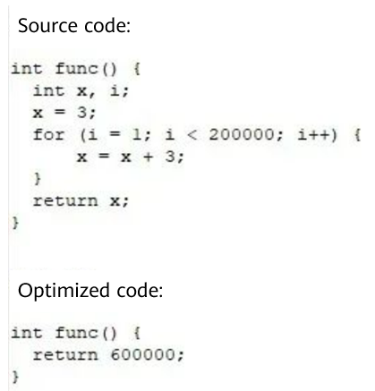
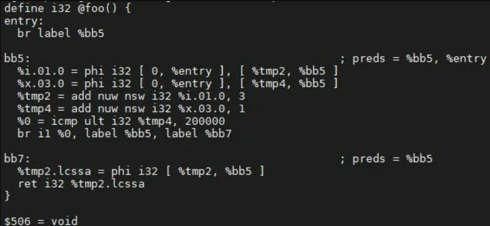
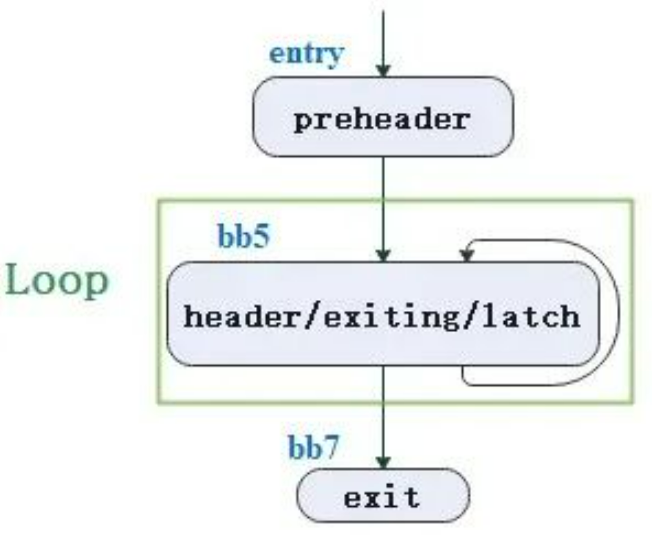
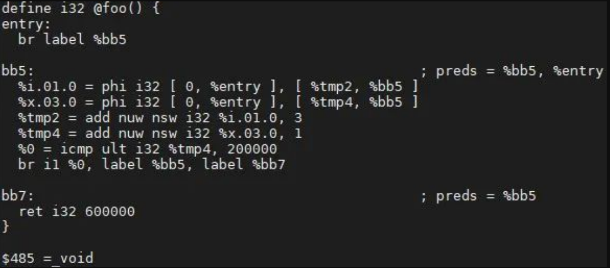
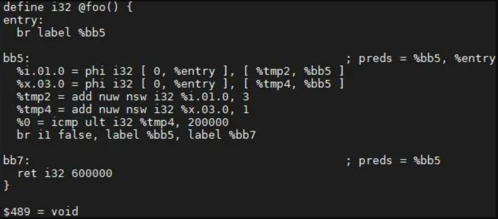

## 0. Basic Knowledge

### 0.1 Loop

**Definition**

A loop, or a natural loop in LLVM, is a set of nodes (L) from the control-flow graph (CFG) with the following properties [1] [2]:

- There is a single entry node (called a header), which controls all nodes in the loop.
- There is a backedge that enters the loop header.

**Terms**

- Entering block: A non-loop node that has an edge connected to the loop. If there is only one entering block and its only edge is connected to the header, it is also called the preheader. The peheader that functions as a non-loop node dominates the entire loop.
- Latch: A loop node that has an edge to the header.
- Backedge: An edge from the latch to the header.
- Exiting edge: An edge from inside the loop to a node outside the loop. The start node of the edge is called an exiting block, and the end node is called an exit block.

<div align=center>


</div><br>

In the figure on the right, the yellow area is a loop; the red area is not, because it has two entry nodes a and c.  

### 0.2 Scalar Evolution (SCEV)

**Definition**

SCEV is an optimization pass used by the compiler to analyze variables (usually integers). It is mainly used to analyze how variables in a loop are updated and then optimize variables based on the analysis.

**Chains of Recurrences **(**CR**)

As shown in the following figure, the start value of the induction variable `var` in the loop is *start*, the iteration mode is *ϕ*, and the step is *step*.

<div align=center>


</div><br>

Its CR is as follows:

```
var = {start, ϕ , step}
// ϕ∈{+,∗}
// start: starting value
// step: step in each iteration
````

Example:

```
int m = 0;
for (int i = 0; i < n; i++) {
  m = m + n;
  *res = m;
}
```

In the example, **m = {0, +, n}** is the CR.

## 1. Induction Variable

### 1.1 Definition

```
for (i = 0; i < 10; ++i) {
    j = 17 * i;
}
```

### 1.2 Benefits

The advantages of induction variable optimization include but are not limited to the following:

- The original calculation method could be replaced with a simpler instruction. For example, the multiplication in the code above can be replaced with an addition at a lower cost.

```
j = -17;
for (i = 0; i < 10; ++i) {
    j = j + 17;
}
```
- The number of induction variables is decreased to reduce the pressure on the register.

```
extern int sum;
int foo(int n) {
    int i, j;
    j = 5;
    for (i = 0; i < n; ++i) {
        j += 2;
        sum += j;
    }
    return sum;
}
```

The loop now has two induction variables: *i* and *j*. After one variable is used to express the other, the following information is displayed:

```
extern int sum;
int foo(int n) {
    int i;
    for (i = 0; i < n; ++i) {
        sum += 5 + 2 * (i + 1);
    }
    return sum;
}
```

- Induction variable substitution makes the relationship between variables and loop indexes clear, facilitating other optimization analyses, such as dependency analysis. In the following example, c is expressed as a function of a loop index.

```
int c, i;
c = 10;
for (i = 0; i < 10; i++) {
    c = c + 5; // c is incremented by 5 for each loop iteration
}
```

Then:

```
int c, i;
c = 10;
for (i = 0; i < 10; i++) {
    c = 10 + 5 * (i + 1);  // c is explicitly expressed as a function of loop index
}
```

## 2. Practices

### 2.1 Compilation Options

|Compiler|Option|
|--|--|
|gcc|fivopt|
|BiSheng Compiler|indvars|

### 2.2 Optimization Case

The induction variable optimization (ivs) is in **llvm\lib\Transforms\Scalar\IndVarSimplify.cpp**.
Let's look at the optimization process of the BiSheng Compiler through a use case.
As shown in the following figure, assume that the upper func part is the code to be optimized, and the lower func part is the expected result.

<div align=center>


</div><br>

Its IR case `test.ll` is as follows:

<div align=center>


</div><br>

The compilation command is as follows:

```
opt test.ll -indvars -S
```

In the current example, the `header`, `latch`, and `exiting block` are the same basic block (BB), that is, bb5.

<div align=center>


</div><br>

Step 1: Traverse the source of the operand of the `phi` node in `ExitBlock` of the `loop` based on the `def-use` relationship, calculate the final value, replace the operand, and then replace the phi node.

In the example, the only operand for calculating `%tmp2.lcssa` is `%tmp2 = add nuw nsw i32 %i.01.0, 3 `, and the loop where the expression is located is bb5. In this case, the CR of `%tmp2` is as follows:


```
%tmp2 = {3,+,3}<nuw><nsw><%bb5>
```

The maximum number of times that the current loop can be repeated before it exits is 199999, which means `%tmp2=add(3, mul(3,199999))=600000`. The current substitution cost is low (the cost calculation varies according to the architecture). Replace the value in the `user` of the `phi` node. The optimization results are as follows:

<div align=center>


</div><br>

Step 2: Traverse the `ExitingBlock`, calculate the jump condition, and delete the corresponding instruction according to the `def-use` relationship.
In the example, `%0` of `br i1 %0, label %bb5, label %bb7` is `false`. After the jump instruction is replaced, `%0 = icmp ult i32 %tmp4, 200000` does not have a user, so it is added to dead instructions. The optimization results are as follows:

<div align=center>



</div><br>

Step 3: Delete all dead instructions and check whether their operands need to be deleted.
In the example, `%tmp4`, as the operand of `%0`, has a user  `%x.03.0`, so it cannot be considered as a dead instruction to be deleted. The optimization results are as follows:

<div align=center>


</div><br>

## References

1. <https://llvm.org/docs/LoopTerminology.html>
2. Compilers: Principles, Techniques, & Tools by Alfred V. Aho (Author), Monica S. Lam (Author), Ravi Sethi (Author)
3. BiSheng Compiler: <https://www.hikunpeng.com/developer/devkit/compiler/bisheng>
4. Original text: <https://mp.weixin.qq.com/s/9CQheIx4nlPfp-xPff5PJQ>
---
Welcome to join the Compiler SIG to communicate about compilation technologies. Scan the QR code to add the assistant WeChat to invite you.

<div align=center>


</div><br>
