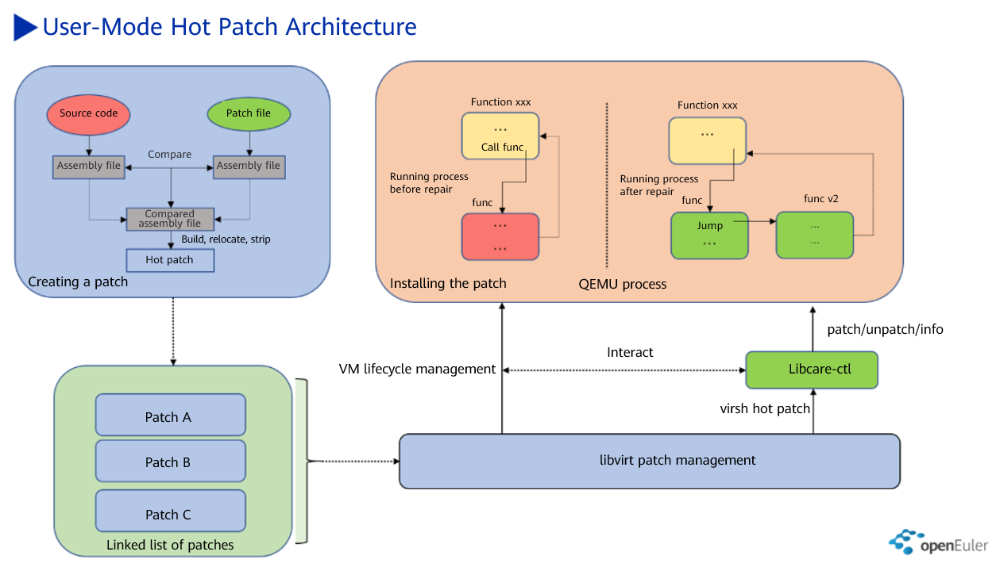
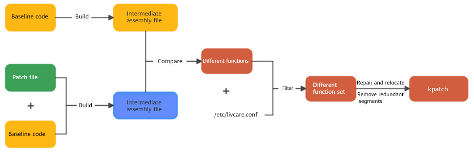
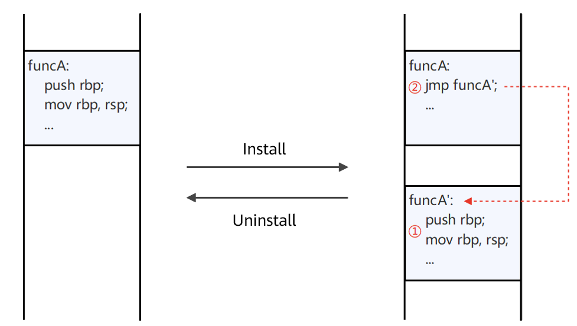

---

LibcarePlus, developed by the openEuler community together with the e-Cloud infrastructure team, is a hot patch framework for the AArch64 and x86 platforms. It can fix CVE vulnerabilities and emergency bugs that do not interrupt application services. This article briefly introduces the LibcarePlus hot patch technology. As a key technology of the openEuler community, it has attracted attention from developers.  

## Technical Background of Hot Patches

If a running program has vulnerabilities, the following solutions are available:

- Replace the OS with the latest version that contains the repair patch. In the networking environment with the active/standby switchover capability, you can migrate the running programs to the standby node. After the upgrade on the active node is complete, migrate the programs back to the active node.  
- Replace the RPM package of the program, and then restart the program (the compatibility of the dependency package needs to be considered). For the program that has the hotswap capability, the hotswap capability can be used to replace the problematic code of the program.  
- Install patches for the running program and replace problematic code to fix program vulnerabilities.  

The patch granularity of the above solutions changes in descending order.  
- The first solution is system-level, which mainly involves live migration technology.
- The second solution is RPM package-level, which mainly involves hotswap.
- The third solution is program-level, which mainly involves hot patches.

The service interruption duration of the above solutions also changes in descending order.  
- The technology of the first solution interrupts services for several minutes, and the active/standby switchover of the entire system is required. The upgrade period is the longest with an upgrade window of several months.  
- The technology of the second solution interrupts services for hundreds of milliseconds. It is not universal and requires intrusive modification and adaptation of a large amount of service code. The upgrade period is relatively short with an upgrade window of one month.  
- The technology of the third solution interrupts services for several milliseconds. It is universal and does not require intrusive modification or adaptation of the service code. Only part of the common code needs to be adapted. The upgrade period is relatively short with an upgrade window of one month.  

Based on the preceding analysis, we can summarize the following advantages of hot patches:  

1. Hot patches can fix program vulnerabilities without affecting services on the live network.   
2. Hot patches are applicable to market environments that require quick response and simplify verification from version verification to patch verification.   

To sum up, hot patches are suitable for scenarios that require a quick response.    

## Basic LibcarePlus Principles

LibcarePlus is an independent branch derived from the upstream community LibCare. Currently, it is maintained by the openEuler community. Compared with LibCare, LibcarePlus supports mainstream x86_64 and AArch64 architectures, openEuler QEMU component, function-level filtering, incremental patches, and patch file parsing.  

Take the LibcarePlus QEMU hot patch technology as an example. The following figure shows the overall architecture of the hot patch.  

LibcarePlus work process includes hot patch creation, patch management, and patch installation/uninstallation.  

### 1. Creating a Hot Patch

A LibcarePlus hot patch is created by using the assembly-level instruction comparison technology. LibcarePlus compares the intermediate assembly file generated by the baseline code with that generated by the patched baseline code to find the differences. Then, LibcarePlus removes redundant sections and repairs and relocates information based on the differences to obtain the hot patch **kpatch** file. Before analyzing assembly differences, LibcarePlus divides assembly content into function blocks and variable blocks based on certain key information. Then, LibcarePlus compares the differences between function blocks and variable blocks to find the functions and variables that are different. The following figure shows the process of creating a patch.  

### 2. Managing QEMU Hot Patches

The following figure shows the basic principles of hot patch installation and uninstallation.  

 

The LibcarePlus hot patch is installed or uninstalled by using the ptrace call provided by the kernel. ptrace freezes the target process for a short period of time. Then, it checks the security of the patch installation environment. If the environment is secure, it inserts the adapted patch file into the memory hole of the target process through mmap. After the preceding steps are finished, the code of the first five bytes of the defect function is modified so that the defect function jumps to the address of the new function when being invoked. In this way, the hot patch takes effect. Finally, the target process is unfrozen.  

In the process of hot patch installation, the first five bytes of the code replaced are saved in the management structure of the hot patch of the target process. To uninstall the hot patch, you can roll back it to the source version, that is, writing the five bytes of the code replaced to the original address.  

## Join Us

LibcarePlus has been open-sourced in the openEuler community. In the future, we will share a series of technologies to help you understand LibcarePlus in detail. If you are interested in the hot patch technology, you are welcome to join us. You can scan the assistant QR code and reply "LibcarePlus" to join the SIG.  

Project address: <https://gitee.com/openeuler/libcareplus>

Project issues: <https://gitee.com/openeuler/libcareplus/issues>

