# Start from Scratch: Building a BiSheng JDK RPM Package (on openEuler and Raspberry Pi)

BiSheng JDK is the open source version of Huawei JDK customized for Huawei internal OpenJDK. It is a high-performance OpenJDK distribution that can be used in production environments. Huawei JDK runs on more than 500 Huawei products, and its development team has accumulated rich development experience, resolved countless issues encountered in actual service running, and improved the JDK performance on the ARM architecture. Therefore, BiSheng JDK can achieve better performance in big data scenarios.

Red Hat Package Manager (RPM) is a software package management system running on Red Hat Enterprise Linux, CentOS, and Fedora. It can easily distribute, manage, and update software created for Red Hat Enterprise Linux, CentOS, and Fedora. Packaging software into RPM packages includes: (re)installing, deleting, upgrading, and verifying the software packages; packaging original software sources into source and binary packages; adding the software packages to Yum repositories; and signing digital signatures.

This document analyzes the RPM package build process of OpenJDK-1.8.0 on a VM and on a Raspberry Pi, both with openEuler installed.

## Build Process of openEuler-based BiSheng JDK RPM Packages

### 1. openEuler Installation

#### Downloading the openEuler Image File

openEuler, an open source OS, is designed based on the Linux kernel and developed by global open source contributors. It supports Kunpeng and other processors and can fully unleash the potential of computing chips. It has become essential for database, big data, cloud computing, and artificial intelligence (AI) scenarios. In addition, openEuler provides entry to the open source OS community, where global developers can collaborate to build an innovative, unified, and open OS that supports the multi-processor architecture, to advance the hardware/software applications.

Visit the [official openEuler website](https://www.openeuler.org/en/download/) and download the required version. In this example, select openEuler 20.03 LTS. openEuler 20.03 LTS is a standard distribution, whose lifecycle is four years. It meets the requirements of open solutions.  

  

Click **Download** on the card of the selected version. On the **Download** page, select **ISO/** to download the image CD-ROM file. You can use the burning software to directly burn the ISO file into a system CD-ROM that can be installed. The ISO file name extension is .iso.  

  

In the **ISO/** index, select the system to be downloaded. The ISO download list of openEuler 20.03 LTS provides the AArch64 ISO, x86_64 ISO, and openEuler source code ISO. Here, we use the x86_64 ISO.  

  

In the **/openEuler-20.3-LTS/ISO/x86_64/** index, download the required ISO file. Here, we download **openEuler-20.03-LTS-x86_64-dvd.iso**.  

  

#### Creating a VM

Use the VMware Workstation or Oracle VM software to create a VM, with the downloaded ISO image file **openEuler-20.03-LTS-x86_64-dvd.iso**.  

On the openEuler **INSTALLATION SUMMARY** page, set the installation parameters, such as the **Keyboard**, **Language Support**, **Time & Date**, and **Installation Destination**.  

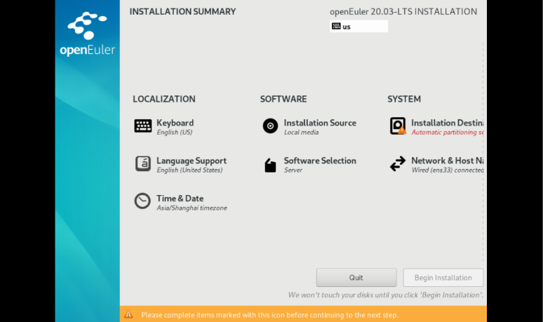  

On the **INSTALLATION SUMMARY** page, select **Installation Destination** and set the installation disk and partition of the OS.  

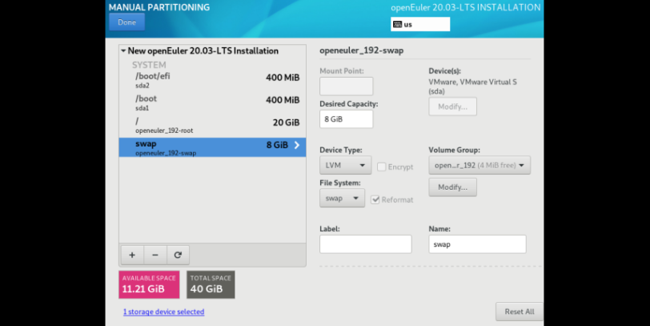  

Set the password for the **root** user of the VM. A **root** account is used to run administration tasks of key systems. It is not recommended during daily work or system access.   

  

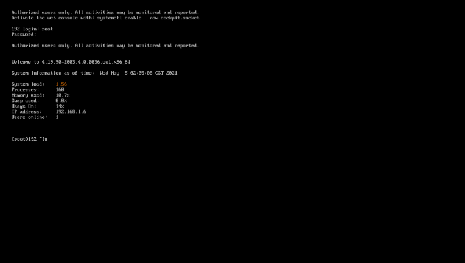  

#### Creating a User Account

```
useradd zhangsan   // Create an individual user account.
passwd zhangsan    // Change the personal password.
su - zhangsan      // Switch to the individual user account.
```
  
  

The password of the **root** user and the password of the new user must meet the password complexity requirements; otherwise, the password configuration or user creation will fail. Password complexity requirements: Each password must contain at least eight characters, including at least three types of the following characters: uppercase letters, lowercase letters, digits, and special characters.  
Note: The password cannot be the same as the account and cannot be a password in the weak password dictionary.

#### MobaXterm: Remote Network Access Tool

MobaXterm is a toolbox for remote computing. Its intuitive user interface allows you to access remote servers through different networks or systems. After a VM is created and configured, you can access it using MobaXterm. The IP address of the VM is allocated after the VM is created.

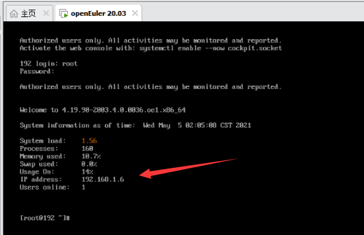  

Remotely access the openEuler VM using the corresponding IP address, username, and password.

  

### 2. Dependency Installation and Source File Download

#### Installing the RPM Build Toolkit

`yum install rpm-build rpm-devel rpmdevtools`  

  

Check the utilities for RPM packaging provided by the software package: `rpm -ql rpmdevtools | grep bin` `rpm -ql rpm-devel | grep bin` `rpm -ql rpm-build | grep bin`  

  

**rpmdev-setuptree** creates the directory layout for constructing the RPM packaging space.  
**rpmdev-newspec** creates an empty SPEC file.  
**rpmbuild** creates an actual RPM software package from the SPEC file.  
**rpmspec** queries the parsed output of specifications.

#### Generating the rpmbuild Directory and Related Subdirectories

Go to the personal folder and run `rpmdev-setuptree` to automatically create the rpmbuild directory and related subdirectories.  

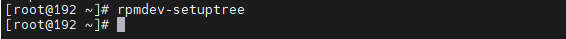  

The following figure shows the generated rpmbuild directory and its subdirectories.   
**BUILD**: During package build, `%buildroot` creates various directories here. If the log output does not provide sufficient information, it is useful to investigate failed builds.  
 **RPMS**: Binary RPMs are created in its subdirectories of different architectures (for example, `x86_64` and `noarch`).  
 **SOURCES**: This folder stores the compressed source code archives and patches. The `rpmbuild` command can be found here.  
 **SPECS**: This folder stores SPECS files.  
 **SRPMS**: If `rpmbuild` is used to build SRPM instead of binary RPM, the result SRPM is created here.


#### Preparing the Source Package and SPEC File

In the **/rpmbuild/SOURCES/** directory, download the jdkSource file for building the RPM package by running `git clone https://gitee.com/src-openeuler/openjdk-1.8.0.git`. The URL of the openJDK is [https://gitee.com/src-openeuler/openjdk-1.8.0](https://gitee.com/src-openeuler/openjdk-1.8.0). If you want to build the JDK of another version, replace the URL.  

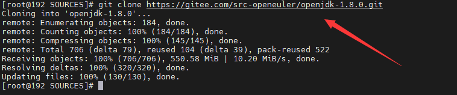  

Move the SPEC file in the downloaded JDK package to the **SPECS** folder.  
`mv ./openjdk-1.8.0/*spec ../SPECS/`  

  

  

Move other files in the JDK package to the **SOURCE** folder.  
`mv ./openjdk-1.8.0/* ./`  

  

  

#### Installing and Configuring JDK 8

You can use `yum list | grep openjdk` to check the JDK version that can be installed in the Yum source of openEuler and install the JDK. If the required JDK is not available, install it or update the Yum source.  

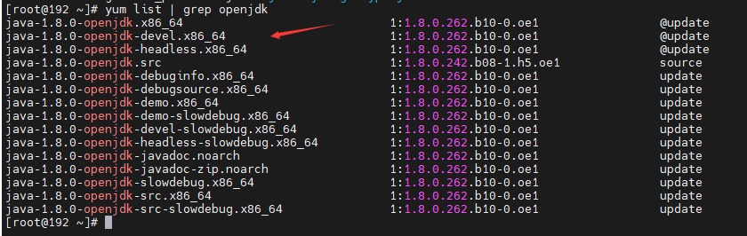  

Installation command: `yum install java-1.8.0-openjdk.x86_64`  

Check whether the JDK is installed successfully.  
`java -version`  

  

The following lists the versions provided by each OpenJDK Yum source.  

[https://repo.openeuler.org/openEuler-20.03-LTS/OS/x86_64/Packages/](https://repo.openeuler.org/openEuler-20.03-LTS/OS/x86_64/Packages/)  

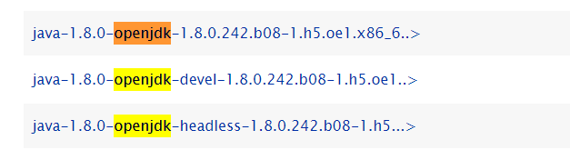  

[https://repo.openeuler.org/openEuler-20.03-LTS/everything/x86_64/Packages/](https://repo.openeuler.org/openEuler-20.03-LTS/everything/x86_64/Packages/)  

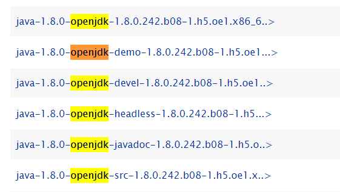  

[https://repo.openeuler.org/openEuler-21.03/everything/x86_64/Packages/](https://repo.openeuler.org/openEuler-21.03/everything/x86_64/Packages/)  

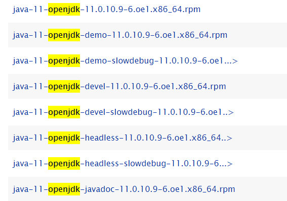  

#### Installing the Dependencies  

 `yum install alsa-lib-devel cups-devel elfutils-devel fontconfig-devel freetype-devel giflib-devel harfbuzz-devel lcms2-devel nss-devel`  

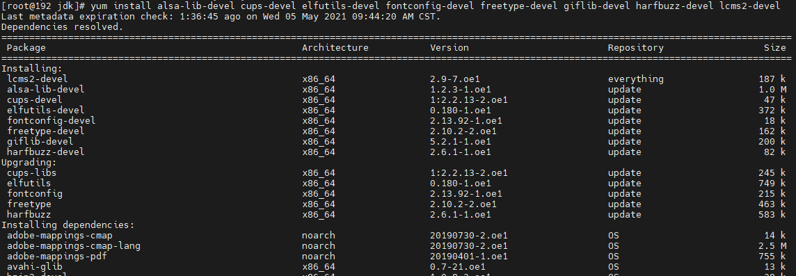  

To install other required dependencies, run the `yum install package` command.

### 3. RPM Package Build

Go to the **SPECS** folder and enter the corresponding command as required to start the build.  

```
rpmbuild -bi java-1.8.0-openjdk.spec // Execute script in the install phase.   
rpmbuild -bb java-1.8.0-openjdk.spec // Generate the RPM binary package.  
rpmbuild -bs java-1.8.0-openjdk.spec // Generate the RPM source package.  
rpmbuild -ba java-1.8.0-openjdk.spec // Generate the RPM binary package and source package.
```

 The RPM package build complete.

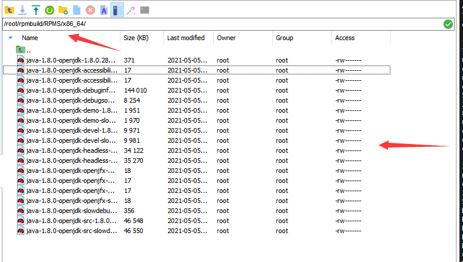  

File list  
  
  

### 4. Common Errors and Solutions

#### Error: There are no enabled repositories in "/etc/yum.repos.d"  

  

Solution:

`cd /etc/yum.repos.d`

`vi openEuler_x86_64.repo` (or `vi openEuler_aarch64.repo` for AArch64 OSs)

Content to be added:  

```
#generic-repos is licensed under the Mulan PSL v2.
#You can use this software according to the terms and conditions of the Mulan PSL v2.
#You may obtain a copy of Mulan PSL v2 at:
#    http://license.coscl.org.cn/MulanPSL2
#THIS SOFTWARE IS PROVIDED ON AN "AS IS" BASIS, WITHOUT WARRANTIES OF ANY KIND, EITHER EXPRESS OR
#IMPLIED, INCLUDING BUT NOT LIMITED TO NON-INFRINGEMENT, MERCHANTABILITY OR FIT FOR A PARTICULAR
#PURPOSE.
#See the Mulan PSL v2 for more details.

[OS]
name=OS
baseurl=http://repo.openeuler.org/openEuler-20.03-LTS/OS/$basearch/
enabled=1
gpgcheck=1
gpgkey=http://repo.openeuler.org/openEuler-20.03-LTS/OS/$basearch/RPM-GPG-KEY-openEuler

[everything]
name=everything
baseurl=http://repo.openeuler.org/openEuler-20.03-LTS/everything/$basearch/
enabled=1
gpgcheck=1
gpgkey=http://repo.openeuler.org/openEuler-20.03-LTS/everything/$basearch/RPM-GPG-KEY-openEuler

[EPOL]
name=EPOL
baseurl=http://repo.openeuler.org/openEuler-20.03-LTS/EPOL/$basearch/
enabled=1
gpgcheck=1
gpgkey=http://repo.openeuler.org/openEuler-20.03-LTS/OS/$basearch/RPM-GPG-KEY-openEuler

[debuginfo]
name=debuginfo
baseurl=http://repo.openeuler.org/openEuler-20.03-LTS/debuginfo/$basearch/
enabled=1
gpgcheck=1
gpgkey=http://repo.openeuler.org/openEuler-20.03-LTS/debuginfo/$basearch/RPM-GPG-KEY-openEuler

[source]
name=source
baseurl=http://repo.openeuler.org/openEuler-20.03-LTS/source/
enabled=1
gpgcheck=1
gpgkey=http://repo.openeuler.org/openEuler-20.03-LTS/source/RPM-GPG-KEY-openEuler

[update]
name=update
baseurl=http://repo.openeuler.org/openEuler-20.03-LTS/update/$basearch/
enabled=1
gpgcheck=1
gpgkey=http://repo.openeuler.org/openEuler-20.03-LTS/OS/$basearch/RPM-GPG-KEY-openEuler
```

The Yum source is from Gitee. The link is [https://gitee.com/src-openeuler/openEuler-repos/blob/openEuler-20.03-LTS/generic.repo#](https://gitee.com/src-openeuler/openEuler-repos/blob/openEuler-20.03-LTS/generic.repo#).  

#### Error: Failed build dependencies: packages is needed by java-1.8.0-openjdk-1:1.8.0.282.b08-17.x86_64  

  

Cause: Packages required for RPM package build are not installed in the SPECS file.  

Solution: Run the `yum install packages` command to install the packages.  

`yum install gdb java-1.8.0-openjdk-devel libX11-devel libXext-devel libXi-devel libXinerama-devel libXrender-devel libXt-devel libXtst-devel libjpeg-devel openssl-devel`  

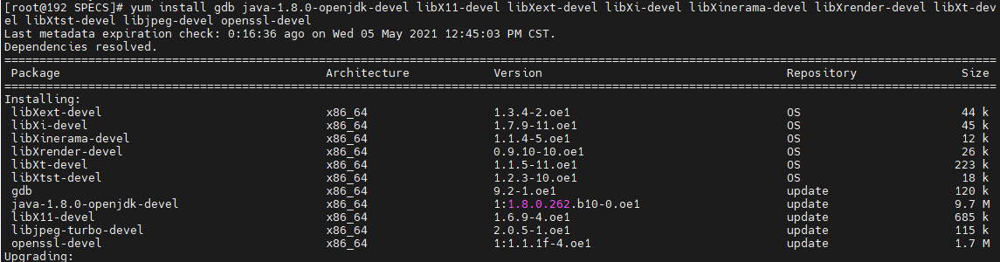  

#### Error: java-8-openjdk-devel is is needed by xxx  

Cause: openjdk-devel is required in **BuildRequires** in the SPEC file, but the current OpenJDK version does not meet the requirement.  

Solution: If you are sure that the installed OpenJDK version meets the build requirements, comment out the line or modify the version requirements. If you are not sure whether the current version meets the build requirements, install and configure the OpenJDK version as required.  

  

#### Error :tzdate-java>=2020a is needed by xxx  

Cause: The tzdate-java version is specified in **BuildRequires** in the SPEC file, but the installed version does not meet the requirement.  

Solution: If you are sure that the installed tzdate-java version meets the build requirements, comment out the line or modify the version requirements. If you are not sure whether the current version meets the build requirements, install and configure the tzdate-java version as required.  

  

#### Error: Bad exit status from /var/tmp/rpm-tem.f4PLQX(%build)  

Cause: JDK 8 has been configured in the system, but the downloaded SPEC file has not been modified. You need to access the SPEC file and change the JDK path to the local JDK 8 path.  

`vim /root/rpmbuild/SPECS/java-1.8.0-openjdk.spec?configure`  

Find the **configure** location and change the JDK path to the local JDK 8 path.  

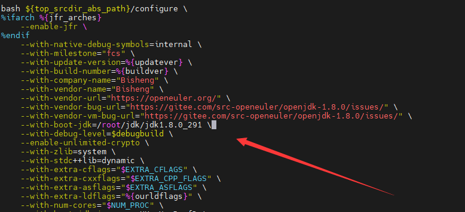  

### 5. RPM Package Build for Other JDK Versions  

For other JDK versions, such as JDK 11 and JDK 15, if you want to build RPM packages, you only need to download the JDK source package of the corresponding version, replace the corresponding URL, and change the JDK path to the corresponding local JDK path. The build process is the same as that of JDK 8. If an error message is displayed, refer to solutions provided in this section.  

## Build Process of openEuler-based Raspberry Pi RPM Packages  

### 1. Installation of the openEuler ISO Image  

#### Installation Requirements

The Raspberry Pi where you want to install the openEuler OS must meet the following hardware compatibility and minimum hardware requirements: Raspberry Pi versions 3B, 3B+, and 4B; Memory: at least 4 GB for better application experience; Drive: at least 8 GB for better application experience. The Raspberry Pi official website is [https://www.raspberrypi.org/](https://www.raspberrypi.org/), and the openEuler community website is [https://www.openeuler.org/en/download/](https://www.openeuler.org/en/download/).

#### Obtaining the Installation Source

Obtain the Raspberry Pi image and its verification file released by openEuler. Log in to the [openEuler community](https://www.openeuler.org/en/download/) and click **Download** on the **openEuler 20.03 LTS SP1** card.  

  

Click **raspi_img**. The Raspberry Pi image download list is displayed.  

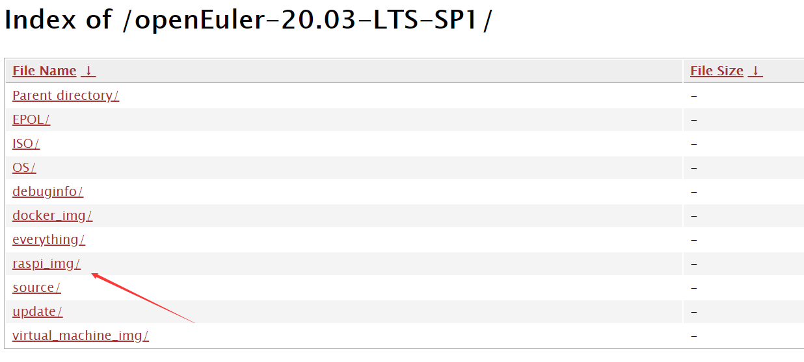  

Click **openEuler-20.03-LTS-SP1-raspi-aarch64.img.xz** to download the Raspberry Pi image released by openEuler to your local PC.  

  

#### Formatting the SD Card  

Download and install an SD card formatting tool. The following uses the DiskGenius disk formatting tool as an example.  

Select the drive letter of the SD card to be formatted, delete its content, and save the file.  

Select the disk whose content has just been deleted, create a partition, set the file system type to FAT32, and save and format the disk.  

#### Writing the Image File to the SD Card  

Download and install an image writing tool. The following uses Win32 Disk Imager as an example.

Select the **openEuler-20.03-LTS-SP1-raspi-aarch64.img** image file in the image file download path, select the drive letter of the SD card as the device, and click **Write**.  

>Note: After the image file is written, the disk capacity of the SD card decreases because the ext file system cannot be identified in Windows. This is normal.

#### Starting the System

Insert the SD card after image writing into the Raspberry Pi and power it on.

#### Logging In to the System

You can log in to the Raspberry Pi in either of the following ways: local login and SSH remote login.

Local login: After the Raspberry Pi is connected with the monitor, keyboard, and mouse, start the Raspberry Pi and you can view the Raspberry Pi startup logs on the monitor. After the Raspberry Pi is started, enter the username (**root**) and password (**openeuler**) to log in.

SSH remote login: If the Raspberry Pi is connected to a known router, you can log in to the router to view the new IP address (that is, the Raspberry Pi IP address). Alternatively, you can use an IP address scanning tool to scan the Raspberry Pi IP address. The following uses advanced_ip_scanner as an example.  

  

For example, if the IP address of the Raspberry Pi is 192.168.1.9, you can use the remote network access tool MobaXterm to access the Raspberry Pi.  

  

If the remote access is successful, enter the username (**root**) and password (**openeuler**) to log in. The following figure shows the window for using MobaXterm to access the openEuler system on the Raspberry Pi.  

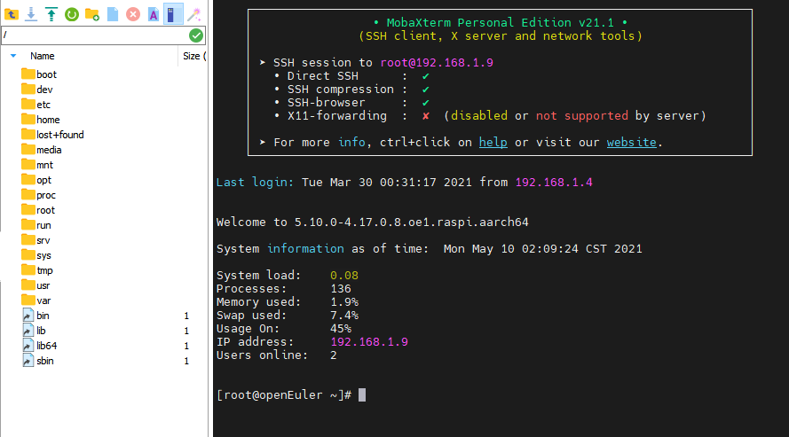  

### 2. Installing Yum on Raspberry Pi openEuler

Log in to the system and run **yum** to install packages and dependencies. The message `-bash: yum: command not found` is displayed.  

  

You need to manually install `yum-4.2.23-3.oe1.noarch.rpm` and upload it.

URL: [https://repo.openeuler.org/openEuler-20.03-LTS-SP1/everything/aarch64/Packages/yum-4.2.23-3.oe1.noarch.rpm](https://repo.openeuler.org/openEuler-20.03-LTS-SP1/everything/aarch64/Packages/yum-4.2.23-3.oe1.noarch.rpm). Run `rpm -ivh --force --nodeps yum-4.2.23-3.oe1.noarch.rpm` in the same directory.  

  

### 3. Dependency Installation and Source File Download

#### Installing the RPM Build Toolkit

`yum install rpm-build rpm-devel rpmdevtools`  

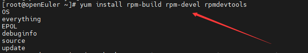  

#### Generating the rpmbuild Directory and Related Subdirectories  

Go to the personal folder and run `rpmdev-setuptree` to automatically create the rpmbuild directory and related subdirectories.  

  

The following figure shows the generated rpmbuild directory and its subdirectories.  
**BUILD**: During package build, `%buildroot` creates various directories here. If the log output does not provide sufficient information, it is useful to investigate failed builds.  
 **RPMS**: Binary RPMs are created in its subdirectories of different architectures (for example, `x86_64` and `noarch`).  
**SOURCES**: This folder stores the compressed source code archives and patches. The `rpmbuild` command can be found here.  
**SPECS**: This folder stores SPECS files.  
**SRPMS**: If `rpmbuild` is used to build SRPM instead of binary RPM, the result SRPM is created here.

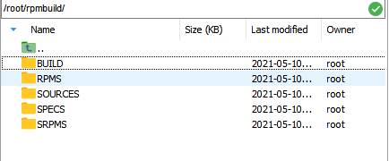

#### Preparing the Source Package and SPEC File

In the **/rpmbuild/SOURCES/** directory, download the jdkSource file for building the RPM package by running `git clone https://gitee.com/src-openeuler/openjdk-1.8.0.git`. The URL of the openJDK is https://gitee.com/src-openeuler/openjdk-1.8.0. If you want to build the JDK of another version, replace the URL.  

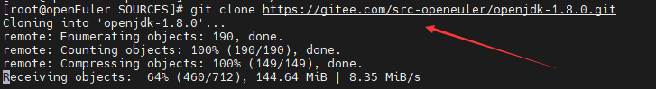  

Move the SPEC file in the downloaded JDK package to the **SPECS** folder.  
`mv ./openjdk-1.8.0/*spec ../SPECS/`

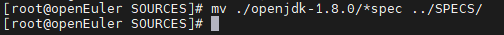  

  

Move other files in the JDK package to the **SOURCE** folder.  
`mv ./openjdk-1.8.0/* ./`


#### Installing and Configuring JDK 8

You can use `yum list | grep openjdk` to check the JDK version that can be installed in the Yum source of openEuler and install the JDK. If the required JDK is not available, install it or update the Yum source.  

  

Installation command: `yum install java-1.8.0-openjdk.aarch64`  

Check whether the JDK is installed successfully.  
`java -version`

#### Installing the Dependencies

`yum install alsa-lib-devel cups-devel elfutils-devel fontconfig-devel freetype-devel giflib-devel harfbuzz-devel lcms2-devel`  

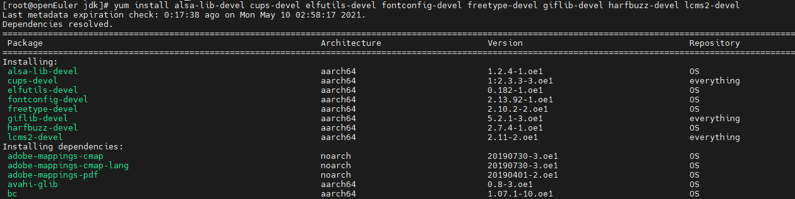  

To install other required dependencies, run the `yum install package` command.  

### 4. RPM Package Build

Go to the **SPECS** folder and enter the corresponding command as required to start the build.

`rpmbuild -bi java-1.8.0-openjdk.spec ` Execute the script in the install phase.  
`rpmbuild -bb java-1.8.0-openjdk.spec` Generate the RPM binary package.  
`rpmbuild -bs java-1.8.0-openjdk.spec ` Generate the RPM source package.  
`rpmbuild -ba java-1.8.0-openjdk.spec ` Generate the RPM binary package and source package.

The following figure shows a built RPM package.  

  

The file list is as follows:  

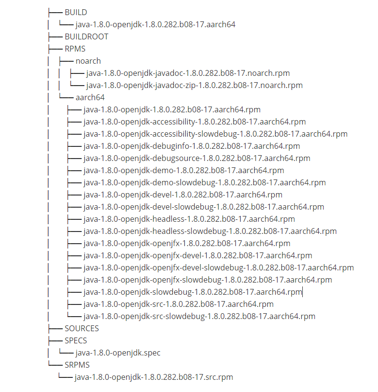  

### 5. Errors and Solutions

#### Error: The Raspberry Pi cannot be remotely accessed.

For the SSH connection, you need to: (1). Confirm that the Raspberry Pi is connected to the network. (2). Confirm that the IP address, username, and password are correct. (3). Check whether the SSH is enabled. If the Raspberry Pi is connected to the network and the IP address, username, and password are correct, but the remote access still fails, the SSH is disabled.

Solution: If an external monitor is used and the system monitor interface is connected, run the `rpm -qa|grep openssh` command to check whether the SSH server software package has been installed during system installation. If the command output contains `openssh-server-`, the SSH server has been installed. In this case, run the `service iptables start` command to start the SSHD service.  

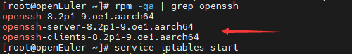  

If no external monitor is available and the system monitor interface can be connected, create an SSH file (without the file name extension) in the SD card to enable remote access.  

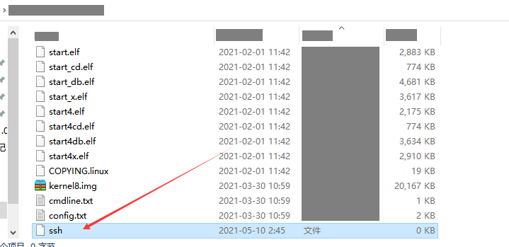  

#### Error: bash: yum: command not found

When you run the **yum** command, the message `-bash: yum: command not found` is displayed.


You need to manually install `yum-4.2.23-3.oe1.noarch.rpm` and upload it.

URL: [https://repo.openeuler.org/openEuler-20.03-LTS-SP1/everything/aarch64/Packages/yum-4.2.23-3.oe1.noarch.rpm](https://repo.openeuler.org/openEuler-20.03-LTS-SP1/everything/aarch64/Packages/yum-4.2.23-3.oe1.noarch.rpm). Run `rpm -ivh --force --nodeps yum-4.2.23-3.oe1.noarch.rpm` in the same directory.

  

#### Error: Failed build dependencies: xxx is needed by java-1.8.0-openjdk-1:1.8.0.282.b08-17.aarch64  

  

Cause: Packages required for RPM package build are not installed in the SPECS file.

Solution: Run the `yum install xxx` command to install the package.  

`yum install gdb java-1.8.0-openjdk-devel libX11-devel libXext-devel libXi-devel libXinerama-devel libXrender-devel libXt-devel libXtst-devel libjpeg-devel openssl-devel`

#### Error: java-8-openjdk-devel is needed by xxx  

Cause: openjdk-devel is required in **BuildRequires** in the SPEC file, but the current OpenJDK version does not meet the requirement.  

Solution: If you are sure that the installed OpenJDK version meets the build requirements, comment out the line or modify the version requirements. If you are not sure whether the current version meets the build requirements, install and configure the required OpenJDK version.  

  

#### Error: Bad exit status from /var/tmp/rpm-tem.f4PLQX(%build)  

Cause: JDK 8 has been configured in the system, but the downloaded SPEC file has not been modified. You need to access the SPEC file and change the JDK path to the local JDK 8 path.  

`vim /root/rpmbuild/SPECS/java-1.8.0-openjdk.spec?configure`  

Find the **configure** location and change the JDK path to the local JDK 8 path.  

  

### 6. RPM Package Build for Other JDK Versions

For other JDK versions, such as JDK 11 and JDK 15, if you want to build RPM packages, you only need to download the JDK source package of the corresponding version, replace the corresponding URL, and change the JDK path to the corresponding local JDK path. The build process is the same as that of JDK 8. If an error message is displayed, refer to solutions provided in this section.  

## References

How to create an RPM package: [https://fedoraproject.org/wiki/How_to_create_an_RPM_package?rd=How_to_create_an_RPM_package/en](https://fedoraproject.org/wiki/How_to_create_an_RPM_package?rd=How_to_create_an_RPM_package/en)

RPM Packaging Guide: [https://rpm-packaging-guide.github.io/](https://rpm-packaging-guide.github.io/)

BiSheng JDK 8 User Guide: [https://gitee.com/openeuler/bishengjdk-8/wikis/Home?sort_id=2879418](https://gitee.com/openeuler/bishengjdk-8/wikis/Home?sort_id=2879418)

Raspberry Pi: [https://www.raspberrypi.org/](https://www.raspberrypi.org/)
