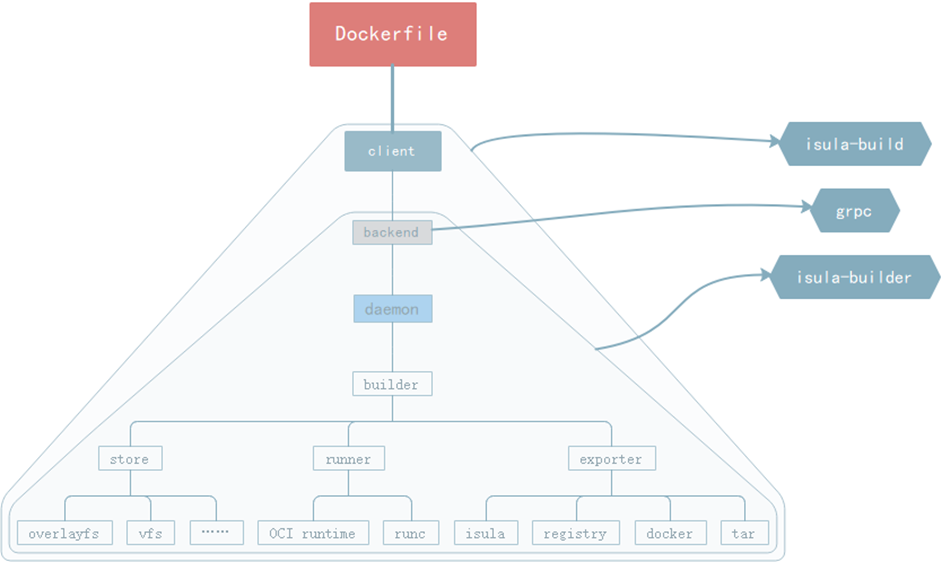
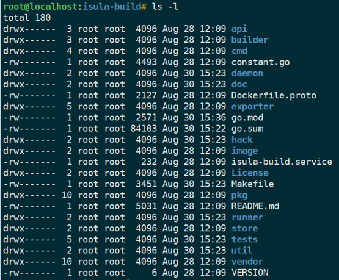
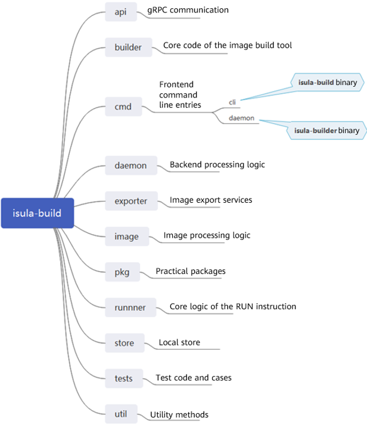
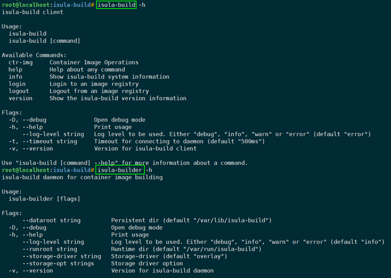
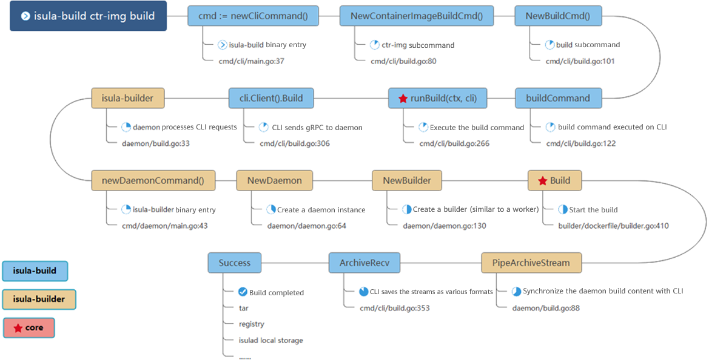
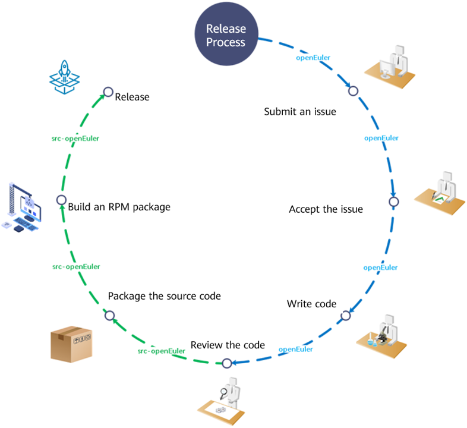

This article analyzes the code of the container image build tool isula-build and provides a quick tutorial to get started with the open source project if you want to give suggestions or improvements on the tool.  

## isula-build Code Analysis

Contents

1. Introduction to isula-build

2. Introduction to the code

3. Introduction to isula-build community release process and how to join the community

### What Is isula-build?  

As a member of the iSulad ecosystem, isula-build provides multiple functions, such as image creation, management, and distribution.  

  

iSulad is a general-purpose container engine developed by Huawei and open sourced on [Gitee](https://gitee.com/openeuler/iSulad). It uses a unified architecture design to meet various requirements in the CT and IT fields. Compared with Docker written in Golang, iSulad features a lightweight, fast, and flexible design that is not restricted by hardware specifications and architecture, has less memory overhead, and can be widely used in more scenarios.  

### What Can isula-build Do?

- Quickly and securely creates container images and manages the images.  
- Quickly integrates with iSulad and Docker, facilitating deployment.  
- Creates, deletes, updates, and retrieves images.  
- Constitutes the full-stack container solution.  

### isula-build Architecture

isula-build adopts the classic client-server (C-S) architecture, in which client `isula-build` communicates with server `isula-builder` through gRPC. You can run the `isula-build` commands to interact with `isula-builder` and initiate requests for image creation and management.  

  

### isula-build Code Overview  

Currently, isula-build, written in Golang, has more than 20,000 in-house lines of code.  

```bash
--------------------------------------------------------------------------------
Language                      files          blank        comment           code
--------------------------------------------------------------------------------
Go                              134           3293           2676          25038
Markdown                          9            486              0           1098
Bourne Shell                     15             95            225            499
XML                               9              0              0            419
Protocol Buffers                  2             41             97            193
make                              1             18              1             89
Dockerfile                        6             14              0             68
Bourne Again Shell                1              8              4             31
TOML                              3             37            255             15
JSON                              1              0              0              8
--------------------------------------------------------------------------------
SUM:                            181           3992           3258          27458
--------------------------------------------------------------------------------
```

The following figure shows a series of folders with various functions involved in the isula-build project.  

  

The following figure shows the main functions of some folders.  

  

You may be confused by far. But relax, the following describes how to quickly understand the isula-build code.  

### Code Builder

In my opinion, the fastest way to understand a project is not to dive into the code at the very beginning. Instead, you should build and run the software, and then get familiar with the entire project by mapping the external appearance to the internal logic.  

How do we run isula-build? If you didn't install the RPM package, you need to manually build the binary. First, find `Makefile`, which describes how to build the project.  

Open the file and locate the `isula-build` and `isula-builder` binaries. Then, you can find the beginning of the code, that is, the program entry.  

  

Build the files and see what happens.  

  

Two binaries are built in the **isula-build/bin** directory. You can run them.  

### Command Line Entries  

Each Go binary is generated by the `main.go` file. According to the isula-build code overview, the entry of `isula-build` is in `cmd/cli/main.go`, and the entry of `isula-builder` is in `cmd/daemon/main.go`.  

  

Enter `isula-build -h` and `isula-builder -h`.

  

### External Appearance and Internal Logic  

Next, let's learn about the build process with a command used to build a container image and save it as a local TAR package.  

> Example command: `isula-build ctr-img build –f Dockerfile –o docker-archive:busybox.tar:busybox:latest` 


  

The preceding S-shaped process provides key points of the entire build process. You can find the required code and extend it.  

> Quiz: How many level-2 subcommands does isula-build have so far?  

### isula-build Community Development  

Up to this point, you may want to give suggestions or improvements on the tool. Let me walk you through how to participate in the open source community development.  

First, you need to know the code development and release process.  

  

As shown in the figure, as a user or developer, you can obtain the released isula-build RPM package or source code. If you have any doubts or want to improve the project, you need to submit an issue in the [source code repository](https://gitee.com/openeuler/isula-build).  

If the community accepts the issue, it will make a schedule based on the urgency and difficulty of the issue.  

Interested contributors will claim the issue and start coding. After the local code is finished and the functions are tested, the contributor can submit the code by creating a pull request in the code repository.  

However, it doesn't mean that the code can be merged directly. The code submitted will be reviewed manually by maintainers and automatically by the robot (ci-bot). After the code passes the review, it can be merged into the source code repository.  

Yet the process is not over. How does the code become an RPM package that allows users to install and run on their computers using `yum install isula-build`? This involves another repository, the [artifact repository](https://gitee.com/src-openeuler/isula-build).  

The isula-build code exists in the artifact repository in the form of a TAR package, which means that the source code is packaged. You can use the corresponding **spec** file to build an RPM package, which is then integrated into the openEuler release package. Alternatively, you can directly obtain the official [RPM package](https://build.openeuler.org/package/show/openEuler:Mainline/isula-build).  

So far, our introduction to the isula-build code architecture and process comes to an end. You are welcome to join us to learn more about isula-build.    


> isula-build source code repository: [https://gitee.com/openeuler/isula-build](https://gitee.com/openeuler/isula-build)
>
> isula-build artifact repository: [https://gitee.com/src-openeuler/isula-build](https://gitee.com/src-openeuler/isula-build)
>
> isula-build obs address: [https://build.openeuler.org/package/show/openEuler:Mainline/isula-build](https://build.openeuler.org/package/show/openEuler:Mainline/isula-build)
