# Analysis of the Cloud Native Network Data Plane Acceleration Solution

## Background

The data plane performance of the cloud native network directly determines key performance metrics such as the throughput and service response time of the entire system. Data plane acceleration is an important means of system acceleration.

Cloud native networks include the Container Network Interface (CNI), service meshes, Ingress, and data center networks. Except for data center networks, most of them are virtual networks. Data plane acceleration focuses on these virtual networks.


## Overview

CNI: acceleration of intra-pod communication, inter-pod communication (within a node), network policies, service access, and backend pod communication (inter-node)

Service mesh: sidecar communication acceleration

Ingress: Ingress acceleration

### Intra-pod Communication Acceleration

Main data paths in a pod are in the kernel protocol stack whose performance has been continuously analyzed and optimized. However, its performance is still far lower than that of user-mode protocol stacks such as DPDK and AF_XDP.

#### Acceleration Solution

Introduce multiple data planes in a pod. When both legacy and I/O-intensive apps exist in a pod, the I/O-intensive applications can use the high-performance data plane, which accelerates the app running and prevents impact on other apps.

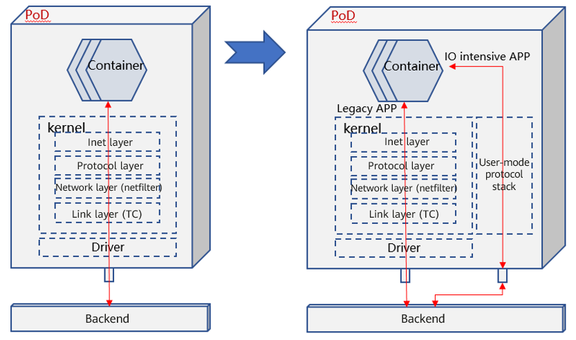

#### Summary

Solution: **User-mode CNI** (**Gazelle CNI**, which is under design and development by the high-performance network SIG of the openEuler community.)

The user-mode CNI can be implemented based on the DPDK and AF_XDP technologies which complement each other. Therefore, this solution must support the two technologies at the same time.

It has application values in scenarios where the control plane and data plane are separated, legacy and I/O-intensive apps coexist, and multiple tenants are isolated.

### Inter-pod Communication Acceleration

Communication between pods depends on the container network mode, which can be Bridge (default), Host, Container, or None. See the following figure:

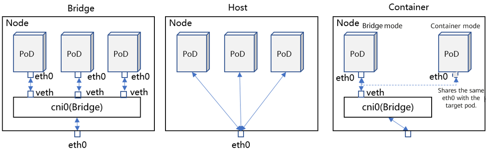


Bridge: eth0 is enabled for each pod, and the pods are connected to a bridge (cni0 by default) through virtual Ethernet (veth) devices to communicate with eth0 of the node.

Host: Pods share the namespace with the node. Therefore, eth0 (as well as other interfaces) of the node can be identified by the pods.

Container: Pods share the namespace with other containers so that the interfaces of the target container can be identified and used.

None: No interface is configured. (It does not mean that there is no available interface. You can customize interfaces as required in this mode.)

In this article, we focus on the Bridge and None modes. In the None mode, the router is often used to solve communication problems. Therefore, we mainly analyze the acceleration of data paths in the bridge and router.

#### Acceleration Solution

By default, the bridge and router are located at the link layer and network layer of the kernel protocol stack, respectively. Data paths reach the destination pod after being processed by the kernel protocol stack.

The acceleration solution is XDP over veth. In the XDP program, the help function is used to query the kernel forwarding information base (FIB) and complete forwarding actions similar to those of the bridge and router.

The entire forwarding path does not involve the kernel protocol stack and is processed at the driver layer.

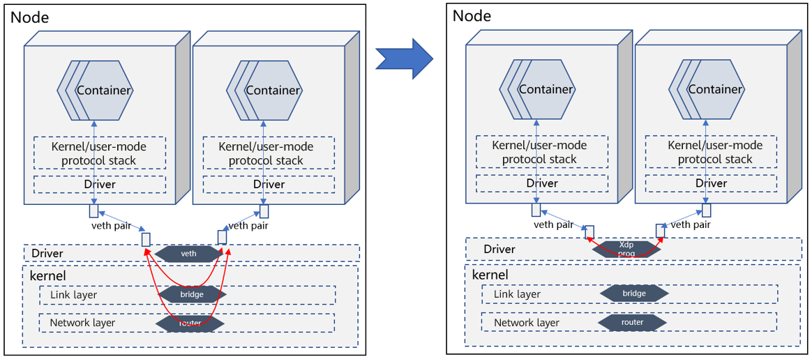

#### Summary

Solution: **VNF powered by XDP**

The virtual network function (VNF) is a bridge or router. This solution is not dedicated for this scenario and can be applied to other scenarios as well. It is suitable for base software vendors.

### Inter-node Communication Acceleration

In this article, the focus is virtual network acceleration, and a node refers to a VM.

Mainstream solutions for inter-VM communication include Open vSwitch, VMware virtual switch, Cisco Nexus 1000V, Huawei 1800V and Huawei EVS. Most of them use the DPDK technology for acceleration.


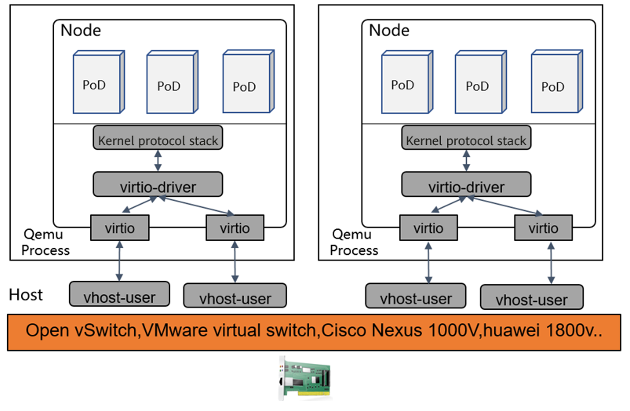

#### Acceleration Solution

In terms of performance, the existing mature solutions are optimal. In terms of hardware availability, AF_XDP can be used to replace DPDK. AF_XDP provides slightly lower performance than DPDK, but can make up for the lack of hardware.

For details, see [https://events19.linuxfoundation.cn/wp-content/uploads/2017/11/Accelerating-VM-Networking-through-XDP_Jason-Wang.pdf](https://events19.linuxfoundation.cn/wp-content/uploads/2017/11/Accelerating-VM-Networking-through-XDP_Jason-Wang.pdf).

#### Summary

Solution name: **VNF powered by DPDK**

DPDK dominates communication acceleration between VMs on a bare metal host, and there is little room for performance improvement.


### Kubernetes Network Policy Acceleration

Kubernetes defines some network policy specs by default (various CNI plugin solutions redefine their own network policy specs). The following example shows that network policies can be either independently or jointly defined based on the IP address/port, namespace, and pod label.

```
apiVersion: networking.k8s.io/v1
kind: NetworkPolicy
metadata:
  name: test-network-policy
  namespace: default
spec:
  podSelector:
    matchLabels:
      role: db
  policyTypes:
  - Ingress
  - Egress
  ingress:
  - from:
    - ipBlock:  #  Defines a network policy based on the IP address.
        cidr: 172.17.0.0/16
        except:
        - 172.17.1.0/24
    - namespaceSelector:  #  Defines a network policy based on the namespace.
        matchLabels:
          project: myproject
    - podSelector:   #  Defines a network policy based on the pod label.
        matchLabels:
          role: frontend
    ports:
    - protocol: TCP
      port: 6379
  egress:
  - to:
    - ipBlock:
        cidr: 10.0.0.0/24
    ports:
    - protocol: TCP
      port: 5978
```

 After network policies are defined, the control plane converts them into Linux iptables rules and delivers them to the Linux network data plane to control network access.

```
#The control plane listens to the running status of the environment and fills in proper IP address information.
iptables -A INPUT -s X.X.X.X -d X.X.X.X -j ACCEPT
iptables -A INPUT -s X.X.X.X -d X.X.X.X -j ACCEPT 
...
iptables -A OUTPUT -s X.X.X.X -d X.X.X.X -j ACCEPT
iptables -A OUTPUT -s X.X.X.X -d X.X.X.X -j ACCEPT
...
```

When the iptables rules are executed on the data plane:

1. iptables implements access control based on network location identifiers.
2. Network location identifiers change with the lifecycle of pods, and network access rules keep being refreshed.
3. The number of network location identifiers increases in direct proportion to the number of pods (cluster scale) in a non-linear manner, and the number of network access rules increases sharply.
4. Inherent defects of iptables:

- Poor latency performance: The iptables matching rules are linearly ordered, the number of which increases sharply as the cluster scale increases. The matching time complexity is O(N).
- Poor scalability: Rules cannot be incrementally updated. Due to the large number of rules, a kernel lock is held when the update is submitted. You have to wait until the lock is released.
- Poor availability: During service scaling, updating iptables rules will cause protocol disconnection and service unavailability.

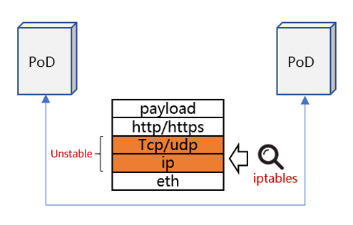

#### Acceleration Solution 1

The data plane and control plane have different policy approaches. The former executes access policies based on IP addresses/ports, and the latter defines access policies based on Kubernetes Deployment information. The gap between the two planes is the cause of performance deterioration.

If a Kubernetes Deployment is translated into a unique cluster identifier and added to the network load and the data plane performs access control based on the identifier, the gap can be removed.

The solution details are as follows:

1. Use eBPF to customize the network policy control logic and perform access control based on a Kubernetes Deployment (mapped to a unique cluster identifier).
2. The Kubernetes Deployment does not change with the pod lifecycle.
3. The Kubernetes Deployment consists of abstract information from the service perspective. Compared with physical location information such as IP addresses and ports, the Kubernetes Deployment can achieve the aggregation effect and effectively reduce the number of rules.
4. eBPF provides more flexible control and better execution performance than iptables.

```
#Example of the aggregation effect
#Kubernetes defines access control policies as follows.
Ingress:
  from:
     podSelector:
        matchLabels:
          role: frontend
#If the preceding policies are translated into network address–based access control rules like iptables, there may be dozens of rules (depending on the number of backend pod instances).
#However, when the policies are translated into identifier-based rules, there are only two rules.
#1 allow pod-label=frontend
#2 deny all
```

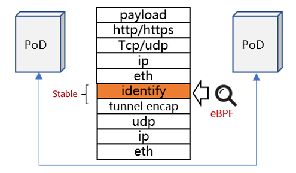

#### Acceleration Solution 2

Although solution 1 brings good performance, it relies on CNI ISVs to redesign the CNI solution. Besides, tunnel encapsulation is added, which reduces the transmission efficiency. In terms of solution applicability, solution 1 is not favorable. Among many CNI solutions, only Cilium uses solution 1.

Most CNI solutions improve the data plane backend and use the eBPF technology to rebuild iptables.

Example:

- Calico CNI manages data planes as plugins and supports multiple data planes, including the high-performance data plane built by eBPF. See [https://docs.projectcalico.org/about/about-calico](https://docs.projectcalico.org/about/about-calico).
- Compatible with the iptables frontend, the eBPF technology re-implements the iptables backend. See [https://github.com/mbertrone/bpf-iptables](https://github.com/mbertrone/bpf-iptables).

#### Summary

Solution 1: **Network policy based on K8s identifier**

Solution 2: **iptables powered by eBPF**

- Solution 1 is more suitable for CNI ISVs. It fully integrates the management plane and data plane.
- Solution 2 is more suitable for base software vendors. It is compatible with the iptables frontend and re-implements the backend.


### Service Mesh Acceleration

Service meshes (such as Istio) are widely used in cloud native systems, which provide service governance capabilities for cluster management.

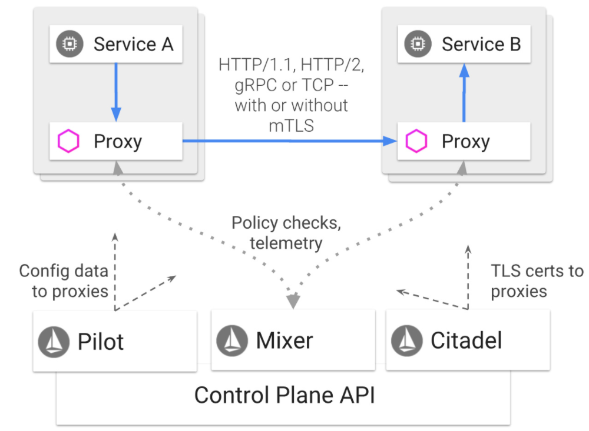

Istio deploys a proxy component (usually called sidecar) in each pod. This component takes over all external communication requests of pods and provides capabilities such as layer 7 load balancing, API traffic visualization, and topology management for pods. However, all data traffic is processed by the proxy, and data paths are prolonged. See the following figure:

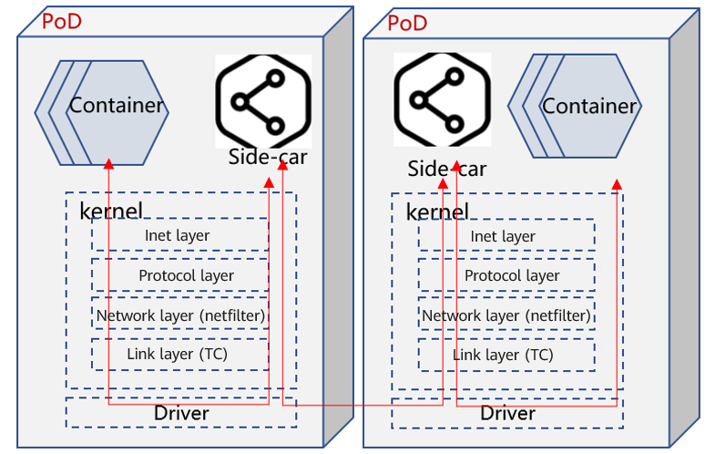

#### Acceleration Solution

eBPF is used to implement the socket map solution. A pair of sockets of the TCP connection between the containers and sidecar in a pod is mapped. When a socket sends data, eBPF directly moves the data to the other socket and wakes up the thread to which the data belongs, to prevent it from entering the complete kernel protocol stack.

See the following figure:

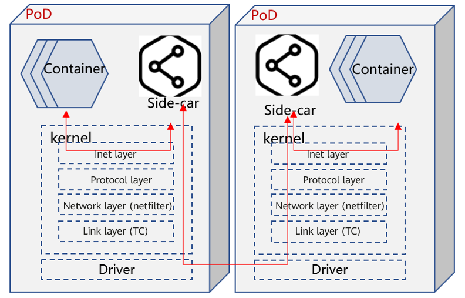

#### Summary

Solution: **SocketMap**

In addition to the service mesh scenario, the SocketMap acceleration solution applies to other scenarios as well, for example, communication acceleration between apps in the same namespace. Therefore, this solution is suitable for base software vendors.

### Service Access Acceleration

To improve availability, Kubernetes proposes the concept of Service. It abstracts the service provided by an application as an endpoint and allocates an IP address or port to the endpoint. Then the Service is powered by multiple backend instances. In this way, services and program instances are separated and programs are deployed as multiple instances to achieve high service availability.

When a service is accessed in a cluster, the address needs to be converted based on the actual backend instance to redirect requests to specific pods through load balancing (LB). This process is controlled by kube-proxy, a Kubernetes component. It listens to the matching relationship between services and backends, generates LB data, and writes the data to the data plane. Currently, kube-proxy supports two data planes: iptables and IPVS. The performance of the latter is better than that of the former.

The following is an example of mutual access data flow between services:


iptables has many restrictions that are described in preceding sections, and IPVS brings better performance. See the following performance test data.

- [ ] **Latency performance comparison**

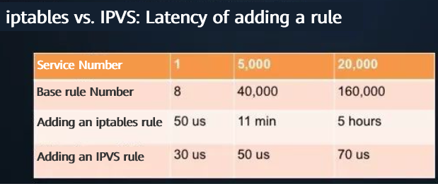

- The latency of adding an iptables rule increases exponentially as the number of base rules increases.
- When the number of services in the cluster reaches 20,000, the latency of adding an iptables rule increases from 50 µs to 5 hours.
- The latency of adding an IPVS rule is still within 100 µs, which is almost not affected by the number of base rules.

- [ ] **Bandwidth performance comparison**

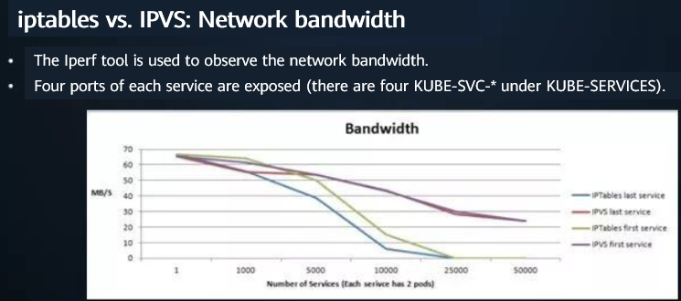

- In iptables mode, as the number of services increases, the bandwidth of the first and last services decreases sharply. When the number of services reaches 25,000, the services are unavailable.
- In IPVS mode, as the number of services increases, the bandwidth of the first and last services decreases slightly, and the bandwidth gap between the first and last services is relatively small.

- [ ] **CPU usage comparison**

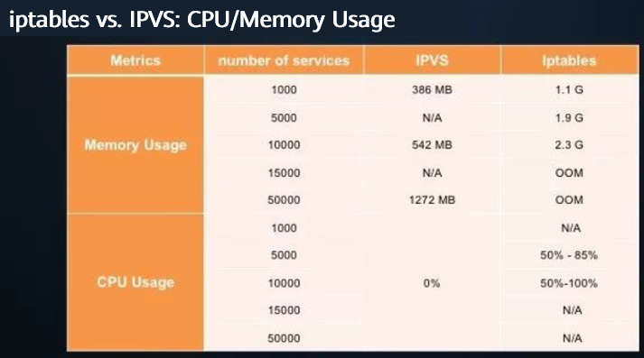

Obviously, IPVS shows better metrics than iptables in terms of CPU usage and memory usage.

Note: The preceding data is cited from [https://zhuanlan.zhihu.com/p/37230013](https://zhuanlan.zhihu.com/p/37230013).


#### Acceleration Solution 1

Currently, kube-proxy still uses iptables as the default mode. On the iSula platform, you can set kube-proxy to the IPVS mode during the installation.


#### Acceleration Solution 2

The performance of IPVS is obviously better than that of iptables, but kube-proxy still uses iptables by default. Why?

A major consideration is compatibility. IPVS processes data in a different phase in a data path from iptables. In some scenarios, if IPVS and iptables coexist, compatibility problems may occur.

Therefore, some CNI ISVs (such as Cilium) simply replace the kube-proxy component and use the eBPF technology in their software to implement the process of addressing the backend of the Service. This solution is temporarily named **LB powered by eBPF**.

However, this solution is applicable to some CNIs. Most CNIs do not have this capability. To apply this solution to a wider range of scenarios, the technical idea of **iptables powered by eBPF** can be used.

#### Summary

Solution 1: **IPVS**

Solution 2: **iptables powered by eBPF**

- Solution 1 should be adopted with caution because it is difficult to find and solve the compatibility problems.
- Solution 2 that rebuilds iptables using eBPF is suitable for base software vendors.


### Ingress Acceleration

A Kubernetes cluster sometimes needs to expose services to the outside of the cluster. Generally, there are three solutions:

1. NodePort: A specific port is opened on a Kubernetes node. The port is exposed, and the traffic of the port is forwarded to a specific Service. Disadvantages: (1) Each Service occupies one port. (2) If the node IP address is changed, the inbound traffic is affected.
2. LoadBalancer: An LB node is deployed outside the cluster, and the IP address of this node is exposed. Its traffic is forwarded to Service backend instances through L4 load balancing. Disadvantage: Each Service needs to expose an independent LB IP address on the Internet and is charged.
3. Ingress: An Ingress node is deployed in the cluster. It implements L7 load balancing. The Ingress controller percepts Service changes in the cluster and updates Ingress rules in real time. Because parsing and load balancing are implemented on L7, an Ingress node supports load balancing of multiple Services.

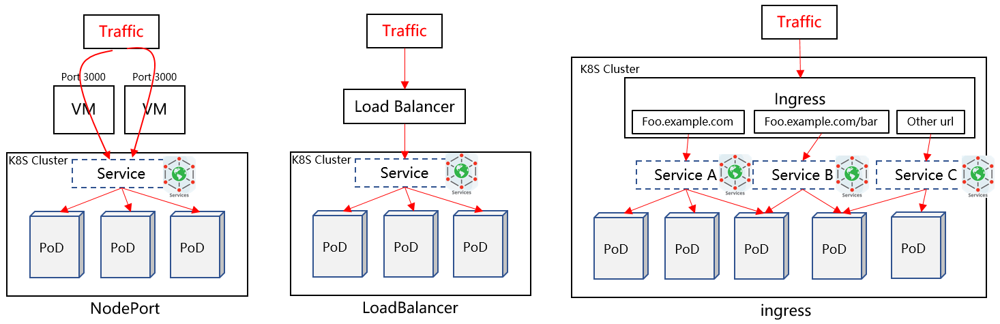

#### Acceleration Solution

Ingress is a mainstream solution. It uses multiple types of Ingress software, including HA Proxy and Nginx. Nginx is the most common Ingress solution.

openEuler has optimized the Nginx performance by more than 50% in some scenarios. For details about the optimization solution, see the *Innovation Drives the Future of openEuler*.

#### Summary

Solution: Nginx performance optimization

## Conclusion

We here summarize the performance optimization solutions for each scenario and the software vendors that are suitable for providing such technical solutions.

| Scenario           | Acceleration Solution                           | Applicable Software Vendor| Key Technology|
| --------------- | ----------------------------------- | ---------------- | -------- |
| Intra-pod communication acceleration  | User-mode CNI                          | OS and base software    | AF_XDP   |
| Inter-pod communication acceleration  | VNF powered by XDP                  | OS and base software    | XDP      |
| Inter-node communication acceleration | VNF powered by DPDK                 | ISV              | DPDK     |
| Kubernetes network policy acceleration| Network policy based on K8s identifier | ISV              | CNI      |
|                 | iptables powered by eBPF            | OS and base software    | eBPF     |
| Service mesh acceleration   | SocketMap                           | OS and base software    | eBPF     |
| Service access acceleration| IPVS                               | This solution is not recommended.    |          |
|                 | iptables powered by eBPF            | OS and base software    | eBPF     |
| Ingress acceleration    | Nginx performance optimization                      | OS and base software    | Nginx   |
