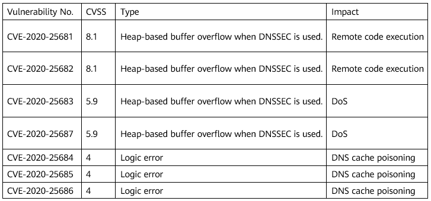

### 1.1	Overview 
Dnsmasq is an open source, lightweight DNS forwarder that provides basic network services such as DNS and DHCP to small networks. It is widely used in smartphones and IoT devices. Recently, JSOF disclosed seven dnsmasq vulnerabilities (CVE-2020-25681, CVE-2020-25682, CVE-2020-25683, CVE-2020-25684, CVE-2020-25685, CVE-2020-25686, and CVE-2020-25687), collectively known as DNSpooq. Attackers may exploit these vulnerabilities to perform a DNS cache poisoning attack, remote code execution, and DoS attack.

### 1.2	Vulnerability Details 



(1) Buffer overflow vulnerabilities: CVE-2020-25681, CVE-2020-25682, CVE-2020-25683, and CVE-2020-25687  When dnsmasq is configured to use DNSSEC, attackers can exploit these vulnerabilities to remotely execute any code or crash the dnsmasq service. The four CVEs involve two functions: 

```
static int sort_rrset(struct dns_header *header, size_t plen, u16 *rr_desc, int rrsetidx, unsigned char **rrset, char *buff1, char *buff2)
```

```
static int get_rdata(struct dns_header *header, size_t plen, unsigned char *end, char *buff, int bufflen, unsigned char **p, u16 **desc)
```

Code in sort_rrset: 


 If **get_rdata** returns 0, the remaining data in RDATA is copied to **buff1**. The size of **buff1** is **MAXDNAME * 2 (2050)** bytes. Dnsmasq supports data transmission using UDP, which allows a maximum packet length of 4096 bytes. Due to the lack of length verification in the code, attackers can send RRset packets of more than 2,050 bytes, causing system buffer overflow. 

(2) DNS cache poisoning vulnerabilities: CVE-2020-25684, CVE-2020-25685, and CVE-2020-25686 
DNS cache poisoning, also known as DNS spoofing, can be exploited by attackers to tamper with DNS records on devices and inject fake DNS entries into the devices, thus redirecting users to the malicious server specified by the attackers. 

### 1.3	Impact Analysis

The vulnerabilities exist in the source code of dnsmasq earlier than 2.83. openEuler uses dnsmasq 2.82.

### 1.4	Workarounds

1. Buffer overflow vulnerabilities: CVE-2020-25681, CVE-2020-25682, CVE-2020-25683, and CVE-2020-25687 
Temporarily disable the DNSSEC validation option until you get a patch to fix the vulnerabilities. 

2. DNS cache poisoning vulnerabilities: CVE-2020-25684, CVE-2020-25685, and CVE-2020-25686 
Disable the dnsmasq cache: Add **cache-size=0** to the **/etc/dnsmasq.conf** configuration file.
Note: After the dnsmasq cache is disabled, all DNS queries are forwarded to the upstream server, slowing down the DNS response speed. Before disabling the dnsmasq cache, evaluate whether the workaround is suitable for the system environment. 

### 1.5	Solution

•	Download the latest dnsmasq software package released by openEuler. 
     [Vulnerability Security Advisory (SA)](https://www.openeuler.org/en/security/safety-bulletin/detail.html?id=openEuler-SA-2021-1001)
	20.03-LTS: 
		[AAch64 architecture software package](https://repo.openeuler.org/openEuler-20.03-LTS/update/aarch64/Packages) 
		[x86 software package](https://repo.openeuler.org/openEuler-20.03-LTS/update/x86_64/Packages) 
	20.03-LTS-SP1: 
		[AAch64 architecture software package](https://repo.openeuler.org/openEuler-20.03-LTS-SP1/update/aarch64/Packages/) 
		[x86 software package](https://repo.openeuler.org/openEuler-20.03-LTS-SP1/update/x86_64/Packages/) 
•	Upgrade dnsmasq. 	 

```
rpm -Uvh dnsmasq-*.rpm
```


•	Check whether dnsmasq is successfully upgraded. 	 

```
 rpm -qi dnsmasq
```

  	20.03-LTS fix version: dnsmasq-2.82-4. 
	  20.03-LTS-SP1 fix version: dnsmasq-2.82-5. 