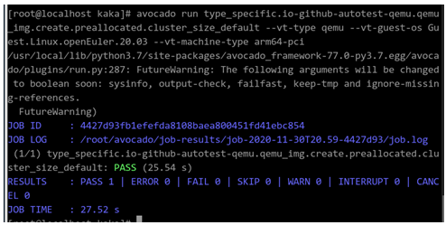

#  Introduction

  This article uses openEuler as an example to describe the deployment and application of the virtualization framework Avocado-VT and provides guidance for users to test virtualization components.

  To understand the entire application process, you need to understand the following basic concepts:

- Avocado, which lives under the Autotest umbrella, is a set of tools and libraries to help with automated testing. The main advantages of Avocado are that it can display results in multiple forms, provide multiple practical program modules, and can be extended through plug-ins.
  
  For more information, see the [official guide](https://avocado-framework.readthedocs.io/en/latest/index.html).

- Avocado-VT is a virtualization test plug-in that provides atoms related to virtualization tests and all conveniences provided by Avocado.
  
  For more information, see the [official guide](https://avocado-vt.readthedocs.io/en/latest/index.html).

- Test-Providers (tp) provides component test sets. Currently, tp-libvirt and tp-qemu are available on openEuler.

  
#  Preparing the Test Environment

- Install the base RPM packages.

  Install virtualization component packages, including QEMU, libvirt, and edk2.
  
  Install framework dependency packages, such as git, gcc, python3-pip, python3-devel, tcpdump, nc, diffutils, and iputils.
  
- Configure pip3 sources.

  When deploying the Avocado or Avocado-VT, use pip3 to install the third-party Python libraries. If the pip3 sources are not configured, use pip3 to obtain the third-party libraries from the official Python library. Based on the actual network conditions, pip3 sources can be configured to improve the download rate and stability.  
  
  For example, configure the tsinghua source.
  
  ```
  pip3 config set global.index-url https://pypi.tuna.tsinghua.edu.cn/simple
  ```
  
- Complete other configurations.

  If network isolation is performed in the test environment, determine whether to configure a proxy based on the site requirements, including configuring the HTTP/HTTPS proxy for Git and network.  

#  Installing and Deploying the Framework

- Download the source code.

  Download the framework and test set code and switch to the corresponding branch. Currently, the branch supports openEuler-20.03.
  
  ```
  git clone $url
  git checkout -f $branch
  ```
  
  The following repositories are included:

  [https://gitee.com/src-openeuler/avocado](https://gitee.com/src-openeuler/avocado)

  [https://gitee.com/openeuler/avocado-vt](https://gitee.com/openeuler/avocado-vt)

  [https://gitee.com/openeuler/tp-libvirt](https://gitee.com/openeuler/tp-libvirt)

  [https://gitee.com/openeuler/tp-qemu](https://gitee.com/openeuler/tp-qemu)

- Install Avocado.

  Install the dependency packages.  

  ```
  pip3 install -r requirements-selftests.txt
  ```

  Install the Avocado framework.  

  ```
  python3 setup.py install
  ```

  

- Install Avacado-VT.  
  
  Configure tp: libvirt and QEMU.
  
  Install the dependency packages.
  
  ```
  pip3 install -r requirements.txt  
  ```
  
  Install Avocado-VT.  
  
  ```
  python3 setup.py install
  ```
  
  
  
- Bootstrap test sets.

  Bootstrap the tp-libvirt and tp-qemu test sets.  

  ```
  avocado vt-bootstrap --vt-type qemu --vt-skip-verify-download-assets --yes-to-all
  avocado vt-bootstrap --vt-type libvirt --vt-skip-verify-download-assets --yes-to-all
  ```

The code for the preceding deployment is as follows:
```
install_virttest() {
    local branch=$1

    cd "$srcdir/tp-qemu"
    git checkout -f "$branch"

    cd "$srcdir/tp-libvirt"
    git checkout -f "$branch"

    cd "$srcdir/avocado"
    git checkout -f "$branch"
    sed -i "s/^libvirt-python/#&/" requirements-selftests.txt
    pip3 install -r requirements-selftests.txt
    python3 setup.py install

    cd "$srcdir/avocado-vt"
    git checkout -f "$branch"
    sed -i "/^branch: /d" test-providers.d/io-github-autotest-qemu.ini
    sed -i "/^uri: /c uri: $srcdir/tp-qemu" test-providers.d/io-github-autotest-qemu.ini
    sed -i "/^uri: /a branch: $branch" test-providers.d/io-github-autotest-qemu.ini
    sed -i "/^branch: /d" test-providers.d/io-github-autotest-libvirt.ini
    sed -i "/^uri: /c uri: $srcdir/tp-libvirt" test-providers.d/io-github-autotest-libvirt.ini
    sed -i "/^uri: /a branch: $branch" test-providers.d/io-github-autotest-libvirt.ini
    rm -f test-providers.d/io-github-spiceqa-spice.ini
    pip3 install -r requirements.txt
    python3 setup.py install

    avocado vt-bootstrap --vt-type qemu --vt-skip-verify-download-assets --yes-to-all
    avocado vt-bootstrap --vt-type libvirt --vt-skip-verify-download-assets --yes-to-all
}
```

#  Preparing for Executing the Test Cases

- Prepare VM XML.

  Prepare the XML file of libvirt and define the VM before executing the tp-libvirt cases.
  
- Prepare the test VM image.

  For details about image naming requirements and supported images, see **/var/lib/avocado/data/avocado-vt/backends/libvirt/cfg/guestos-os.cfg**.
  
  The path for storing the image is **/var/lib/avocado/data/avocado-vt/images/**. The image will be backed up during case execution. Therefore, the disk space must be at least twice the size of the image. In multi-host scenarios, multiple images are cloned using virt-clone. Ensure that the size of the disk partition where the image is located is sufficient.
  
- Configure libvirt.

  Set the **user/group** field in **/etc/libvirt/qemu.conf** to **root**.

- Complete the base configuration of the test framework.

  The base configuration includes the VM name, image name, and image login user password. If two-node cluster migration is involved, you need to configure the migration environment.
  
  ```
  /var/lib/avocado/data/avocado-vt/backends/libvirt/cfg/base.cfg
  /var/lib/avocado/data/avocado-vt/backends/libvirt/cfg/guest-os.cfg
  ```

#  Executing the Test Cases and Analyzing the Results

- View cases.

  Before executing test cases, run the **avocado list** command to view the test cases of the corresponding module and check the correctness of the framework deployment.
  
  To view the qemu, libvirt, and qemu_img test cases filtered by multiple conditions, you can run the following commands. Note that the test set is large, if the test set is not filtered, the command execution takes a little longer (within one minute).
  
  ```
  avocado list --vt-type qemu --vt-machine-type arm64-pci
  avocado list --vt-type libvirt --vt-machine-type arm64-pci 
  avocado list qemu_img --vt-type qemu --vt-no-filter non-preallocated --vt-only-filter cluster_size_default --vt-machine-type arm64-pci
  ```

- Execute the QEMU cases.

  The QEMU cases can be directly executed without configuring libvirt or using libvirt to define a VM in advance.
  
  Example:
  
  ```
  avocado run type_specific.io-github-autotest-qemu.qemu_img.create.preallocated.cluster_size_default --vt-type qemu --vt-guest-os Guest.Linux.openEuler.20.03 --vt-machine-type arm64-pci
  ```
    

- Execute the libvirt cases.

  Before executing the libvirt cases, ensure that the libvirt service is started and define a test VM based on the VM XML file and image prepared in the previous section.
  
  Example:
  ```
  avocado list virsh.reset --vt-type libvirt --vt-no-filter acl_test --vt-only-filter uuid_options --vt-machine-type arm64-pci
  ```

- Analyze the results.

  The logs of each case executed by the framework are archived in **logs_dir = ~/avocado/job-results** (the **logs_dir** field in the **avocado.conf** file can be configured).
  
  You can view the archived logs by referring to the preceding QEMU case execution example. Pay attention to the **JOB LOG** file, which can be used to analyze and locate execution failures.

