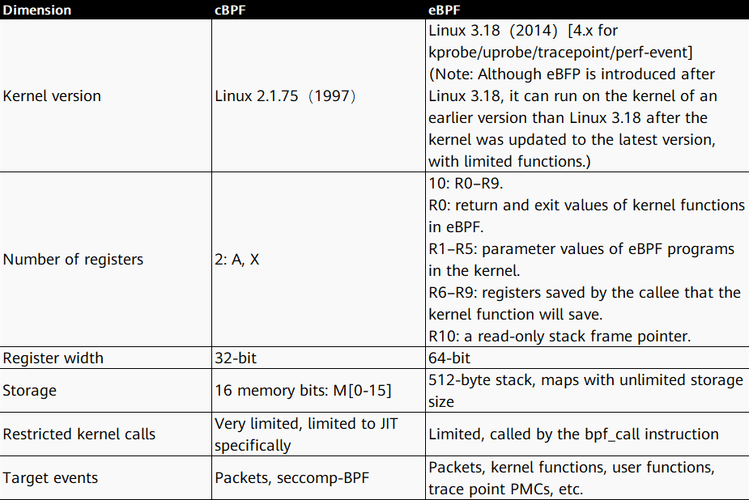
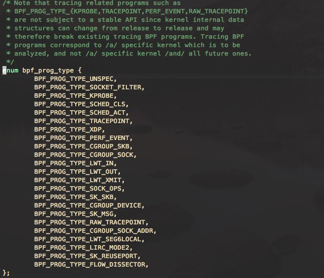
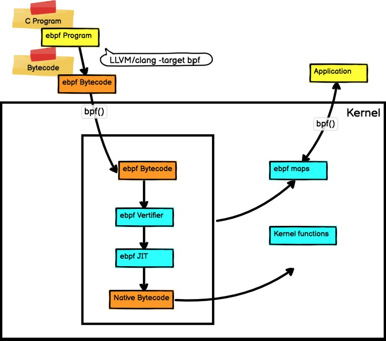
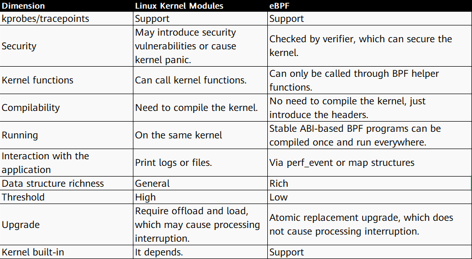
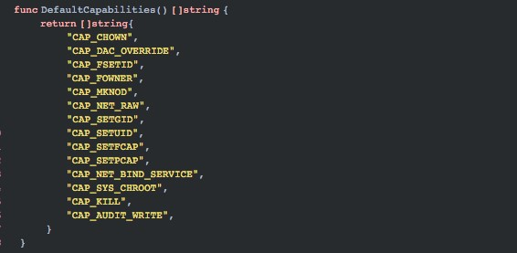
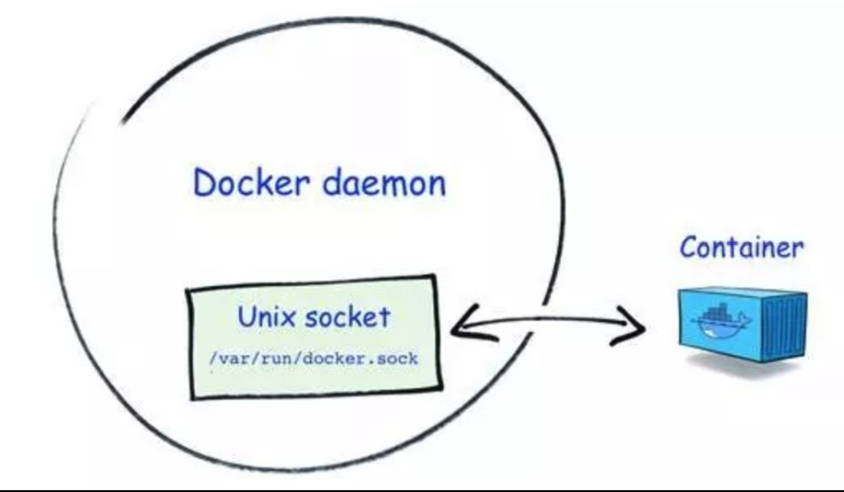
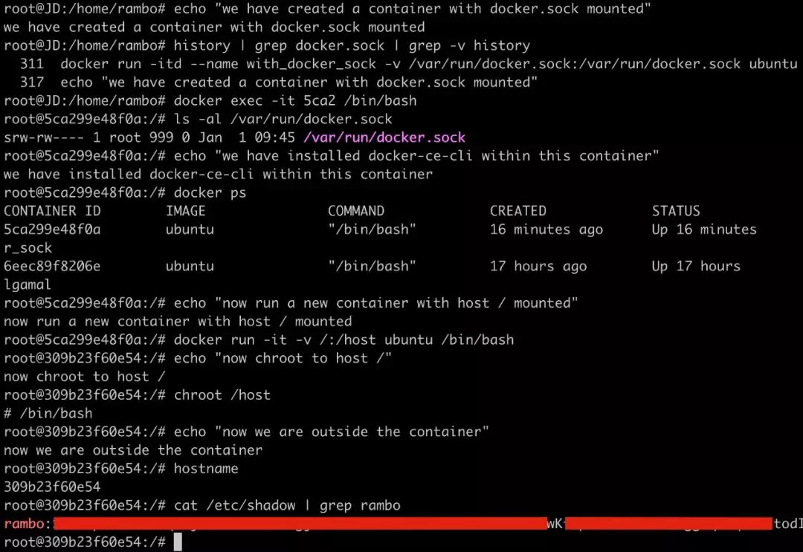
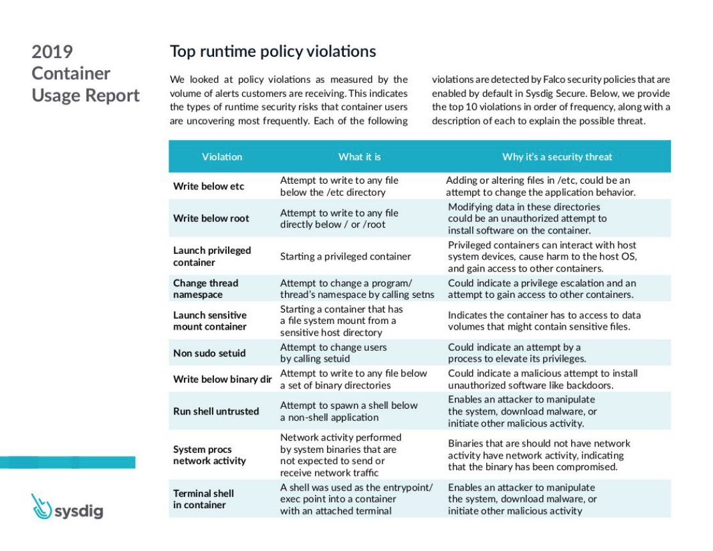
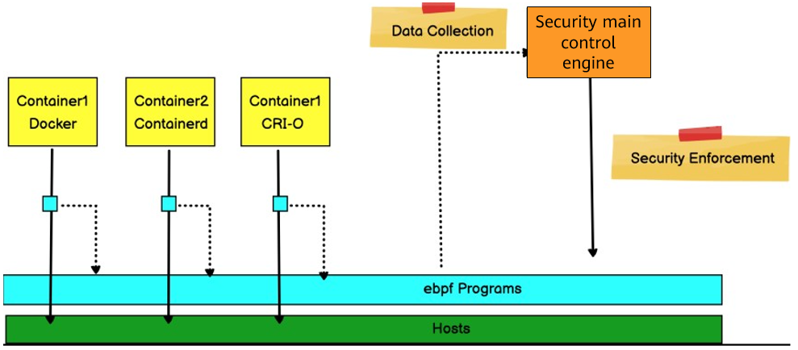

 *Author: Fan Bin, Cloud Computing Branch of China Telecom Corp Ltd.* 

# 1. Overview

With the development of container technology, more and more services and even core services start to use this lightweight virtualization solution. Container security is continuously improved and challenged. China Telecom Cloud Container Engine (CT-CCE) was launched at the end of November 2019. Currently, it has been deployed in 22 self-developed resource pools. CT-CCE uses the extended Berkeley packet filter (eBPF) technology to implement fine-grained container security. It detects abnormal behavior of hosts and containers and automatically isolates faulty nodes and containers, ensuring the security of containers on the multi-tenant container platform.


BPF is a revolutionary technology that securely and efficiently monitors, traces, and observes kernel events without requiring to compile the kernel or load kernel modules. BPF can be used for a variety of purposes, such as development performance analysis, software-defined networking, and security.

This article describes the BPF technology origin, architecture evolution, BPF tracing, new challenges to container security, and how to implement container runtime security based on the BPF technology.

# 2. BPF, a Data Packet Filtering Technology

BPF was first presented in a paper entitled "The BSD Packet Filter: A New Architecture for User-level Packet Capture" written by Steven McCanne and Van Jacobson in 1992. This paper described the design of a new user-level packet filtering architecture on a BSD system. In terms of performance, the new architecture was 20 times faster than the stack filter-based CSPF, and 100 times faster than the Unix packet filter, such as the SunOS Network Interface Tap (NIT).

 

BPF introduces two innovations in packet filtering to improve performance:

● BPF is a register-based filter, which can effectively work on the register-based CPUs.

● BPF uses a simple, shared-nothing buffer model. Data packets are filtered by the BPF and then copied to the buffer, so the buffer does not need to copy all data packets. This minimizes the amount of data to be processed and improves performance.  

  

# 3. Linux Superpower: eBPF Architecture 

## 3.1 Introduction

In September 2013, Alexei Starovoitov proposed a major rewrite of BPF and introduced a patch named eBPF. The initial goal of eBPF was to optimize modern hardware. eBPF increased the number of registers from two 32-bit registers to ten 64-bit registers. As the number and width of registers increased, function parameters could be used to exchange more information and to write more complex programs. The execution speed of the instruction set generated by the eBPF was four times faster than that of the machine code generated by the old BPF interpreter.

 

At this point, BPF was still restricted to kernel space, and only a few programs in user space could write BPF filters for the kernel, like Tcpdump and Seccomp. In March 2014, after being further developed by Alexei Starovoitov and Daniel Borkmann, eBPF was added to the Linux kernel by Daniel. In June 2014, the BPF Just-In-Time (JIT) component was added to Linux 3.15. In December 2014, the system call bpf was added to Linux 3.18. Later, BPF support for kprobes, uprobe, tracepoints, and perf_evnets was added to Linux 4.x. With the changes to make BPF accessible from user space, the eBPF architecture evolution was complete. As Alexei wrote in the patch that introduced these changes, “This patch demonstrates the potential of eBPF.” BPF became a top-level kernel subsystem, and it was no longer limited to the networking stack.

 

Alexei later changed eBPF to BPF. The original BPF was called classic BPF (cBPF), which is now basically obsolete. Nowadays, the Linux kernel runs only eBPF and loaded cBPF bytecode is transparently translated into an eBPF representation in the kernel before program execution.

 

The following table compares cBPF and eBPF.  

  

Next, let's look at the evolved BPF architecture. 

## 3.2 eBPF Architecture

BPF is a general-purpose execution engine that efficiently and securely executes specific code based on system events. BPF consists of bytecode instructions, storage objects, and helper functions. In a sense, the BPF is similar to the Java virtual machine (JVM), a specialized program that runs machine code compiled from a high-level programming language by Java developers using javac. Accordingly, BPF developers can use the LLVM compiler to compile C code into eBPF bytecode. Bytecode instructions are verified by the BPF verifier before being executed in the kernel. In addition, the BPF JIT module in the kernel converts bytecode instructions into native instructions that can be executed by the kernel. The compiled program is attached to various events of the kernel to run the BPF program in the Linux kernel.

 

BPF makes the kernel programmable. BPF programs are small programs that run on various kernel events. BPF allows the kernel to run mini programs on system and application events, such as disk I/O. There are some similarities to JavaScript that allows a website to run mini programs on browser events such as mouse clicks. Before running a BPF program, the kernel needs to know which execution point the program is attached to. The execution points are defined by the BPF program types. The **/kernel-src/sample/bpf/bpf_load.c** file records the BPF program types. The bpf program types defined in the bpf header file are as follows:  

  

BPF maps provide bidirectional structures to share data, so that users can write and read the data from both the kernel and user space. The structure type includes simple arrays, hash maps, and custom maps. The bpf map types defined in the bpf header file are as follows:  

  

The following figure shows the BPF architecture.  

  

## 3.3 Comparison Between BPF and Traditional Linux Kernel Modules

BPF looks more like a kernel module, so it's always compared to the Linux kernel module approach, but BPF is different from the kernel module. BPF has advantages over kernel modules in terms of security, entry level, and high performance.

 

In the traditional Linux kernel module development, kernel development engineers directly modify the kernel code. Each time a function is updated, the kernel code needs to be recompiled and packaged. Kernel engineers can develop kernel modules that can be loaded instantly and loaded into the Linux kernel at run time to extend kernel functions. However, each official kernel version update may cause the kernel APIs to change. Therefore, the kernel module you write may be unavailable with the release of each kernel version. In this case, you need to adjust the module code for each kernel version update, and incorrect code causes the kernel to crash.

 

BPF is highly secure. BPF programs do not need to recompile the kernel, and the BPF verifier ensures that each program runs safely and the kernel does not crash. The BPF VM uses the BPF JIT compiler to convert BPF bytecode into local machine bytecode, thereby obtaining the program running speed after local compilation.

 

The following table compares the BPF and Linux kernel modules.  

  

# 4. BPF Tracing

BPF tracing is a new approach to Linux profiling. BPF tracing is the most widely used application of BPF. In December 2013, Alexei used eBPF for tracing. BPF tracing supports the following kernel events: kprobes, uprobes, tracepoint, USDT, and perf_events.

❏  kprobes: implements dynamic kernel tracing. The kprobes can trace the function entry or return point in the Linux kernel, but it is not a stable ABI. The tracing may be invalid due to kernel version changes.

❏  uprobes: implements user-level dynamic tracing. It is similar to kprobes, except that the function to be traced is located in the user program.

❏  tracepoints: implements static kernel tracing. Tracepoints can provide stable ABIs, but the number of tracepoints and scenarios may be limited because they are maintained by kernel developers.

❏  USDT: provides static tracepoints for applications in the userspace.

❏  perf_events: implements scheduled sampling and PMC.  

  

# 5. Container Security

## 5.1 New Challenges Brought by the Container Ecosystem

A virtual machine (VM) is an abstraction of a physical hardware layer, and is used to convert one server into multiple servers. The hypervisor allows multiple VMs to run on the same machine. Each VM contains an entire OS, one or more applications, binaries, and libraries, occupying a large amount of space. The VM starts slowly.

 

A container is an application-layer abstraction used to package code and dependent resources together. Multiple containers can run on the same machine and share the OS kernel. However, each container runs as an independent process in the user space. Compared with a VM, a container occupies less space (the size of a container image is only dozens of MB) and can be started instantly.  

  

New challenges to the container technology:

❏ Since containers share the host's kernel, they cannot be as isolated as VMs.

❏ Users with the root permission can access all container resources. Privilege escalation of a container may affect the entire system.

❏ Containers build an overlay network on top of the host network, so that they can communicate with each other without traditional network security protection.

❏ Due to the elastic scalability of containers, some containers run only for a short period of time during which container exceptions are difficult to detect.

❏ Containers and container orchestration add new elements to the system, bringing new risks.

## 5.2 Container Security Incident: Container Escape

Among container security issues, container escape is the most serious, which directly affects the confidentiality, integrity, and availability of the underlying infrastructure that carries containers. Container escape occurs in the following situations:

❏ Unsafe configuration: The container community has been trying to implement concepts and principles such as defense in depth and least privilege. For example, by default Docker drops all capabilities except those needed, a trustlist instead of a blocklist approach. If a container runs with unsafe capabilities, privileges, or root permissions, container escape occurs. The following are the default minimum permissions for container running.  

  

❏ Unsafe mounting: Docker Socket is a Unix domain socket that the Docker daemon is listening to. It can communicate with the daemon for querying information or delivering commands. If the socket file **/var/run/docker.sock** is mounted in an attacker-controlled container, container escape is easy unless permissions are further controlled.  

  

The following uses a small experiment to demonstrate the escape possibility:

1. Prepare the dockertest image. This image is generated through the **docker commit** command while Docker is installed on the Ubuntu image.

2. Create a container and mount **/var/run/docker.sock** to the container.

```
docker run -itd --name with_docker_sock -v /var/run/docker.sock:/var/run/docker.sock dockertest
```


3. Use the container to communicate with the Docker daemon through Docker Socket, send a command to create and run a new container, and mount the root directory of the host machine to the newly created container.

```
docker exec -it <CONTAINER_ID> /bin/bash

docker ps

docker run -it -v /:/host dockertest /bin/bash
```

  

❏ Program vulnerabilities: for example, runC container escape vulnerability (CVE-2019-5736).

❏ Kernel vulnerabilities: for example, the Dirty COW vulnerability copy_on_write writes shellcode into vDSO and hijacks the calling process of normal functions, leading to container escape.

 

The following table lists the top container security incidents in 2019.  

  

# 6. Container Security Main Control Engine

## 6.1 Detecting Abnormal Activities on Hosts and Containers

The key points for ensuring container running security are as follows:

❏ Reduce the attack surface of containers. Each container runs with minimum permissions, including the file system mounted to the container, network control, and running commands.

❏ Ensure that users have proper permissions on different containers.

❏ Use secure containers to control access between containers. Currently, the Linux Docker container isolation technologies namespaces and cgroups cannot prevent privilege escalation attacks or sandbox breaking attacks.

❏ Use the eBPF tracing technology to automatically generate container access control permissions, including suspicious access of containers to files, suspicious invoking of containers to the system, suspicious mutual access between containers, detection of abnormal processes of containers, and evidence collection for suspicious behavior. For example:

- Check whether other processes are created when the container is running.


- Check whether abnormal file system reads and writes occur during container running, for example, whether a new software package is installed or configurations are updated in the running container.


- Check whether a new listening port is enabled or an unexpected connection is established when the container is running.


- Detect user operations in containers and execution of suspicious shell scripts.  

  

## 6.2 Isolating Faulty Containers and Nodes

If a faulty container or node is detected, the node can be set to the maintenance state, and the faulty container can be isolated using a network policy or be deleted by setting the number of deployment copies to 0. In addition, Sidecar WAF is used to install virtual patches to protect containerized applications.  

  

## 6.3 Security Main Control Engine of the Large-Scale Public Cloud Container Platform

The following figure shows the security main control engine implemented by CT-CCE to ensure container runtime security.  

  

❏ The WAF component can be installed on a pod through Sidecar to defend containers against in-depth attacks.

❏ The container security agent Sage is deployed on each node as a DaemonSet to collect abnormal behaviors of containers and hosts and push them to message queues through its Sidecar.

❏ The security main control engine component jasmine pulls events from the message queue, analyzes data, isolates faulty containers and hosts, and pushes the events to the security information and event management (SIEM) platform for management.

 

References:

1. Cloud native security attack and defense research–container escape technology overview: [https://mp.weixin.qq.com/s/_GwGS0cVRmuWEetwMesauQ](https://mp.weixin.qq.com/s/_GwGS0cVRmuWEetwMesauQ)
2. GKE security using Falco, Pub/Sub, and Cloud Functions: [https://sysdig.com/blog/gke-security-using-falco/](https://sysdig.com/blog/gke-security-using-falco/)
3. Kubernetes Security monitoring at scale with Sysdig Falco: [https://medium.com/@SkyscannerEng/kubernetes-security-monitoring-at-scale-with-sysdig-falco-a60cfdb0f67a](https://medium.com/@SkyscannerEng/kubernetes-security-monitoring-at-scale-with-sysdig-falco-a60cfdb0f67a)
4. Open source project Falco: [https://sysdig.com/opensource/falco/](https://sysdig.com/opensource/falco/)
5. Container escape: from CTF challenge solving to CVE-2019-5736 vulnerability discovery analysis: [https://mp.weixin.qq.com/s/UZ7VdGSUGSvoo-6GVl53qg](https://mp.weixin.qq.com/s/UZ7VdGSUGSvoo-6GVl53qg)
