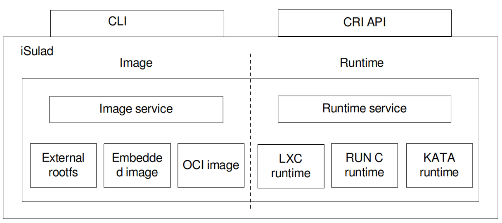
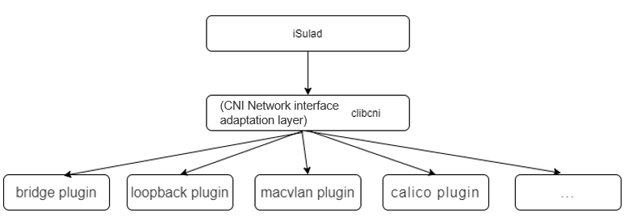
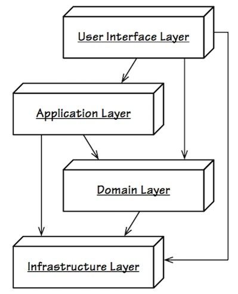
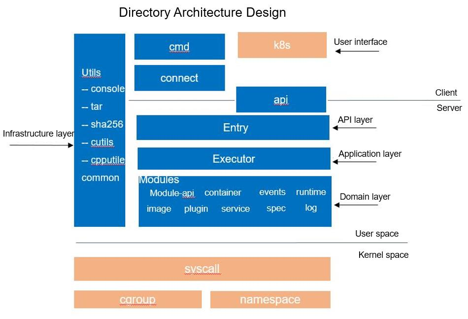
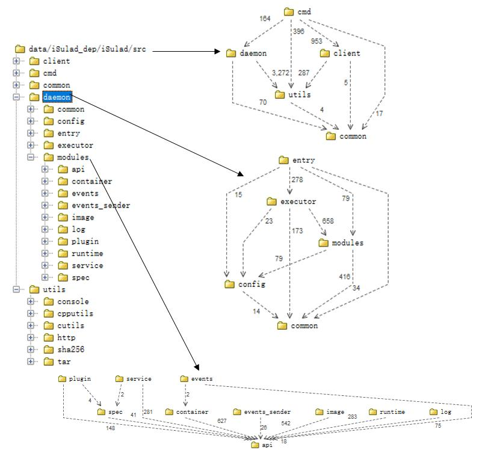

Introduction to the author: Li Feng has years of experience in container and OS software development, as well as in-depth research and understanding of container engines and runtime. He extensively participates in open source container communities such as LXC and Containers, and is now the maintainer of the openEuler iSulad community.  

iSulad is a container engine written in the C/C++ programming language. It has been open-sourced in the openEuler community ([https://gitee.com/openeuler/iSulad](https://gitee.com/openeuler/iSulad)).   Mainstream container engines, such as Docker, containerd, and CRI-O, are written in the GO language.  With the emergence of embedded device scenarios such as edge computing and the Internet of Things (IoT), the demands for service containerization are increasing in resource-limited environments.  The disadvantages in memory overhead of container engines written in high-level languages are becoming more and more prominent.  In addition, thanks to the standardization of external interfaces of container engines, it is possible to rewrite container engines using C/C++.  The following figure shows the overall architecture of iSulad.    

  

iSulad provides two types of external interfaces: command line interfaces (CLIs) and gRPC-based container runtime interfaces (CRIs). Its core service functions are image management and container management.    

The following figure shows the positioning of iSulad in the container ecosystem.  

   

This blog describes the features and overall architecture of iSulad.    

## iSulad Features   

### Client CLI for Container and Image Operations  

iSulad is in a typical client-server architecture model.  It functions as the daemon server and provides a client command **isula** for users.  

The command parameters provided by iSulad cover most common application scenarios, including container operations, such as starting, stopping, deleting, and pausing containers, and image-related operations, such as downloading, importing, and deleting images.    

```
$ sudo isula --help
USAGE:
	isula <command> [args...]

COMMANDS:
	attach 	Attach to a running container
	cp     	Copy files/folders between a container and the local filesystem
	create 	Create a new container
	events 	Get real time events from the server
	exec   	Run a command in a running container
	export 	export container
	images 	List images
	import 	Import the contents from a tarball to create a filesystem image
	info   	Display system-wide information
	inspect	Return low-level information on a container or image
	kill   	Kill one or more  running containers
	load   	load an image from a tar archive
	login  	Log in to a Docker registry
	logout 	Log out from a Docker registry
	logs   	Fetch the logs of a container
	pause  	Pause all processes within one or more containers
	ps     	List containers
	pull   	Pull an image or a repository from a registry
	rename 	Rename a container
	restart	Restart one or more containers
	rm     	Remove one or more containers
	rmi    	Remove one or more images
	run    	Run a command in a new container
	start  	Start one or more stopped containers
	stats  	Display a live stream of container(s) resource usage statistics
	stop   	Stop one or more containers
	tag    	Create a tag TARGET_IMAGE that refers to SOURCE_IMAGE
	top    	Display the running processes of a container
	unpause	Unpause all processes within one or more containers
	update 	Update configuration of one or more containers
	version	Display information about isula
	wait   	Block until one or more containers stop, then print their exit codes
```

### Example

If you are using an openEuler distribution, you can use iSulad as follows:    

Run the **yum** command to install iSulad.  

```
[root@openeuler ~]# yum install -y iSulad
```

After the installation is complete, check the service running status.    

```
[root@openeuler ~]# systemctl status isulad
● isulad.service - iSulad Application Container Engine
   Loaded: loaded (/usr/lib/systemd/system/isulad.service; enabled; vendor preset: disabled)
   Active: active (running) since Mon 2020-09-14 15:53:43 CST; 4h 35min ago
 Main PID: 1248 (isulad)
    Tasks: 25
   Memory: 88.3M
   CGroup: /system.slice/isulad.service
           ├─1248 /usr/bin/isulad
```

Modify the iSulad configuration file and add the image repository address.  

```
[root@openeuler iSula]# vi /etc/isulad/daemon.json   
{
    .......
    "registry-mirrors": [
        "hub.oepkgs.net"
    ],
    .......
```

Restart the iSulad service.  

```
[root@openeuler iSula]# systemctl restart isulad
```

Run a container based on the openEuler 20.09 image.  

Create a container.

```
[root@openeuler iSula]# isula create -it openeuler/openeuler:20.09
Unable to find image 'openeuler/openeuler:20.09' locally
Image "openeuler/openeuler:20.09" pulling
Image "8c788f4bfb7290e434b2384340a5f9811db6ed302f9247c5fc095d6ec4fc8f32" pulled
e91e5359be653f534312bc2b4703dcc6c4ca0436ac7819e09e1ff0e75ee1d733
```

The created container cannot be found by running the **isula ps** command because it is not running.

```
[root@openeuler iSula]# isula ps
CONTAINER ID	IMAGE				COMMAND	CREATED		STATUS	PORTS	NAMES
```

You can run the **isula pa –a** command to find the created container.

```
[root@ecs-cdf3 ~]# isula ps -a
CONTAINER ID	IMAGE				COMMAND	CREATED		STATUS	PORTS	NAMES
e91e5359be65		openeuler/openeuler:20.09	"/bin/bash"		8 seconds ago	Created	 e91e5359be653f534312bc2b4703dcc6c4ca0436ac7819e09e1ff0e75ee1d733
```

Start the container.

```
[root@openeuler iSula]# isula start e91e5359be65
```

You can run the **isula ps** command to find the container because it is now running.  

```
[root@openeuler iSula]# isula ps
CONTAINER ID	IMAGE				COMMAND	CREATED		STATUS	PORTS	NAMES
e91e5359be65		openeuler/openeuler:20.09	"/bin/bash"		30 seconds ago	Up 4 seconds	     e91e5359be653f534312bc2b4703dcc6c4ca0436ac7819e09e1ff0e75ee1d733
```

View the container system version information.

```
[root@ecs-cdf3 ~]# isula exec e91e5359be65 cat /etc/os-release
NAME="openEuler"
VERSION="20.09"
ID="openEuler"
VERSION_ID="20.09"
PRETTY_NAME="openEuler 20.09"
ANSI_COLOR="0;31"
```

The openEuler 20.09 container is successfully running on the openEuler 20.03 system.  

Suspend and resume a container.    

```
[root@openeuler iSula]# isula pause e91e5359be65
e91e5359be65
[root@openeuler iSula]# isula unpause e91e5359be65
e91e5359be65
```

Forcibly delete a running container.  

```
[root@openeuler iSula]# isula rm -f 6c1d81467d33
6c1d81467d3367a90dd6e388a16c80411d4ba76316d86b6f56463699306e1394
```

Delete an image.  

```
[root@openeuler iSula]# isula rmi openeuler/openeuler:20.09
Image " openeuler/openeuler:20.09" removed
```

### Support for the CRI Standard Protocol

The Container Runtime Interface (CRI) is a plugin interface defined by Kubernetes for container engines to provide container and image services externally to Kubernetes. In general, it is used by container engines to access Kubernetes.

The CRI is implemented based on gRPC. iSulad complies with the CRI specifications and implements the CRI gRPC server, including RuntimeService and ImageService, which provide the container runtime interface and image operation interface, respectively. The gRPC server of iSulad needs to listen to the local Unix sockets, and the kubelet component of Kubernetes runs as the gRPC client.  

  

### Support for the CNI Network Standard Protocol  

The Container Network Interface (CNI) is a container network standard protocol developed by Google and CoreOS. With the CNI protocol, iSulad communicates with specific network plugins through JSON files to implement network functions of containers.  iSulad uses the C language to implement the clibcni interface module to enable corresponding functions.  

  

### OCI Standard Compliment

OCI consists of two specifications: the **runtime specification and image format specification**.

#### Support for the OCI Standard Image Format

First, let's look at what is a container image. The root file system (rootfs) and some resource configurations required for container running are packaged into a specific data structure, which is called a container image. A container can easily run based on the image. The operating environment and applications are packaged into the container image, avoiding the environment dependency problem during application deployment. Each container image consists of one or more layers of data and a **config.json** configuration file. The multiple layers depend on each other. This dependency is called a parent-child relationship (the depended layer is the parent layer). Before a container runs, data at all layers is combined and mounted to the rootfs for the container to use, which is called the container layer. If the combined data conflicts, the data at the child layer overwrites the data with the same paths and names at the parent layer. The following figure shows the image structure.  

  

Image layering is used to solve the space occupation problem. If the current layer and all its recursively dependent parent layers have the same data, the data can be reused to reduce space occupation. The following figure shows the data reuse structure of two container images with the same layer 0 and layer 1.  

  

iSulad supports the OCI standard image format and image formats compatible with Docker. You can download container images from image repositories such as Docker Hub, or import image files exported from Docker to start containers.  

#### Support for the OCI Standard Runtime

iSulad supports the standard OCI runtime operation interfaces for container life cycle management. iSulad not only supports mainstream container runtimes such as runc and kata, but also modifies the LXC written in the C language to make it a C language runtime that supports the OCI standard protocol to meet the low memory overhead requirement. This further reduces the memory overhead of the container engine infrastructure.  
​The following uses iSulad to run a new container. You can view the processes generated during running and the persistent configurations to better understand the container running.  

To run a container, you need to download an image first. We use **openeuler/openeuler:20.09** mentioned above as the container image.  

Use the iSulad client command to download the image.  

```bash
$ sudo isula pull openeuler/openeuler:20.09
Image "openeuler/openeuler:20.09" pulling
Image "c7c37e472d31c1685b48f7004fd6a64361c95965587a951692c5f298c6685998" pulled
```

Create a container and start it.

```bash
$ sudo isula run -itd openeuler/openeuler:20.09
42fc2595f876b5a18f7729dfb10d0def29789fb73fe0f1327e0277e6d85189a1
```

After the container is started, you can view the persistent container configuration file through a local file.

```bash
# cd /var/lib/isulad/engines/lcr/42fc2595f876b5a18f7729dfb10d0def29789fb73fe0f1327e0277e6d85189a1
# ls -al
total 92
drwxr-x--- 3 root root 4096 Jul 27 16:25 .
drwxr-x--- 3 root root 4096 Jul 27 16:25 ..
-rw-r----- 1 root root 4045 Jul 27 16:25 config
-rw-r----- 1 root root 23878 Jul 27 16:25 config.json
-rw-r----- 1 root root 2314 Jul 27 16:25 config.v2.json
-rw-r----- 1 root root     0 Jul 27 16:25 console.log
-rw-r----- 1 root root   101 Jul 27 16:25 hostconfig.json
-rw-r--r-- 1 root root    10 Jul 27 16:25 hostname
-rw-r--r-- 1 root root   183 Jul 27 16:25 hosts
drwx------ 3 root root 4096 Jul 27 16:25 mounts
-rw-r----- 1 root root     5 Jul 27 16:25 ocihooks.json
-rw-r--r-- 1 root root   707 Jul 27 16:25 resolv.conf
-rw-r----- 1 root root 26140 Jul 27 16:25 seccomp
```

The **config.json** file is the container configuration file that complies with the OCI standard protocol. It contains the configuration information required for starting the container.

```bash
# cat config.json
{
    "ociVersion": "1.0.1",
    "hooks": {

    },
    "hostname": "localhost",
    "mounts": [
        {
            "source": "tmpfs",
            "destination": "/dev",
            "options": [
                "nosuid",
                "strictatime",
                "mode=755",
                "size=65536k"
            ],
            "type": "tmpfs"
        },
        {
            "source": "mqueue",
            "destination": "/dev/mqueue",
            "options": [
                "nosuid",
                "noexec",
                "nodev"
            ],
            "type": "mqueue"
        },
        ...
```

The **config.v2.json** file contains information about container persistence maintenance and management of iSulad, including basic container configurations, creation time, startup time, container PID, and running startup time.  

```bash
# cat config.v2.json
{
    "CommonConfig": {
        "Path": "sh",
        "Config": {
            "Hostname": "localhost",
            "User": "",
            "Tty": true,
            "OpenStdin": true,
            "Env": [
                "PATH=/usr/local/sbin:/usr/local/bin:/usr/sbin:/usr/bin:/sbin:/bin"
            ],
            "Cmd": [
                "sh"
            ],
            "WorkingDir": "",
            "LogDriver": "json-file"
        },
        "Created": "2020-07-27T16:25:16.170149428+08:00",
        "Image": "openeuler/openeuler:20.09",
        "ImageType": "oci",
        "Name": "42fc2595f876b5a18f7729dfb10d0def29789fb73fe0f1327e0277e6d85189a1",
        "id": "42fc2595f876b5a18f7729dfb10d0def29789fb73fe0f1327e0277e6d85189a1"
    },
    "Image": "sha256:c7c37e472d31c1685b48f7004fd6a64361c95965587a951692c5f298c6685998",
    "State": {
        "FinishedAt": "0001-01-01T00:00:00Z",
        "Pid": 19232,
        "PPid": 19229,
        "StartTime": 2731408,
        "PStartTime": 2731402,
        "Running": true,
        "StartedAt": "2020-07-27T16:25:16.286812971+08:00"
    }
}
```

## Performance

### Performance Comparison with Other Container Engines

#### Test Environment

| Configuration | Information                                  |
| ------------- | -------------------------------------------- |
| OS            | Fedora32 X86_64                              |
| Kernel       | linux 5.7.10-201.fc32.x86_64                 |
| CPU           | 48 cores, Intel Xeon CPU E5-2695 v2 @ 2.4GHZ|
| Memory       | 132 GB                                       |

#### Test Software 

| Name      | Version                                                               |
| --------- | --------------------------------------------------------------------- |
| iSulad    | Version: 2.0.3, Git commit: 3bb24761f07cc0ac399e1cb783053db8b33b263d |
| docker    | Version: 19.03.11, Git commit: 42e35e6                                |
| podman    | Version: 2.0.3                                                        |
| CRI-O     | v1.15.4                                                               |
| kubelet   | v1.15.0                                                               |
| cri-tools | v1.15.0                                                               |

#### Single-Container Operations

Execution Time Using a Client (in Milliseconds)

| Operator| Docker | Podman | iSulad | vs. Docker | vs. Podman |
| ------------- | ------ | ------ | ------ | --------- | --------- |
| create        | 287    | 180    | 87     | -69.69%   | -51.67%   |
| start         | 675    | 916    | 154    | -77.19%   | -83.19%   |
| stop          | 349    | 513    | 274    | -21.49%   | -46.59%   |
| rm            | 72     | 187    | 60     | -16.67%   | -67.91%   |
| run           | 866    | 454    | 195    | -77.48%   | -57.05%   |

Execution Time Using the CRI (in Milliseconds)

| Operator| Docker | CRI-O | iSulad | vs. Docker | vs. Podman |
| ------------- | ------ | ---- | ------ | --------- | --------- |
| runp          | 681    | 321  | 186    | -72.69%   | -42.06%   |
| stopp         | 400    | 356  | 169    | -57.75%   | -52.53%   |

#### Concurrent 100-Container Operations

Execution Time Using a Client (in Milliseconds)

| Operator| Docker | Podman | iSulad | vs. Docker | vs. Podman |
| ------------- | ------ | ------ | ------ | --------- | --------- |
| 100 \* create | 4995   | 3993   | 829    | -83.40%   | -79.24%   |
| 100 \* start  | 10126  | 5537   | 1425   | -85.93%   | -74.26%   |
| 100 \* stop   | 8066   | 11100  | 2273   | -71.82%   | -79.52%   |
| 100 \* rm     | 3220   | 4319   | 438    | -86.40%   | -89.86%   |
| 100 \* run    | 9822   | 5979   | 2117   | -78.45%   | -64.59%   |

Execution Time Using the CRI (in Milliseconds)

| Operator| Docker | CRI-O | iSulad | vs. Docker | vs. Podman |
| ------------- | ------ | ---- | ------ | --------- | --------- |
| 100 \* runp   | 13998  | 4946 | 2825   | -79.82%   | -42.88%   |
| 100 \* stopp  | 8402   | 4834 | 4543   | -45.93%   | -6.02%    |

## iSulad Code Architecture

We have introduced the main features of iSulad. Now, let's go to the iSulad code to understand its organizational architecture.

### **DDD Layered Architecture Design**

iSulad adopts the Domain Driven Design (DDD) to organize the architecture by layer. The layers are as follows:  

  

The logical layers and their responsibilities are as follows:  

| **Layer**  | **Function**                                                                          |
| ---------- | -------------------------------------------------------------------------------------- |
| User interface layer  | Displays information and interprets user commands.                                                    |
| API layer    | Defines and implements the client-server communication interface and the CRI.                                            |
| Application layer    | Calls interfaces at the domain layer to implement corresponding service applications.                                                  |
| Domain layer    | Contains domain information, which is the core of the iSulad software. It has multiple modules and is the actual execution layer of the service logic.|
| Infrastructure layer| Serves as the support library of other layers, and provides various tool functions for other layers to call.                          |

According to the preceding logical layering design, the architecture of iSulad source code directories is organized as follows:  

  

The **api** directory contains the .proto file of the gRPC service provided by iSulad for external systems. During compilation, gRPC is used to generate the corresponding client and server code.  

### Organizational Structure of Code at Each Layer

#### User Interface Layer

Code of the user interface layer is stored in the **src/cmd** directory, which contains the command line interfaces provided by iSulad for external systems. The **cmd** directory contains interpretations and parameters of the `isula` (client), `isulad` (server), and `isulad-shim` commands. The code structure is as follows:  

```bash
├── CMakeLists.txt
├── command_parser.c
├── command_parser.h
├── isula # Definitions of the client commands and subcommands  
│   ├── base # Basic container operation commands, such as those for creating, starting, and deleting containers  
│   ├── client_arguments.c
│   ├── client_arguments.h
│   ├── CMakeLists.txt
│   ├── extend  # Extended commands for container operations, such as the update command for updating container resources and the events command for viewing container event logs.
│   ├── images # Image-related operation commands, such as those for downloading, importing, and deleting images
│   ├── information # Commands for querying container information, such as inspect and info
│   ├── isula_commands.c
│   ├── isula_commands.h
│   ├── main.c
│   └── stream  # Persistent connection commands, such as cp, attach, and exec that require persistent connection with the server
├── isulad # Definitions of the server commands and parameters
│   ├── CMakeLists.txt
│   ├── isulad_commands.c
│   ├── isulad_commands.h
│   └── main.c
└── isulad-shim # Definitions of the isulad-shim commands and parameters
│   ├── CMakeLists.txt
│   ├── common.c
│   ├── common.h
│   ├── main.c
│   ├── process.c
│   ├── process.h
│   ├── terminal.c
│   └── terminal.h
└── options # Common parameter parsing method
│   ├── CMakeLists.txt
│   ├── opt_log.c
│   ├── opt_log.h
│   ├── opt_ulimit.c
│   └── opt_ulimit.h


```

#### API Layer  

Code of the API layer of iSulad is stored in the **src/daemon/entry** directory, which provides definitions of the client-server communication interface and the CRI.

This layer is used to process client and CRI requests.

In the **cri** directory, iSulad implements two types of services: image and runtime.

```bash
├── CMakeLists.txt
├── connect # Client request processing
│   ├── CMakeLists.txt
│   ├── grpc # gRPC request interface processing
│   ├── rest # RESTful request interface processing
│   ├── service_common.c
│   └── service_common.h
└── cri  # CRI request processing
    ├── checkpoint_handler.cc
    ├── checkpoint_handler.h
    ├── CMakeLists.txt
    ├── cni_network_plugin.cc
    ├── cni_network_plugin.h
    ├── cri_container.cc # Processing of container-related operation requests in the CRI
    ├── cri_container.h
    ├── cri_image_service.cc # Processing of image-related operation requests in the CRI
    ├── cri_image_service.h
    ├── cri_runtime_service.cc  # Processing of runtime-related operation requests in the CRI
    ├── cri_runtime_service.h
    ├── cri_sandbox.cc # Processing of pod-related operation requests in the CRI
    ├── cri_sandbox.h
    ├── cri_security_context.cc # CRI security configuration processing
    ├── cri_security_context.h
    └── websocket  # Processing of CRI streaming service requests using the WebSocket service
```

#### Application Layer

Code of the application layer of iSulad is stored in the **src/daemon/executor** directory. It is used to call APIs at the domain layer to implement corresponding service applications. The application layer is a service scheduling layer. According to the folder names, the application layer implements two service modules: image and runtime.

```bash
├── callback.c
├── callback.h
├── CMakeLists.txt
├── container_cb # Container service module
│   ├── CMakeLists.txt
│   ├── execution.c
│   ├── execution_create.c
│   ├── execution_create.h
│   ├── execution_extend.c
│   ├── execution_extend.h
│   ├── execution.h
│   ├── execution_information.c
│   ├── execution_information.h
│   ├── execution_network.c
│   ├── execution_network.h
│   ├── execution_stream.c
│   ├── execution_stream.h
│   ├── list.c
│   └── list.h
└── image_cb # Image service module
    ├── CMakeLists.txt
    ├── image_cb.c
    └── image_cb.h
```

#### Domain Layer

The domain layer contains domain information, which is the core of the iSulad software. It contains all service modules and is the execution layer of the service logic. Its code is stored in **src/daemon/modules**.

```bash
├── api # Header files provided by the domain layer, which are used by the application layer
│   ├── CMakeLists.txt
│   ├── container_api.h
│   ├── events_collector_api.h
│   ├── events_sender_api.h
│   ├── event_type.h
│   ├── image_api.h
│   ├── io_handler.h
│   ├── log_gather_api.h
│   ├── plugin_api.h
│   ├── runtime_api.h
│   ├── service_container_api.h
│   ├── service_image_api.h
│   └── specs_api.h
├── CMakeLists.txt
├── container # Container module, which maintains the full life cycle and status of a container
│   ├── CMakeLists.txt
│   ├── container_events_handler.c
│   ├── container_events_handler.h
│   ├── container_gc
│   ├── containers_store.c
│   ├── containers_store.h
│   ├── container_state.c
│   ├── container_state.h
│   ├── container_unix.c
│   ├── container_unix.h
│   ├── health_check
│   ├── restart_manager
│   ├── restore
│   └── supervisor
├── events # Event collection module, which collects container and image events generated during iSulad running
│   ├── CMakeLists.txt
│   ├── collector.c
│   ├── monitord.c
│   └── monitord.h
├── events_sender  # Event sending module, which provides an interface for sending events to the event collection module
│   ├── CMakeLists.txt
│   └── event_sender.c
├── image # Image management module
│   ├── CMakeLists.txt
│   ├── embedded # Management of images in embedded format
│   ├── external # Management of images in external format
│   ├── image.c
│   ├── image_rootfs_handler.c
│   ├── image_rootfs_handler.h
│   └── oci	# Management of images in OCI format
├── log # Log collection module
│   ├── CMakeLists.txt
│   └── log_gather.c
├── plugin # Plugin mechanism module
│   ├── CMakeLists.txt
│   ├── plugin.c
│   ├── pspec.c
│   └── pspec.h
├── runtime # Container runtime module
│   ├── CMakeLists.txt
│   ├── engines # LXC-based lightweight runtime interconnection interface
│   ├── isula # Standard OCI runtime interconnection interface
│   └── runtime.c
├── service # Service module, including the implementation of collaborative calls to multiple modules
│   ├── CMakeLists.txt
│   ├── io_handler.c
│   ├── service_container.c # Container service operation interface
│   └── service_image.c  # Image service operation interface
└── spec  # OCI specification configuration module, which provides functional interfaces such as OCI specification combination and verification
    ├── CMakeLists.txt
    ├── specs.c
    ├── specs_extend.c
    ├── specs_extend.h
    ├── specs_mount.c
    ├── specs_mount.h
    ├── specs_namespace.c
    ├── specs_namespace.h
    ├── specs_security.c
    ├── specs_security.h
    ├── verify.c  # Interface for configuring the verification function
    └── verify.h
```

#### Infrastructure Layer

The infrastructure layer is located in the **src/utils** directory. It functions as the support library of other layers, and provides various tool functions for other layers to call.

```bash
├── buffer # Buffer tool functions
│   ├── buffer.c
│   ├── buffer.h
│   └── CMakeLists.txt
├── CMakeLists.txt
├── console # I/O terminal processing tool functions
│   ├── CMakeLists.txt
│   ├── console.c
│   └── console.h
├── cpputils # Tool functions used by C++, including basic character string processing, URL, and thread tools
│   ├── CMakeLists.txt
│   ├── cxxutils.cc
│   ├── cxxutils.h
│   ├── stoppable_thread.cc
│   ├── stoppable_thread.h
│   ├── url.cc
│   └── url.h
├── cutils # Tool functions used by C, including basic character string processing, data type conversion, file processing, and regular expression tools
│   ├── CMakeLists.txt
│   ├── util_atomic.c
│   ├── util_atomic.h
│   ├── utils_aes.c
│   ├── utils_aes.h
│   ├── utils_array.c
│   ├── utils_array.h
│   ├── utils_base64.c
│   ├── utils_base64.h
│   ├── utils.c
│	....
├── http # HTTP processing tool functions, including HTTP request, parsing, and authentication tools
│   ├── certificate.c
│   ├── certificate.h
│   ├── CMakeLists.txt
│   ├── http.c
│   ├── http.h
│   ├── mediatype.h
│   ├── parser.c
│   ├── parser.h
│   ├── rest_common.c
│   └── rest_common.h
├── sha256 # sha256 tool functions, which are used to calculate SHA-256 hash values.
│   ├── CMakeLists.txt
│   ├── sha256.c
│   └── sha256.h
└── tar # File compression and decompression tool function
    ├── CMakeLists.txt
    ├── isulad_tar.c
    ├── isulad_tar.h
    ├── util_archive.c
    ├── util_archive.h
    ├── util_gzip.c
    └── util_gzip.h
```

### Calling Process

You can use the **Structure101** code analysis tool to sort out the calling dependencies between iSulad code directories.  

  

As the top layer, the user interface layer (**cmd**) only calls interfaces of other modules and is not depended by other modules. **cmd** calls the functions in the **client** directory to communicate with the daemon service. The **cmd** directory contains the `daemon` command of iSulad. Therefore, it depends on the function definitions in the **daemon** directory.

The **daemon** directory is the top-level directory of the server code, including the code of the API layer (**entry**), application layer (**executor**), and domain layer (**modules**). As the entry for calling the daemon service, the API layer needs to call functions at other layers for service scheduling. Other layers do not depend on this layer. The application layer needs to call the interfaces of each module at the domain layer (**modules**) to implement specific services.

With the core code of iSulad at the domain layer, the **modules** directory contains the implementation of every sub-function module. Take the **image** module as an example. The **image_api.h** file is provided in **src/daemon/modules/api** to shield the differences between different image formats and implement a unified image operation function interface.

```c
int image_module_init(const isulad_daemon_configs *args);

void image_module_exit();

int im_list_images(const im_list_request *request, im_list_response **response);

int im_rm_image(const im_rmi_request *request, im_remove_response **response);

int im_tag_image(const im_tag_request *request, im_tag_response **response);

int im_inspect_image(const im_inspect_request *request, im_inspect_response **response);

int im_import_image(const im_import_request *request, char **id);

int im_load_image(const im_load_request *request, im_load_response **response);

int im_pull_image(const im_pull_request *request, im_pull_response **response);

char *im_get_image_type(const char *image, const char *external_rootfs);

bool im_config_image_exist(const char *image_name);

int im_login(const im_login_request *request, im_login_response **response);

int im_logout(const im_logout_request *request, im_logout_response **response);

int im_container_export(const im_export_request *request);

void free_im_export_request(im_export_request *ptr);

```

Inside the image management module, image operations in different formats are distinguished.

```c
static const struct bim_type g_bims[] = {
#ifdef ENABLE_OCI_IMAGE
    {
        .image_type = IMAGE_TYPE_OCI,
        .ops = &g_oci_ops,
    },
#endif
    { .image_type = IMAGE_TYPE_EXTERNAL, .ops = &g_ext_ops },
#ifdef ENABLE_EMBEDDED_IMAGE
    { .image_type = IMAGE_TYPE_EMBEDDED, .ops = &g_embedded_ops },
#endif
};
```

Other modules are designed in a similar way. The detailed analysis of each module will be analyzed in subsequent blogs.
