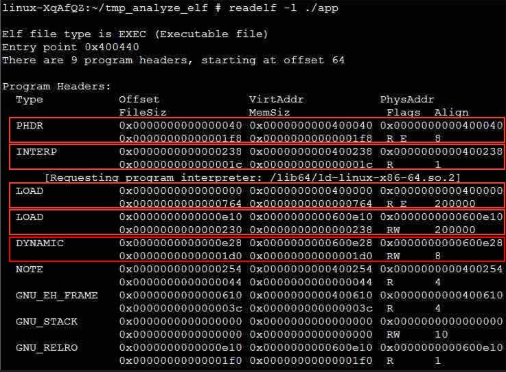
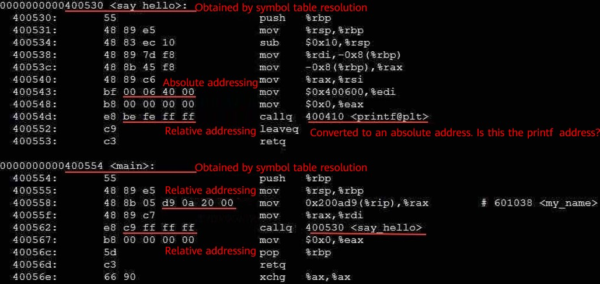

# ELF File Format Analysis
A compiler can compile and convert the source code to an object file. In terms of structure, an object file is the same as an executable file. The only difference is that the object file isn't linked, and some symbols and addresses isn't adjusted.  

Executable file formats cover all aspects of program compilation, linking, loading, and execution. Understanding the executable file format helps understand the operating system and the mechanism behind program execution.  

Currently, the executable file format for the Linux platform is Executable and Linkable Format (ELF), which is similar to the EXE file format for the Windows platform.  


Example Program
====
To facilitate understanding, a simple C language program is used as an example to describe each part of the ELF.  
```c
#include <stdio.h>

void say_hello(char *who)
{
    printf("hello, %s!\n", who);
}

char *my_name = "wb";

int main()
{
    say_hello(my_name);
    return 0;
}    
```
Compile it to generate an executable program named **app** and run it.  
```shell
linux-XqAfQZ:~/tmp_analyze_elf # gcc -o app main.c
linux-XqAfQZ:~/tmp_analyze_elf # ./app
hello, wb!  
```

ELF Layout
====
The ELF format can express four types of binary object files:  
  1. Relocatable file (.o file)  
    2. Executable file (for example, the app file generated by the preceding example code)  
    3. Shared object file (.so file, used for dynamic linking)  
    4. Core dump file  

Relocatable files are used in the building and linking phase. Executable files are used in the program execution phase. Shared object files are used in both phases. We can understand the ELF from different perspectives in different phases. The following figure shows the overall layout.  

  

As shown in the preceding figure, an ELF file consists of four parts:  
  * An ELF header defines global information.  
  * A program header table is an array of structures, each describing a segment. Executable files usually contain a program header table. Relocatable files usually don't contain one, but they could.  
  * A segment consists of several sections. Segments are loaded into the process address space during execution and are contained in executable files. A section is a unit of a segment and is contained in executable files and relocatable files.  
  * A section header table is an array of structures, each describing a section. Relocatable files usually contain a section header table. Executable files usually contain one, but they don't need it.  


ELF Header
====
The fields in the ELF header are defined as follows:  

  

Run the **readelf -h** command to view the ELF header content in the example program **app**. The command output is as follows:  

  

  * **e_ident** contains the first 16 bytes and can be further divided into fields such as class, data, and version. You only need to know that the file is in ELF format if the first four bytes contain the keyword "ELF".  
  * **e_type** indicates the ELF type, which can be the relocatable file, executable file, or shared library file. **e_machine** indicates the machine platform where the file is executed, which is x86_64 in the example.  
  * **e_version** indicates the file version. The value **1** indicates the initial version.  
  * **e_entry** indicates the entry point address. It is the program entry function address and is expressed as an address in the process virtual address space (0x400440 in the example).  
  * **e_phoff** indicates the start of program headers, that is, the offset of the program header table in the file. In the example, **e_phoff** starts from byte 64 (assuming that the initial byte is byte 0).  
  * **e_shoff** indicates the start of section headers, that is, the offset of the section header table in the file. In the example, **e_shoff** starts from byte 4472, which is close to the end of the file.  
  * **e_flags** indicates information related to the CPU architecture and is zero in the example.  
  * **e_ehsize** indicates the size of this header. The size is 64 bytes in the example. The value of **e_phoff** is also 64, which means that the ELF header is followed by the program header table.  
  * **e_phentsize** indicates the size of program headers, that is, the size of each element in the program header table. In this example, the size is 56 bytes.  
  * **e_phnum** indicates the number of program headers, that is, the number of elements in the program header table. In this example, the number is 9.  
  * **e_shentsize** indicates the size of section headers, that is, the size of each element in the section header table. In this example, the size is 64 bytes.  
  * **e_shnum** indicates the number of section headers, that is, the number of elements in the section header table. In this example, the number is 30.  
  * **e_shstrndx** indicates the section header string table index, that is, the subscript of the section name string table in the section header table. For details, see the description of the string table in the following sections.  

Program Header Table
====
The program header table is an array. Each array element is called a program header. The structure of the program header table is defined as follows:  

  

Run the **readelf -l** command to view the program header table of the example program.  

  

The preceding figure shows the first part of the command output. The following analyzed only some headers:  
  * **PHDR**: This header element describes the information about the program header table. The offset of the program header table of the example program in the file is 0x40, that is, 64 bytes, and the virtual address (**VirtAddr**) of the process space to which the segment is mapped is 0x400040. **PhysAddr** is the same as **VirtAddr** but not used currently. The file size occupied by **PhysAddr** is 00x1f8. The size of the process space occupied by **PhysAddr** is also 0x1f8. **Flags** indicates the read and write permissions of the segment. **R E** indicates that the segment is readable and executable, which means that the segment is a code segment. **Align** is 8, indicating that the segment is 8-byte aligned.  
  * **INTERP**: This header element describes a special memory segment that records the access path string of the dynamically loaded interpreter. In the example program, the memory segment is located at the file offset 0x238, following the program header table. The mapped process virtual address space's address is 0x400238. The file length and memory-mapped file length are both 0x1c, that is, 28 characters. The specific path is **/lib64/ld-linux-x86-64.so.2**. The segment is read-only and aligned by byte.  
  * **LOAD**: This header element describes the code segment or data segment that can be loaded to the process space. The first **LOAD** element is a code segment. The file offset is 0 and the mapped process address is 0x400000. The length of the code segment is 0x764 bytes. The segment is read-only and executable. The segment address is aligned to a 2M boundary. The second **LOAD** segment is a data segment. The file offset is 0xe10. The data segment is mapped into the process address at 0x600e10 (2M aligned). The file size is 0x230 and the memory size is 0x238 (because there is an 8-byte BSS segment, that is, an uninitialized data segment, which does not occupy the file space, but needs to be allocated space and cleared during running). The segment is readable and writable, and the segment address is also aligned to a 2M boundary.  
  * **DYNAMIC**: This header element describes the dynamically loaded segment, which usually contains a dynamically loaded section named **.dynamic**. This segment is also an array. Each array element describes information related to dynamic loading, which will be described in dynamic loading. This segment starts from the file offset 0xe28, has a length of 0x1d0, and is mapped to 0x600e28 of the process. Therefore, this segment overlaps with the previous data segment.  

The second part of the **readelf** command output shows the include relationship between segments and sections, as shown in the following figure. The **INTERP** segment contains only the **.interp** section. The code segment contains the **.interp**, **.plt**, and **.text** sections. The data segment contains the **.dynamic**, **.data**, and **.bss** sections. The **DYNAMIC** segment contains the **.dynamic** section. As we can see, some sections are included in multiple segments.  

  

Section Header Table  
====
The section header table describes file sections. The definition of each element in the array is as follows:  

  

Run the **readelf -S** command to view the content of the section header table in the example program, as shown in the following figure. There are 30 sections in the example program. **Name** indicates the section name. **Type** indicates the section function. **Address** indicates the virtual address of each section. **Offset** indicates the offset in the file. **Size** indicates the section size. **EntSize** indicates the size of each element in a section (if the section isn't an array, the value is 0). **Flags** indicates the section attribute. **Link** and **Info** record the information about different types of sections (for details, see the specifications). **Align** indicates the alignment unit of the section.  

  

String Table
====
In the preceding section header table example, there is a section type of STRTAB (subscripts 6, 27, and 29 in the section header table). This section is called a string table, which records all character string information. When other sections need to use character strings, only the offset of the start address of the character string in the string table needs to be recorded. The entire character string content doesn't need to be included.  

Run the **readelf -x** command to output the detailed information in the subscript-27 section.  

  

The content in the red box is the actual content of the section, the left part is the offset address of the section, and the right part is the character representations. We can see that there are a bunch of character strings, which correspond to the section names. Therefore, the name field of each element in the section header table is the index of the string table. The value of **e_shstrndx** in the ELF header is 27, pointing to the current string table.  

Similarly, let's look at the content in section 29, as shown in the following figure. We can see the **main** and **say_hello** character strings, which are symbols defined in the source code in the example. Therefore, section 29 is the string table of the application, which records the character strings used by the application.  

  

Symbol Table  
====
In the section header table, there is another section type of SYMTAB (DYNSYM), which is called a symbol table. Each element in the symbol table corresponds to a symbol and records the actual value of the symbol. The symbol table is usually used in a relocation or a problem location process. The process execution doesn't load the symbol table. These elements are defined as follows: **name** indicates a source code string corresponding to a symbol, and is an index to a string table; **value** indicates the symbol value; **size** indicates a space occupied by the symbol; **info** indicates related information of the symbol, for example, a symbol type (variable symbol or function symbol); **shndx** indicates an index of the section related to the symbol, for example, a function symbol is related to a code section.  

  

Run the **readelf -s** command to output the symbol table in the example program, as shown in the following figure. The value corresponding to the **main** function symbol defined in the example program is 0x400554, the type is FUNC, the size is 26 bytes, and the index of the corresponding code section in the section header table is 13. The value corresponding to the **say_hello** function symbol is 0x400530, the type is FUNC, the size is 36 bytes, and the corresponding code section is 13.  

  

Code Segment
====
After understanding the functions of the string table and symbol table, we use **objdump** to disassemble a file to understand the **.text** code segment.  

  

We can see that a function is defined at 0x400530 and 0x400554 respectively. The symbols of the functions are **say_hello** and **main** respectively. The information is obtained by resolving the symbol table. In an instruction involving a memory address, except that a reference to a data segment address is performed by using an absolute address, a reference to a code segment address is performed by using a relative address. An advantage of doing so is that in a relocation process of a binary file, we don't need to change the address of the instruction (because the relative address remains unchanged). The access to the library function **printf** points to the code segment address 0x400410. Is the **printf** function stored at this address? The answer involves dynamic linking, which we will discuss in future.  

Summary
====
The preceding definitions and examples can help you understand the basics of the ELF file format. If you want to further explore the ELF files in detail, you can visit the following links:  
1. [https://en.wikipedia.org/wiki/Executable_and_Linkable_Format](https://en.wikipedia.org/wiki/Executable_and_Linkable_Format)
2. [https://linux-audit.com/elf-binaries-on-linux-understanding-and-analysis/](https://linux-audit.com/elf-binaries-on-linux-understanding-and-analysis/)
3. [https://refspecs.linuxfoundation.org/elf/elf.pdf](https://refspecs.linuxfoundation.org/elf/elf.pdf)
