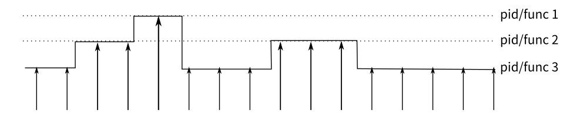

## VM Performance Tuning Tools

# 1. trace

## 1.1 Introduction

The trace tool is used to trace and record system kernel events, including kernel information, kernel extension information, and user programs, especially system calls, kernel services, and interrupt handlers. The source code of trace is stored in **\kernel\trace\trace.c**.

trace has three working modes: alternate (the default mode), single, and circular.

1. Default: In this mode, the trace data is written to the drive by default.
2. Single: In this mode, data is written to the memory buffer. After the trace daemon stops, the data is written to the drive. When the buffer is full, the daemon automatically stops.
3. Circular: In this mode, data is first written to the memory buffer as well. The difference is that the buffer is reused after it is full, and the previous data is overwritten. The trace daemon does not stop until you run the **trcstop** command. After the daemon is stopped, data is written to the drive.

## 1.2 Obtaining Trace Data

The following is an example of the most commonly used trace command: **trace -a -l -T2000000 -L4000000 -o trace.out**

**-a**: Runs the trace daemon asynchronously (as a background task).  
**-l**: Runs the trace daemon in the circular mode.  
**-o**: Specifies the directory and name of the file output by trace. The default value is **/var/adm/ras/trcfile**.  
**-T**: Specifies the buffer size, in bytes. The default value is **128 KB**.  
**-L**: Specifies the size of the trace file written to the drive, in bytes. The default value is **1 MB**.

# 2. perf

## 2.1 Introduction

perf (short for performance) is a performance analysis tool provided by the Linux system. It returns names of functions that are being executed by the CPU and the call stacks.

Based on the event sampling principle, performance events can be used to analyze the performance metrics related to processors and operating systems to locate performance bottlenecks and hotspot code.

CPU cycles, also called clock ticks, are default performance events. A CPU cycle is the minimum time unit that can be identified by the CPU, usually several hundred millionths of a second. It is the time required for the CPU to execute a simplest instruction, for example, reading the content in a register.

The principle of perf is as follows: An interrupt is generated on each core of the CPU at a fixed interval. perf checks the current process and function on the interrupt, and then increases the statistics value of the corresponding process and function. In this way, we know the percentage of time the CPU spends on a process or a function. The following figure shows an example working mode.

This is a sampling mode. It is expected that a function (or process) with more running time is more likely to be hit by a clock interrupt. Therefore, it can be inferred that the CPU usage of the function (or process) is higher.

## 2.2 Common Sub-tools

+ perf-list

  **perf list** is used to view performance events supported by perf, including:

  1. Hardware events are generated by the performance monitor unit (PMU), for example, cache hit. To know the usage of hardware features by programs, we need to sample these events.

  2. Software events are generated by the kernel, such as process switch and clock tick.

  3. Tracepoint events are triggered by the static tracepoints in the kernel. These events are used to determine kernel behavior details during program running, for example, the number of allocation times of the slab allocator.

  > Usage: perf list [hw | sw | cache | tracepoint | event_glob]

  **hw**, **cache**, and **pmu** are hardware-related; **tracepoint** uses Ftrace of the kernel; **sw** is a kernel counter.

+ perf-stat

  When a performance problem occurs, you are advised to analyze the problem in the top-down sequence. First, view the general situation of various statistical events during program running, and then check the details of some events.

  To monitor the overall code performance, use the **perf stat** tool. This tool monitors the overall code performance and allows you to find out the causes of the program performance bottleneck. It provides the overall status and statistics of the program during running in a simplified manner.

  By default, **perf stat** collects statistics on hardware and software events that have the greatest impact on system or software performance, such as cycles, instructions, cache-misses and context-switches. Based on the statistics, we can know whether the software running efficiency is affected by the CPU, I/O, number of instructions, or memory access. Based on the number of instructions and cache access times, we can determine whether the software performance meets the design and whether code-level optimization is possible.

  > Usage:
  >
  > perf stat [-e <EVENT> | --event=EVENT] [-a] <command>
  >
  > perf stat [-e <EVENT> | --event=EVENT] [-a] - <command> [<options>]

  That is, **perf stat** + program. After the program running is complete, press **Ctrl** + **C** to stop the program (if the program automatically stops, skip this operation). Then, perf prints the monitoring result, as shown in the following figure.

  

  1. **102.97 task-clock** indicates that 102.97 task clock cycles are occupied during program running. A higher value indicates that more time is spent on CPU computing instead of I/O operations.

  2. **6 context-switches** indicates that 6 context switches occur during program running. Frequent process switches should be avoided. (Frequent switches may occur between processes or between the kernel mode and user mode.)

  3. **0 cpu-migrations** indicates that CPU migration occurs for 0 times during program running. CPU migration: A user program is running on one CPU and then migrated to another CPU.

  4. **617 page-faults** indicates that 617 page faults occur in the program.

  5. Other items that can be monitored, such as branch prediction and cache hit

+ perf-top

  **perf top** can be used to observe the list of functions with the highest performance overhead in the system and software. By observing the function list of different events, we can analyze the performance overhead and characteristics of different functions and determine the optimization direction.

  For example, if a function ranks low in **perf top -e instructions** but high in **perf top -e cache-misses** and **perf top -e cycles**, a large number of cache misses occur during the function execution, causing high CPU usage. In this case, we can optimize the memory access policy of the function to reduce the number of memory access times and cache misses, thereby reducing the CPU overhead.

  > Usage: perf top [-e <EVENT> | --event=EVENT] [<options>]
  >
  > > Common parameters:
  > >
  > > **-e <event>**: Specifies the performance event to be analyzed.
  > >
  > > **-p <pid>**: profile events on existing processes. Sperate PIDs with commas. Only the target process and its threads are analyzed.
  > >
  > > **-k <path>**: path to vmlinux. This parameter is required for annotation functionality. It is the path of the kernel image with a symbol table.
  > >
  > > **-K**: Do not display symbols that belong to the kernel or modules.
  > >
  > > **-U**: Do not display symbols that belong to user-mode programs.
  > >
  > > **-d <n>**: GUI refresh interval. The default value is 2s, because **perf top** reads performance data from the mmap memory area every 2s by default.
  > >
  > > **-g**: Obtains the calling relationship diagram of functions.

+ perf-record/perf-report

  **perf record** collects sampling information and records it in a .data file. Then, **perf report** analyzes the .data file. The result is similar to that of **perf top**.

  > Usage: Use **perf record** to record information and generate a .data file, and then use **perf report** to display the result.

# 3 Flame Graph

## 3.1 Introduction

A flame graph, as its name indicates, looks like a flame. The operation at the top of a flame graph is the operation that is being performed by the CPU. Note that the color is random and has no special meaning. The y axis indicates the call stack depth, and the x axis indicates the consumed time. Call stacks are sorted alphabetically on the x axis, and the same call stacks are combined. A wide call stack may be a bottleneck. Therefore, pay attention to wide call stacks, especially for a flame with a plateau.

Each box in the CPU flame graph is a function. The length of the box represents its execution time. The wider the function, the longer the execution time. Each higher floor of the flame graph is deeper functions that are called. Functions at the top are leaf functions.

## 3.2 Usage

1. The Flame Graph project is hosted on GitHub: [https://github.com/brendangregg/FlameGraph](https://github.com/brendangregg/FlameGraph)

2. Run the **git clone** command to clone the project: **git clone https://github.com/brendangregg/FlameGraph.git**

The following uses perf as an example to describe how to generate a flame graph:

Step 1

> perf record -e cpu-clock -g -p `pidof xxx`

After you press **Ctrl** + **C**, the sampling data **perf.data** is generated in the current directory.

Step 2

Use **perf script** to parse **perf.data**.

> perf script -i perf.data &> perf.unfold

Step 3

Go to the **FlameGraph** directory.

Fold symbols in **perf.unfold**.

> ./stackcollapse-perf.pl perf.unfold &> perf.folded

Step 4

Generate an SVG image.

> ./flamegraph.pl perf.folded > perf.svg

## 3.3 Analyzing the Flame Graph

A flame graph is an SVG image generated based on stack information to display CPU call stacks.

The y axis indicates call stacks. Each box is a function. A deeper stack produces a higher flame. The top is the function being executed, and its parent function is below it.

The x axis indicates the number of samples. A wider function indicates longer execution time of the function. Note that the x axis does not represent the passage of time. Instead, it represents all call stacks arranged in alphabetical order.

In the flame graph, the function at the top layer that occupies the largest width is the most hotspot function. If a plateau occurs, the function may have performance issues. The larger the width, the more likely a performance problem exists.

# 4 Common Linux Performance Detection Commands

| Command       | Description              |
| ----------- | ---------------------- |
| uptime      | Average system load rate        |
| dmesg       | Hardware/System information         |
| top         | Process status          |
| iostat      | Average CPU and drive usage   |
| vmstat      | System running status          |
| sar         | Collecting system usage in real time  |
| free        | Memory usage            |
| traffic-vis | Network monitoring (available only for SUSE)|
| pmap        | Memory usage of a process        |
| strace      | Tracing the program running status      |
| ulimit      | System resource usage restriction      |
| mpstat      | Multiprocessor usage        |

* ### top

  **Function**

  Displays information about the process that is being executed in the system, including the process ID, memory usage, and CPU usage.

  **Options**

  **-b**: batch processing

  **-c**: Displays complete commands.

  **-I**: Ignores invalid procedures.

  **-s**: secure mode

  **-S**: cumulative mode

  **-i<time>**: Sets the interval.

  **-u<user_name>**: Specifies the user name.

  **-p<PID>**: Specifies the process.

  **-n<count>**: number of cyclic display times

* ### free

  **Function**

  Displays the used and free physical memory, swap memory usage, cache occupied by the kernel, and shared memory.

  **Options**

  **-b**, **–bytes**: Displays the memory usage in bytes.

  **-k**, **–kilo**: Displays memory usage in KB. This is the default value.

  **-m**, **–mega**: Displays memory usage in MB.

  **-g**, **–giga**: Displays memory usage in GB.

  **-h**, **–human**: Automatically converts values into human-readable forms.

  **-c**, **–count**: Displays the output *count* number of times. This option actually works with **-s** option.

  **-s**, **–seconds**: interval for dynamically refreshing the memory usage

+ ### iostat

  **Function**

  Views the activity and load information of devices such as the CPU, NIC, TTY device, drive, and CD-ROM.

  **Options**

  **-C**: Displays the CPU usage.

  **-d**: Displays the drive usage.

  **-m**: The unit is MB.

  **-k**: The unit is KB.

  **-N**: Displays the LVM information.

  **-n**: Displays the NFS usage.

  **-p[drive]**: Displays the drive and partition information.

  **-t**: Displays terminal and CPU information.

  **-x**: Displays details.

  **-V**: Displays the version information.
