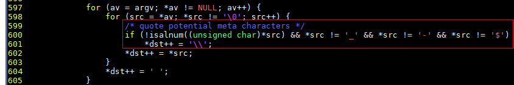
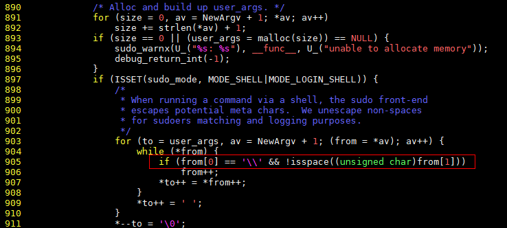

### Overview
Qualys has disclosed the sudo heap-based buffer overflow vulnerability (CVE-2021-3156) that allows privilege escalation to root via **sudoedit -s** and a command-line argument that ends with a single backslash character (\\).  
### Vulnerability Details
(1) Technical analysis

A heap-based buffer overflow occurs when sudo parses command-line arguments. Any local user (common users or system users, sudoers or non-sudoers) can exploit this vulnerability to bypass identity authentication when escalating privileges from a common user to the root user. The biggest threat posed by this vulnerability is the threat to data confidentiality and integrity as well as system availability.  
This vulnerability was introduced in July 2011 (commit 8255ed69). When **sudoedit –s /** is executed, the parse_args function in the **src/parse_args.c** file of sudo sets **/** to **\\**.  
 

The vulnerable code is in the set_cmnd function of the **plugins/sudoers/sudoers.c** file. The key code is as follows:  
 

If a command-line argument ends with a single backslash character (**sudoedit –s /** will execute this code logic), then:
a. In line 905, "from[0]" is the backslash character, and "from[1]" is the argument's null terminator (i.e., not a space character).  
b. In line 906, the index of "from" is incremented by 1 and points to the null terminator.    
c. In line 907, the null terminator is copied to the "user_args" buffer, and the index of "from" is incremented by 1 again and points to the first character after the null terminator (i.e., the index is out of bounds).  
d. The "while" loop at lines 904-908 copies out-of-bounds characters to the "user_args" buffer.

(2) Vulnerability fixing

Fix the buffer overflow problem when backslashes are escaped in user_args. Do not escape backslashes unless the run mode and shell mode are both specified. Reject insecure **-H** and **-P** options. After that, when you run the **sudoedit –H** or **sudoedit –P** command, error information starting with "usage:" is displayed.  


(3) Troubleshooting

Log in to the system as a non-root user and run the **sudoedit -s /** command.  

- If an error message starting with "sudoedit:" is displayed, the vulnerability exists.
- If an error message starting with "usage:" is displayed, the patch has taken effect.  

### Impact
Affected versions:
           All legacy versions from 1.8.2 to 1.8.31p2
           All stable versions from 1.9.0 to 1.9.5p1
The version on openEuler is 1.9.2.

### Workarounds
Use SystemTap to temporarily make the **sudoedit** command unavailable.  
First, install the SystemTap software package, dependencies, and debuginfo software package of sudo.   

```
yum install systemtap kernel-devel-"$(uname -r)"
debuginfo-install sudo
```

Then, create a SystemTap script and name it **sudoedit-block.stap**.  

```
probe process("/usr/bin/sudo").function("main") {
        command = cmdline_args(0,0,"");        
        if (strpos(command, "edit") >= 0) {                
                raise(9);        
        }
}
```

Finally, run the script as the root user.  

```
nohup stap -g sudoedit-block.stap &
```

This script will disable the vulnerable sudoedit binary file, whereas the sudo commands can be executed normally. The preceding modification becomes invalid after the system is restarted. You must run the script again after each restart.  
After a patch is installed, you can disable the SystemTap script by stopping the SystemTap process to make **sudoedit** available again.  

Example: **# kill -s SIGTERM 26285** (**26285** is the PID of the SystemTap process.)

### Vulnerability Fixing Method
•	Download the latest sudo software packages released by openEuler.   
	Security advisory on this vulnerability: https://www.openeuler.org/en/security/safety-bulletin/detail.html?id=openEuler-SA-2021-1002 
	20.03-LTS:   
		[AArch64](https://repo.openeuler.org/openEuler-20.03-LTS/update/aarch64/Packages)   
		[x86](https://repo.openeuler.org/openEuler-20.03-LTS/update/x86_64/Packages)   
	20.03-LTS-SP1:   
		[AArch64](https://repo.openeuler.org/openEuler-20.03-LTS-SP1/update/aarch64/Packages/)   
		[x86](https://repo.openeuler.org/openEuler-20.03-LTS-SP1/update/x86_64/Packages/)

•	Upgrade the sudo software package.

```
rpm -Uvh sudo-*.rpm
```

•	After the upgrade is complete, check whether the sudo software package is successfully upgraded.

```
rpm -qi sudo
```

​	20.03-LTS: This vulnerability is fixed in sudo-1.9.2-2.  
​	20.03-LTS-SP1: This vulnerability is fixed in sudo-1.9.2-3.

### Interface Changes
The **sudoedit -H** and **sudoedit –P** commands are no longer supported.  
After the two commands are executed, error information starting with "usage:" is displayed.
