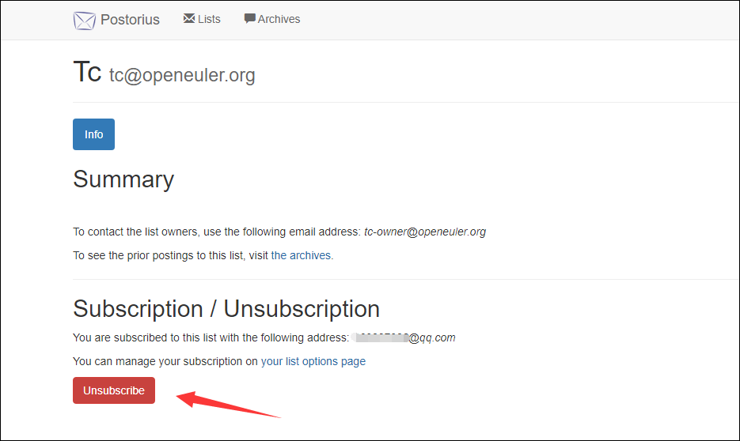

---  
title: How to unsubscribe from a mailing list of the openEuler community
date: 2021-10-14
tags:
    - openEuler
    - mailing list
    - unsubscribe
sig: sig-Gatekeeper
archives: 2021-10
author: liuqi<469227928@qq.com>
summary: The blog provides two ways to unsubscribe from a mailing list of the openEuler community.

---  

### Subscribe on Web UI
If you are a registered user of the openEuler mailing list (the registration interface is not available currently), log in to
the Postorius UI, go to the mailing list to be unsubscribed from and click **Unsubscribe**.

  
### Subscribe through email
The following uses unsubscribing from tc@openeuler.org as an example.
Send an email to tc-leave@openeuler.org using your subscription mailbox. There are no special requirements on the email title
and content.
  
  
You will receive an email with a title starting with `tc-confirm`. Reply to this email (you can email a blank message) if you
are sure to unsubscribe.

  
Finally, you will receive an email from tc-bounces informing you of the unsubscription success.

### More
Visit [**Mailweb List FAQ**](https://osinfra.cn/faq/mailinglist.html) for more questions about the community mailing
list.
