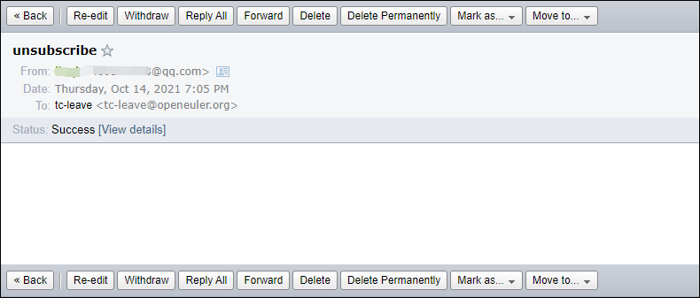
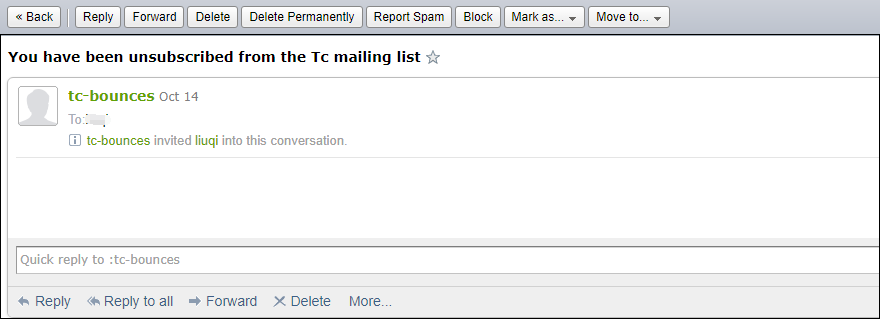

---  
title: How to unsubscribe from a mailing list of the openEuler community
date: 2021-11-23
tags:
    - openEuler
    - mailing list
    - unsubscribe
sig: sig-Gatekeeper
archives: 2021-11
author: liuqi<469227928@qq.com>
summary: The blog provides two ways to unsubscribe from a mailing list of the openEuler community.

---  
The openEuler infrastructure team has received some inquries from community maintainers and contributors about how to
unsubscribe from openEuler mailing lists. Here we provide two methods:

### 1. Unsubscribe through email

There are two scenarios for sending an email to unsubscribe.

- 
  Some emails contain the footer of unsubscription instructions. You can click test-leave@openeuler.org to edit and send 
  unsubscription emails. There are no special requirements on the email title and content.

  

  Later, you will receive an email from test-bounces informing you of the unsubscription success.
  
-
  You can also send an email to tc-leave@openeuler.org (already subscribed) using your subscription mailbox. 
  There are no special requirements on the email title and content.
  
  
  Later, you will receive an email from tc-bounces informing you of the unsubscription success.
  

### 2. Unsubscribe on Web UI
If you are a registered user of the openEuler mailing list (the registration interface is not available currently), log in to
the Postorius UI, go to the mailing list to be unsubscribed from and click **Unsubscribe**.

### More
Visit [**Mailweb List FAQ**](https://osinfra.cn/faq/mailinglist.html) for more questions about the community mailing
list.
