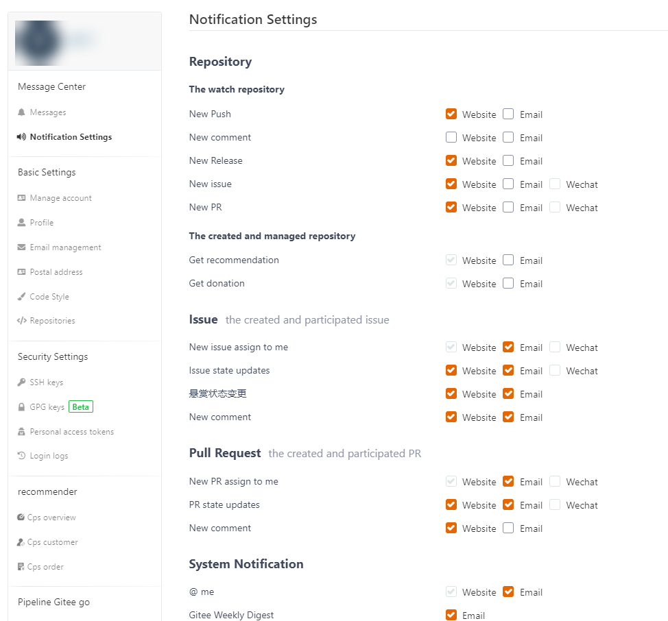
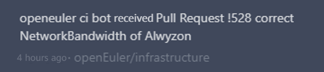
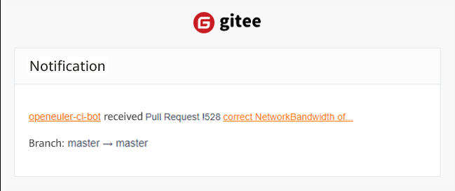
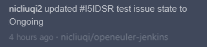
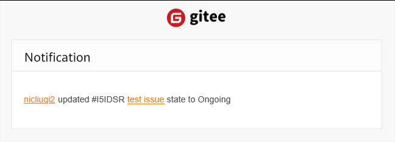
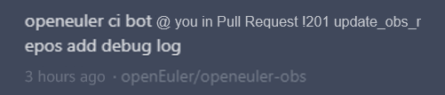
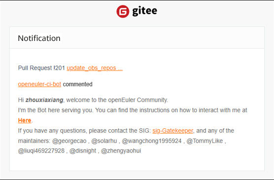

### Background
In the EulerTalk developer meeting, maintainers and developers from multiple SIGs of the openEuler community provided many valuable suggestions. One of them indicates that Gitee notifications are limited to the Gitee website currently. When there are too many messages, users cannot obtain useful information (such as pull request (PR) and issue assignment and PR merges) in a timely manner.  

After checking Gitee settings, we find that Gitee provides not only website message notifications, but also email and WeChat notifications. The notification mode can be customized. This document describes how to configure email notifications.  

### Settings  
On your [Gitee](https://gitee.com/profile/account_information) account homepage, choose **Settings** > **Message Center** > **Notification Settings**.
You can select one or more notification modes based on your preferences or requirements.  

Gitee notification settings

### Notifications  
Notifications in the following scenarios are based on the settings in the preceding figure.  
- Scenario 1: The PR created by you is merged by others.  

  **PR state updates**: choose **website** and **email**.

Gitee website message

Email notification

- Scenario 2: An issue is assigned to you.  

  **New issue assign to me**: choose **email**.

Email notification
  

- Scenario 3: The state of the assigned issue changes.  

  **Issue state updates**: choose **website** and **email**.  

Gitee website message

Email notification
  

- Scenario 4: You are @mentioned.  

  **@ me**: choose **website** and **email**.  

Gitee website message

Email notification

**NOTE**: Notifications in the preceding scenarios are not triggered by yourself. If you perform the preceding operations, you will not receive the corresponding notification. In addition, if you are mentioned in a repository to which you do not have the access permission, you will not be notified.  