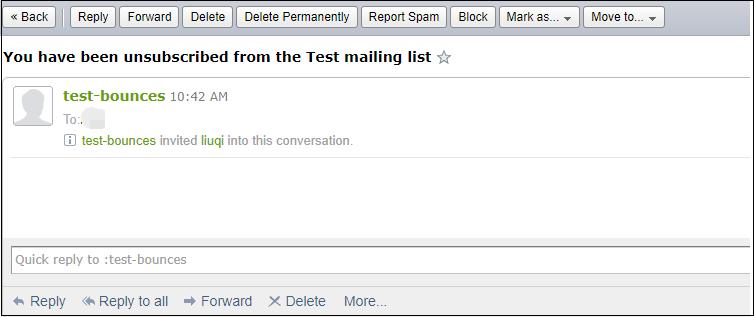
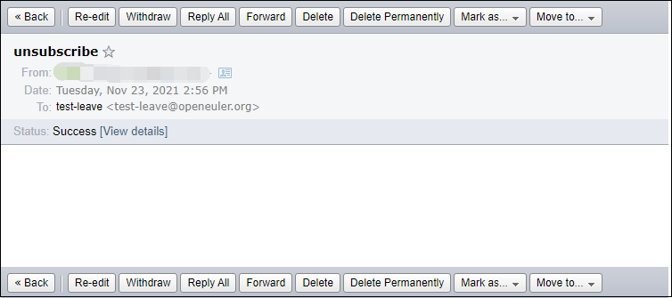
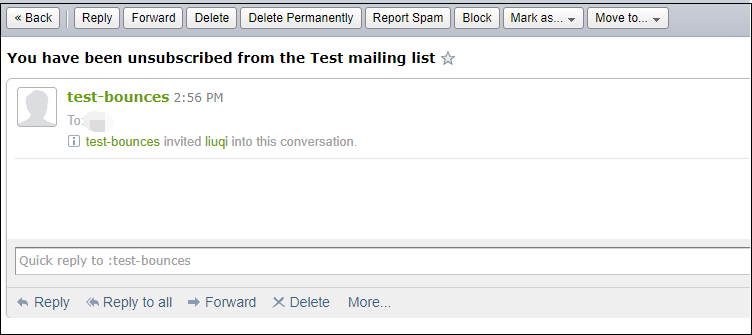
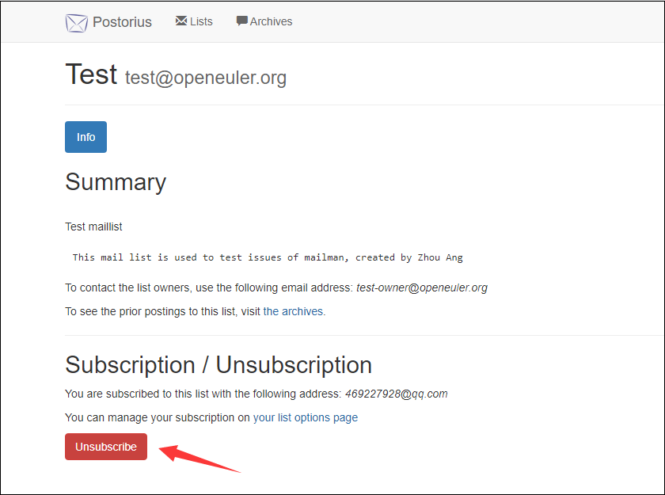

# How to Unsubscribe from a Mailing List of the openEuler Community
The openEuler infrastructure team has received some inquiries from community maintainers and contributors about how to unsubscribe from openEuler mailing lists. Here are two methods:

### 1. Unsubscribe through email

Unsubscribe by email in either of two methods.  In an email with an unsubscription footer, click the unsubscription icon in the email footer to create and send an unsubscription email. Alternatively, send an email to `**-leave@openeuler.org`. The following describes how to unsubscribe from test@openeuler.org.

-
  For emails containing an unsubscribe footer, click test-leave@openeuler.org to create and send unsubscription emails. You do not need to include a specific email title or include any content.  
    

  After you send the email, you will receive an email from test-bounces informing you that you have successfully unsubscribed from the mailing list.  
    

-
  You can also send an email to tc-leave@openeuler.org from your registered mailbox. You do not need to include a specific email title or include any content.  
    

  After you send the email, you will receive an email from tc-bounces informing you that you have successfully unsubscribed.  
    

### 2. Unsubscribe on WebUI
If you are a registered user of the openEuler mailing list (the registration interface is unavailable currently), log in to [**Postorius**](https://mailweb.openeuler.org/postorius/lists/), go to the related mailing list, and click **Unsubscribe**.  

  

### More Related Issues
Visit [**Mailweb List FAQ**](https://osinfra.cn/faq/mailinglist.html) for more questions about the community mailing list.

