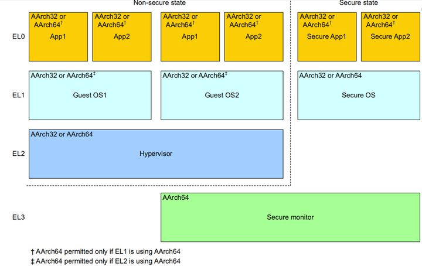
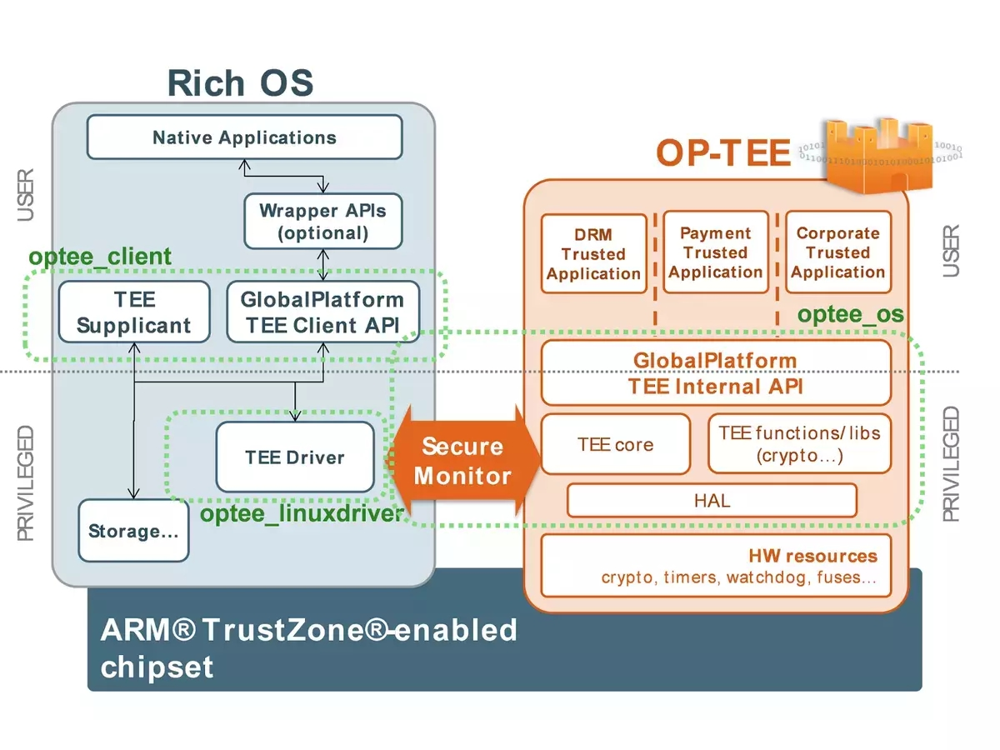

# Adaptation of OP-TEE to openEuler

Kunpeng 920 processors support the Arm TrustZone technology, so theoretically, they also support the ARM-based Trusted Execution Environment (TEE) solution. The TrustZone technology divides the execution environment of the ARM CPU into two states: normal world state and secure world state. Programs executed in the normal world state cannot access the memory, cache, and other peripheral, secure, and hardware devices in the secure world state, achieving hardware-level security isolation.

In ARMv8 architecture, the CPU can execute in four different exception levels (EL0-EL3). EL0 is used to run a user application, EL1 is used to run an OS kernel, EL2 is used to support virtualization of the non-secure state, and EL3 is used to switch between the secure world state and the normal world state. The following figure shows the relationship between the execution levels and security states.

As shown in the preceding figure, guest OSs (such as Linux and Android) run in the normal world state and have rich operating resources, which are also called rich execution environments (REEs). Secure OSs (also called trusted execution environment operating systems, TEE OSs) and secure applications (also called trusted applications, TAs) run in the secure world state. Even if the REE is trusted, it cannot access system resources in the secure world state, such as a security device, secure memory and cache data. Therefore, users can store sensitive data in the secure world, and then the TA completes related data processing. Code running in the secure world state can access the address space on the REE side. A program on the REE side may obtain specific data and invoke a specific function in the secure world state by running a client application (CA) in the normal world state. To switch between the secure world state and the normal world state, the system executes the smc instruction to enter the EL3 secure monitor mode.

To implement TrustZone, the ARMv8 architecture adds non-secure bits (NS bits) to the bus, page tables in the MMU, and caches, and provides permission control on secure operations and secure operation signals for peripheral components. When the primary device initiates a read or write operation, the secondary device can check the NS bit on the bus to prevent the security device from being accessed from the normal world. In addition, the TrustZone Address Space Controller (TZASC) divides the address space of the secondary device into the secure space and non-secure space. The addresses in the secure space cannot be accessed from the normal world. This mechanism is also used to control the access to the off-chip DRAM. For the on-chip ROM and on-chip static ARM, the TrustZone Memory Adapter (TAMA) divides them into secure and non-secure halves. For peripherals, the TrustZone Protection Controller (TZPC) distinguishes secure peripherals from non-secure peripherals.

[OP-TEE](https://github.com/OP-TEE) is an open source TEE solution jointly developed by Linaro and STMicroelectronics. It complies with the GlobalPlatform specifications and contains a client API (optee_client), a TEE driver module in Linux (optee_linuxdriver), and a trusted OS (optee_os). The trusted OS uses the BSD open source protocol. Therefore, SoC vendors and device vendors can modify OP-TEE without disclosing the modifications, helping OP-TEE to become a commercial product. The following figure shows the OP-TEE architecture.

  

In the preceding figure, the OP-TEE libteec library provides 10 GlobalPlatform TEE Client APIs. They enable applications on the REE to request the TEE to establish a connection, allocate shared memory, and send commands. The information is transmitted to the TEE through the OP-TEE driver in Linux. The TEE supplicant is a permanent process on the REE side. It receives and processes requests from the TEE. A trusted application (TA) in the TEE sends a request to the REE through the OP-TEE driver by using a remote procedure call (RPC). The TEE supplicant monitors the status of RPC requests from the TEE in the driver. Once receiving a request, the TEE supplicant parses and processes the request. Common RPC requests from TAs include TA image loading, REE-side file system operations, socket operations, and REE-side database operations. The OP-TEE driver in Linux creates a request queue for RPC requests. Each time receiving an RPC request from the TEE, the TEE supplicant automatically creates a thread to receive other RPC requests from the request queue, implementing concurrent processing of RPC requests. The TEE supplicant processes the RPC requests and sends the processing result to the TEE through the OP-TEE driver.

In the ARMv8 architecture, loading and boot processes of the OP-TEE and Linux kernel are generally completed by ARM Trusted Firmware (ATF). The ATF provides unified ARM base interface standards to facilitate code porting. The main functions of the ATF are as follows:

> - Initialize the running environment, exception vector, control register, interrupt controller, and configuration platform interrupts in the secure world.
> - Initialize the driver of the ARM generic interrupt controller (GIC 2.0 or GIC 3.0).
> - Enable the standard initialization of the ARM system IP and the initial configuration of the security extensions.
> - Process the logic code of Secure Monitor Call (SMC) requests.
> - Implement the trusted board boot function and check the electronic signature of the image file loaded during the boot process.
> - Support self-developed firmware boot. Developers can add self-developed firmware to the ATF boot process as required.

The ATF implements the secure boot function of ARMv8. The source code is divided into BL1, BL2, BL31, BL32, and BL33. The code of the former stage is used to load the image file of the latter stage and provide the boot entry for the code of the latter stage. Before an image file is loaded, the electronic signature of the image file is verified to ensure the validity of the image file. The BL31 is used to complete switching between the secure world and the normal world, the BL32 is used to load the TEE OS, and the BL33 is used to load the REE OS. The ATF secure boot process is as follows:

> 1. Execute chip ROM.
> 2. Obtain and verify the electronic signature of BL1.
> 3. Go to BL1 and verify the electronic signature of the BL2 image.
> 4. Execute the BL2 image and verify the electronic signature of the BL31 image.
> 5. Execute the BL31 image, complete the software configuration of the EL3 running status, and verify whether the TEE OS image is valid.
> 6. Start the TEE OS and verify whether the bootloader is valid.
> 7. Start the bootloader (supported by embedded systems, and generally the BIOS is used by servers) to check whether the kernel or recovery image is valid.
> 8. Start the kernel or recovery image.

If the validity verification fails in any step, the system is suspended. The bootloader is generally used in a boot process of an embedded system, and the BIOS is generally used in a server. This means that in a boot process of the Kunpeng 920, the bootloader in the foregoing process needs to be replaced with the BIOS. For the structure of the OP-TEE boot BIOS, refer to the structure of BIOS used to run the OP-TEE on QEMU. When the OP-TEE runs on QEMU, the **bios.bin** image file is generated during compilation. This file contains the Linux kernel image, OP-TEE OS image, and rootfs image. During the boot, the entry function in the **/bios/entry.S** file initializes the interrupt vector table, BSS segment, and stack space, calls the main_init_sec function to load the OP-TEE OS image, and calls the main_init_ns function to start the Linux kernel image. The main_init_sec function loads the OP-TEE OS image, Linux kernel image, rootfs, and device tree to the RAM. In the QEMU project, the device tree is stored in the DTB_START address instead of **bios.bin**. During the boot of Linux, the rootfs and OP-TEE driver are mounted. The OP-TEE driver is compiled into the Linux kernel image in the compilation phase. Linux automatically creates a TEE supplicant during boot. The boot information of the process is written into the **/etc/init.d** file during compilation.

Based on the preceding process, the preliminary solution for adapting OP-TEE on the Kunpeng 920 is as follows:

1. Modify the OP-TEE compilation file based on QEMU-v8 and delete QEMU-related compilation options.
2. Modify the BIOS based on the QEMU-v8 compilation result. Pay attention to the device tree loading process.
3. Modify the secure boot process of the ATF and replace the bootloader with the modified BIOS. This process can be implemented by using the self-developed firmware supported by the ATF.

------

### References

[1] Mobile Phone Security and Trusted Application Development Guide: Detailed Solutions for TrustZone and OP-TEE Technology (Shuai Fengyun, Huang Teng, Song Yangzhu, 2018)

[2] [https://www.linaro.org/blog/op-tee-open-source-security-mass-market/](https://www.linaro.org/blog/op-tee-open-source-security-mass-market/)

[3] [https://blog.csdn.net/yiyueming/article/details/72897362](https://blog.csdn.net/yiyueming/article/details/72897362)