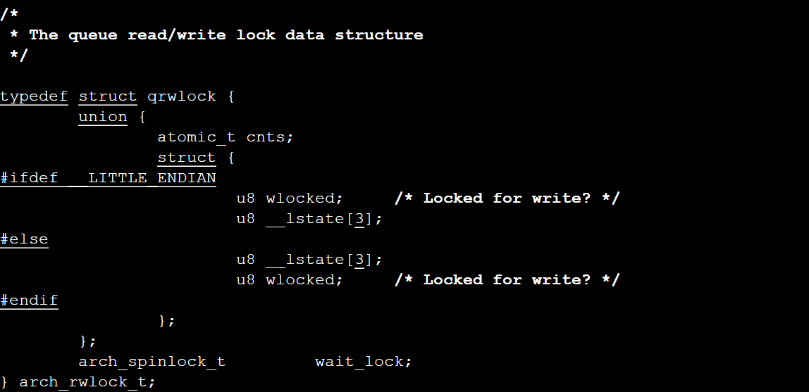

# Queued Readers-Writer Locks on openEuler

Threads in a same thread group share data structures **mm_struct** and **vm_area_struct**, thereby implementing memory sharing. However, when two threads access a same shared memory block at the same time, contention occurs. In other words, the sequence for the two threads to access the memory may be uncertain. Consequently, the output of a program is uncertain. To ensure an expected sequence in which threads access shared variables, an inter-thread communication mechanism is required. Common inter-thread communication mechanisms include locks and semaphores. The two mechanisms may be used to ensure that only one thread enters the program segment where a shared resource is accessed at a time. Such a program segment is referred to as a critical section. Locks on openEuler include spin locks and mutex locks. In this article, spin locks are introduced, including queued spin locks and queued readers-writer locks.

Spin locks are used to protect short critical sections where sleep is not allowed. The spin lock definition code can be found in **include/linux/spinlock_types.h**.  

  

This code segment encapsulates another structure **raw_spinlock** whose definition code can be found in the same file.  

  

The definition of the **arch_spinlock_t** type is different for the single-processor scenario and the symmetric multiprocessor (SMP) scenario. For the single-processor scenario, it is defined in **spinlock_types_up.h**. For another, it is defined in **spinlock_types.h**.  

  

In the single-processor scenario, the definition of **arch_spinlock_t** is empty.


In the SMP scenario, the **arch/arm64/include/asm/spinlock_types.h** file shows that the definition of **arch_spinlock_t** is contained in the following two files:


You can find the definition of **arch_spinlock_t** in **qspinlock_types.h**.

```
typedef struct qspinlock {
        union {
                atomic_t val;

                /*
                 * By using the whole 2nd least significant byte for the
                 * pending bit, we can allow better optimization of the lock
                 * acquisition for the pending bit holder.
                 */

#ifdef __LITTLE_ENDIAN
                struct {
                        u8      locked;
                        u8      pending;
                };
                struct {
                        u16     locked_pending;
                        u16     tail;
                };
#else
                struct {
                        u16     tail;
                        u16     locked_pending;
                };
                struct {
                        u8      reserved[2];
                        u8      pending;
                        u8      locked;

                };

#endif
        };
} arch_spinlock_t;
```

The **locked** bit indicates the lock status. Specifically, the value **1** indicates that the lock cannot be obtained, and **0** indicates that the lock can be obtained. For the pending bit, **1** indicates that at least one thread is waiting for the lock, and **0** indicates that the lock is held but not contended for or a waiting queue already exists [2].

The two files define the queued spin lock and the queued readers-writer lock, respectively. The readers-writer lock is an improvement of the spin lock. Spin locks allow only one thread to enter the critical section at a time. Readers-writer locks allow multiple readers or only one writer to access the critical section at the same time. That is, a writer is mutually exclusive with another writer or a reader, but readers can concurrently enter the critical section. Queuing refers to using a queue algorithm to manage multiple threads that want to hold a lock. On openEuler, the FIFO algorithm is used to manage threads that wait in a queue. Queued spin locks are described in detail in reference [2], and this article focuses on queued readers-writer locks.

The definition code of queued readers-writer locks can be found in the **include/asm-generic/qrwlock_types.h** file.



The lower nine bits of the **cnts** atomic variable indicate whether the readers-writer lock of the queue is held by a writer. The next nine bits indicate the number of readers who hold the queued readers-writer lock. In addition, a queued spin lock wait_lock is defined in the readers-writer lock. To better understand the code, let's first learn about the atomic variables and operations on openEuler. Atomic variables can be used to implement exclusive access to integer variables. An atomic operation on an atomic variable is indivisible. Atomic variables are of the **atomic_t** type. Common operations on an atomic variable are as follows [1]:

- atomic_read(v): Reads the value of an atomic variable.
- atomic_add_return(i,v): Adds *i* to the value of atomic variable *v* and returns a new value.
- atomic_sub_return(i,v): Subtracts *i* from the value of atomic variable *v* and returns a new value.
- atomic_cmpxchg(v,old,new): If the value of atomic variable *v* is *old*, set *v* to *new* and return the old value.

On openEuler, a series of atomic operations is defined in the **include/linux/atomic.h** file, for example, atomic_add_return_acquire.


atomic_cmpxchg_acquire:


You can use these atomic operations to operate the **cnts** variable in the queued readers-writer lock. For example, in the queued_read_trylock() function in the **include/asm-generic/qrwlock.h** file, the atomic_read() function is used to read the value of the **cnts** atomic variable. If no writer holds the lock, the number of readers is increased and **1** is returned. Otherwise, the number of readers remains unchanged and **0** is returned.


The definitions of the involved parameters are as follows:


**cnts** and **QW_WMASK** are used to check whether the lock is held by a writer. **_QR_BIAS** is used to perform atomic addition on **cnts**, so that the upper bits of **cnts** can be used to count the number of readers. Then let's look the definition of the queued_write_trylock() function.


This function determines whether a reader or writer has held the readers-writer lock by checking whether the value of the **cnts** variable is **0**. If yes, the lock fails to be obtained. If no, the function sets the lower eight bits of **cnts** to **0xff**, indicating that the lock is held by a writer.

The following is the definition of the queued_read_lock() function. This function calls the queued__read_lock_slow_path() function when it is confirmed that no writer holds the lock.


The code of this function can be found in the **./kernel/locking/qrwlock.c** file.

```
/**

 * queued_read_lock_slowpath - acquire read lock of a queue rwlock

 * @lock: Pointer to queue rwlock structure
 */
   void queued_read_lock_slowpath(struct qrwlock *lock)
   {
       /*
        * Readers come here when they cannot get the lock without waiting
        */
       if (unlikely(in_interrupt())) {
               /*
                * Readers in interrupt context will get the lock immediately
                * if the writer is just waiting (not holding the lock yet),
                * so spin with ACQUIRE semantics until the lock is available
                * without waiting in the queue.
                */
               atomic_cond_read_acquire(&lock->cnts, !(VAL & _QW_LOCKED));
               return;
       }
       atomic_sub(_QR_BIAS, &lock->cnts);

       /*
        * Put the reader into the wait queue
        */
               arch_spin_lock(&lock->wait_lock);
               atomic_add(_QR_BIAS, &lock->cnts);
       
               /*
                * The ACQUIRE semantics of the following spinning code ensure
                * that accesses can't leak upwards out of our subsequent critical
                * section in the case that the lock is currently held for write.
                */
               atomic_cond_read_acquire(&lock->cnts, !(VAL & _QW_LOCKED));
       
               /*
                * Signal the next one in queue to become queue head
                */
               arch_spin_unlock(&lock->wait_lock);
       }
       EXPORT_SYMBOL(queued_read_lock_slowpath);


```

**atomic_cond_read_acquire(&lock->cnts, !(VAL & _QW_LOCKED))** indicates that the reader waits for the writer to release the lock. If the writer holds the lock, the reader keeps waiting. The arch_spin_lock() function puts the reader into the queue by using the queued spin lock mechanism, and the arch_spin_unlock() function puts the next reader in the queue into the queue head. In the queuing mechanism of the queued spin lock, if the lock is available, the thread directly obtains the lock. If the lock is held by another thread and no other thread is waiting, the thread continuously attempts to obtain the lock by waiting in a loop (spinning). If there are more threads waiting, the threads form a queue. The thread at the head of the queue spins and continuously attempts to acquire the lock, and the remaining threads sleep [2]. For details, see reference [2] chapter 6 or reference [3]. The queuing mechanism for a writer to obtain a lock is similar. The difference is that a reader only needs to wait for the writer to release the lock, while a writer needs to wait for all readers or another writer to release the lock.

---


### References

[1] Yu Huabing, *In-depth Analysis of Linux Kernel*, 2019

[2] Ren Ju, Zhang Yaoxue, and Peng Xuhong, *openEuler Operating System*, 2020

[3] [https://zhuanlan.zhihu.com/p/100546935](https://zhuanlan.zhihu.com/p/100546935)