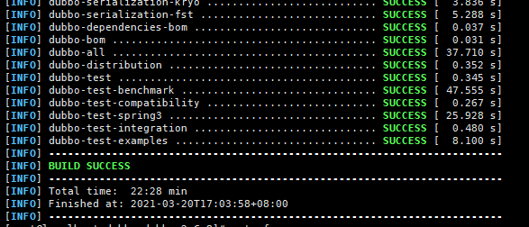

#  Dubbo 2.6.8 Porting Guide (openEuler 20.03 LTS SP1)

## Introduction

### Overview

Dubbo is a high-performance open-source service framework provided by Alibaba, which enables applications to implement service output and input via high-performance remote procedure calls (RPC), and can be seamlessly integrated with the Spring framework. In short, Dubbo is a Spring-based RPC framework that implements remote calling and management of services.


### Recommended Version

Dubbo 2.6.8


## Environment Requirements


### Hardware

[Table 1](https://support.huaweicloud.com/intl/en-us/prtg-dubbo-kunpengwebs/kunpengdubbo268_02_0002.html) lists the hardware requirements.

| Item| Description         |
| ---- | ------------- |
| CPU  | Kunpeng 920 processor|
| Network| Accessible to the Internet   |
| Storage| No requirements       |
| Memory| No requirements       |


### Operating Systems

[Table 2](https://support.huaweicloud.com/intl/en-us/prtg-dubbo-kunpengwebs/kunpengdubbo268_02_0002.html) lists the OS requirements.

| Item     | Version                 |
| --------- | --------------------- |
| openEuler | 20.03 LTS SP1 AArch64|
| Kernel    | 4.19.90               |


## Configuring the Compilation Environment

### Configuring a DNS server

```
# cat /etc/resolv.conf 
nameserver 114.114.114.114
nameserver 8.8.8.8
```


### Installing Dependencies

1. Download and install dependencies.

```
yum install java-1.8.0* tcl git gcc gcc-c++ make cmake libtool autoconf automake -y
```


2. Query the Java version.

```
[root@localhost ~]# java -version
openjdk version "1.8.0_272"
OpenJDK Runtime Environment Bisheng (build 1.8.0_272-b10)
OpenJDK 64-Bit Server VM Bisheng (build 25.272-b10, mixed mode)

```


### Installing Maven


1. Download the Maven installation package.

```
wget https://archive.apache.org/dist/maven/maven-3/3.6.3/binaries/apache-maven-3.6.3-bin.tar.gz
```


2. Decompress the installation package to a specified directory.

```
tar -zxvf apache-maven-3.6.3-bin.tar.gz -C /opt/
```


3. Configure the Maven environment variables.

a. Add the Maven path to the end of the **/etc/profile** file.

```
echo "MAVEN_HOME=/opt/apache-maven-3.6.3/" >> /etc/profile
echo "export PATH=$MAVEN_HOME/bin:$PATH" >> /etc/profile
```


b. Make the modified environment variables take effect.

```
source /etc/profile
```


4. Check whether the configuration has taken effect.

```
[root@localhost ~]# mvn -v
Apache Maven 3.6.3 (cecedd343002696d0abb50b32b541b8a6ba2883f)
Maven home: /opt/apache-maven-3.6.3
Java version: 1.8.0_272, vendor: Bisheng, runtime: /usr/lib/jvm/java-1.8.0-openjdk-1.8.0.272.b10-7.oe1.aarch64/jre
Default locale: en_US, platform encoding: UTF-8
OS name: "linux", version: "4.19.90-2012.4.0.0053.oe1.aarch64", arch: "aarch64", family: "unix"

```


5. Modify the local repository, remote repository, and proxy in the Maven configuration file.

Configuration file path: **/opt/apache-maven-3.6.3/conf/settings.xml**

Configure the network proxy. Change the values of **host**, **port**, **username**, and **password** as required.

```
<proxies>
   <proxy>
     <id>my-proxy</id>
     <active>true</active>
     <protocol>https</protocol>
     <host>Proxy server URL</host>
     <port>Proxy server port</port>
     <username>User name</username>
     <password>Password</password>
     <nonProxyHosts>local.net|some.host.com</nonProxyHosts>
   </proxy>
   <proxy>
     <id>my-proxy1</id>
     <active>true</active>
     <protocol>http</protocol>
     <host>Proxy server URL</host>
     <port>Proxy server port</port>
     <username>User name</username>
     <password>Password</password>
     <nonProxyHosts>local.net|some.host.com</nonProxyHosts>
   </proxy>
</proxies>
```

Configure the remote repository.

```
<mirrors>
         <mirror>
                <id>huaweicloud</id>
                <mirrorOf>*</mirrorOf>
                <url>https://mirrors.huaweicloud.com/repository/maven/</url>
         </mirror>
</mirrors>
```


## Compiling Dubbo 2.6.8


### Obtaining the Source Code

```
mkdir /home/Dubbo && cd /home/Dubbo && wget https://github.com/apache/dubbo/archive/dubbo-2.6.8.tar.gz
&& tar -xvf dubbo-2.6.8.tar.gz
```


### Compiling the dubbo-rpc-redis Module

```
mvn install
```

If **BUILD SUCCESS** is displayed, it means that the dubbo-rpc-redis module has been successfully compiled.


### Compiling Dubbo 2.6.8

  Add the following content to the end of line 552 in the **/home/Dubbo/dubbo-dubbo-2.6.8/pom.xml** file:


If **BUILD SUCCESS** is displayed, it means that Dubbo 2.6.8 has been successfully compiled.




The **dubbo-2.6.8.jar** package generated after the compilation is stored in the **all/target** directory.
