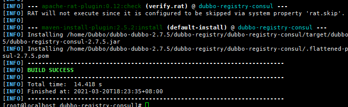
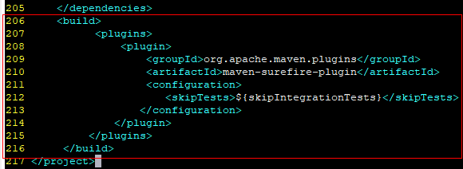
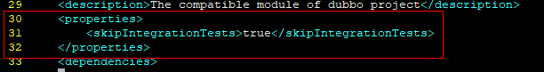

# Dubbo 2.7.5 Porting Guide (openEuler 20.03 LTS SP1)


## Introduction

### Overview

Dubbo is a high-performance open-source service framework provided by Alibaba, which enables applications to implement service output and input via high-performance remote procedure calls (RPC), and can be seamlessly integrated with the Spring framework. In short, Dubbo is a Spring-based RPC framework that implements remote calling and management of services.


### Recommended Version

Dubbo 2.7.5


## Environment Requirements


### Hardware

[Table 1](https://support.huaweicloud.com/intl/en-us/prtg-dubbo-kunpengwebs/kunpengdubbo268_02_0002.html) lists the hardware requirements.

| Item| Description         |
| ---- | ------------- |
| CPU  | Kunpeng 920 processor|
| Network| Accessible to the Internet   |
| Storage| No requirements       |
| Memory| No requirements       |


### Operating Systems

[Table 2](https://support.huaweicloud.com/intl/en-us/prtg-dubbo-kunpengwebs/kunpengdubbo268_02_0002.html) lists the OS requirements.

| Item     | Version                 |
| --------- | --------------------- |
| openEuler | 20.03 LTS SP1 AArch64|
| Kernel    | 4.19.90               |


## Configuring the Compilation Environment

### Configuring a DNS server

```
# cat /etc/resolv.conf 
nameserver 114.114.114.114
nameserver 8.8.8.8
```


### Installing Dependencies

1. Download and install dependencies.

```
yum install java-1.8.0* tcl git gcc gcc-c++ make cmake libtool autoconf automake -y
```


2. Query the Java version.

```
[root@localhost ~]# java -version
openjdk version "1.8.0_272"
OpenJDK Runtime Environment Bisheng (build 1.8.0_272-b10)
OpenJDK 64-Bit Server VM Bisheng (build 25.272-b10, mixed mode)

```


### Installing Maven


1. Download the Maven installation package.

```
wget https://archive.apache.org/dist/maven/maven-3/3.6.3/binaries/apache-maven-3.6.3-bin.tar.gz
```


2. Decompress the installation package to a specified directory.

```
tar -zxvf apache-maven-3.6.3-bin.tar.gz -C /opt/
```


3. Configure the Maven environment variables.

a. Add the Maven path to the end of the **/etc/profile** file.

```
echo "MAVEN_HOME=/opt/apache-maven-3.6.3/" >> /etc/profile
echo 'export PATH=$MAVEN_HOME/bin:$PATH'  >> /etc/profile
```


b. Make the modified environment variables take effect.

```
source /etc/profile
```


4. Check whether the configuration has taken effect.

```
[root@localhost ~]# mvn -v
Apache Maven 3.6.3 (cecedd343002696d0abb50b32b541b8a6ba2883f)
Maven home: /opt/apache-maven-3.6.3
Java version: 1.8.0_272, vendor: Bisheng, runtime: /usr/lib/jvm/java-1.8.0-openjdk-1.8.0.272.b10-7.oe1.aarch64/jre
Default locale: en_US, platform encoding: UTF-8
OS name: "linux", version: "4.19.90-2012.4.0.0053.oe1.aarch64", arch: "aarch64", family: "unix"

```


5. Modify the local repository, remote repository, and proxy in the Maven configuration file.

Configuration file path: **/opt/apache-maven-3.6.3/conf/settings.xml**

Configure the network proxy. Change the values of **host**, **port**, **username**, and **password** as required.

```
<proxies>
   <proxy>
     <id>my-proxy</id>
     <active>true</active>
     <protocol>https</protocol>
     <host>Proxy server URL</host>
     <port>Proxy server port</port>
     <username>User name</username>
     <password>Password</password>
     <nonProxyHosts>local.net|some.host.com</nonProxyHosts>
   </proxy>
   <proxy>
     <id>my-proxy1</id>
     <active>true</active>
     <protocol>http</protocol>
     <host>Proxy server URL</host>
     <port>Proxy server port</port>
     <username>User name</username>
     <password>Password</password>
     <nonProxyHosts>local.net|some.host.com</nonProxyHosts>
   </proxy>
</proxies>
```

Configure the remote repository.

```
<mirrors>
         <mirror>
                <id>huaweicloud</id>
                <mirrorOf>*</mirrorOf>
                <url>https://mirrors.huaweicloud.com/repository/maven/</url>
         </mirror>
</mirrors>
```


## Compilation


### Obtaining the Source Code

```
mkdir /home/Dubbo && cd /home/Dubbo && wget https://github.com/apache/dubbo/archive/dubbo-2.7.5.tar.gz
&& tar -xvf dubbo-2.7.5.tar.gz
```


### Compiling the dubbo-common Module


### Compiling the dubbo-remoting-netty Module


1. Modify the **NettyClientTest.java** file.

   

   a. Open the file and change **6000** in line 76 to **9000**.

   `vim /home/Dubbo/dubbo-dubbo-2.7.5/dubbo-remoting/dubbo-remoting-netty/src/test/java/org/apache/dubbo/remoting/transport/netty/NettyClientTest.java `

   

     

   b.  Compile the dubbo-remoting-netty module.

   ```
   cd /home/Dubbo/dubbo-dubbo-2.7.5/dubbo-remoting/dubbo-remoting-netty && mvn install
   ```

   


If **BUILD SUCCESS** is displayed, it means that the dubbo-remoting-netty module has been successfully compiled.

	

### Compiling the dubbo-rpc-redis Module

1. Obtain the **embedded-redis-0.6.jar** package that supports AArch64.

```
 mkdir -p /root/.m2/repository/com/github/kstyrc/embedded-redis/0.6/ && wget https://mirrors.huaweicloud.com/kunpeng/maven/com/github/kstyrc/embedded-redis/0.6/embedded-redis-0.6.jar -O /root/.m2/repository/com/github/kstyrc/embedded-redis/0.6/embedded-redis-0.6.jar
```


2. Compile the dubbo-rpc-redis module.

```
cd /home/Dubbo/dubbo-dubbo-2.7.5/dubbo-rpc/dubbo-rpc-redis/ && mvn install
```


If **BUILD SUCCESS** is displayed, it means that the dubbo-rpc-redis module has been successfully compiled.

### Compiling the dubbo-remoting-etcd3 Module

1.  Install Docker.

```
yum -y install docker
```

2. Configure environment variables.

```
echo "export TESTCONTAINERS_RYUK_DISABLED=true" >> /etc/profile && source /etc/profile
```

3. Modify the **/root/.testcontainers.properties** file.

```
echo "checks.disable=true" >>  /root/.testcontainers.properties
```

4. Replace the **jetcd-launcher-0.3.0.jar** package with the one that supports the ARM64 image.

```
wget https://mirrors.huaweicloud.com/kunpeng/maven/io/etcd/jetcd-launcher/0.3.0/jetcd-launcher-0.3.0.jar -O /root/.m2/repository/io/etcd/jetcd-launcher/0.3.0/jetcd-launcher-0.3.0.jar
```


5. Compile the dubbo-remoting-etcd3 module.

```
cd /home/Dubbo/dubbo-dubbo-2.7.5/dubbo-remoting/dubbo-remoting-etcd3/ && mvn install
```


If **BUILD SUCCESS** is displayed, it means that the dubbo-remoting-etcd3 module has been successfully compiled.

### Compiling the dubbo- registry-consul Module

```
cd /home/Dubbo/dubbo-dubbo-2.7.5/dubbo-registry/dubbo-registry-consul/ && mvn install

```

If the error message "EmbeddedConsul Could not start Consul process in..." is displayed during the compilation, store the **consul_1.1.0_linux_arm64.zip** package of the ARM64 version to the **local /tmp/embedded-consul-1.1.0** directory.

```
wget https://releases.hashicorp.com/consul/1.1.0/consul_1.1.0_linux_arm64.zip && unzip consul_1.1.0_linux_arm64.zip && mv consul /tmp/embedded-consul-1.1.0/consul
```

 

Then recompile the module.



If **BUILD SUCCESS** is displayed, it means that the dubbo-registry-consul module has been successfully compiled.


### Modifying Other Configuration Files

1. Replace the **netty-all-4.1.25.Final.jar** package in the local repository.

   

   ```
   mkdir -p /root/.m2/repository/io/netty/netty-all/4.1.25.Final/ && wget https://mirrors.huaweicloud.com/kunpeng/maven/io/netty/netty-all/4.1.25.Final/netty-all-4.1.25.Final.jar -O  /root/.m2/repository/io/netty/netty-all/4.1.25.Final/netty-all-4.1.25.Final.jar
   ```

   

   

2. Modify the **/home/Dubbo/dubbo-dubbo-2.7.5/dubbo-config/dubbo-config-api/pom.xml** file.

   

   1. Open the **pom.xml** file.

      `vim /home/Dubbo/dubbo-dubbo-2.7.5/dubbo-config/dubbo-config-api/pom.xml `

   2. Add the following code. Save the file and exit.

      - Add the following code to line 31:

        ```
                <skipIntegrationTests>true</skipIntegrationTests>
        ```

        

        

      - Add the following code to line 206:

        ```
            <build>
                <plugins>
                    <plugin>
                        <groupId>org.apache.maven.plugins</groupId>
                        <artifactId>maven-surefire-plugin</artifactId>
                        <configuration>
                            <skipTests>${skipIntegrationTests}</skipTests>
                        </configuration>
                    </plugin>
                </plugins>
            </build>
        ```

        

        

   

3. Modify the **/home/Dubbo/dubbo-dubbo-2.7.5/dubbo-compatible/pom.xml** file.

   

   1. Open the **pom.xml** file.

      `vim /home/Dubbo/dubbo-dubbo-2.7.5/dubbo-compatible/pom.xml `

   2. Add the following code. Save the file and exit.

      - Add the following code to line 30:

        ```
            <properties>
                <skipIntegrationTests>true</skipIntegrationTests>
            </properties>
        ```

        

        

      - Add the following code to line 110:

        ```
            <build>
                <plugins>
                    <plugin>
                        <groupId>org.apache.maven.plugins</groupId>
                        <artifactId>maven-surefire-plugin</artifactId>
                        <configuration>
                            <skipTests>${skipIntegrationTests}</skipTests>
                        </configuration>
                    </plugin>
                </plugins>
            </build>
        ```

        

        


### Compiling Dubbo 2.7.5

  Add the following content to the end of line 592 in the **/home/Dubbo/dubbo-dubbo-2.7.5/pom.xml** file:

```
<configuration>
	<testFailureIgnore>true</testFailureIgnore>
</configuration>
```


 


If **BUILD SUCCESS** is displayed, it means that Dubbo 2.7.5 has been successfully compiled.

The **dubbo-2.7.5.jar** package generated after the compilation is stored in the **dubbo-all/target** directory.
