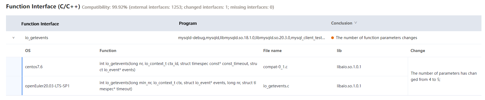

# MySQL 5.7.21 Porting Guide (openEuler 20.03 LTS SP1)


## 1. Introduction

This document describes how to deploy the MySQL database on openEuler 20.03 SP1.

MySQL is a secure, cross-platform, and efficient database system that works closely with mainstream programming languages such as PHP and Java.
In this document, x86_64 VMs are used. The x2openEuler tool is used to evaluate the compatibility between MySQL 5.7.21 and openEuler before data migration.

MySQL 5.7.21 is recommended.

> NOTE:
> This document applies to MySQL 5.7.21. However, you can refer to this document when porting other MySQL versions.

## 2. Environment

Hardware
| Item    | Description             |
| -------- | ----------------- |
| Server  | TaiShan 200 server|
| CPU      | Kunpeng 920 processor|
| RAID controller card  | SAS3508           |
| NIC  | Mellanox SP333    |
|          | TM210             |
|          | TM280             |
| Drive | 500 GB or more        |

Operating systems
| Software| Version               | Remarks               |
| ---- | ------------------- | ------------------- |
| OS   | CentOS 7.6.1810     | Current MySQL cluster server|
| OS   | openEuler 20.03 SP1 | Target server     |

Software packages
| Software                 | Version  |
| --------------------- | ------ |
| mysql5                | 5.7.21 |
| mysql5-common         | 5.7.21 |
| mysql5-embedded       | 5.7.21 |
| mysql5-embedded-devel | 5.7.21 |
| mysql5-errmsg         | 5.7.21 |
| mysql5-libs           | 5.7.21 |
| mysql5-server         | 5.7.21 |
| mysql5-test           | 5.7.21 |

## 3. Software Compatibility Assessment

The openEuler community provides [x2openEuler](https://repo.oepkgs.net/openEuler/rpm/openEuler-20.03-LTS-SP1/stable/contrib/x2openEuler/noarch/Packages/) to evaluate software packages and interfaces of compiled binary programs, and determine whether application software needs to be adapted and whether any dependencies are needed. In addition, the tool checks whether prototypes of interfaces called by the software are different between the two OSs.

Note: It is difficult to ensure that the binary program is completely compatible with the target OS once it has been compiled and therefore memory risks may occur. Since it is difficult to identify this problem through verification, it is therefore important to perform software compatibility evaluation prior to porting.

#### 3.1 Obtain the MySQL RPM package and decompress it to the /opt/mysql directory.

```
wget -P /opt https://downloads.mysql.com/archives/get/p/23/file/mysql-5.7.21-1.el7.x86_64.rpm-bundle.tar
```
```
cd /opt/
mkdir mysql
tar -xf mysql-5.7.21-1.el7.x86_64.rpm-bundle.tar -C mysql
```

#### 3.2 Download x2openEuler to the /opt/mysql directory.

```
cd /opt/mysql
wget https://repo.oepkgs.net/openEuler/rpm/openEuler-20.03-LTS-SP1/stable/contrib/x2openEuler/noarch/Packages/x2openEuler-1.0-1.noarch.rpm
```
#### 3.3 Deploy the tool.

```
cd /opt/mysql
rpm -ivh x2openEuler-1.0-1.noarch.rpm
```

> Note: You need to install the RPM package as the root user. Currently, a network connection is required for downloading and installing the dependencies.
> Note: Install dependencies such as **bzip2-devel** as prompted.

```
su x2openEuler
x2openEuler redis-db -init
```
> Enter the following information about the Redis database in sequential order.
> IP address: 127.0.0.1
> Port: 6379
> Database index (0-16): 0
> Password (encrypted by the tool): If the Redis password is not set or is empty, press **Enter**.

```
x2openEuler init source_centos7.6-openEuler20.03-LTS-SP1.tar.gz
```

> Note: After x2openEuler is installed using an RPM package, the default resource package (source_centos7.6-openEuler20.03-LTS-SP1.tar.gz) is generated in the **/opt/x2openEuler** directory.
> To support the evaluation of hardware compatibility between CentOS 8.2 and openEuler 20.03 LTS SP1, you need to obtain and import the corresponding static resource package. For example, if the resource package is **source_centos8.2-openEuler20.03-LTS-SP1.tar.gz**, run **x2openEuler init source_centos8.2-openEuler20.03-LTS-SP1.tar.gz** to import the package.

#### 3.4 Scan MySQL.

```
x2openEuler scan /opt/mysql/
The x2openEuler user must have the read permission on the file to be analyzed.
After the scan is complete, an HTML report is generated in the /opt/x2openEuler/output directory.
```
## 4. Evaluation Result Analysis

The software compatibility evaluation report consists of three parts: dependency compatibility, C/C++ interface compatibility, and Java interface compatibility. Dependency compatibility reflects the required direct dependencies during software installation. If the dependency compatibility is not 100%, the installation fails. Interface compatibility reflects the calling of other software packages, dynamic libraries, or system interfaces during the running of the software. If the interface compatibility is not 100%, an exception may be triggered when a certain function is called. Manual confirmation is recommended for some results. The priority of software packages is as follows: packages that have been ported to openEuler > manually recompiled packages for openEuler > packages for CentOS.

#### 4.1 Report Analysis

```
Open and view the HTML report line by line. In the example below, the report shows that using the CentOS MySQL package on openEuler may cause the following risk:
One to-be-confirmed interface indicates that the MySQL series packages call libaio.so.1.0.1, and that the number of function parameters changes from 4 to 5. When the function is called, an exception may be triggered.

In addition, the report shows that three dependencies need to be confirmed. Manual confirmation confirms that they are self-closed-loop dependencies of the MySQL series packages. Therefore, the software installation is not affected.
```




#### 4.2 Suggestion

```
Suggestion: To avoid function call risks, you are advised to use the MySQL 5.7.21 series software packages that have been compiled and released on the openEuler community.
https://repo.openeuler.org/openEuler-20.03-LTS-SP1/everything/x86_64/Packages/mysql5-5.7.21-3.oe1.x86_64.rpm
https://repo.openeuler.org/openEuler-20.03-LTS-SP1/everything/x86_64/Packages/mariadb-common-10.3.9-9.oe1.x86_64.rpm
https://repo.openeuler.org/openEuler-20.03-LTS-SP1/everything/x86_64/Packages/mysql5-common-5.7.21-3.oe1.x86_64.rpm
https://repo.openeuler.org/openEuler-20.03-LTS-SP1/everything/x86_64/Packages/mysql5-server-5.7.21-3.oe1.x86_64.rpm
https://repo.openeuler.org/openEuler-20.03-LTS-SP1/everything/x86_64/Packages/mysql5-errmsg-5.7.21-3.oe1.x86_64.rpm
https://repo.openeuler.org/openEuler-20.03-LTS-SP1/everything/x86_64/Packages/mecab-0.996-2.oe1.x86_64.rpm
```

## 5. MySQL Database Installation

#### 5.1 Installing MySQL and Configuring the Password

**(1) Install MariaDB and MySQL services.**

rpm -ivh mysql5-5.7.21-3.oe1.x86_64.rpm mariadb-common-10.3.9-9.oe1.x86_64.rpm mysql5-common-5.7.21-3.oe1.x86_64.rpm mysql5-server-5.7.21-3.oe1.x86_64.rpm mecab-0.996-2.oe1.x86_64.rpm mysql5-errmsg-5.7.21-3.oe1.x86_64.rpm

**(2) Start MySQL.**

systemctl start mysqld

**(3) Query the MySQL status.**

systemctl status mysqld

If the service status is running, the MySQL service starts successfully.

```
root@vm-2p32g.2288hv5-2s44p-384g--b5-0 ~# systemctl status mysqld

● mysqld.service - MySQL 5.7 database server

  Loaded: loaded (/usr/lib/systemd/system/mysqld.service; disabled; vendor preset: disabled)

  Active: active (running) since Thu 2021-09-09 10:23:25 CST; 1 day 4h ago

 Process: 103715 ExecStartPre=/usr/libexec/mysql-check-socket (code=exited, status=0/SUCCESS)

 Process: 103738 ExecStartPre=/usr/libexec/mysql-prepare-db-dir mysqld.service (code=exited, sta>

 Process: 103773 ExecStart=/usr/libexec/mysqld --daemonize --basedir=/usr --pid-file=/run/mysqld>

 Process: 103803 ExecStartPost=/usr/libexec/mysql-check-upgrade (code=exited, status=0/SUCCESS)

 Main PID: 103775 (mysqld)

  Tasks: 37

  Memory: 188.4M

  CGroup: /system.slice/mysqld.service

​      └─103775 /usr/libexec/mysqld --daemonize --basedir=/usr --pid-file=/run/mysqld/mysqld.
```

**(4) Log in to the database and change the default password.**

mysql -uroot -p

a.     By default, there is no password. Press **Enter** to log in.

```
root@vm-2p32g.2288hv5-2s44p-384g--b5-0 /# mysql -uroot -p

Enter password: 

Welcome to the MySQL monitor. Commands end with ; or \g.

Your MySQL connection id is 2

Server version: 5.7.21 MySQL Community Server (GPL)

 
Copyright (c) 2000, 2018, Oracle and/or its affiliates. All rights reserved.

 
Oracle is a registered trademark of Oracle Corporation and/or its

affiliates. Other names may be trademarks of their respective

owners.


Type 'help;' or '\h' for help. Type '\c' to clear the current input statement.

mysql>
```

b.     Set the password.

alter user 'user'@'localhost' identified by 'passward';

```
mysql> alter user 'root'@'localhost' identified by '123456';

Query OK, 0 rows affected (0.00 sec)

mysql> flush privileges;

Query OK, 0 rows affected (0.00 sec)

mysql>
```

> You need to run the **flush privileges** command to make the settings take effect.

**(5) Verify the password.**

Log out and then log in to MySQL again to check whether the password is changed successfully.

```
root@vm-2p32g.2288hv5-2s44p-384g--b5-0 /# mysql -uroot -p

Enter password: 

Welcome to the MySQL monitor. Commands end with ; or \g.

Your MySQL connection id is 3

Server version: 5.7.21 MySQL Community Server (GPL)


Copyright (c) 2000, 2018, Oracle and/or its affiliates. All rights reserved.

 
Oracle is a registered trademark of Oracle Corporation and/or its

affiliates. Other names may be trademarks of their respective

owners.


Type 'help;' or '\h' for help. Type '\c' to clear the current input statement.


mysql>
```
