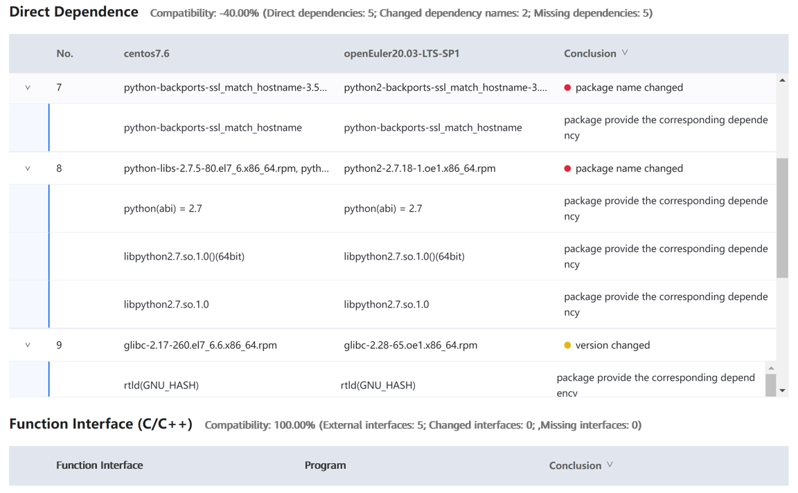

# Tornado 4.2.1 Porting Guide (openEuler 20.03 LTS SP1)

# Introduction

## Tornado Overview

Tornado is a Python web framework and asynchronous networking library that was originally developed by FriendFeed. It uses non-blocking network I/O to scale to tens of thousands of open connections, making it ideal for long polling, WebSockets, and other apps that require a persistent connection to each user.  
This document uses x86_64 VMs and the x2openEuler tool to evaluate the compatibility of Tornado 4.2.1 with openEuler. You can port the software based on the evaluation result.  

Programing languages: C++/Python

Brief description: A Python web framework and asynchronous networking library  

Open-source license: Apache

## Recommended Version

Tornado 4.2.1

Note: This document applies to Tornado 4.2.1. However, you can refer to this document when porting other Tornado versions.

# Environment Requirements

## OS Requirements

| OS | Version         |
| :-------- | :------------ |
| openEuler | 20.03 LTS SP1 |
| CentOS    | 7.6           |

## Installing the OS

When installing the OS for the first time, select **Server with GUI** instead of **Minimal Install**. Otherwise, lots of software packages need to be installed manually.  
For details about how to install the openEuler OS, see [https://docs.openeuler.org/en/docs/20.03_LTS_SP1/docs/Installation/Installation.html](https://docs.openeuler.org/en/docs/20.03_LTS_SP1/docs/Installation/Installation.html).

# Compatibility Evaluation

## Obtaining the Tornado RPM Package

```
wget http://mirror.centos.org/centos/7/os/x86_64/Packages/python-tornado-4.2.1-5.el7.x86_64.rpm
```

#### Downloading x2openEuler

```
Download address: https://repo.oepkgs.net/openEuler/rpm/openEuler-20.03-LTS-SP1/contrib/x2openEuler/
```

#### Deploying the Tool

```
rpm -ivh x2openEuler-2.0.0-1.x86_64.rpm
```

Note: 
You need to install the RPM package as the root user. Currently, a network connection is required for downloading and installing dependencies.  
Install dependencies such as **bzip2-devel** as prompted.  

```
su x2openEuler
x2openEuler redis-db -init
```

Enter the following information about the Redis database in sequential order.   
IP address: 127.0.0.1  
Port: 6379  
Database index (0-16): 0  
Password (encrypted by the tool): If the Redis password is not set or is empty, press **Enter**.  

```
x2openEuler init source_centos7.6-openEuler20.03-LTS-SP1.tar.gz
```

Note: After x2openEuler is installed using an RPM package, the default resource package **source_centos7.6-openEuler20.03-LTS-SP1.tar.gz** is generated in the **/opt/x2openEuler** directory.  
To support the evaluation of software compatibility between CentOS 8.2 and openEuler 20.03 LTS SP1, you need to obtain and import the corresponding static resource package. For example, if the resource package is **source_centos8.2-openEuler20.03-LTS-SP1.tar.gz**, run `x2openEuler init source_centos8.2-openEuler20.03-LTS-SP1.tar.gz` to import the package. Replace the package with the actual one.  

#### Scanning the Software

```
x2openEuler scan python-tornado-4.2.1-5.el7.x86_64.rpm
The x2openEuler user must have the read permission on the file to be analyzed.
After the scan is complete, an HTML report is generated in the **/opt/x2openEuler/output** directory.  
```

## Viewing Evaluation Results

The software compatibility evaluation report consists of three parts: dependency compatibility, C/C++ interface compatibility, and Java interface compatibility. Dependency compatibility reflects the required direct dependencies during software installation. If the dependency compatibility is not 100%, the installation fails. Interface compatibility reflects the calling of other software packages, dynamic libraries, or system interfaces during the running of the software. If the interface compatibility is not 100%, an exception may be triggered when a certain function is called. Manual confirmation is recommended for some results. The priority of software packages is as follows: packages that have been ported to openEuler > manually recompiled packages for openEuler > packages for CentOS.  



Result: The report shows that the external interface compatibility is 100%, and the dependency compatibility passes the manual review. It is confirmed that the Tornado 4.2.1 software package is compatible with the openEuler 20.03 LTS SP1 system. You can install the software package on openEuler 20.03 LTS SP1 and then verify the software.

# Installing Tornado

## Installing Tornado using an RPM package

The compatibility report shows that the software is compatible with openEuler. Use the downloaded RPM package to install the software.  

```
[root@localhost ~]# yum install python-tornado-4.2.1-5.el7.x86_64.rpm -y
Last metadata expiration check: 0:11:53 ago on Mon 22 Mar 2021 01:25:06 PM CST.
Dependencies resolved.
================================================================================
 Package                              Arch   Version         Repository    Size
================================================================================
Installing:
 python-tornado                       x86_64 4.2.1-5.el7     @commandline 641 k
Installing dependencies:
 python2-backports                    x86_64 1.0-17.oe1      everything   9.2 k
 python2-backports-ssl_match_hostname noarch 3.7.0.1-2.oe1   everything    16 k
 python2-ipaddress                    noarch 1.0.23-1.oe1    everything    41 k
 python3-pycurl                       x86_64 7.43.0.3-1.oe1  OS            65 k

Transaction Summary
================================================================================
Install  5 Packages

Total size: 772 k
Total download size: 131 k
Installed size: 4.1 M
Downloading Packages:
(1/4): python2-backports-1.0-17.oe1.x86_64.rpm   53 kB/s | 9.2 kB     00:00
(2/4): python2-backports-ssl_match_hostname-3.7  63 kB/s |  16 kB     00:00
(3/4): python2-ipaddress-1.0.23-1.oe1.noarch.rp 126 kB/s |  41 kB     00:00
(4/4): python3-pycurl-7.43.0.3-1.oe1.x86_64.rpm 113 kB/s |  65 kB     00:00
--------------------------------------------------------------------------------
Total                                           226 kB/s | 131 kB     00:00
warning: /var/cache/dnf/OS-fcb43ce6e8cef091/packages/python3-pycurl-7.43.0.3-1.oe1.x86_64.rpm: Header V3 RSA/SHA1 Signature, key ID b25e7f66: NOKEY
OS                                               14 kB/s | 2.1 kB     00:00
Importing GPG key 0xB25E7F66:
 Userid     : "private OBS (key without passphrase) <defaultkey@localobs>"
 Fingerprint: 12EA 74AC 9DF4 8D46 C69C A0BE D557 065E B25E 7F66
 From       : http://repo.openeuler.org/openEuler-20.03-LTS-SP1/OS/x86_64/RPM-GPG-KEY-openEuler
Key imported successfully
Running transaction check
Transaction check succeeded.
Running transaction test
Transaction test succeeded.
Running transaction
  Preparing        :                                                        1/1
  Installing       : python2-ipaddress-1.0.23-1.oe1.noarch                  1/5
  Installing       : python2-backports-1.0-17.oe1.x86_64                    2/5
  Installing       : python2-backports-ssl_match_hostname-3.7.0.1-2.oe1.n   3/5
  Installing       : python3-pycurl-7.43.0.3-1.oe1.x86_64                   4/5
  Installing       : python-tornado-4.2.1-5.el7.x86_64                      5/5
  Running scriptlet: python-tornado-4.2.1-5.el7.x86_64                      5/5
  Verifying        : python3-pycurl-7.43.0.3-1.oe1.x86_64                   1/5
  Verifying        : python2-backports-1.0-17.oe1.x86_64                    2/5
  Verifying        : python2-backports-ssl_match_hostname-3.7.0.1-2.oe1.n   3/5
  Verifying        : python2-ipaddress-1.0.23-1.oe1.noarch                  4/5
  Verifying        : python-tornado-4.2.1-5.el7.x86_64                      5/5
Installed:
  python-tornado-4.2.1-5.el7.x86_64
  python2-backports-1.0-17.oe1.x86_64
  python2-backports-ssl_match_hostname-3.7.0.1-2.oe1.noarch
  python2-ipaddress-1.0.23-1.oe1.noarch
  python3-pycurl-7.43.0.3-1.oe1.x86_64

Complete!
```

The installation is successful.  

# Running and Verifying Tornado

## Checking the Version

```
[root@localhost ~]# python
Python 2.7.18 (default, Dec  8 2020, 03:37:36)
[GCC 7.3.0] on linux2
Type "help", "copyright", "credits" or "license" for more information.
>>> import tornado
>>> tornado.version
'4.2.1'
```

## Using Tornado

Write a handler to respond to a standard HTTP request. The code is obtained from the [Tornado official website](https://www.tornadoweb.org/en/stable/).  

```
vim hello.py
```

Edit the following content:

```
import tornado.ioloop
import tornado.web

class MainHandler(tornado.web.RequestHandler):
    def get(self):
        self.write("Hello, world")

def make_app():
    return tornado.web.Application([
        (r"/", MainHandler),
    ])

if __name__ == "__main__":
    app = make_app()
    app.listen(8888)
    tornado.ioloop.IOLoop.current().start()
```

Save the file and exit. Run the following command on the terminal:  

```
python hello.py
```

Open another terminal and run the following command:  

```
curl http://localhost:8888
```

The following output indicates that Tornado is successfully installed:  

```
Hello, world
```
