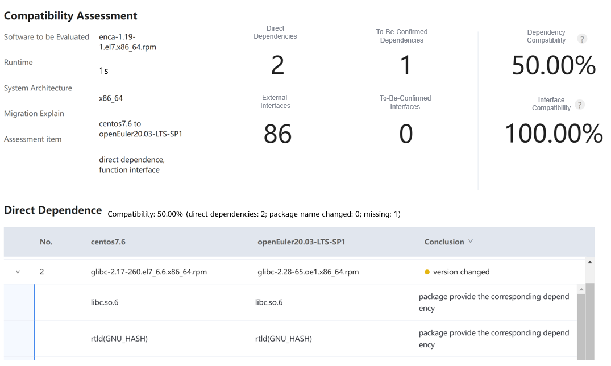

# enca 1.19 Porting Guide (openEuler 20.03 LTS SP1)

# Introduction

## Overview

enca is a practical code conversion tool. In this case, x86_64 VMs and the evaluation tool x2openEuler are used to evaluate the compatibility of enca 1.19 to be ported to the openEuler OS, and complete the porting based on the evaluation result.

Programming language: C

## Recommended Version

The recommended version is enca 1.19.1.

NOTE:
This document applies to enca 1.19.1. You can also refer to this document when porting other enca versions.

# Environment Requirements

##  OS Requirements
| OS| Version |
|---|---|
| openEuler  | 20.03 LTS SP1 |
| CentOS  |  7.6 |

## Installing the OS

When installing the OS for the first time, select "Server with GUI" instead of "Minimal Install". Otherwise, lots of software packages need to be installed manually.
For details about how to install the openEuler OS, see [https://docs.openeuler.org/en/docs/20.03_LTS_SP1/docs/Installation/Installation.html](https://docs.openeuler.org/en/docs/20.03_LTS_SP1/docs/Installation/Installation.html).

# Compatibility Evaluation

Tool: x2openEuler
Environment: CentOS 7.6

#### Downloading x2openEuler

```
wget https://repo.oepkgs.net/openEuler/rpm/openEuler-20.03-LTS-SP1/contrib/x2openEuler/x86_64/Packages/

User guide:
https://gitee.com/openeuler/docs/blob/stable2-20.03_LTS_SP1/docs/en/docs/thirdparty_migration/x2openEuleruserguide.md
```

#### Deploying x2openEuler

```
rpm -ivh x2openEuler-2.0.0-1.x86_64.rpm
```

Note: 
You need to install the RPM package as the root user. Currently, the network is required for downloading and installing dependencies.
Install dependencies such as bzip2-devel as prompted.

```
su x2openEuler
x2openEuler redis-db -init
```

Enter the following information about the Redis database in sequence.   
IP address: 127.0.0.1  
Port: 6379  
Database index (0-16): 0  
Password (encrypted by the tool): If the Redis password is not set or is empty, press **Enter**.  

```
x2openEuler init source_centos7.6-openEuler20.03-LTS-SP1.tar.gz
```

Note: After x2openEuler is installed using an RPM package, the default resource package (**source_centos7.6-openEuler20.03-LTS-SP1.tar.gz**) is generated in the **/opt/x2openEuler** directory.  
To support the evaluation of hardware compatibility from CentOS 8.2 to openEuler 20.03 LTS SP1, you need to obtain and import the corresponding static resource package. For example, if the resource package is **source_centos8.2-openEuler20.03-LTS-SP1.tar.gz,** run `x2openEuler init source_centos8.2-openEuler20.03-LTS-SP1.tar.gz` to import the package. Replace the package with the actual one.  

#### Scanning enca

```
wget http://rpmfind.net/linux/epel/7/x86_64/Packages/e/enca-1.19-1.el7.x86_64.rpm
x2openEuler scan enca-1.19-1.el7.x86_64.rpm
The x2openEuler user must have the read permission on the file to be analyzed.
After the scan is complete, an HTML report is generated in the /opt/x2openEuler/output directory.
```

## Viewing Evaluation Results

The software compatibility evaluation report consists of three parts: dependency compatibility, C/C++ interface compatibility, and Java interface compatibility. Dependency compatibility reflects the required direct dependencies during software installation. If the dependency compatibility is not 100%, the installation fails. Interface compatibility reflects the call of other software packages, dynamic libraries, or system interfaces during the software running. If the interface compatibility is not 100%, an exception may be triggered when some function is called. Manual confirmation is recommended for some results. The priority of software packages is as follows: packages that have been ported to openEuler > manually recompiled packages for openEuler > packages for CentOS.  

  

Result: The report shows that the external interface compatibility is 100%. The dependency package compatibility passes the manual review. enca 1.19 is compatible with the openEuler 20.03 LTS SP1.  

# Installing enca RPM

1. Download the RPM package: [http://rpmfind.net/linux/epel/7/x86_64/Packages/e/enca-1.19-1.el7.x86_64.rpm](http://rpmfind.net/linux/epel/7/x86_64/Packages/e/enca-1.19-1.el7.x86_64.rpm).  
2. Upload the package to the openEuler server.  
    > Note:
    > If the server is connected to the Internet, you can run the **wget** command on the server to download the source package.

3. Install enca.
```shell
    rpm -ivh enca-1.19-1.el7.x86_64.rpm
```

# Running and Verifying enca

1. Check whether enca has been installed.  
```shell
   enca --version 
```
2. enca was successfully installed if the following information is displayed:  
```shell
   enca 1.19
 
   Features: -librecode-interface +iconv-interface +external-converter +language-detection +locale-alias+
   target-charset-auto +ENCAOPT 
 
   Copyright (C) 2000-2005 David Necas (Yeti) (&lt;yeti@physics.muni.cz&gt;),
              2005 Zuxy Meng (&lt;zuxy.meng@gmail.com&gt;).
 
   Enca is free software; it can be copied and/or modified under the terms of
   version 2 of GNU General Public License, run `enca --license' to see the full
   license text.  There is NO WARRANTY; not even for MERCHANTABILITY or FITNESS
   FOR A PARTICULAR PURPOSE.
```
