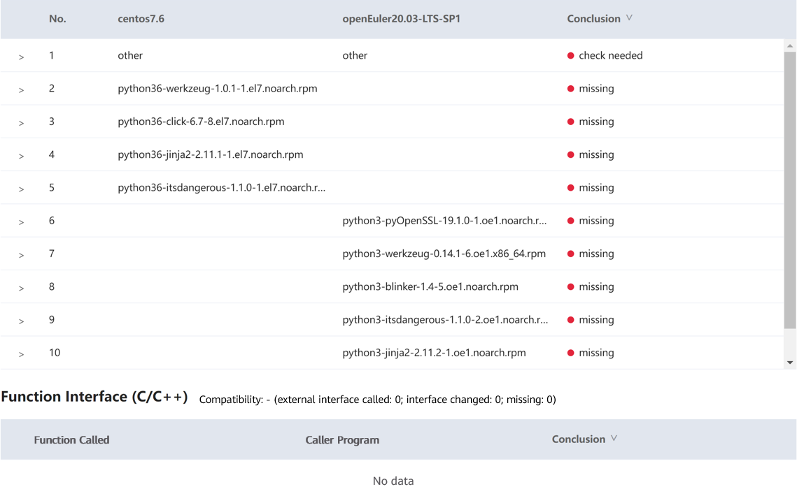

# Flask 1.1.2 Porting Guide (OpenEuler 20.03 LTS SP1)


## Introduction

### Overview

Flask is a lightweight web framework written in Python. Flask is based on the Werkzeug, WSGI toolkit and the Jinja2 template engine.  
In this case, x86_64 VMs and the evaluation tool x2openEuler are used to evaluate the compatibility of Flask 1.1.2 to be ported to the openEuler OS and complete the porting based on the evaluation result.  

Programming language: Python

Open source license: BSD

### Recommended Version

The recommended version is Flask 1.1.2.

NOTE: This document applies to Flask 1.1.2. You can also refer to this document when porting other Flask versions.

## Environment Requirements

### OS Requirements

| OS | Version         |
| :-------- | :------------ |
| openEuler | 20.03 LTS SP1 |
| CentOS    | 7.6           |

### Installing the OS

When installing the OS for the first time, select "Server with GUI" instead of "Minimal Install". Otherwise, lots of software packages need to be installed manually.  
For details about how to install the openEuler OS, see https://docs.openeuler.org/en/docs/20.03_LTS_SP1/docs/Installation/Installation.html.(https://bbs.huaweicloud.com/forum/thread-116157-1-1.html#)

## Compatibility Evaluation

### Obtaining Flask RPM Package

```
wget https://download-ib01.fedoraproject.org/pub/epel/7/x86_64/Packages/p/python36-flask-1.1.2-4.el7.noarch.rpm
```

#### Downloading x2openEuler

```
wget https://repo.oepkgs.net/openEuler/rpm/openEuler-20.03-LTS-SP1/contrib/x2openEuler/x86_64/Packages/

User guide:
https://gitee.com/openeuler/docs/blob/stable2-20.03_LTS_SP1/docs/en/docs/thirdparty_migration/x2openEuleruserguide.md
```

#### Deploying x2openEuler

```
rpm -ivh x2openEuler-2.0.0-1.x86_64.rpm
```

Note: 
You need to install the RPM package as the root user. Currently, the network is required for downloading and installing dependencies.  
Install dependencies such as bzip2-devel as prompted.

```
su x2openEuler
x2openEuler redis-db -init
```

Enter the following information about the Redis database in sequence.   
IP address: 127.0.0.1  
Port: 6379  
Database index (0-16): 0  
Password (encrypted by the tool): If the Redis password is not set or is empty, press **Enter**.  

```
x2openEuler init source_centos7.6-openEuler20.03-LTS-SP1.tar.gz
```

Note: After x2openEuler is installed using an RPM package, the default resource package (**source_centos7.6-openEuler20.03-LTS-SP1.tar.gz**) is generated in the /opt/x2openEuler directory.  
To support the evaluation of hardware compatibility from CentOS 8.2 to openEuler 20.03 LTS SP1, you need to obtain and import the corresponding static resource package. For example, if the resource package is **source_centos8.2-openEuler20.03-LTS-SP1.tar.gz**, run `x2openEuler init source_centos8.2-openEuler20.03-LTS-SP1.tar.gz` to import the package. Replace the package with the actual one.  

#### Scanning Flask

```
x2openEuler scan python36-flask-1.1.2-4.el7.noarch.rpm
The x2openEuler user must have the read permission on the file to be analyzed.
After the scan is complete, an HTML report is generated in the /opt/x2openEuler/output directory.
```

## Viewing Evaluation Results

The software compatibility evaluation report consists of three parts: dependency compatibility, C/C++ interface compatibility, and Java interface compatibility. Dependency compatibility reflects the required direct dependencies during software installation. If the dependency compatibility is not 100%, the installation fails. Interface compatibility reflects the call of other software packages, dynamic libraries, or system interfaces during the software running. If the interface compatibility is not 100%, an exception may be triggered when some function is called. Manual confirmation is recommended for some results. The priority of software packages is as follows: packages that have been ported to openEuler > manually recompiled packages for openEuler > packages for CentOS.  

  

Result: The report shows that the external interface compatibility is 100%. A manual review confirmed that the dependency package is missing. Since the software package is a Python package, you are advised to use pip3 to install the dependency and Python Flask of the corresponding version.  

## Installing Flask

### Installing the Flask RPM Package

The compatibility report shows that the dependency package is missing. So you can install the downloaded RPM package for verification.  

```
[root@localhost test]# yum install -y python36-flask-1.1.2-4.el7.noarch.rpm
Last metadata expiration check: 1:39:08 ago on Mon 22 Mar 2021 10:35:29 AM CST.
Error:
 Problem: conflicting requests
  - nothing provides python36-setuptools needed by python36-flask-1.1.2-4.el7.noarch
  - nothing provides python(abi) = 3.6 needed by python36-flask-1.1.2-4.el7.noarch
  - nothing provides python36-click >= 5.1 needed by python36-flask-1.1.2-4.el7.noarch
  - nothing provides python36-itsdangerous >= 0.24 needed by python36-flask-1.1.2-4.el7.noarch
  - nothing provides python36-jinja2 >= 2.10.1 needed by python36-flask-1.1.2-4.el7.noarch
  - nothing provides python36-werkzeug >= 0.15 needed by python36-flask-1.1.2-4.el7.noarch
(try to add '--skip-broken' to skip uninstallable packages or '--nobest' to use not only best candidate packages)
```

Flask failed to be installed due to dependency missing.

### Installing Flask Using PIP

Install Flask of the same version using pip3.

```
[root@localhost ~]# pip3 install flask
WARNING: Running pip install with root privileges is generally not a good idea. Try `pip3 install --user` instead.
Collecting flask
  Using cached Flask-1.1.2-py2.py3-none-any.whl (94 kB)
Requirement already satisfied: itsdangerous>=0.24 in /usr/lib/python3.7/site-packages (from flask) (1.1.0)
Requirement already satisfied: Werkzeug>=0.15 in /usr/local/lib/python3.7/site-packages (from flask) (1.0.1)
Requirement already satisfied: click>=5.1 in /usr/local/lib/python3.7/site-packages (from flask) (7.1.2)
Requirement already satisfied: Jinja2>=2.10.1 in /usr/lib/python3.7/site-packages (from flask) (2.11.2)
Requirement already satisfied: MarkupSafe>=0.23 in /usr/lib64/python3.7/site-packages (from Jinja2>=2.10.1->flask) (1.1.1)
Installing collected packages: flask
Successfully installed flask-1.1.2
```

## Running and Verifying Flask

### Checking the Version

```
[root@localhost ~]# python3
Python 3.7.9 (default, Dec 16 2020, 03:16:57)
[GCC 7.3.0] on linux
Type "help", "copyright", "credits" or "license" for more information.
>>> import flask
>>> flask.__version__
'1.1.2'
```

### Running Flask

The starter program is provided on the Flask official website ([https://flask.palletsprojects.com/en/1.1.x/quickstart/#a-minimal-application](https://bbs.huaweicloud.com/forum/thread-115817-1-1.html#))

```
vim hello.py
```

Edit the following content:

```
from flask import Flask
app = Flask(__name__)

@app.route('/')
def hello_world():
    return 'Hello, World!'
```

Save the file and exit. Run the following command on the terminal:

```
[root@localhost ~]# export FLASK_APP=hello.py
[root@localhost ~]# python3 -m flask run
 * Serving Flask app "hello.py"
 * Environment: production
   WARNING: This is a development server. Do not use it in a production deployment.
   Use a production WSGI server instead.
 * Debug mode: off
 * Running on http://127.0.0.1:5000/ (Press CTRL+C to quit)
```

The running is successful.
