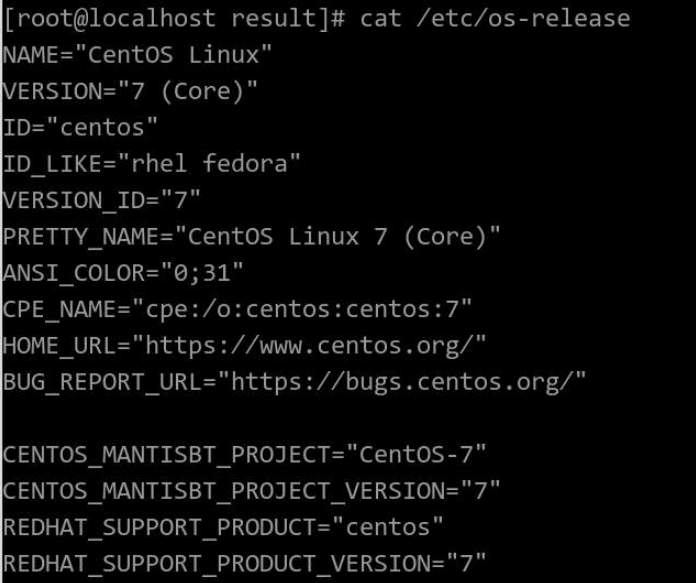

# x86 Hardware Compatibility Assessment and Porting Guide (openEuler 20.03 LTS SP1)

# Environment

## Hardware

The following table lists the hardware.

Hardware| Description
----- | ----- 
Server| 2288H V5 
CPU | Intel(R) Xeon(R) Gold 6266C CPU @ 3.00 GHz
NIC| Mellanox ConnectX-5
RAID controller card| Huawei LSI SAS3108

## Operating System

The following table lists the OSs.

OS| Description
----- | ----- 
CentOS Linux| 7.9.2009 (Core) 
Kernel | 3.10.0  x86_64  

Check the current system information.
cat /etc/os-release



# Running x2openEuler and Evaluating Hardware Compatibility

The openEuler community provides [x2openEuler](https://repo.oepkgs.net/openEuler/rpm/openEuler-20.03-LTS-SP1/stable/contrib/x2openEuler/noarch/Packages/), which can be used to evaluate hardware, software, and system configuration. In terms of hardware, the compatibility between openEuler and boards that run properly on CentOS is evaluated. The tool collects board information and generates reports in HTML format, displaying hardware compatibility visually.

## Downloading x2openEuler

```
cd /opt/
wget https://repo.oepkgs.net/openEuler/rpm/openEuler-20.03-LTS-SP1/stable/contrib/x2openEuler/noarch/Packages/x2openEuler-1.0-1.noarch.rpm
```

## Deploying x2openEuler

```
cd /opt/
rpm -ivh x2openEuler-1.0-1.noarch.rpm
```

> Note: You need to install the RPM package as the root user. Currently, a network connection is required for downloading and installing dependencies.
> Note: Install dependencies such as **bzip2-devel** as prompted.

```
su x2openEuler
x2openEuler redis-db -init
```

> Enter the following information about the Redis database in sequential order. 
> IP address: 127.0.0.1
> Port: 6379
> Database index (0-16): 0
> Password (encrypted by the tool): If the Redis password is not set or is empty, press **Enter**.

```
x2openEuler init source_centos7.6-openEuler20.03-LTS-SP1.tar.gz
```

> Note: After x2openEuler is installed using an RPM package, the default resource package (source_centos7.6-openEuler20.03-LTS-SP1.tar.gz) is generated in the **/opt/x2openEuler** directory.
> To support the evaluation of hardware compatibility between CentOS 8.2 and openEuler 20.03 LTS SP1, you need to obtain and import the corresponding static resource package. For example, if the resource package is **source_centos8.2-openEuler20.03-LTS-SP1.tar.gz**, run **x2openEuler init source_centos8.2-openEuler20.03-LTS-SP1.tar.gz** to import the package.

## Analyzing Hardware Compatibility

    x2openEuler hardware-analyse 
    ‏The command output is as follows:
    2021-11-30 09:41:20,865 - INFO - Log save directory: /var/log/x2openEuler
    2021-11-30 09:41:20,887 - INFO - x2openEuler hardware-analyse
    2021-11-30 09:41:20,888 INFO manager/get_param_config/179: Parameter configuration file loaded.
    2021-11-30 09:41:20,905 INFO manager/get_regex_config/218: Regex pattern compiled.
    2021-11-30 09:41:20,905 INFO manager/load_parsers/233: All builtin parsers loaded.
    2021-11-30 09:41:20,905 INFO manager/load_parsers/236: All custom parsers loaded.
    2021-11-30 09:41:21,254 INFO time_utils/wrapper/21: 0.35s taken for running function [get_data]
    2021-11-30 09:41:21,269 WARNING list/parse_content/47: no data in ls_dev
    2021-11-30 09:41:21,377 INFO time_utils/wrapper/21: 0.12s taken for running function [get_parsed_content]
    2021-11-30 09:41:21,377 INFO manager/write_res/135: write to /opt/x2openEuler/_tmp_18ambppj_/run/9e81f536-517e-11ec-ae65-a01c8dfeddfa/sysconf/kernel_startup_param.json.
    2021-11-30 09:41:21,378 INFO manager/write_res/135: write to /opt/x2openEuler/_tmp_18ambppj_/run/9e81f536-517e-11ec-ae65-a01c8dfeddfa/sysconf/syscall_interface.json.
    2021-11-30 09:41:21,378 INFO manager/write_res/135: write to /opt/x2openEuler/_tmp_18ambppj_/run/9e81f536-517e-11ec-ae65-a01c8dfeddfa/sysconf/path.json.
    2021-11-30 09:41:21,379 INFO manager/write_res/135: write to /opt/x2openEuler/_tmp_18ambppj_/run/9e81f536-517e-11ec-ae65-a01c8dfeddfa/sysconf/port.json.
    2021-11-30 09:41:21,379 INFO manager/write_res/135: write to /opt/x2openEuler/_tmp_18ambppj_/run/9e81f536-517e-11ec-ae65-a01c8dfeddfa/sysconf/device_interface.json.
    2021-11-30 09:41:21,380 INFO manager/write_res/135: write to /opt/x2openEuler/_tmp_18ambppj_/run/9e81f536-517e-11ec-ae65-a01c8dfeddfa/sysconf/linux_command.json.
    2021-11-30 09:41:21,387 INFO manager/write_res/135: write to /opt/x2openEuler/_tmp_18ambppj_/run/9e81f536-517e-11ec-ae65-a01c8dfeddfa/sysconf/hardware_configure.json.
    2021-11-30 09:41:21,396 INFO manager/write_res/135: write to /opt/x2openEuler/_tmp_18ambppj_/run/9e81f536-517e-11ec-ae65-a01c8dfeddfa/sysconf/proc.json.
    2021-11-30 09:41:21,404 INFO manager/write_res/135: write to /opt/x2openEuler/_tmp_18ambppj_/run/9e81f536-517e-11ec-ae65-a01c8dfeddfa/sysconf/system_configure.json.
    2021-11-30 09:41:21,408 INFO manager/write_res/135: write to /opt/x2openEuler/_tmp_18ambppj_/run/9e81f536-517e-11ec-ae65-a01c8dfeddfa/sysconf/system_service.json.
    2021-11-30 09:41:21,412 INFO manager/write_res/135: write to /opt/x2openEuler/_tmp_18ambppj_/run/9e81f536-517e-11ec-ae65-a01c8dfeddfa/sysconf/kernel_configure.json.
    2021-11-30 09:41:21,426 - INFO - Producing report...
    2021-11-30 09:41:21,427 - INFO - Generate Success! The results are saved: /opt/x2openEuler/output/hw_compat_report-20211130094121.html
    In the command output, /opt/x2openEuler/output/hw_compat_report-20211130094121.html is the evaluation report.

# Analyzing Hardware Evaluation Results

The hardware compatibility evaluation report directly shows whether each board and the device as a whole are compatible with openEuler. If any item is not in the compatibility list, adaptation is required.


The four tuples (VID, DID, SVID, and SSID) uniquely identify a board. As shown in the preceding figure, each board can be queried in the southbound compatibility list. Therefore, in this example the hardware server can be ported from CentOS to openEuler 20.03 LTS SP1.

