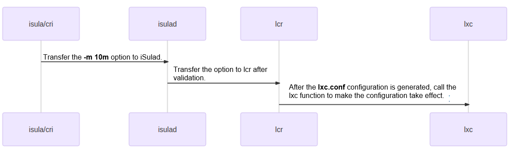
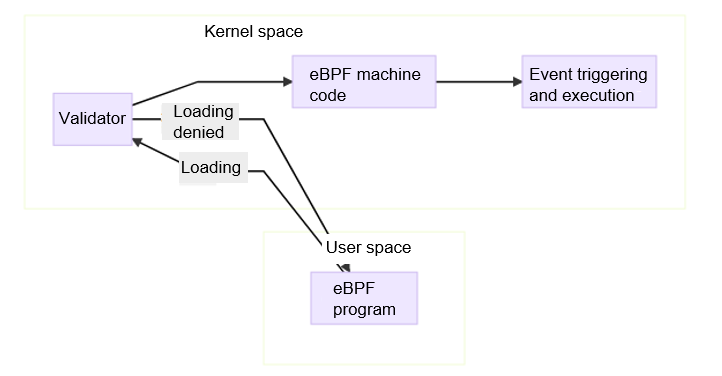
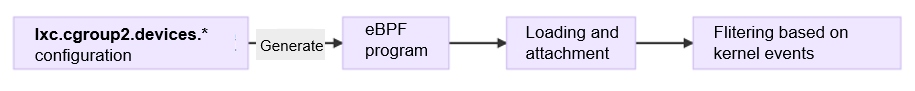

cgroup is used to restrict process group resources in Linux. It has two versions: cgroup v1 and cgroup v2, the latter of which is designed to replace its predecessor. However, for compatibility purposes, cgroup v1 is not deleted from the kernel and there is a high probability that cgroup v1 will exist for a long time. iSulad supports pure cgroup v2, which is still an experimental function now.  


## Changes in cgroup v2 Compared with cgroup v1

cgroup v2 yields the following differences over cgroup v1:  

1. While v1 mounts each subsystem (controller) to its own directory, all subsystems of v2 are mounted to the same directory.   
2. Processes can be bound only to the **/** directory and leaf nodes of a cgroup and cannot be bound to intermediate nodes.  
3. To use the functions of a controller in the subdirectory, enable it in **cgroup.subtree_control**.  
4. In v2, the **tasks** file used in v1 is deleted, and **cgroup.clone_children** in the CPU is removed.  
5. The notification mechanism in v2 changes to the **cgroup.events** file.  
6. Certain APIs are deleted. For details, see the function comparison between v2 and v1 supported by iSulad. In addition, some APIs implemented through cgroup are implemented in eBPF mode. The implementation principle of eBPF will be described later.  


The following are major differences when used with iSulad.

1. In cgroup v1, each subsystem is implemented and mounted independently as follows:  

```
root@wft-pc:~# ls /sys/fs/cgroup/
blkio  cpuacct      cpuset   freezer  memory   net_cls,net_prio  perf_event  rdma     unified
cpu    cpu,cpuacct  devices  hugetlb  net_cls  net_prio          pids        systemd
root@wft-pc:~#
```

In cgroup v2, implementation of each subsystem is planned in a unified manner (for example, almost all values range from **1** to **10000**), and all subsystems are mounted to the same directory. The following is an example:  

```
root@wft-pc:/sys/fs/cgroup/isulad# ls
cgroup.controllers      cpu.max                cpu.weight                hugetlb.2MB.events.local  memory.events.local  memory.swap.high
cgroup.events           cpu.pressure           cpu.weight.nice           hugetlb.2MB.max           memory.high          memory.swap.max
cgroup.freeze           cpuset.cpus            hugetlb.1GB.current       hugetlb.2MB.rsvd.current  memory.low           pids.current
cgroup.max.depth        cpuset.cpus.effective  hugetlb.1GB.events        hugetlb.2MB.rsvd.max      memory.max           pids.events
cgroup.max.descendants  cpuset.cpus.partition  hugetlb.1GB.events.local  io.max                    memory.min           pids.max
cgroup.procs            cpuset.mems            hugetlb.1GB.max           io.pressure               memory.oom.group     rdma.current
cgroup.stat             cpuset.mems.effective  hugetlb.1GB.rsvd.current  io.stat                   memory.pressure      rdma.max
cgroup.subtree_control  cpu.stat               hugetlb.1GB.rsvd.max      io.weight                 memory.stat
cgroup.threads          cpu.uclamp.max         hugetlb.2MB.current       memory.current            memory.swap.current
cgroup.type             cpu.uclamp.min         hugetlb.2MB.events        memory.events             memory.swap.events
root@wft-pc:/sys/fs/cgroup/isulad#
```

2. In cgroup v1, a mounted controller can be directly used. By contrast, in cgroup v2, a mounted controller can be used only after being enabled. The cgroup directory contains the **cgroup.controllers** and **cgroup.subtree_control** files.  

​       **cgroup.controllers**: lists the available controllers in the current directory. It is a read-only file whose content is determined by **cgroup.subtree_control** in the upper-level folder.  

​       **cgroup.subtree_control**: lists the available controllers in the subdirectory. To enable a controller, add it to this file. Then, you can use the controller in the subdirectory.  

The **echo +memory > cgroup.subtree_control** command enables the memory controller in the subdirectoty. **+memory** can be changed to any controller supported by **cgroup.controllers**. In the following example, no memory-related controller is set in the **test** directory. After you enable the memory controller, you can see it in the **test** directory.  

```
root@wft-pc:/sys/fs/cgroup/test# cat cgroup.controllers
cpuset cpu io memory hugetlb pids rdma
root@wft-pc:/sys/fs/cgroup/test# cat cgroup.subtree_control
root@wft-pc:/sys/fs/cgroup/test# mkdir test
root@wft-pc:/sys/fs/cgroup/test# ls test
cgroup.controllers  cgroup.freeze     cgroup.max.descendants  cgroup.stat             cgroup.threads  cpu.pressure  io.pressure
cgroup.events       cgroup.max.depth  cgroup.procs            cgroup.subtree_control  cgroup.type     cpu.stat      memory.pressure
root@wft-pc:/sys/fs/cgroup/test# echo +memory > cgroup.subtree_control
root@wft-pc:/sys/fs/cgroup/test# ls test
cgroup.controllers  cgroup.max.descendants  cgroup.threads  io.pressure          memory.high  memory.oom.group     memory.swap.events
cgroup.events       cgroup.procs            cgroup.type     memory.current       memory.low   memory.pressure      memory.swap.high
cgroup.freeze       cgroup.stat             cpu.pressure    memory.events        memory.max   memory.stat          memory.swap.max
cgroup.max.depth    cgroup.subtree_control  cpu.stat        memory.events.local  memory.min   memory.swap.current
root@wft-pc:/sys/fs/cgroup/test#
```


## Configuring iSulad to Support cgroup v2

Although the kernel supports cgroup v2 since version 4.5, not all related functions are supported. It is recommended that the kernel of the latest version be used to support more cgroup subsystems. To validate the cgroup v2 functions supported by iSulad, you are advised to use kernel 5.8 or later (run the **uname -r** command to query the kernel version). For example, in practice the openEuler 21.03 uses kernel 5.10. iSulad automatically checks the current cgroup version. If the system supports only cgroup v2 and automatically mounts cgroup v2 to the **/sys/fs/cgroup** directory, iSulad uses cgroup v2 to restrict container resources. You can configure **cgroup_no_v1=all** in the system startup command line to disable all cgroups of v1. In this way, when the system starts, only cgroup v2 is enabled and the cgroup v2 subsystems are mounted to the **/sys/fs/cgroup** directory. After system restart, run the **mount | grep cgroup** command. If cgroup v2 is mounted to **/sys/fs/cgroup**, the environment that supports cgroup v2 has been successfully configured.  

```
root@wft-pc:~# mount | grep cgroup
cgroup2 on /sys/fs/cgroup type cgroup2 (rw,nosuid,nodev,noexec,relatime)
root@wft-pc:~#
```


## iSulad Using cgroup v2 to Restrict Resources

### Examples:

1. To restrict the memory usage threshold for a single container to 10 MB, add the **-m 10m** option when running the container.  

   ```
   root@wft-pc:~# isula run -tid -m 10m busybox sh
   dcea83315b7b23d094f629f397c196df6e59be9e9fcd4774afa8428f078338a3
   root@wft-pc:~#
   ```

   -**m 10m** indicates that a maximum of 10 MB memory can be used in a container. You can run the **isula stats** command to view the resource restrictions.  

   ```
   root@wft-pc:~# isula stats --no-stream dcea83315b7b23d094f629f397c196df6e59be9e9fcd4774afa8428f078338a3
   CONTAINER        CPU %      MEM USAGE / LIMIT          MEM %      BLOCK I / O                PIDS
   dcea83315b7b     0.00       300.00 KiB / 10.00 MiB     2.93       0.00 B / 0.00 B            1
   root@wft-pc:~#
   ```

   You can configure the resource threshold as needed.

   ```
   root@wft-pc:~# isula update -m 20m dcea83315b7b23d094f629f397c196df6e59be9e9fcd4774afa8428f078338a3
   dcea83315b7b23d094f629f397c196df6e59be9e9fcd4774afa8428f078338a3
   root@wft-pc:~# isula stats --no-stream dcea83315b7b23d094f629f397c196df6e59be9e9fcd4774afa8428f078338a3
   CONTAINER        CPU %      MEM USAGE / LIMIT          MEM %      BLOCK I / O                PIDS
   dcea83315b7b     0.00       300.00 KiB / 20.00 MiB     1.46       0.00 B / 0.00 B            1
   root@wft-pc:~#
   ```

2. Assume that you want to mount the **/dev/nvme0n1** device to the container as **/dev/sdx** and restrict it as a read-only device. The configuration is as follows:  

   ```
   root@wft-pc:~# isula run -ti --rm --device=/dev/nvme0n1:/dev/sdx:wm busybox fdisk /dev/sdx
   fdisk: can't open '/dev/sdx'
   root@wft-pc:~#
   ```

   The syntax for mounting a device to a container is **--device=$host:$container:rwm**.  
   Where  
   **$host** specifies the absolute path of the device on the host; **$container** specifies the absolute path of the device in the container; **r** indicates that the device can be read; **w** indicates that the device can be written; and **m** indicates that nodes can be created.  
   In the preceding command, the **r** parameter is missing. That means, the nodes can be written and created but cannot be read (read-only).

### More resource restrictions:

iSulad provides the same APIs for both cgroup v1 and v2. However, some functions supported by cgroup v1 are removed from cgroup v2 or the implementation modes are different. Therefore, some APIs are unavailable or their meanings are changed in cgroup v2. iSulad can restrict the following resources:   

| Resource      | Function                                          | Difference from cgroup v1                                           |
| ---------- | ---------------------------------------------- | ------------------------------------------------------------ |
| devices    | Restricts access to a device in a container.| The **devices** subsystem uses the eBPF mode instead of writing values to the cgroup file to restrict resources.|
| memory     | Restricts the memory resources of a container.                            | Swappiness, kmem parameters, and **oom_control** are not supported.     |
| cpu/cpuset | Restricts the CPU resources of a container.                             | **rt_***-related (real-time threads) restrictions are not supported.                              |
| blkio/io   | Restricts the block device I/Os of a container.                            | Both block device I/Os and buffer I/Os are restricted.                       |
| hugetlb    | Restricts the use of huge page memory.                            | No difference.                                                      |
| pids       | Restricts the PIDs used by a container.                             | No difference.                                                      |
| files      | Restrict the FDs used by a container.                              | No difference.                                                      |
| freeze     | Suspends a container.                                      | No difference.                                                      |

To view the script for the preceding example, visit the following link:   

[https://gitee.com/openeuler/iSulad/blob/master/CI/test_cases/manual_cases/cgroupv2.sh](https://gitee.com/openeuler/iSulad/blob/master/CI/test_cases/manual_cases/cgroupv2.sh)


## Implementation Principle of cgroup v2 in iSulad


  

The preceding figure shows the iSulad resource restriction process. iSulad verifies the validity of parameters; lcr generates configurations that can be identified by lxc in the **lxc.conf** file; and lxc parses parameters in the **lxc.conf** file and configures the parameters to the cgroup API file corresponding to the container or uses the eBPF mode to implement corresponding functions.  

lcr determines whether cgroup v1 or cgroup v2 is used based on the **magic** value of the **/sys/fs/cgroup** file system.  

```
int lcr_util_get_cgroup_version()
{
    struct statfs fs = {0};

    if (statfs(CGROUP_MOUNTPOINT, &fs) != 0) {
        ERROR("failed to statfs %s: %s", CGROUP_MOUNTPOINT, strerror(errno));
        return -1;
    }

    if (fs.f_type == CGROUP2_SUPER_MAGIC) {
        return CGROUP_VERSION_2;
    } else {
        return CGROUP_VERSION_1;
    }
}
```

If cgroup v2 is used, the configuration of cgroup v2 is generated. Otherwise, the configuration of cgroup v1 is generated.  
 
```
static struct lcr_list *trans_oci_resources(const defs_resources *res)
{
    int cgroup_version = 0;

    cgroup_version = lcr_util_get_cgroup_version();
    if (cgroup_version < 0) {
        return NULL;
    }

    if (cgroup_version == CGROUP_VERSION_2) {
        return trans_oci_resources_v2(res);
    } else {
        return trans_oci_resources_v1(res);
    }
}
```

The configuration of cgroup v2 generated by lcr is as follows:  

```
root@wft-pc:/var/lib/isulad/engines/lcr/dcea83315b7b23d094f629f397c196df6e59be9e9fcd4774afa8428f078338a3# cat config | grep cgroup2
lxc.cgroup2.devices.deny = a *:* rwm
lxc.cgroup2.devices.allow = c *:* m
lxc.cgroup2.devices.allow = b *:* m
lxc.cgroup2.devices.allow = c 1:3 rwm
lxc.cgroup2.devices.allow = c 1:5 rwm
lxc.cgroup2.devices.allow = c 1:7 rwm
lxc.cgroup2.devices.allow = c 5:0 rwm
lxc.cgroup2.devices.allow = c 5:1 rwm
lxc.cgroup2.devices.allow = c 5:2 rwm
lxc.cgroup2.devices.allow = c 1:8 rwm
lxc.cgroup2.devices.allow = c 1:9 rwm
lxc.cgroup2.devices.allow = c 136:* rwm
lxc.cgroup2.devices.allow = c 10:200 rwm
lxc.cgroup2.devices.deny = c 10:229 rwm
lxc.cgroup2.memory.max = 10485760
lxc.cgroup2.memory.swap.max = 10485760
root@wft-pc:/var/lib/isulad/engines/lcr/dcea83315b7b23d094f629f397c196df6e59be9e9fcd4774afa8428f078338a3#
```

**lxc.cgroup2.memory.max = 10485760** and **lxc.cgroup2.memory.swap.max = 10485760** (if **swap** is not configured, its default value is the same as that for memory restriction) are generated based on the **-m 10m** configuration. Other parameters related to **lxc.cgroup2.devices** are the default **devices** parameters configured by lcr for the container.  

### Restricting Resources Using cgroup v2 File  

Using the **lxc.conf** file, lxc writes most configurations to the corresponding files in the cgroup directory of a container to restrict resources.  

```
root@wft-pc:/sys/fs/cgroup/isulad/dcea83315b7b23d094f629f397c196df6e59be9e9fcd4774afa8428f078338a3# pwd
/sys/fs/cgroup/isulad/dcea83315b7b23d094f629f397c196df6e59be9e9fcd4774afa8428f078338a3
root@wft-pc:/sys/fs/cgroup/isulad/dcea83315b7b23d094f629f397c196df6e59be9e9fcd4774afa8428f078338a3# cat memory.max
10485760
root@wft-pc:/sys/fs/cgroup/isulad/dcea83315b7b23d094f629f397c196df6e59be9e9fcd4774afa8428f078338a3# cat memory.swap.max
10485760
root@wft-pc:/sys/fs/cgroup/isulad/dcea83315b7b23d094f629f397c196df6e59be9e9fcd4774afa8428f078338a3#
```

Note that the cgroup directory of the container is **/sys/fs/cgroup/isulad/$container_id**, and the file is the value of a configuration without the prefix **lxc.cgroup2** in the **lxc.conf** configuration file. For example, the file corresponding to **lxc.cgroup2.memory.max** is **memory.max**.  

Then, the kernel restricts the resources by following the cgroup configuration.

### Using eBPF to Restrict Devices in cgroup v2

As mentioned above, some cgroup v2 resource restrictions are implemented through eBPF. Among the resources used by iSulad, restrictions of devices, that is, the configurations starting with **lxc.cgroup2.devices.**, are implemented through eBPF. The following describes how to restrict devices resources in eBPF mode.  

  

eBPF can dynamically load a segment of bytecode to the kernel for execution without recompiling the kernel or loading the kernel module. In this way, the kernel data can be used for data observation or restriction. Different from the Linux kernel module (LKM), eBPF cannot access kernel resources without restrictions. Instead, it uses a mechanism similar to a VM to execute code in an isolated environment. The eBPF execution process is as follows:  

1. Compile an eBPF program, usually a small segment of assembly code used to implement a user-defined function, for example, observing kernel data or filtering a control permission. A small assembly program compiled in the lxc code is used to implement the filtering function of the devices of cgroup v2.  

2. Before eBPF is loaded, the validator strictly validates the eBPF program. The validator generates a directed acyclic graph (DAG) based on the code to confirm that the program is valid. A valid program does not have the recursion, control cycle, or unreachable instruction. The number of instructions is within the allowed range, and the instructions do not exceed the program boundary. In addition to basic validation, the validator analyzes each instruction executed by the program for pre-execution. After the validation is successful, the eBPF program is compiled into machine code for execution.  

3. During loading of the eBPF program, specify an execution point, which is determined by the eBPF program type. The eBPF program is mounted to a specified kernel event based on the specified type. In this case, when a corresponding kernel event is generated, the eBPF machine code is executed. The type of the eBPF program for the devices function of cgroup v2 is **BPF_PROG_TYPE_CGROUP_DEVICE**, and the loading point is **/sys/fs/cgroup/isulad/$container_id**.  

4. When creating a container, lxc generates the eBPF program based on the **lxc.cgroup2.devices.*** configuration in the **lxc.conf** file and attaches the program to the cgroup root folder of the container to filter device permissions in the container. lxc uninstalls the eBFP program when destroying the container.  

   
