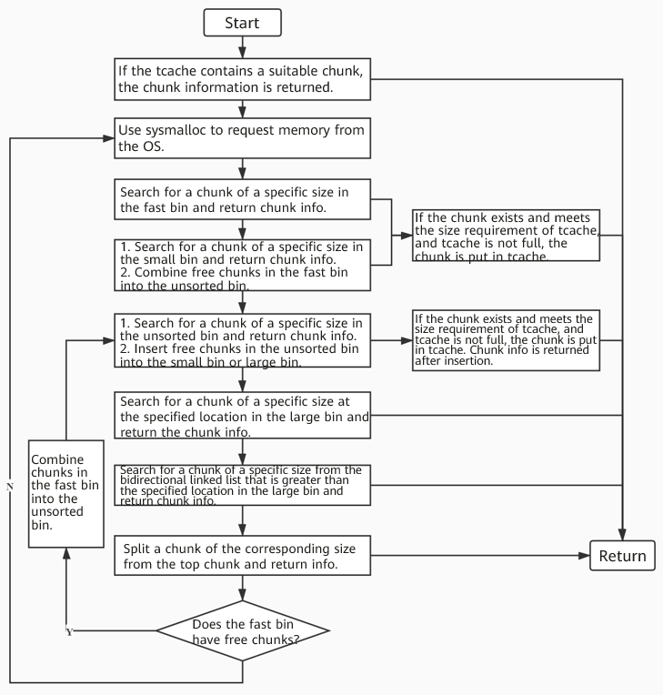

# 1 Overview
The memory allocator ptmalloc, that is, malloc in glibc, implements malloc(), free(), and other functions to support dynamic memory management. The allocator runs between the user program and the kernel. It responds to the user's allocation request, applies for memory from the OS, and allocates the memory to the user program.  
To ensure efficient allocation, the allocator generally pre-allocates a memory chunk larger than that requested by the user, and manages the chunk by using a certain algorithm. The memory released by the user is not returned to the OS immediately. Instead, the allocator manages the released free space to meet the subsequent memory allocation requests of the user. That is, the allocator not only manages allocated chunks, but also manages idle chunks. When responding to an allocation request of the user, the allocator first searches for a proper chunk in the idle space for the user, and allocates a new chunk only when no proper chunk is found in the idle space.


# 2. Malloc Data Structures
## 2.1 Memory Management Structures
### 2.1.1 Chunk
Chunk is the minimum unit for glibc memory management. The following figures show the data structure of a free chunk and an allocated chunk respectively.
<center> </center>

The key members of a chunk are prev_size, mchunk_size, fd, and bk. Their functions are as follows:  
prev_size: If the previous chunk is a free chunk, this area stores the size of the previous chunk. If the previous chunk is an allocated chunk, this area stores the user data of the previous chunk.

mchunk_size: size of the current chunk. The last three bits are used as flag bits. Specifically, bit 0 indicates whether the previous chunk is allocated, and whether the current chunk is allocated can be figured out by querying bit 0 of the next chunk. Bit 1 marks whether the current chunk is applied for via a system call (mmap of a sub-thread or brk of the main thread). If yes, the chunk is no longer marked by the memory management data structures (to be described in following sections), and the memory application and release processes are simplified. Bit 2 marks whether the chunk belongs to the main arena. Arenas are described in detail in following sections.

fd: forward pointer that points to the next chunk in the same bin. It exists only when the current chunk is not used.

bk: backward pointer that points to the previous chunk in the same bin. It exists only when the current chunk is not used.

### 2.1.2 Arena
An arena is a structure that contains elements such as pointers pointing to chunks of different types. Each thread obtains an arena when applying for memory. Arenas are classified into the main arena and thread arenas. There is only one main arena. When a new thread applies for memory, it obtains a free arena from a global linked list. If no free arena is obtained and the number of arenas does not exceed the maximum value (**M_ARENA_MAX**), malloc creates an arena.


### 2.2.3 Heap
A heap consists of a frame header and chunks. Glibc applies for and releases memory from the OS in heaps.  
There is a heap in the main arena and a heap in a thread arena when it is created. When the size of the heap in a thread arena exceeds a certain value (default: 64 MB), a new heap is added. The heaps are connected as a linked list, and the number of heaps is not limited. When a heap is created, there is only one chunk called top chunk. Every time a memory request is received, a chunk is split from the top chunk. The top chunk is always at the end of the heap.

The following figure shows the memory distribution of the main arena and a thread arena with only one heap:
<center></center>
The following figure shows the memory distribution of a thread arena with multiple heaps:
<center></center>
As shown in the preceding figures, the thread arena contains two heap_info structures (heap headers). The two heaps are requested from the OS via mmap. They are not adjacent in memory layout and belong to different memory areas. Therefore, to facilitate management, the malloc function of glibc points the prev member of the second heap_info structure to the start position (ar_ptr member) of the first heap_info structure, and the ar_ptr member of the first heap_info structure points to the arena. In this way, a singly linked list is formed.


## 2.2 Memory Management Linked Lists
Glibc provides several linked lists to manage chunks of different sizes. All variables except tcache are member variables in the arena structure.


### 2.2.1 Tcache
Tcache is a cache mechanism introduced by glibc to improve the performance of applying for and releasing small chunks. A single tcache has 64 linked list items, and each item can store a maximum of seven chunks of the same size. The data structures of the tcache linked list is requested from the heap managed by the arena. When the thread exits, the data structures are released back to the original heap. The tcache is a thread variable, and each thread has its own tcache. Therefore, there is no upper limit on the number of tcaches theoretically.


### 2.2.2 Fast Bin
A fast bin is a linked list that manages small chunks (160 bytes on a 64-bit platform) and applies to scenarios where small chunks are frequently requested. The size of chunks managed by a linked list item increases according to a certain rule. The linked list item index of a chunk of a specified size may be computed by using a specific algorithm, so as to locate the chunk.
<center></center>


### 2.2.3 Unsorted Bin
Chunks in the fast bin, small chunks, and large chunks, after being freed, are put into the unsorted bin to accelerate memory application and release. There is no rule for the size of chunks managed by the unsorted bin.
<center></center>


### 2.2.4 Small Bin and Large Bin
The size of chunks managed by the small bin and large bin increases according to a certain rule. The linked list item index of a chunk of a specified size may be computed by using a specific algorithm, so as to locate the chunk.
<br><br>
# 3 Malloc Principle Analysis
## 3.1 Malloc Cache Model
To balance performance and memory usage, the malloc function of glibc implements a complex memory cache mechanism through a series of memory management linked lists. The following figures show the basic principle:
<center> </center>
When a user applies for memory, the malloc function applies for a heap from the OS, divides the heap into chunks, and uses different linked lists to manage the chunks based on the chunk sizes. For subsequent memory applications, memory is allocated in the following order: tcache→fast bin→unsorted bin→small bin/large bin. The memory release process is in the reverse order.


## 3.2 Malloc Working Process
### 3.2.1 Memory Application Process

<center></center>
<br><br>

### 3.2.2 Memory Release Process
<center></center>


# 4. Parameter Configuration
## 4.1 Parameter List
Glibc provides a series of adjustable parameters. You can adjust these parameters by setting environment variables to change some behaviors of malloc.

|  Name  | Default Value | Value Range | Description |
|  :----:  | :----:  | :----:  | :----  |
| M_MMAP_MAX | 65536 | ≥ 0| Maximum number of chunks allocated via mmap. If the value is **0**, mmap is disabled.|
| M_MMAP_THRESHOLD | 128 x 1024 (bytes) | 0 - 32 MB| mmap is used to allocate memory for all chunks whose sizes are greater than the value of this parameter. If this parameter is not manually set and dynamic adjustment is enabled, the value is dynamically adjusted. Specifically, if the memory requested last time is greater than the value, the value increases accordingly. If this parameter is manually set, dynamic adjustment is disabled and the value remains unchanged. |
| M_TOP_PAD | 0| -| Amount of memory reserved during memory application/release to reduce system calls.|
| M_TRIM_THRESHOLD | 128 x 1024 (bytes) | -| Trimming threshold. When the size of a top chunk exceeds the trimming threshold, a trimming operation is triggered to return the extra memory to the OS. If this parameter is not manually set and dynamic adjustment is enabled, the value is dynamically adjusted. Specifically, when the value of **M_MMAP_THRESHOLD** is updated, the value of this parameter is twice the value of **M_MMAP_THRESHOLD**. If this parameter is manually set, dynamic adjustment is disabled and the value remains unchanged. |
| M_ARENA_MAX | Number of CPU cores x 8 | -| Maximum number of arenas|
| M_ARENA_TEST | 8 | -| Limits the number of arenas. The action of changing the upper limit of arenas is triggered only when the existing arenas of the process are insufficient and the demand exceeds the value of **M_ARENA_TEST**. If **M_ARENA_MAX** is set, **M_ARENA_TEST** will be ignored.|
| tcache_count | 7 | ≥ 0| Sets the number of bins of the tcache linked list. When the value is **0**, extra chunks are not stored in tcache, that is, tcache is disabled. Example:<br />`export GLIBC_TUNABLES=glibc.malloc.tcache_count=0` |
| tcache_unsorted_limit | 0 | ≥ 0| Limits the number of chunks obtained by tcache from the unsorted bin. When the value is **0**, no limitation is set.|

## 4.2 Setting Parameters Using Environment Variables
### 4.2.1 Environment Variables in Compatibility Mode
This method is compatible with glibc earlier than 2.26, but does not support tcache-related settings.  

Example:

```
# export MALLOC_ARENA_MAX=1  
```


### 4.2.2 Environment Variables in Tunables Mode
This method is applicable to glibc 2.26 and later versions. By default, this method is used.

Example:
```
# GLIBC_TUNABLES=glibc.malloc.mmap_max=1:glibc.malloc.top_pad=1
```

# 5 Commissioning Tools
malloc_stats is an interface provided by glibc for collecting statistics on the memory usage of the current process. The statistics are accurate to bytes. The declaration of malloc_stats() is as follows:
```
#include<stdlib.h>  
#include<malloc.h>  
void malloc_stats(void);  
```

malloc_stats() can be added to macros during code writing or directly called during GNU debugging. The output of malloc_stats() is as follows:

```
Arena 0:                      //Arena ID. There is only one thread.
system bytes     =     135168 //Dynamic memory obtained by the thread from the OS. 
in use bytes     =       1152 //Dynamic memory used by the thread. 
Total (incl. mmap):           //Total usage of the dynamic memory, that is, the accumulated dynamic memory used by each thread. 
system bytes     =     135168 //Dynamic memory obtained by the process from the OS. 
in use bytes     =       1152 //Dynamic memory used by the process. 
max mmap regions =          0 //Maximum number of mmap regions 
max mmap bytes   =          0 //Size of the memory corresponding to mmap regions 
```
