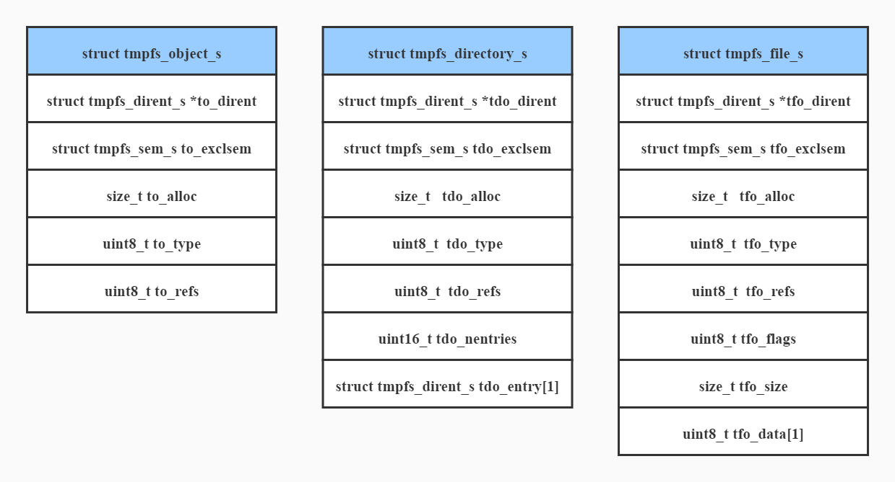

# About This Document
The temporary file system, or tmpfs, is an independent file system that can be used immediately after being mounted. It is similar to a virtual drive (RAM drive), but the drawback of a RAM drive is that it serves as a block device and can be used only after being formatted by commands such as **mkfs**. This document uses tmpfs of NuttX-10.0.1 as an example to introduce its basic data structures and interface implementation.
<br>

# Data Structures
The tmpfs source code is stored in the **fs/tmpfs** directory of NuttX, and there is only one C file. The following describes the key data structures of tmpfs.
<br>

## object
In the following figure, the **object** structure can be regarded as the abstraction of the **file** and **directory** structures for unifying interfaces. From the object-oriented perspective, **object** is the parent structure of **file** and **directory**.
```
/* The generic form of a TMPFS memory object */

struct tmpfs_object_s
{
  FAR struct tmpfs_dirent_s *to_dirent;
  struct tmpfs_sem_s to_exclsem;

  size_t   to_alloc;     /* Allocated size of the memory object */
  uint8_t  to_type;      /* See enum tmpfs_objtype_e */
  uint8_t  to_refs;      /* Reference count */
};
```
<br><br>

<center></center>
<br><br>

## dirent
**dirent** represents a directory entry matching the corresponding object. On the source code, **dirent** adds the object name after the **object** structure.

```
/* The form of one directory entry */

struct tmpfs_dirent_s
{
  FAR struct tmpfs_object_s *tde_object;
  FAR char *tde_name;
};
```
<br>

## directory
A **directory** structure contains one or more **dirent** structures that point to files and subdirectories. Files and directories (including the root directory) are interleaved to form a tmpfs tree.
```
/* The form of a directory memory object */

struct tmpfs_directory_s
{
  /* First fields must match common TMPFS object layout */

  FAR struct tmpfs_dirent_s *tdo_dirent;
  struct tmpfs_sem_s tdo_exclsem;

  size_t   tdo_alloc;    /* Allocated size of the directory object */
  uint8_t  tdo_type;     /* See enum tmpfs_objtype_e */
  uint8_t  tdo_refs;     /* Reference count */

  /* Remaining fields are unique to a directory object */

  uint16_t tdo_nentries; /* Number of directory entries */
  struct tmpfs_dirent_s tdo_entry[1];
};
```
<br>

## file
A file is a sequential stream of bytes. Each file has a readable name. You can read, write, create, and delete a file with a specified name.
```
/* The form of a regular file memory object
 *
 * NOTE that in this very simplified implementation, there is no per-open
 * state.  The file memory object also serves as the open file object,
 * saving an allocation.  This has the negative side effect that no per-
 * open state can be retained (such as open flags).
 */

struct tmpfs_file_s
{
  /* First fields must match common TMPFS object layout */

  FAR struct tmpfs_dirent_s *tfo_dirent;
  struct tmpfs_sem_s tfo_exclsem;

  size_t   tfo_alloc;    /* Allocated size of the file object */
  uint8_t  tfo_type;     /* See enum tmpfs_objtype_e */
  uint8_t  tfo_refs;     /* Reference count */

  /* Remaining fields are unique to a directory object */

  uint8_t  tfo_flags;    /* See TFO_FLAG_* definitions */
  size_t   tfo_size;     /* Valid file size */
  uint8_t  tfo_data[1];  /* File data starts here */
};
```
<br>

## tmpfs_s
The **tmpfs_s** structure represents an instance of tmpfs. The member **tfs_root** points to the root directory of tmpfs.
```
/* This structure represents one instance of a TMPFS file system */

struct tmpfs_s
{
  /* The root directory */

  FAR struct tmpfs_dirent_s tfs_root;
  struct tmpfs_sem_s tfs_exclsem;
};
```
<br>


## Structure Relationship
The following figure shows the relationships between the preceding structures.
<center></center>
<br><br>

# Main Internal Interfaces
Key internal interfaces are classified into the following types based on the operation type.
<br><br>

## dirent Operations
### tmpfs_add_dirent
As mentioned, **dirent** is the simplified encapsulation of the **object** structure and the object name, and **object** is the abstraction of **directory** and **file**. Therefore, the **tmpfs_add_dirent** function is used to add files and directories. The source code is as follows.
**tmpfs_add_dirent** reallocates the current **tdo** directory by adding a **tdo** entry, and assigns the new object (that is, **to**) and name to the new **tdo** entry.

```
/****************************************************************************
 * Name: tmpfs_add_dirent
 ****************************************************************************/

static int tmpfs_add_dirent(FAR struct tmpfs_directory_s **tdo,
                            FAR struct tmpfs_object_s *to,
                            FAR const char *name)
{
  FAR struct tmpfs_directory_s *oldtdo;
  FAR struct tmpfs_directory_s *newtdo;
  FAR struct tmpfs_dirent_s *tde;
  FAR char *newname;
  unsigned int nentries;
  int index;

  /* Copy the name string so that it will persist as long as the
   * directory entry.
   */

  newname = strdup(name);
  if (newname == NULL)
    {
      return -ENOMEM;
    }

  /* Get the new number of entries */

  oldtdo = *tdo;
  nentries = oldtdo->tdo_nentries + 1;

  /* Reallocate the directory object (if necessary) */

  index = tmpfs_realloc_directory(tdo, nentries);
  if (index < 0)
    {
      kmm_free(newname);
      return index;
    }

  /* Save the new object info in the new directory entry */

  newtdo          = *tdo;
  tde             = &newtdo->tdo_entry[index];
  tde->tde_object = to;
  tde->tde_name   = newname;

  /* Add backward link to the directory entry to the object */

  to->to_dirent  = tde;
  return OK;
}
```
<br>
<br>

### tmpfs_find_dirent
The **tmpfs_find_dirent** function is used to search for a **dirent** with a specified name in a directory, for example, **tdo**. The source code is as follows. It is implemented through traversal search.
```
/****************************************************************************
 * Name: tmpfs_find_dirent
 ****************************************************************************/

static int tmpfs_find_dirent(FAR struct tmpfs_directory_s *tdo,
                             FAR const char *name)
{
  int i;

  /* Search the list of directory entries for a match */

  for (i = 0;
       i < tdo->tdo_nentries &&
       strcmp(tdo->tdo_entry[i].tde_name, name) != 0;
       i++);

  /* Return what we found, if anything */

  return i < tdo->tdo_nentries ? i : -ENOENT;
}
```
<br><br>

### tmpfs_remove_dirent
The **tmpfs_remove_dirent** function is used to delete a **dirent** with a specified name from a directory, for example, **tdo**. Its source code is presented below. This function releases the strdup name in the **tmpfs_add_dirent** function and then checks whether the deleted **dirent** is the final one. If so, the function stops; otherwise, it overwrites the to-be-deleted **dirent** with the final **dirent** to release the final **dirent** for future use and avoid frequent reallocation.
```
/****************************************************************************
 * Name: tmpfs_remove_dirent
 ****************************************************************************/

static int tmpfs_remove_dirent(FAR struct tmpfs_directory_s *tdo,
                               FAR const char *name)
{
  int index;
  int last;

  /* Search the list of directory entries for a match */

  index = tmpfs_find_dirent(tdo, name);
  if (index < 0)
    {
      return index;
    }

  /* Free the object name */

  if (tdo->tdo_entry[index].tde_name != NULL)
    {
      kmm_free(tdo->tdo_entry[index].tde_name);
    }

  /* Remove by replacing this entry with the final directory entry */

  last = tdo->tdo_nentries - 1;
  if (index != last)
    {
      FAR struct tmpfs_dirent_s *newtde;
      FAR struct tmpfs_dirent_s *oldtde;
      FAR struct tmpfs_object_s *to;

      /* Move the directory entry */

      newtde             = &tdo->tdo_entry[index];
      oldtde             = &tdo->tdo_entry[last];
      to                 = oldtde->tde_object;

      newtde->tde_object = to;
      newtde->tde_name   = oldtde->tde_name;

      /* Reset the backward link to the directory entry */

      to->to_dirent      = newtde;
    }

  /* And decrement the count of directory entries */

  tdo->tdo_nentries = last;
  return OK;
}
```
<br><br>

## Object Operation
### tmpfs_find_object
As mentioned, **object** is the abstraction of **directory** and **file**. Therefore, the **tmpfs_find_object** function is used to find files and directories. The source code is as follows.
Although the source code contains about 150 lines, it is relatively simple. In the input parameters, **relpath** is an absolute path. The **tmpfs_find_object** function searches from the root directory of tmpfs, and the **tmpfs_find_dirent** function is used to search in a specific directory. If the object cannot be found, an error code is returned. If the object is found, the target object and its directory are locked, and the values of **to_refs** and **tdo_refs** increase by 1.

```
/****************************************************************************
 * Name: tmpfs_find_object
 ****************************************************************************/

static int tmpfs_find_object(FAR struct tmpfs_s *fs,
                             FAR const char *relpath,
                             FAR struct tmpfs_object_s **object,
                             FAR struct tmpfs_directory_s **parent)
{
  FAR struct tmpfs_object_s *to = NULL;
  FAR struct tmpfs_directory_s *tdo = NULL;
  FAR struct tmpfs_directory_s *next_tdo;
  FAR char *segment;
  FAR char *next_segment;
  FAR char *tkptr;
  FAR char *copy;
  int index;
  int ret;

  /* Make a copy of the path (so that we can modify it via strtok) */

  copy = strdup(relpath);
  if (copy == NULL)
    {
      return -ENOMEM;
    }

  /* Traverse the file system for any object with the matching name */

  to       = fs->tfs_root.tde_object;
  next_tdo = (FAR struct tmpfs_directory_s *)fs->tfs_root.tde_object;

  for (segment =  strtok_r(copy, "/", &tkptr);
       segment != NULL;
       segment = next_segment)
    {
      /* Get the next segment after the one we are currently working on.
       * This will be NULL is we are working on the final segment of the
       * relpath.
       */

      next_segment = strtok_r(NULL, "/", &tkptr);

      /* Search the next directory. */

      tdo = next_tdo;

      /* Find the TMPFS object with the next segment name in the current
       * directory.
       */

      index = tmpfs_find_dirent(tdo, segment);
      if (index < 0)
        {
          /* No object with this name exists in the directory. */

          kmm_free(copy);
          return index;
        }

      to = tdo->tdo_entry[index].tde_object;

      /* Is this object another directory? */

      if (to->to_type != TMPFS_DIRECTORY)
        {
          /* No.  Was this the final segment in the path? */

          if (next_segment == NULL)
            {
              /* Then we can break out of the loop now */

               break;
            }

          /* No, this was not the final segment of the relpath.
           * We cannot continue the search if any of the intermediate
           * segments do no correspond to directories.
           */

          kmm_free(copy);
          return -ENOTDIR;
        }

      /* Search this directory for the next segment.  If we
       * exit the loop, tdo will still refer to the parent
       * directory of to.
       */

      next_tdo = (FAR struct tmpfs_directory_s *)to;
    }

  /* When we exit this loop (successfully), to will point to the TMPFS
   * object associated with the terminal segment of the relpath.
   * Increment the reference count on the located object.
   */

  /* Free the dup'ed string */

  kmm_free(copy);

  /* Return what we found */

  if (parent)
    {
      if (tdo != NULL)
        {
          /* Get exclusive access to the parent and increment the reference
           * count on the object.
           */

          ret = tmpfs_lock_directory(tdo);
          if (ret < 0)
            {
              return ret;
            }

          tdo->tdo_refs++;
        }

      *parent = tdo;
    }

  if (object)
    {
      if (to != NULL)
        {
          /* Get exclusive access to the object and increment the reference
           * count on the object.
           */

          ret = tmpfs_lock_object(to);
          if (ret < 0)
            {
              return ret;
            }

          to->to_refs++;
        }

      *object = to;
    }

  return OK;
}
```
<br><br>


## File Operations
### tmpfs_alloc_file
The **tmpfs_alloc_file** function is used to allocate space for new files. The source code is as follows. It requests memory and initializes the structure.
```
/****************************************************************************
 * Name: tmpfs_alloc_file
 ****************************************************************************/

static FAR struct tmpfs_file_s *tmpfs_alloc_file(void)
{
  FAR struct tmpfs_file_s *tfo;
  size_t allocsize;

  /* Create a new zero length file object */

  allocsize = SIZEOF_TMPFS_FILE(CONFIG_FS_TMPFS_FILE_ALLOCGUARD);
  tfo = (FAR struct tmpfs_file_s *)kmm_malloc(allocsize);
  if (tfo == NULL)
    {
      return NULL;
    }

  /* Initialize the new file object.  NOTE that the initial state is
   * locked with one reference count.
   */

  tfo->tfo_alloc = allocsize;
  tfo->tfo_type  = TMPFS_REGULAR;
  tfo->tfo_refs  = 1;
  tfo->tfo_flags = 0;
  tfo->tfo_size  = 0;

  tfo->tfo_exclsem.ts_holder = getpid();
  tfo->tfo_exclsem.ts_count  = 1;
  nxsem_init(&tfo->tfo_exclsem.ts_sem, 0, 0);

  return tfo;
}
```
<br><br>

### tmpfs_create_file
The **tmpfs_create_file** function is used to create a file. The source code is presented below. The function determines whether to create a file in the root directory. If yes, the **parent** variable is the root directory; otherwise, the **tmpfs_find_directory** function is used to find the upper-level directory of the file to be created. Then, the **tmpfs_find_dirent** function is used to check whether the current file exists in the directory. If it exists, an error code is returned and the function stops. If not, the **tmpfs_alloc_file** function is called to allocate space for the new file and the **tmpfs_add_dirent** function is called to allocate a directory entry in the directory where the new file is located.
```
/****************************************************************************
 * Name: tmpfs_create_file
 ****************************************************************************/

static int tmpfs_create_file(FAR struct tmpfs_s *fs,
                             FAR const char *relpath,
                             FAR struct tmpfs_file_s **tfo)
{
  FAR struct tmpfs_directory_s *parent;
  FAR struct tmpfs_file_s *newtfo;
  FAR char *copy;
  FAR char *name;
  int ret;

  /* Duplicate the path variable so that we can modify it */

  copy = strdup(relpath);
  if (copy == NULL)
    {
      return -ENOMEM;
    }

  /* Separate the path into the file name and the path to the parent
   * directory.
   */

  name = strrchr(copy, '/');
  if (name == NULL)
    {
      /* No subdirectories... use the root directory */

      name   = copy;
      parent = (FAR struct tmpfs_directory_s *)fs->tfs_root.tde_object;

      /* Lock the root directory to emulate the behavior of
       * tmpfs_find_directory()
       */

      ret = tmpfs_lock_directory(parent);
      if (ret < 0)
        {
          kmm_free(copy);
          return ret;
        }

      parent->tdo_refs++;
    }
  else
    {
      /* Terminate the parent directory path */

      *name++ = '\0';

      /* Locate the parent directory that should contain this name.
       * On success, tmpfs_find_directory() will lock the parent
       * directory and increment the reference count.
       */

      ret = tmpfs_find_directory(fs, copy, &parent, NULL);
      if (ret < 0)
        {
          goto errout_with_copy;
        }
    }

  /* Verify that no object of this name already exists in the directory */

  ret = tmpfs_find_dirent(parent, name);
  if (ret != -ENOENT)
    {
      /* Something with this name already exists in the directory.
       * OR perhaps some fatal error occurred.
       */

      if (ret >= 0)
        {
          ret = -EEXIST;
        }

      goto errout_with_parent;
    }

  /* Allocate an empty file.  The initial state of the file is locked with
   * one reference count.
   */

  newtfo = tmpfs_alloc_file();
  if (newtfo == NULL)
    {
      ret = -ENOMEM;
      goto errout_with_parent;
    }

  /* Then add the new, empty file to the directory */

  ret = tmpfs_add_dirent(&parent, (FAR struct tmpfs_object_s *)newtfo, name);
  if (ret < 0)
    {
      goto errout_with_file;
    }

  /* Release the reference and lock on the parent directory */

  parent->tdo_refs--;
  tmpfs_unlock_directory(parent);

  /* Free the copy of the relpath and return success */

  kmm_free(copy);
  *tfo = newtfo;
  return OK;

  /* Error exits */

errout_with_file:
  nxsem_destroy(&newtfo->tfo_exclsem.ts_sem);
  kmm_free(newtfo);

errout_with_parent:
  parent->tdo_refs--;
  tmpfs_unlock_directory(parent);

errout_with_copy:
  kmm_free(copy);
  return ret;
}

```
<br><br>

### tmpfs_find_file
The **tmpfs_find_file** function (source code below) is used to search for a target file from a specified absolute path. It calls the **tmpfs_find_object** function and adds a judgment. If the attribute (to_type) of the found object is not **FILE**, an error code is returned and the function stops.
```
/****************************************************************************
 * Name: tmpfs_find_file
 ****************************************************************************/

static int tmpfs_find_file(FAR struct tmpfs_s *fs,
                           FAR const char *relpath,
                           FAR struct tmpfs_file_s **tfo,
                           FAR struct tmpfs_directory_s **parent)
{
  FAR struct tmpfs_object_s *to;
  int ret;

  /* Find the object at this path.  If successful, tmpfs_find_object() will
   * lock both the object and the parent directory and will increment the
   * reference count on both.
   */

  ret = tmpfs_find_object(fs, relpath, &to, parent);
  if (ret >= 0)
    {
      /* We found it... but is it a regular file? */

      if (to->to_type != TMPFS_REGULAR)
        {
          /* No... unlock the object and its parent and return an error */

          tmpfs_release_lockedobject(to);

          if (parent)
            {
              FAR struct tmpfs_directory_s *tdo = *parent;

              tdo->tdo_refs--;
              tmpfs_unlock_directory(tdo);
            }

          ret = -EISDIR;
        }

      /* Return the verified file object */

      *tfo = (FAR struct tmpfs_file_s *)to;
    }

  return ret;
}
```
<br><br>


### tmpfs_realloc_file
The **tmpfs_realloc_file** function (source code below) is used to expand the space of the current file. The **tfo_alloc** member in the **tmpfs_file_s** structure records the actual size of the current file and pre-allocates some space to a newly created file. If the size to be expanded does not exceed the actual size of the file, change the value of **tfo_size**. Otherwise, use the **kmm_realloc** function to expand the space and then update the structure.
```
/****************************************************************************
 * Name: tmpfs_realloc_file
 ****************************************************************************/

static int tmpfs_realloc_file(FAR struct tmpfs_file_s **tfo,
                              size_t newsize)
{
  FAR struct tmpfs_file_s *oldtfo = *tfo;
  FAR struct tmpfs_file_s *newtfo;
  size_t objsize;
  size_t allocsize;
  size_t delta;

  /* Check if the current allocation is sufficient */

  objsize = SIZEOF_TMPFS_FILE(newsize);

  /* Are we growing or shrinking the object? */

  if (objsize <= oldtfo->tfo_alloc)
    {
      /* Shrinking ... Shrink unconditionally if the size is shrinking to
       * zero.
       */

      if (newsize > 0)
        {
          /* Otherwise, don't realloc unless the object has shrunk by a
           * lot.
           */

          delta = oldtfo->tfo_alloc - objsize;
          if (delta <= CONFIG_FS_TMPFS_FILE_FREEGUARD)
            {
              /* Hasn't shrunk enough.. Return doing nothing for now */

              oldtfo->tfo_size = newsize;
              return OK;
            }
        }
    }

  /* Added some additional amount to the new size to account frequent
   * reallocations.
   */

  allocsize = objsize + CONFIG_FS_TMPFS_FILE_ALLOCGUARD;

  /* Realloc the file object */

  newtfo = (FAR struct tmpfs_file_s *)kmm_realloc(oldtfo, allocsize);
  if (newtfo == NULL)
    {
      return -ENOMEM;
    }

  /* Adjust the reference in the parent directory entry */

  DEBUGASSERT(newtfo->tfo_dirent);
  newtfo->tfo_dirent->tde_object = (FAR struct tmpfs_object_s *)newtfo;

  /* Return the new address of the reallocated file object */

  newtfo->tfo_alloc = allocsize;
  newtfo->tfo_size  = newsize;
  *tfo              = newtfo;
  return OK;
}
```
<br><br>

## Directory Operations
### tmpfs_alloc_directory
The **tmpfs_alloc_directory** function is used to allocate space to a new directory. Similar to the **tmpfs_alloc_file** function, it requests memory and initializes the structure.
<br><br>

### tmpfs_create_directory
The **tmpfs_create_directory** function is used to create a directory, which is similar to the **tmpfs_create_file** function.
<br><br>

### tmpfs_find_directory
Similar to the **tmpfs_find_file** function, the **tmpfs_find_directory** function is used to search for a target directory from a specified absolute path. It also calls the **tmpfs_find_object** function and adds a judgment. If the attribute (to_type) of the found object is not **DIRECTORY**, an error code is returned and the function stops.
<br><br>


### tmpfs_realloc_directory
The **tmpfs_realloc_directory** function is used to add a directory entry for a specified directory, for example, **tdo**. The source code is presented below. Different from the **tmpfs_realloc_file** function, the input parameter of **tmpfs_realloc_directory** is the expected total number of directory entries after reallocation. As mentioned, tmpfs does not delete a **dirent** immediately but reserves the final one. Therefore, if the reserved **dirent** in the current directory meets the requirements, you only need to update **tdo_nentries**. Otherwise, **kmm_realloc** is called to expand space and update related structures.
```
/****************************************************************************
 * Name: tmpfs_realloc_directory
 ****************************************************************************/

static int tmpfs_realloc_directory(FAR struct tmpfs_directory_s **tdo,
                                   unsigned int nentries)
{
  FAR struct tmpfs_directory_s *oldtdo = *tdo;
  FAR struct tmpfs_directory_s *newtdo;
  size_t objsize;
  int ret = oldtdo->tdo_nentries;

  /* Get the new object size */

  objsize = SIZEOF_TMPFS_DIRECTORY(nentries);
  if (objsize <= oldtdo->tdo_alloc)
    {
      /* Already big enough.
       * REVISIT: Missing logic to shrink directory objects.
       */

      oldtdo->tdo_nentries = nentries;
      return ret;
    }

  /* Added some additional amount to the new size to account frequent
   * reallocations.
   */

  objsize += CONFIG_FS_TMPFS_DIRECTORY_ALLOCGUARD;

  /* Realloc the directory object */

  newtdo = (FAR struct tmpfs_directory_s *)kmm_realloc(oldtdo, objsize);
  if (newtdo == NULL)
    {
      return -ENOMEM;
    }

  /* Adjust the reference in the parent directory entry */

  DEBUGASSERT(newtdo->tdo_dirent);
  newtdo->tdo_dirent->tde_object = (FAR struct tmpfs_object_s *)newtdo;

  /* Return the new address of the reallocated directory object */

  newtdo->tdo_alloc    = objsize;
  newtdo->tdo_nentries = nentries;
  *tdo                 = newtdo;

  /* Return the index to the first, newly allocated directory entry */

  return ret;
}
```
<br><br>


# Interfaces
Like common file systems, tmpfs provides standard interfaces that serve as the final implementation of system calls. This section describes several common interfaces.

## bind
### Description
Creates a tmpfs root file system instance in the initialization phase.
<br><br>

### Source Code Analysis
In the source code, the **bind** interface requests memory for and initializes the **tmpfs_s** structure. The involved interfaces are described in the preceding sections and are not described here.
```
/****************************************************************************
 * Name: tmpfs_bind
 ****************************************************************************/

static int tmpfs_bind(FAR struct inode *blkdriver, FAR const void *data,
                      FAR void **handle)
{
  FAR struct tmpfs_directory_s *tdo;
  FAR struct tmpfs_s *fs;

  finfo("blkdriver: %p data: %p handle: %p\n", blkdriver, data, handle);
  DEBUGASSERT(blkdriver == NULL && handle != NULL);

  /* Create an instance of the tmpfs file system */

  fs = (FAR struct tmpfs_s *)kmm_zalloc(sizeof(struct tmpfs_s));
  if (fs == NULL)
    {
      return -ENOMEM;
    }

  /* Create a root file system.  This is like a single directory entry in
   * the file system structure.
   */

  tdo = tmpfs_alloc_directory();
  if (tdo == NULL)
    {
      kmm_free(fs);
      return -ENOMEM;
    }

  fs->tfs_root.tde_object = (FAR struct tmpfs_object_s *)tdo;
  fs->tfs_root.tde_name   = "";

  /* Set up the backward link (to support reallocation) */

  tdo->tdo_dirent         = &fs->tfs_root;

  /* Initialize the file system state */

  fs->tfs_exclsem.ts_holder = TMPFS_NO_HOLDER;
  fs->tfs_exclsem.ts_count  = 0;
  nxsem_init(&fs->tfs_exclsem.ts_sem, 0, 1);

  /* Return the new file system handle */

  *handle = (FAR void *)fs;
  return OK;
}
```
<br><br>

## unbind
### Description
Releases the tmpfs file system.
<br><br>

### Source Code Analysis
The core of the **unbind** interface is the **tmpfs_foreach** function that releases the content in tmpfs through traversal, and then tmpfs releases the root file system.
```
/****************************************************************************
 * Name: tmpfs_unbind
 ****************************************************************************/

static int tmpfs_unbind(FAR void *handle, FAR struct inode **blkdriver,
                        unsigned int flags)
{
  FAR struct tmpfs_s *fs = (FAR struct tmpfs_s *)handle;
  FAR struct tmpfs_directory_s *tdo;
  int ret;

  finfo("handle: %p blkdriver: %p flags: %02x\n",
        handle, blkdriver, flags);
  DEBUGASSERT(fs != NULL && fs->tfs_root.tde_object != NULL);

  /* Lock the file system */

  ret = tmpfs_lock(fs);
  if (ret < 0)
    {
      return ret;
    }

  /* Traverse all directory entries (recursively), freeing all resources. */

  tdo = (FAR struct tmpfs_directory_s *)fs->tfs_root.tde_object;
  ret = tmpfs_foreach(tdo, tmpfs_free_callout, NULL);

  /* Now we can destroy the root file system and the file system itself. */

  nxsem_destroy(&tdo->tdo_exclsem.ts_sem);
  kmm_free(tdo);

  nxsem_destroy(&fs->tfs_exclsem.ts_sem);
  kmm_free(fs);
  return ret;
}
```
<br><br>

## open
### Description
Opens a file, which is similar to using the **open** system call in user mode.
<br><br>

### Source Code Analysis

The source code contains about 150 lines and the involved interfaces have been described in preceding sections. The **tmpfs_find_file** function is used to search for a file. If the file is not found, the **tmpfs_create_file** function is called to determine whether to create a file or report an error and stop based on the flag transferred in user mode. If the file is found, the **tmpfs_find_file** function determines whether to return the EEXIST error code or clear up the file based on the flag transferred in user mode.
```
/****************************************************************************
 * Name: tmpfs_open
 ****************************************************************************/

static int tmpfs_open(FAR struct file *filep, FAR const char *relpath,
                      int oflags, mode_t mode)
{
  FAR struct inode *inode;
  FAR struct tmpfs_s *fs;
  FAR struct tmpfs_file_s *tfo;
  off_t offset;
  int ret;

  finfo("filep: %p\n", filep);
  DEBUGASSERT(filep->f_priv == NULL && filep->f_inode != NULL);

  /* Get the mountpoint inode reference from the file structure and the
   * mountpoint private data from the inode structure
   */

  inode = filep->f_inode;
  fs    = inode->i_private;

  DEBUGASSERT(fs != NULL && fs->tfs_root.tde_object != NULL);

  /* Get exclusive access to the file system */

  ret = tmpfs_lock(fs);
  if (ret < 0)
    {
      return ret;
    }

  /* Skip over any leading directory separators (shouldn't be any) */

  for (; *relpath == '/'; relpath++);

  /* Find the file object associated with this relative path.
   * If successful, this action will lock both the parent directory and
   * the file object, adding one to the reference count of both.
   * In the event that -ENOENT, there will still be a reference and
   * lock on the returned directory.
   */

  ret = tmpfs_find_file(fs, relpath, &tfo, NULL);
  if (ret >= 0)
    {
      /* The file exists.  We hold the lock and one reference count
       * on the file object.
       *
       * It would be an error if we are asked to create it exclusively
       */

      if ((oflags & (O_CREAT | O_EXCL)) == (O_CREAT | O_EXCL))
        {
          /* Already exists -- can't create it exclusively */

          ret = -EEXIST;
          goto errout_with_filelock;
        }

      /* Check if the caller has sufficient privileges to open the file.
       * REVISIT: No file protection implemented
       */

      /* If O_TRUNC is specified and the file is opened for writing,
       * then truncate the file.  This operation requires that the file is
       * writeable, but we have already checked that. O_TRUNC without write
       * access is ignored.
       */

      if ((oflags & (O_TRUNC | O_WRONLY)) == (O_TRUNC | O_WRONLY))
        {
          /* Truncate the file to zero length (if it is not already
           * zero length)
           */

          if (tfo->tfo_size > 0)
            {
              ret = tmpfs_realloc_file(&tfo, 0);
              if (ret < 0)
                {
                  goto errout_with_filelock;
                }
            }
        }
    }

  /* ENOENT would be returned by tmpfs_find_file() if the full directory
   * path was found, but the file was not found in the final directory.
   */

  else if (ret == -ENOENT)
    {
      /* The file does not exist.  Were we asked to create it? */

      if ((oflags & O_CREAT) == 0)
        {
          /* No.. then we fail with -ENOENT */

          ret = -ENOENT;
          goto errout_with_fslock;
        }

      /* Yes.. create the file object.  There will be a reference and a lock
       * on the new file object.
       */

      ret = tmpfs_create_file(fs, relpath, &tfo);
      if (ret < 0)
        {
          goto errout_with_fslock;
        }
    }

  /* Some other error occurred */

  else
    {
      goto errout_with_fslock;
    }

  /* Save the struct tmpfs_file_s instance as the file private data */

  filep->f_priv = tfo;

  /* In write/append mode, we need to set the file pointer to the end of the
   * file.
   */

  offset = 0;
  if ((oflags & (O_APPEND | O_WRONLY)) == (O_APPEND | O_WRONLY))
    {
      offset = tfo->tfo_size;
    }

  filep->f_pos = offset;

  /* Unlock the file file object, but retain the reference count */

  tmpfs_unlock_file(tfo);
  tmpfs_unlock(fs);
  return OK;

  /* Error exits */

errout_with_filelock:
  tmpfs_release_lockedfile(tfo);

errout_with_fslock:
  tmpfs_unlock(fs);
  return ret;
}
```
<br><br>


## close
### Description
Closes a file, which is similar to using the **close** system call in user mode.
<br><br>

### Source Code Analysis
The core of the **close** interface is to operate **tfo_refs**. The source code is as follows.
```
/****************************************************************************
 * Name: tmpfs_close
 ****************************************************************************/

static int tmpfs_close(FAR struct file *filep)
{
  FAR struct tmpfs_file_s *tfo;
  int ret;

  finfo("filep: %p\n", filep);
  DEBUGASSERT(filep->f_priv != NULL && filep->f_inode != NULL);

  /* Recover our private data from the struct file instance */

  tfo = filep->f_priv;

  /* Get exclusive access to the file */

  ret = tmpfs_lock_file(tfo);
  if (ret < 0)
    {
      return ret;
    }

  /* Decrement the reference count on the file */

  DEBUGASSERT(tfo->tfo_refs > 0);
  if (tfo->tfo_refs > 0)
    {
      tfo->tfo_refs--;
    }

  filep->f_priv = NULL;

  /* If the reference count decremented to zero and the file has been
   * unlinked, then free the file allocation now.
   */

  if (tfo->tfo_refs == 0 && (tfo->tfo_flags & TFO_FLAG_UNLINKED) != 0)
    {
      /* Free the file object while we hold the lock?  Weird but this
       * should be safe because the object is unlinked and could not
       * have any other references.
       */

      kmm_free(tfo);
      return OK;
    }

  /* Release the lock on the file */

  tmpfs_unlock_file(tfo);
  return OK;
}
```
<br><br>

## read
### Description
Reads content from a file to a specified buffer, which is similar to using the **read** system call in user mode.
<br><br>

### Source Code Analysis
The source code of the **read** interface is as follows. It calls **memcpy** to copy the content in a specified position of the file to the provided user buffer.
```
/****************************************************************************
 * Name: tmpfs_read
 ****************************************************************************/

static ssize_t tmpfs_read(FAR struct file *filep, FAR char *buffer,
                          size_t buflen)
{
  FAR struct tmpfs_file_s *tfo;
  ssize_t nread;
  off_t startpos;
  off_t endpos;
  int ret;

  finfo("filep: %p buffer: %p buflen: %lu\n",
        filep, buffer, (unsigned long)buflen);
  DEBUGASSERT(filep->f_priv != NULL && filep->f_inode != NULL);

  /* Recover our private data from the struct file instance */

  tfo = filep->f_priv;

  /* Get exclusive access to the file */

  ret = tmpfs_lock_file(tfo);
  if (ret < 0)
    {
      return ret;
    }

  /* Handle attempts to read beyond the end of the file. */

  startpos = filep->f_pos;
  nread    = buflen;
  endpos   = startpos + buflen;

  if (endpos > tfo->tfo_size)
    {
      endpos = tfo->tfo_size;
      nread  = endpos - startpos;
    }

  /* Copy data from the memory object to the user buffer */

  memcpy(buffer, &tfo->tfo_data[startpos], nread);
  filep->f_pos += nread;

  /* Release the lock on the file */

  tmpfs_unlock_file(tfo);
  return nread;
}
```
<br><br>

## write
### Description
Writes the content in a specified buffer to a file, which is similar to using the **write** system call in user mode.
<br><br>

### Source Code Analysis
This interface calls **memcpy** to copy the content in the user buffer to a specified position of the file. If the file space is insufficient, the **tmpfs_realloc_file** function is called to expand the capacity first. The source code of the **write** interface is as follows:
```
/****************************************************************************
 * Name: tmpfs_write
 ****************************************************************************/

static ssize_t tmpfs_write(FAR struct file *filep, FAR const char *buffer,
                           size_t buflen)
{
  FAR struct tmpfs_file_s *tfo;
  ssize_t nwritten;
  off_t startpos;
  off_t endpos;
  int ret;

  finfo("filep: %p buffer: %p buflen: %lu\n",
        filep, buffer, (unsigned long)buflen);
  DEBUGASSERT(filep->f_priv != NULL && filep->f_inode != NULL);

  /* Recover our private data from the struct file instance */

  tfo = filep->f_priv;

  /* Get exclusive access to the file */

  ret = tmpfs_lock_file(tfo);
  if (ret < 0)
    {
      return ret;
    }

  /* Handle attempts to write beyond the end of the file */

  startpos = filep->f_pos;
  nwritten = buflen;
  endpos   = startpos + buflen;

  if (endpos > tfo->tfo_size)
    {
      /* Reallocate the file to handle the write past the end of the file. */

      ret = tmpfs_realloc_file(&tfo, (size_t)endpos);
      if (ret < 0)
        {
          goto errout_with_lock;
        }

      filep->f_priv = tfo;
    }

  /* Copy data from the memory object to the user buffer */

  memcpy(&tfo->tfo_data[startpos], buffer, nwritten);
  filep->f_pos += nwritten;

  /* Release the lock on the file */

  tmpfs_unlock_file(tfo);
  return nwritten;

errout_with_lock:
  tmpfs_unlock_file(tfo);
  return (ssize_t)ret;
}
```
<br><br>

## seek
### Description
Obtains or moves the position of a file pointer, which is similar to using the **lseek** system call in user mode.
<br><br>

### Source Code Analysis
In tmpfs, the **f_pos** member indicates the position of the current file pointer. When the file is opened, **f_pos** is cleared or added to the end of the file as required. The source code of the **seek** interface is as follows:
```
/****************************************************************************
 * Name: tmpfs_seek
 ****************************************************************************/

static off_t tmpfs_seek(FAR struct file *filep, off_t offset, int whence)
{
  FAR struct tmpfs_file_s *tfo;
  off_t position;

  finfo("filep: %p\n", filep);
  DEBUGASSERT(filep->f_priv != NULL && filep->f_inode != NULL);

  /* Recover our private data from the struct file instance */

  tfo = filep->f_priv;

  /* Map the offset according to the whence option */

  switch (whence)
    {
      case SEEK_SET: /* The offset is set to offset bytes. */
          position = offset;
          break;

      case SEEK_CUR: /* The offset is set to its current location plus
                      * offset bytes. */
          position = offset + filep->f_pos;
          break;

      case SEEK_END: /* The offset is set to the size of the file plus
                      * offset bytes. */
          position = offset + tfo->tfo_size;
          break;

      default:
          return -EINVAL;
    }

  /* Attempts to set the position beyond the end of file will
   * work if the file is open for write access.
   *
   * REVISIT: This simple implementation has no per-open storage that
   * would be needed to retain the open flags.
   */

#if 0
  if (position > tfo->tfo_size && (tfo->tfo_oflags & O_WROK) == 0)
    {
      /* Otherwise, the position is limited to the file size */

      position = tfo->tfo_size;
    }
#endif

  /* Save the new file position */

  filep->f_pos = position;
  return position;
}
```
<br><br>

## mkdir
### Description
Creates a directory, which is similar to using the **mkdir** system call in user mode.
<br><br>

### Source Code Analysis
The source code of the **write** interface is as follows. It calls **tmpfs_create_directory** to create a directory. Its implementation has been described in preceding sections.
```
/****************************************************************************
 * Name: tmpfs_mkdir
 ****************************************************************************/

static int tmpfs_mkdir(FAR struct inode *mountpt, FAR const char *relpath,
                       mode_t mode)
{
  FAR struct tmpfs_s *fs;
  int ret;

  finfo("mountpt: %p relpath: %s mode: %04x\n", mountpt, relpath, mode);
  DEBUGASSERT(mountpt != NULL && relpath != NULL);

  /* Get the file system structure from the inode reference. */

  fs = mountpt->i_private;
  DEBUGASSERT(fs != NULL && fs->tfs_root.tde_object != NULL);

  /* Get exclusive access to the file system */

  ret = tmpfs_lock(fs);
  if (ret < 0)
    {
      return ret;
    }

  /* Create the directory. */

  ret = tmpfs_create_directory(fs, relpath, NULL);
  tmpfs_unlock(fs);
  return ret;
}
```
<br><br>

## opendir
### Description
Opens a directory, which is similar to using the **opendir** system call in user mode.
<br><br>

### Source Code Analysis
The source code of the **opendir** interface is as follows. By calling **tmpfs_find_directory**, it finds a specified directory, returns the directory structure to the upper level that calls **opendir**, and returns the processed directory structure to the user.
```
/****************************************************************************
 * Name: tmpfs_opendir
 ****************************************************************************/

static int tmpfs_opendir(FAR struct inode *mountpt, FAR const char *relpath,
                         FAR struct fs_dirent_s *dir)
{
  FAR struct tmpfs_s *fs;
  FAR struct tmpfs_directory_s *tdo;
  int ret;

  finfo("mountpt: %p relpath: %s dir: %p\n",
        mountpt, relpath, dir);
  DEBUGASSERT(mountpt != NULL && relpath != NULL && dir != NULL);

  /* Get the mountpoint private data from the inode structure */

  fs = mountpt->i_private;
  DEBUGASSERT(fs != NULL && fs->tfs_root.tde_object != NULL);

  /* Get exclusive access to the file system */

  ret = tmpfs_lock(fs);
  if (ret < 0)
    {
      return ret;
    }

  /* Skip over any leading directory separators (shouldn't be any) */

  for (; *relpath == '/'; relpath++);

  /* Find the directory object associated with this relative path.
   * If successful, this action will lock both the parent directory and
   * the file object, adding one to the reference count of both.
   * In the event that -ENOENT, there will still be a reference and
   * lock on the returned directory.
   */

  ret = tmpfs_find_directory(fs, relpath, &tdo, NULL);
  if (ret >= 0)
    {
      dir->u.tmpfs.tf_tdo   = tdo;
      dir->u.tmpfs.tf_index = tdo->tdo_nentries;

      tmpfs_unlock_directory(tdo);
    }

  /* Release the lock on the file system and return the result */

  tmpfs_unlock(fs);
  return ret;
}
```
<br><br>

## closedir
### Description
Closes a directory opened using **opendir**, which is similar to using the **closedir** system call in user mode.
<br><br>

### Source Code Analysis
The source code of the **closedir** interface is as follows. It subtracts the value of **tdo_refs** that increases when **tmpfs_find_object** is called during the **opendir** operation.
```
/****************************************************************************
 * Name: tmpfs_closedir
 ****************************************************************************/

static int tmpfs_closedir(FAR struct inode *mountpt,
                          FAR struct fs_dirent_s *dir)
{
  FAR struct tmpfs_directory_s *tdo;

  finfo("mountpt: %p dir: %p\n",  mountpt, dir);
  DEBUGASSERT(mountpt != NULL && dir != NULL);

  /* Get the directory structure from the dir argument */

  tdo = dir->u.tmpfs.tf_tdo;
  DEBUGASSERT(tdo != NULL);

  /* Decrement the reference count on the directory object */

  tmpfs_lock_directory(tdo);
  tdo->tdo_refs--;
  tmpfs_unlock_directory(tdo);
  return OK;
}
```
<br><br>

## readdir
### Description
Reads a directory opened using **opendir**, which is similar to using the **readdir** system call in user mode.
<br><br>

### Source Code Analysis
The source code of the **readdir** interface is as follows. It uses **tf_index** obtained during the **opendir** operation to access the **dirent** in the target directory from back to front, and then the index decreases automatically.
```
/****************************************************************************
 * Name: tmpfs_readdir
 ****************************************************************************/

static int tmpfs_readdir(FAR struct inode *mountpt,
                         FAR struct fs_dirent_s *dir)
{
  FAR struct tmpfs_directory_s *tdo;
  unsigned int index;
  int ret;

  finfo("mountpt: %p dir: %p\n",  mountpt, dir);
  DEBUGASSERT(mountpt != NULL && dir != NULL);

  /* Get the directory structure from the dir argument and lock it */

  tdo = dir->u.tmpfs.tf_tdo;
  DEBUGASSERT(tdo != NULL);

  tmpfs_lock_directory(tdo);

  /* Have we reached the end of the directory? */

  index = dir->u.tmpfs.tf_index;
  if (index-- == 0)
    {
      /* We signal the end of the directory by returning the special error:
       * -ENOENT
       */

      finfo("End of directory\n");
      ret = -ENOENT;
    }
  else
    {
      FAR struct tmpfs_dirent_s *tde;
      FAR struct tmpfs_object_s *to;

      /* Does this entry refer to a file or a directory object? */

      tde = &tdo->tdo_entry[index];
      to  = tde->tde_object;
      DEBUGASSERT(to != NULL);

      if (to->to_type == TMPFS_DIRECTORY)
        {
          /* A directory */

           dir->fd_dir.d_type = DTYPE_DIRECTORY;
        }
      else /* to->to_type == TMPFS_REGULAR) */
        {
          /* A regular file */

           dir->fd_dir.d_type = DTYPE_FILE;
        }

      /* Copy the entry name */

      strncpy(dir->fd_dir.d_name, tde->tde_name, NAME_MAX);

      /* Save the index for next time */

      dir->u.tmpfs.tf_index = index;
      ret = OK;
    }

  tmpfs_unlock_directory(tdo);
  return ret;
}
```
<br><br>

## unlink
### Description
Deletes a file, which is similar to using the **unlink** system call in user mode.
<br><br>

### Source Code Analysis
The source code of the **unlink** interface is as follows. It calls **tmpfs_find_file** to find the target file and its directory, and then calls **tmpfs_remove_dirent** to delete the **dirent** of the target file from the directory. Then, it checks the value of **tfo_refs** of the file. If the value is less than or equal to **1**, **kmm_free** is called to release the memory occupied by the target file.
```
/****************************************************************************
 * Name: tmpfs_unlink
 ****************************************************************************/

static int tmpfs_unlink(FAR struct inode *mountpt, FAR const char *relpath)
{
  FAR struct tmpfs_s *fs;
  FAR struct tmpfs_directory_s *tdo;
  FAR struct tmpfs_file_s *tfo = NULL;
  FAR const char *name;
  int ret;

  finfo("mountpt: %p relpath: %s\n", mountpt, relpath);
  DEBUGASSERT(mountpt != NULL && relpath != NULL);

  /* Get the file system structure from the inode reference. */

  fs = mountpt->i_private;
  DEBUGASSERT(fs != NULL && fs->tfs_root.tde_object != NULL);

  /* Get exclusive access to the file system */

  ret = tmpfs_lock(fs);
  if (ret < 0)
    {
      return ret;
    }

  /* Find the file object and parent directory associated with this relative
   * path.  If successful, tmpfs_find_file will lock both the file object
   * and the parent directory and take one reference count on each.
   */

  ret = tmpfs_find_file(fs, relpath, &tfo, &tdo);
  if (ret < 0)
    {
      goto errout_with_lock;
    }

  DEBUGASSERT(tfo != NULL);

  /* Get the file name from the relative path */

  name = strrchr(relpath, '/');
  if (name != NULL)
    {
      /* Skip over the file '/' character */

      name++;
    }
  else
    {
      /* The name must lie in the root directory */

      name = relpath;
    }

  /* Remove the file from parent directory */

  ret = tmpfs_remove_dirent(tdo, name);
  if (ret < 0)
    {
      goto errout_with_objects;
    }

  /* If the reference count is not one, then just mark the file as
   * unlinked
   */

  if (tfo->tfo_refs > 1)
    {
      /* Make the file object as unlinked */

      tfo->tfo_flags |= TFO_FLAG_UNLINKED;

      /* Release the reference count on the file object */

      tfo->tfo_refs--;
      tmpfs_unlock_file(tfo);
    }

  /* Otherwise we can free the object now */

  else
    {
      nxsem_destroy(&tfo->tfo_exclsem.ts_sem);
      kmm_free(tfo);
    }

  /* Release the reference and lock on the parent directory */

  tdo->tdo_refs--;
  tmpfs_unlock_directory(tdo);
  tmpfs_unlock(fs);

  return OK;

errout_with_objects:
  tmpfs_release_lockedfile(tfo);

  tdo->tdo_refs--;
  tmpfs_unlock_directory(tdo);

errout_with_lock:
  tmpfs_unlock(fs);
  return ret;
}
```
<br><br>

## rmdir
### Description
Deletes a directory, which is similar to using the **rmdir** system call in user mode.
<br><br>

### Source Code Analysis
The source code of the **rmdir** interface is as follows. It calls **tmpfs_find_directory** to search for a target directory. If there are files in the target directory or the target directory is opened by another process, it returns an error code and stops. The rest procedures are similar to those of **unlink**.
```
/****************************************************************************
 * Name: tmpfs_rmdir
 ****************************************************************************/

static int tmpfs_rmdir(FAR struct inode *mountpt, FAR const char *relpath)
{
  FAR struct tmpfs_s *fs;
  FAR struct tmpfs_directory_s *parent;
  FAR struct tmpfs_directory_s *tdo;
  FAR const char *name;
  int ret;

  finfo("mountpt: %p relpath: %s\n", mountpt, relpath);
  DEBUGASSERT(mountpt != NULL && relpath != NULL);

  /* Get the file system structure from the inode reference. */

  fs = mountpt->i_private;
  DEBUGASSERT(fs != NULL && fs->tfs_root.tde_object != NULL);

  /* Get exclusive access to the file system */

  ret = tmpfs_lock(fs);
  if (ret < 0)
    {
      return ret;
    }

  /* Find the directory object and parent directory associated with this
   * relative path.  If successful, tmpfs_find_file will lock both the
   * directory object and the parent directory and take one reference count
   * on each.
   */

  ret = tmpfs_find_directory(fs, relpath, &tdo, &parent);
  if (ret < 0)
    {
      goto errout_with_lock;
    }

  /* Is the directory empty?  We cannot remove directories that still
   * contain references to file system objects.  No can we remove the
   * directory if there are outstanding references on it (other than
   * our reference).
   */

  if (tdo->tdo_nentries > 0 || tdo->tdo_refs > 1)
    {
      ret = -EBUSY;
      goto errout_with_objects;
    }

  /* Get the directory name from the relative path */

  name = strrchr(relpath, '/');
  if (name != NULL)
    {
      /* Skip over the fidirectoryle '/' character */

      name++;
    }
  else
    {
      /* The name must lie in the root directory */

      name = relpath;
    }

  /* Remove the directory from parent directory */

  ret = tmpfs_remove_dirent(parent, name);
  if (ret < 0)
    {
      goto errout_with_objects;
    }

  /* Free the directory object */

  nxsem_destroy(&tdo->tdo_exclsem.ts_sem);
  kmm_free(tdo);

  /* Release the reference and lock on the parent directory */

  parent->tdo_refs--;
  tmpfs_unlock_directory(parent);
  tmpfs_unlock(fs);

  return OK;

errout_with_objects:
  tdo->tdo_refs--;
  tmpfs_unlock_directory(tdo);

  parent->tdo_refs--;
  tmpfs_unlock_directory(parent);

errout_with_lock:
  tmpfs_unlock(fs);
  return ret;
}
```
<br><br>

## rename
### Description
Renames a file or directory, which is similar to using the **rename** system call in user mode.
<br><br>

### Source Code Analysis
The source code of the **rename** interface is as follows. **oldrelpath** and **newrelpath** transferred by **tmpfs_rename** are processed absolute paths. The interface first checks that **newrelpath** is in the root directory, and then the parent directory is the root file system. Otherwise, it calls the **tmpfs_find_directory** function to search for the new parent directory corresponding to the new file name, and then calls the **tmpfs_find_dirent** function to check whether the new file exists in the new parent directory. If the file exists, an error code is returned; otherwise, it searches for the parent directory corresponding to the old file name and the structure of the file and deletes the **dirent** corresponding to the old file name from the old parent directory. After that, it associates the **dirent** corresponding to the new file name with the file structure and adds the **dirent** to the new parent directory. In this way, the **rename** operation is complete.
```
/****************************************************************************
 * Name: tmpfs_rename
 ****************************************************************************/

static int tmpfs_rename(FAR struct inode *mountpt,
                        FAR const char *oldrelpath,
                        FAR const char *newrelpath)
{
  FAR struct tmpfs_directory_s *oldparent;
  FAR struct tmpfs_directory_s *newparent;
  FAR struct tmpfs_object_s *to;
  FAR struct tmpfs_s *fs;
  FAR const char *oldname;
  FAR char *newname;
  FAR char *copy;
  int ret;

  finfo("mountpt: %p oldrelpath: %s newrelpath: %s\n",
        mountpt, oldrelpath, newrelpath);
  DEBUGASSERT(mountpt != NULL && oldrelpath != NULL && newrelpath != NULL);

  /* Get the file system structure from the inode reference. */

  fs = mountpt->i_private;
  DEBUGASSERT(fs != NULL && fs->tfs_root.tde_object != NULL);

  /* Duplicate the newpath variable so that we can modify it */

  copy = strdup(newrelpath);
  if (copy == NULL)
    {
      return -ENOMEM;
    }

  /* Get exclusive access to the file system */

  ret = tmpfs_lock(fs);
  if (ret < 0)
    {
      kmm_free(copy);
      return ret;
    }

  /* Separate the new path into the new file name and the path to the new
   * parent directory.
   */

  newname = strrchr(copy, '/');
  if (newname == NULL)
    {
      /* No subdirectories... use the root directory */

      newname   = copy;
      newparent = (FAR struct tmpfs_directory_s *)fs->tfs_root.tde_object;

      tmpfs_lock_directory(newparent);
      newparent->tdo_refs++;
    }
  else
    {
      /* Terminate the parent directory path */

      *newname++ = '\0';

      /* Locate the parent directory that should contain this name.
       * On success, tmpfs_find_directory() will lockthe parent
       * directory and increment the reference count.
       */

      ret = tmpfs_find_directory(fs, copy, &newparent, NULL);
      if (ret < 0)
        {
          goto errout_with_lock;
        }
    }

  /* Verify that no object of this name already exists in the destination
   * directory.
   */

  ret = tmpfs_find_dirent(newparent, newname);
  if (ret != -ENOENT)
    {
      /* Something with this name already exists in the directory.
       * OR perhaps some fatal error occurred.
       */

      if (ret >= 0)
        {
          ret = -EEXIST;
        }

      goto errout_with_newparent;
    }

  /* Find the old object at oldpath.  If successful, tmpfs_find_object()
   * will lock both the object and the parent directory and will increment
   * the reference count on both.
   */

  ret = tmpfs_find_object(fs, oldrelpath, &to, &oldparent);
  if (ret < 0)
    {
      goto errout_with_newparent;
    }

  /* Get the old file name from the relative path */

  oldname = strrchr(oldrelpath, '/');
  if (oldname != NULL)
    {
      /* Skip over the file '/' character */

      oldname++;
    }
  else
    {
      /* The name must lie in the root directory */

      oldname = oldrelpath;
    }

  /* Remove the entry from the parent directory */

  ret = tmpfs_remove_dirent(oldparent, oldname);
  if (ret < 0)
    {
      goto errout_with_oldparent;
    }

  /* Add an entry to the new parent directory. */

  ret = tmpfs_add_dirent(&newparent, to, newname);

errout_with_oldparent:
  oldparent->tdo_refs--;
  tmpfs_unlock_directory(oldparent);

  tmpfs_release_lockedobject(to);

errout_with_newparent:
  newparent->tdo_refs--;
  tmpfs_unlock_directory(newparent);

errout_with_lock:
  tmpfs_unlock(fs);
  kmm_free(copy);
  return ret;
}
```
<br><br>


# Summary
This document introduces basic data structures of tmpfs and several common system calls based on their NuttX source code. The content of NuttX tmpfs is simple, and with its complete functions, it can be used as a reference for learning complex file systems in Linux.
<br>

# Recommended Articles
**glibc malloc series articles**
&nbsp;&nbsp;&nbsp;&nbsp;Principle analysis:
&nbsp;&nbsp;&nbsp;&nbsp; https://www.openeuler.org/zh/blog/wangshuo/glibc+malloc%E5%8E%9F%E7%90%86%E7%AE%80%E6%9E%90/glibc+malloc%E5%8E%9F%E7%90%86%E7%AE%80%E6%9E%90.html <br>
&nbsp;&nbsp;&nbsp;&nbsp;Data structure:
&nbsp;&nbsp;&nbsp;&nbsp; https://www.openeuler.org/zh/blog/wangshuo/glibc+malloc%E6%BA%90%E7%A0%81%E7%AE%80%E6%9E%90.html <br>
&nbsp;&nbsp;&nbsp;&nbsp;malloc:
&nbsp;&nbsp;&nbsp;&nbsp; https://www.openeuler.org/zh/blog/wangshuo/glibc+malloc%E6%BA%90%E7%A0%81%E7%AE%80%E6%9E%90(%E4%BA%8C).html <br>
&nbsp;&nbsp;&nbsp;&nbsp;free:
&nbsp;&nbsp;&nbsp;&nbsp; https://www.openeuler.org/zh/blog/wangshuo/glibc+malloc%E6%BA%90%E7%A0%81%E7%AE%80%E6%9E%90(%E4%B8%89).html <br>
<br>

**Articles about glibc fault locating and analysis**
&nbsp;&nbsp;&nbsp;&nbsp;Analysis of the VM performance deterioration when running memcpy to copy 1,000 bytes in the x86_64 environment:
&nbsp;&nbsp;&nbsp;&nbsp; https://www.openeuler.org/zh/blog/wangshuo/memcpy_1k%E5%AD%97%E8%8A%82x86_64%E8%99%9A%E6%8B%9F%E6%9C%BA%E6%80%A7%E8%83%BD%E4%B8%8B%E9%99%8D%E5%88%86%E6%9E%90.html <br>
&nbsp;&nbsp;&nbsp;&nbsp;Call stack fault analysis:
&nbsp;&nbsp;&nbsp;&nbsp; https://www.openeuler.org/zh/blog/wangshuo/glibc%E9%97%AE%E9%A2%98%E5%AE%9A%E4%BD%8D--%E6%8E%A8%E6%A0%88%E9%97%AE%E9%A2%98%E5%88%86%E6%9E%90.html <br>

&nbsp;&nbsp;&nbsp;&nbsp;glibc locale usage:
&nbsp;&nbsp;&nbsp;&nbsp; https://www.openeuler.org/zh/blog/wangshuo/glibc%20locale%E4%BD%BF%E7%94%A8%E7%AE%80%E6%9E%90/glibc+locale%E4%BD%BF%E7%94%A8%E7%AE%80%E6%9E%90.html <br>