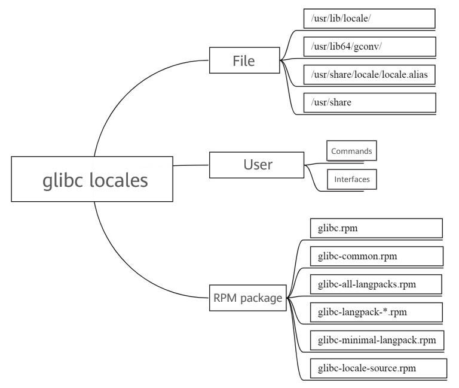
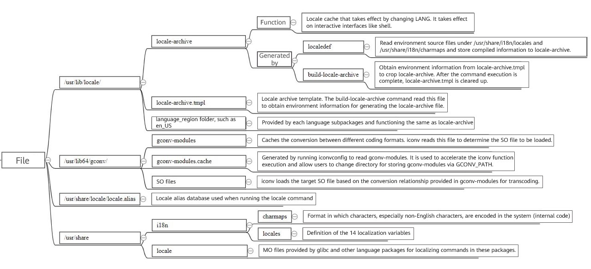
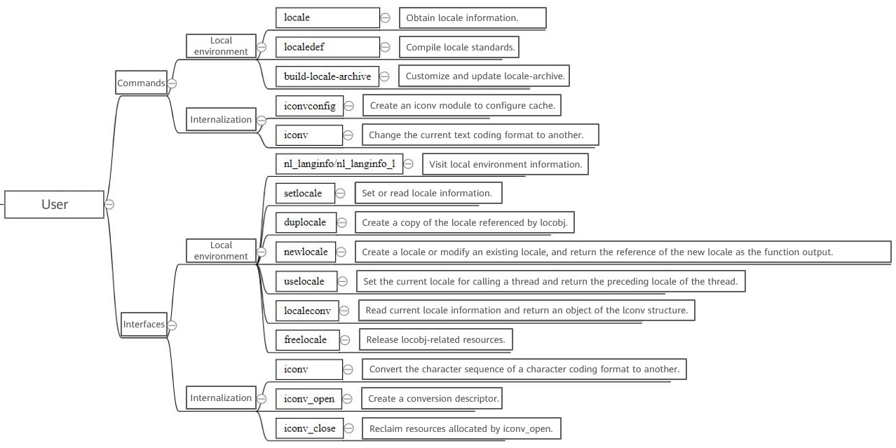
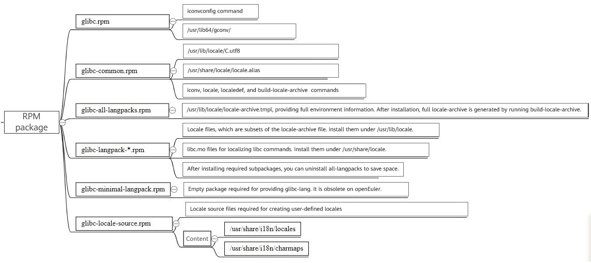

# 1 Overview
In the IBM community, there was a post named "Internationalization and Localization Mechanism of glibc and Linux." With reference to this post, this document describes how to use glibc locales based on files provided by openEuler glibc and its subpackages.  
The software information is as follows:

| <div style="width: 30pt">Item</div> | <div style="width: 150pt">Version</div>                |
| :------------------------------------:| :------------------------------------------------------: |
| <div style="width: 30pt">OS</div>     | <div style="width: 150pt">openEuler 20.03 (LTS)</div>    |
| <div style="width: 30pt">Kernel</div>| <div style="width: 150pt">4.19.90-2003.4.0.0036.oe1</div>|
| <div style="width: 30pt">glibc</div>  | <div style="width: 150pt">2.28</div>                     |
| <div style="width: 30pt">GCC</div>    | <div style="width: 150pt">7.3.0</div>                    |
<br>

# 2 Functions
This section describes the functions from aspects of file, user, and RPM package, as shown in the following figure.  
<center></center>
<br>

## 2.1 File
The functions of each module from this aspect are as follows:  
<center></center>
<br>

## 2.2 User
The functions of each module from this aspect are as follows:  
<center></center>
<br>

## 2.3 RPM Package
The functions of each module from this aspect are as follows:  
<center></center>
<br>

<br>

# 3 Common Functions
## 3.1 Localization
Generally, a locale is the presentation of the local interaction environment. In other words, a locale is the language and organization format of the shell. The following provides some examples.
<br>

### 3.1.1 Locales and Language Subpackages
Run the **locale** command:
```
$ locale
LANG=en_US.UTF-8
LC_CTYPE="en_US.UTF-8"
LC_NUMERIC="en_US.UTF-8"
LC_TIME="en_US.UTF-8"
LC_COLLATE="en_US.UTF-8"
LC_MONETARY="en_US.UTF-8"
LC_MESSAGES="en_US.UTF-8"
LC_PAPER="en_US.UTF-8"
LC_NAME="en_US.UTF-8"
LC_ADDRESS="en_US.UTF-8"
LC_TELEPHONE="en_US.UTF-8"
LC_MEASUREMENT="en_US.UTF-8"
LC_IDENTIFICATION="en_US.UTF-8"
LC_ALL=en_US.UTF-8
```

It shows that a locale is divided into 12 categories according to cultural conventions. The 12 categories are as follows:
```
1. Characters and classification (LC_CTYPE)
2. Number (LC_NUMERIC)
3. Comparison and sorting habits (LC_COLLATE)
4. Time format (LC_TIME)
5. Currency unit (LC_MONETARY)
6. Messages including prompts, errors, status, titles, labels, buttons, and menus (LC_MESSAGES)
7. Name format (LC_NAME)
8. Address format (LC_ADDRESS)
9. Phone number format (LC_TELEPHONE)
10. Measurement (LC_MEASUREMENT)
11. Default paper size (LC_PAPER)
12. Locale information (LC_IDENTIFICATION)
```

Therefore, locale refers to the language habits, cultural traditions, and lifestyle of people in a certain region. The locale of a region is defined based on these categories. The locale definition files are stored in **/usr/share/i18n/locales**. For example, **en_US**, **zh_CN**, and **de_DE@euro** are definition files of various locales.

You can change the locale by modifying the environment variable. For example:
```
# echo $LANG
en_US.UTF-8
# LANG="zh_CN.UTF-8"

```
After modifying the **LANG** environment variable, run the **date** command.
```
# date
2021年 03月 09日 星期二 11:11:02 CST
```

The locale is successfully changed to Chinese. However, if you run a **--help** (for example, **iconv --help**) command, the output is still in English. Why?
```
# iconv --help 
Usage: iconv [OPTION...] [FILE...]
Convert encoding of given files from one encoding to another.

 Input/Output format specification:
  -f, --from-code=NAME       encoding of original text
  -t, --to-code=NAME         encoding for output

 Information:
  -l, --list                 list all known coded character sets

 Output control:
  -c                         omit invalid characters from output
  -o, --output=FILE          output file
  -s, --silent               suppress warnings
      --verbose              print progress information

  -?, --help                 Give this help list
      --usage                Give a short usage message
  -V, --version              Print program version

Mandatory or optional arguments to long options are also mandatory or optional
for any corresponding short options.

For bug reporting instructions, please see:
<http://www.gnu.org/software/libc/bugs.html>.
```
In this case, a glibc language subpackage is required. Specifically, you need to install the **glibc-langpack-zh** subpackage. Decompress the package to check the content.
```
.
└── usr
    ├── lib
    │    └── locale
    └── share
         └── locale
```

**/usr/lib/locale** is the directory where the **locale-archive** file is stored. As mentioned in the figure in section 2.1, the files in the **language_region** folder provided by each language subpackage overlap with the **locale-archive** file in **/usr/lib/locale**.
<br>

**/usr/share/locale** contains an MO file named **libc**. As a basic library, glibc provides the **libc.so** file, and the **iconv** command you just executed is actually provided by glibc. Therefore, glibc command localization takes effect only after the corresponding language package is installed. The same applies to other commands. Generally, the MO file is provided with commands in an RPM package. For example, the **date** command is provided by the **coreutils** package. You can run the **rpm -ql** command to list the files provided by the **coreutils** package. The output shows that the **coreutils** package provides the MO files required for localization. Therefore, after the current environment information is modified via **LANG**, the **date** command output is displayed in the target language.
```
# rpm -ql coreutils | grep mo
...
/usr/share/locale/zh_CN/LC_MESSAGES/coreutils.mo
/usr/share/locale/zh_CN/LC_TIME/coreutils.mo
...
```
<br>

Install the **glibc-langpack-zh** package and run **iconv --help** again. The output is in Chinese.
```
# iconv --help 
用法： iconv [选项...] [文件...]
转换给定文件的编码。

 输入/输出格式规范：
  -f, --from-code=名称     原始文本编码
  -t, --to-code=名称       输出编码

 信息：
  -l, --list                 列举所有已知的字符集

 输出控制：
  -c                         从输出中忽略无效的字符
  -o, --output=文件        输出文件
  -s, --silent               关闭警告
      --verbose              打印进度信息

  -?, --help                 给出此帮助列表
      --usage                给出简要的用法信息
  -V, --version              打印程序版本号

长选项的强制或可选参数对对应的短选项也是强制或可选的。

要知道错误报告指令，请参看：
<http://www.gnu.org/software/libc/bugs.html>。
```
<br>

In short, the **/usr/share/locale** directory contains folders to store MO files for localizing the packages, including glibc. The MO files in each folder are provided by the corresponding RPM package. Command localization is implemented by using the **LANG** environment variable.
<br><br>

### 3.1.2 locale-archive
You may wonder: What is locale-archive? Can I delete it? Can I crop it? I have been searching for the definition of locale-archive on the Internet for a long time, but no proper definition is found. So, I try to define it as follows: locale-archive is a local cache provided by glibc of Fedora Linux. The full locale-archive is functionally equivalent to the collection of files in the **/usr/lib/locale/** directory provided by all language subpackages.
<br>

For example, what will happen if we move **locale-archive** using the **mv** command and then modify **LANG**?
```
# pwd
/usr/lib/locale
# mv locale-archive bak
# LANG="zh_CN.UTF-8"
# date 
Wed Mar 10 09:21:27 CST 2021
```
As shown in the output, the modification does not take effect. What if we install the **glibc-langpack-zh** subpackage and then modify **LANG**?
```
# date
2021年 03月 10日 星期三 09:22:59 CST
```
The modification takes effect. What if we uninstall the Chinese subpackage, move **locale-archive** back, and then modify **LANG**?
```
# pwd
/usr/lib/locale
# mv bak locale-archive
# LANG="zh_CN.UTF-8"
# date 
2021年 03月 10日 星期三 09:24:17 CST
```

The modification also takes effect. Now, the answer is clear. In fact, the **glibc.spec** file states that when you install the required language subpackage, you can uninstall the **all-langpacks** package, that is, delete the **locale-archive** file to save space.
```
glibc.spec

# The glibc-all-langpacks provides the virtual glibc-langpack,
# and thus satisfies glibc's requirement for installed locales.
# Users can add one more other langauge packs and then eventually
# uninstall all-langpacks to save space.
%package all-langpacks
Summary: All language packs for %{name}.
Requires: %{name} = %{version}-%{release}
Requires: %{name}-common = %{version}-%{release}
Provides: %{name}-langpack = %{version}-%{release}
%description all-langpacks
```
<br>

The following describes how to crop **locale-archive**:
1. List all locales in the current environment.
```
# localedef --list-archive
```
2. Specify the locale to be cropped.
```
# localedef --delete-from-archive [to_be_cropped_locale]
```
3. Use the current **locale-archive** file to overwrite the **locale-archive.tmpl** file.
```
# mv /usr/lib/locale/locale-archive /usr/lib/locale/locale-archive.tmpl
```
4. Regenerate **locale-archive**.
```
# build-locale-archive
```
<br> 

For example, remove non-English support.
```
# localedef --list-archive | grep -v -i ^en | xargs localedef --delete-from-archive
# mv /usr/lib/locale/locale-archive /usr/lib/locale/locale-archive.tmpl
# build-locale-archive
```
Note: After the **build-locale-archive** command is executed, SSH disconnection may occur. In this case, rebuild the SSH connection.
<br><br>

## 3.2 Internationalization
Internationalization means that a piece of program or software can be used by a specific group of people without modifying or recompiling the source code. glibc provides two related commands (**iconv** and **iconvconfig**) and three interfaces (**iconv_open**, **iconv**, and **iconv_close**). For details, see the Linux manual page. As for using files in the **/usr/lib64/gconv/** directory (or **/usr/lib/gconv**), invoke the **iconv** interface to use the **gconv-modules.cache** file (generated by running the **iconvconfig** command to read the **gconv-modules** file) to load the corresponding .so file for transcoding.
<br><br>

# 4 References
1. Internationalization and Localization Mechanism of Linux
[https://cutt.ly/KzjZUxW](https://cutt.ly/KzjZUxW)

2. Introduction to Character Encoding and iconv
[https://www.cnblogs.com/qingergege/p/7491590.html](https://www.cnblogs.com/qingergege/p/7491590.html)

3. locale localedef: Understanding the Linux Character Set
[https://www.cnblogs.com/wn1m/p/10837609.html](https://www.cnblogs.com/wn1m/p/10837609.html)

4. Setting Linux Locales
[http://www.360doc.com/content/15/1105/08/14513665_510854234.shtml](http://www.360doc.com/content/15/1105/08/14513665_510854234.shtml)

5. Settings of Locale and Differences Between the Environment Variables LANG, LC_ALL, and LANGUAGE
[https://cutt.ly/DzjXdvr](https://cutt.ly/DzjXdvr)

6. gconv-modules Format and iconv Implementation
[https://cutt.ly/5zjXoOr](https://cutt.ly/5zjXoOr)
<br><br>
