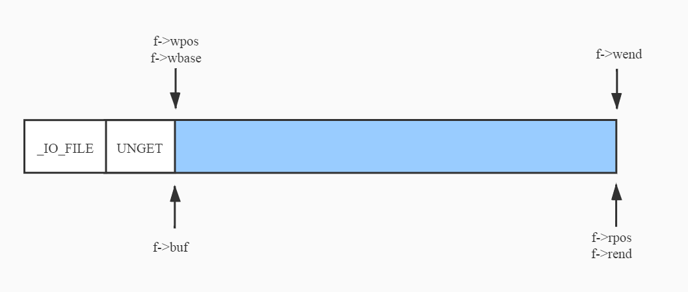

# About This Document
musl is a C standard library intended for OSs built on the Linux kernel. It contains the interfaces defined in POSIX and mainstream extensions. Compared with glibc, musl is faster, simpler, and more lightweight and protocol-friendly. This document uses the fopen series interfaces of musl to describe basic operations on files based on musl source code.  

# Data Structures
The following shows the key data structure of a file involving musl. The structure is FILE. This document focuses on four function pointers (close, read, write, and seek) and five position pointers (rpos and rend for read and wend, wpos, and wbase for write.)  
```
struct _IO_FILE {
	unsigned flags;
	unsigned char *rpos, *rend;
	int (*close)(FILE *);
	unsigned char *wend, *wpos;
	unsigned char *mustbezero_1;
	unsigned char *wbase;
	size_t (*read)(FILE *, unsigned char *, size_t);
	size_t (*write)(FILE *, const unsigned char *, size_t);
	off_t (*seek)(FILE *, off_t, int);
	unsigned char *buf;
	size_t buf_size;
	FILE *prev, *next;
	int fd;
	int pipe_pid;
	long lockcount;
	int mode;
	volatile int lock;
	int lbf;
	void *cookie;
	off_t off;
	char *getln_buf;
	void *mustbezero_2;
	unsigned char *shend;
	off_t shlim, shcnt;
	FILE *prev_locked, *next_locked;
	struct __locale_struct *locale;
};
```


# Interfaces
## fopen
The fopen source code is as follows. This interface first determines the file opening mode and uses the open system call to obtain a file descriptor (FD) from the kernel. Then, it encapsulates the FD into a FILE using the __fdopen function before mounting the default functions on the four function pointers (close, read, write, and seek).  
The following figure shows the initial status of the FILE structure. The first part is the main body of FILE; the second part is a reserved area **UNGET** for non-buffering scenarios (8 bytes by default); and the third displays the buffer reserved by musl (1024 bytes by default).  

```
FILE *fopen(const char *restrict filename, const char *restrict mode)
{
	FILE *f;
	int fd;
	int flags;

	/* Check for valid initial mode character */
	if (!strchr("rwa", *mode)) {
		errno = EINVAL;
		return 0;
	}

	/* Compute the flags to pass to open() */
	flags = __fmodeflags(mode);

	fd = sys_open(filename, flags, 0666);
	if (fd < 0) return 0;
	if (flags & O_CLOEXEC)
		__syscall(SYS_fcntl, fd, F_SETFD, FD_CLOEXEC);

	f = __fdopen(fd, mode);
	if (f) return f;

	__syscall(SYS_close, fd);
	return 0;
}

...

FILE *__fdopen(int fd, const char *mode)
{
	...

	/* Allocate FILE+buffer or fail */
	if (!(f=malloc(sizeof *f + UNGET + BUFSIZ))) return 0;

	/* Zero-fill only the struct, not the buffer */
	memset(f, 0, sizeof *f);

	...

	f->fd = fd;
	f->buf = (unsigned char *)f + sizeof *f + UNGET;
	f->buf_size = BUFSIZ;

	...

	/* Initialize op ptrs. No problem if some are unneeded. */
	f->read = __stdio_read;
	f->write = __stdio_write;
	f->seek = __stdio_seek;
	f->close = __stdio_close;

	...

}
```
<br><br>

<center></center>
<br><br>

## fclose
The fclose source code is as follows (only key steps are presented). This interface flushes data from the write buffer to the file and calls the close function __stdio_close using **f->close(f)**. It then closes the file corresponding to the FD by using system calls before releasing externally encapsulated data structures.  
```
int fclose(FILE *f)
{
	int r;
	
	FLOCK(f);
	r = fflush(f);
	r |= f->close(f);
	FUNLOCK(f);

	...

	free(f->getln_buf);
	free(f);

	return r;
}

...

int __stdio_close(FILE *f)
{
	return syscall(SYS_close, __aio_close(f->fd));
}
```


## fread
The fread interface calls the read pointer function (a member in _IO_FILE) that is initialized during the fopen phase. The source code of this function is as follows. This process is used to read data whose length is *len* to the user buffer and preread a part of the data to the FILE buffer.  
Based on the initialization of the iov structure array, the first element is the user buffer, and the second is the FILE buffer. That is, the data is read to the user buffer first and then to the FILE buffer. The data that is read to the FILE buffer is less than or equal to 1023 bytes by default.  
The reason it is not 1024 bytes is because the start address length of the first element of the iov structure array is subtracted by 1. That is, iov reads a maximum of *len* – 1 elements. The last element is placed in iov[1] and reassigned to buf[len – 1] at the end. In this way, the rpos pointer is offset by one byte, indicating that there is preread data in the FILE buffer. The following figure shows the pointers after the preread operation (the three pointers related to the write operation are null).  

<center></center>
<br><br>

```
size_t __stdio_read(FILE *f, unsigned char *buf, size_t len)
{
	struct iovec iov[2] = {
		{ .iov_base = buf, .iov_len = len - !!f->buf_size },
		{ .iov_base = f->buf, .iov_len = f->buf_size }
	};
	ssize_t cnt;

	cnt = iov[0].iov_len ? syscall(SYS_readv, f->fd, iov, 2)
		: syscall(SYS_read, f->fd, iov[1].iov_base, iov[1].iov_len);
	if (cnt <= 0) {
		f->flags |= cnt ? F_ERR : F_EOF;
		return 0;
	}
	if (cnt <= iov[0].iov_len) return cnt;
	cnt -= iov[0].iov_len;
	f->rpos = f->buf;
	f->rend = f->buf + cnt;
	if (f->buf_size) buf[len-1] = *f->rpos++;
	return len;
}
```


The source code of the fread interface is as follows. As mentioned, the __stdio_read function prereads data. fread reads data from the FILE buffer by calling the memcpy function first. If insufficient, it then calls __stdio_read to read data from the file.  
```
size_t fread(void *restrict destv, size_t size, size_t nmemb, FILE *restrict f)
{
	unsigned char *dest = destv;
	size_t len = size*nmemb, l = len, k;
	if (!size) nmemb = 0;

	FLOCK(f);

	f->mode |= f->mode-1;

	if (f->rpos != f->rend) {
		/* First exhaust the buffer. */
		k = MIN(f->rend - f->rpos, l);
		memcpy(dest, f->rpos, k);
		f->rpos += k;
		dest += k;
		l -= k;
	}
	
	/* Read the remainder directly */
	for (; l; l-=k, dest+=k) {
		k = __toread(f) ? 0 : f->read(f, dest, l);
		if (!k) {
			FUNLOCK(f);
			return (len-l)/size;
		}
	}

	FUNLOCK(f);
	return nmemb;
}
```

fread calls the __toread function before calling __stdio_read. The following shows the source code of __toread. This function serves as the switch between the read and write modes. Because the read and write operations share the same buffer, if the previous operation is write, data in the write buffer needs to be flushed to the file and the three write-related pointers need to be cleared before the read operation is performed. In addition, the __toread function is used to check whether the file is readable.  
```
int __toread(FILE *f)
{
	f->mode |= f->mode-1;
	if (f->wpos != f->wbase) f->write(f, 0, 0);
	f->wpos = f->wbase = f->wend = 0;
	if (f->flags & F_NORD) {
		f->flags |= F_ERR;
		return EOF;
	}
	f->rpos = f->rend = f->buf + f->buf_size;
	return (f->flags & F_EOF) ? EOF : 0;
}
```

## fwrite
This section analyzes the source code of the __stdio_write function, which is used to write data in the user buffer to the FILE buffer. After the FILE buffer is full, the data is written to the file. Compared with __stdio_read, __stdio_write is simpler. The following figure shows the positions of the FILE pointers when an __stdio_write operation is complete and the FILE buffer is not full.  
```
size_t __stdio_write(FILE *f, const unsigned char *buf, size_t len)
{
	struct iovec iovs[2] = {
		{ .iov_base = f->wbase, .iov_len = f->wpos-f->wbase },
		{ .iov_base = (void *)buf, .iov_len = len }
	};
	struct iovec *iov = iovs;
	size_t rem = iov[0].iov_len + iov[1].iov_len;
	int iovcnt = 2;
	ssize_t cnt;
	for (;;) {
		cnt = syscall(SYS_writev, f->fd, iov, iovcnt);
		if (cnt == rem) {
			f->wend = f->buf + f->buf_size;
			f->wpos = f->wbase = f->buf;
			return len;
		}
		if (cnt < 0) {
			f->wpos = f->wbase = f->wend = 0;
			f->flags |= F_ERR;
			return iovcnt == 2 ? 0 : len-iov[0].iov_len;
		}
		rem -= cnt;
		if (cnt > iov[0].iov_len) {
			cnt -= iov[0].iov_len;
			iov++; iovcnt--;
		}
		iov[0].iov_base = (char *)iov[0].iov_base + cnt;
		iov[0].iov_len -= cnt;
	}
}
```
<br><br>

<center></center>
<br><br>
Next shows the source code of the fwrite interface. __towrite can also be used to switch between the read and write modes. If the remaining space of the write buffer is insufficient, fwrite calls the __stdio_write function. If the buffer space is sufficient, data is directly written to the buffer by calling memcpy.  

```
size_t __fwritex(const unsigned char *restrict s, size_t l, FILE *restrict f)
{
	size_t i=0;

	if (!f->wend && __towrite(f)) return 0;

	if (l > f->wend - f->wpos) return f->write(f, s, l);

	if (f->lbf >= 0) {
		/* Match /^(.*\n|)/ */
		for (i=l; i && s[i-1] != '\n'; i--);
		if (i) {
			size_t n = f->write(f, s, i);
			if (n < i) return n;
			s += i;
			l -= i;
		}
	}

	memcpy(f->wpos, s, l);
	f->wpos += l;
	return l+i;
}

size_t fwrite(const void *restrict src, size_t size, size_t nmemb, FILE *restrict f)
{
	size_t k, l = size*nmemb;
	if (!size) nmemb = 0;
	FLOCK(f);
	k = __fwritex(src, l, f);
	FUNLOCK(f);
	return k==l ? nmemb : k/size;
}
```

Conversely, __towrite is used to switch to the write operation. The source code is as follows. The following includes a bug, which will be described in detail in the following section.
```
int __towrite(FILE *f)
{
	f->mode |= f->mode-1;
	if (f->flags & F_NOWR) {
		f->flags |= F_ERR;
		return EOF;
	}
	/* Clear read buffer (easier than summoning nasal demons) */
	f->rpos = f->rend = 0;

	/* Activate write through the buffer. */
	f->wpos = f->wbase = f->buf;
	f->wend = f->buf + f->buf_size;

	return 0;
}
```

# Weaknesses
By comparing the source code of __towrite and __toread, you can see that they are not symmetric. Specifically, __toread flushes data in the write buffer to the file through **f->write(f, 0, 0)** before switching to the read mode. However, __towrite clears read-related pointers (rpos and rend) before switching to the write mode. To note the differences, let's see the following operations:  

|<div style="width: 30pt">Step</div>  |<div style="width: 50pt">Action</div>    |<div style="width: 50pt">Expected Position</div> |<div style="width: 50pt">Actual Position</div> |
|:------------------------------------:|:--------------------------------------:|:--------------------------------------:|:--------------------------------------:|
|<div style="width: 30pt">1</div>      |<div style="width: 50pt">Write 30 bytes.</div>    |<div style="width: 50pt">30</div>       |<div style="width: 50pt">30</div>       |
|<div style="width: 30pt">2</div>      |<div style="width: 50pt">Return to the beginning.</div>|<div style="width: 50pt">0</div>        |<div style="width: 50pt">0</div>        |
|<div style="width: 30pt">3</div>      |<div style="width: 50pt">Read 15 bytes.</div>    |<div style="width: 50pt">15</div>       |<div style="width: 50pt">15</div>       |
|<div style="width: 30pt">4</div>      |<div style="width: 50pt">Write 15 bytes.</div>    |<div style="width: 50pt">30</div>       |<div style="width: 50pt">45</div>       |


If you use fgetpos to obtain the position of the current file pointer after step 4 is complete, you can see that the actual position is **45** instead of the expected position **30**. The last 15 bytes of the file are expected to be overwritten in step 4. However, 15 bytes are directly added, and the actual position becomes **45**. Why?
As mentioned, the fread interface prereads some data. Therefore, when reading 15 bytes of data in step 3, it actually reads 30 bytes, that is, the entire file. The following code shows why the result of step 3 is correct:  

```
off_t __ftello_unlocked(FILE *f)
{
	off_t pos = f->seek(f, 0,
		(f->flags & F_APP) && f->wpos != f->wbase
		? SEEK_END : SEEK_CUR);
	if (pos < 0) return pos;

	/* Adjust for data in buffer. */
	if (f->rend)
		pos += f->rpos - f->rend;
	else if (f->wbase)
		pos += f->wpos - f->wbase;
	return pos;
}
```

fgetpos calls the __ftello_unlocked function to obtain the file's real position from the kernel through system calls, and then performs correction. Specifically, the read operation is performed in step 3, and therefore the rend pointer is not null. ftello_unlocked subtracts data that is preread. Therefore, no error occurs in step 3. However, in step 4, the towrite function clears the read pointers, and the 15 bytes of data is directly placed in the FILE buffer. During the next read operation, the 15 bytes of data is directly added to the end of the file.  
To solve this problem, move back to the position before the preread phase and before __towrite clears the read pointers.  

# Summary
This document analyzes the implementation of fopen series interfaces based on the musl source code. Compared with glibc, musl source code is simpler, but still contains imperfections. For more information, see the following recommended articles.  

# Recommended Articles
**glibc malloc series articles**  
Principle analysis:  
[https://www.openeuler.org/zh/blog/wangshuo/glibc+malloc%E5%8E%9F%E7%90%86%E7%AE%80%E6%9E%90/glibc+malloc%E5%8E%9F%E7%90%86%E7%AE%80%E6%9E%90.html](https://www.openeuler.org/zh/blog/wangshuo/glibc+malloc%E5%8E%9F%E7%90%86%E7%AE%80%E6%9E%90/glibc+malloc%E5%8E%9F%E7%90%86%E7%AE%80%E6%9E%90.html)  
Data structure:  
[https://www.openeuler.org/zh/blog/wangshuo/glibc+malloc%E6%BA%90%E7%A0%81%E7%AE%80%E6%9E%90.html](https://www.openeuler.org/zh/blog/wangshuo/glibc+malloc%E6%BA%90%E7%A0%81%E7%AE%80%E6%9E%90.html)  
malloc:  
[https://www.openeuler.org/zh/blog/wangshuo/glibc+malloc%E6%BA%90%E7%A0%81%E7%AE%80%E6%9E%90(%E4%BA%8C).html](https://www.openeuler.org/zh/blog/wangshuo/glibc+malloc%E6%BA%90%E7%A0%81%E7%AE%80%E6%9E%90(%E4%BA%8C).html)  
free:  
[https://www.openeuler.org/zh/blog/wangshuo/glibc+malloc%E6%BA%90%E7%A0%81%E7%AE%80%E6%9E%90(%E4%B8%89).html](https://www.openeuler.org/zh/blog/wangshuo/glibc+malloc%E6%BA%90%E7%A0%81%E7%AE%80%E6%9E%90(%E4%B8%89).html)  

**Articles about glibc fault locating and analysis**  
Analysis of the VM performance deterioration when running memcpy to copy 1,000 bytes in the x86_64 environment:  
[https://www.openeuler.org/zh/blog/wangshuo/memcpy_1k%E5%AD%97%E8%8A%82x86_64%E8%99%9A%E6%8B%9F%E6%9C%BA%E6%80%A7%E8%83%BD%E4%B8%8B%E9%99%8D%E5%88%86%E6%9E%90.html](https://www.openeuler.org/zh/blog/wangshuo/memcpy_1k%E5%AD%97%E8%8A%82x86_64%E8%99%9A%E6%8B%9F%E6%9C%BA%E6%80%A7%E8%83%BD%E4%B8%8B%E9%99%8D%E5%88%86%E6%9E%90.html)  
Call stack fault analysis:  
[https://www.openeuler.org/zh/blog/wangshuo/glibc%E9%97%AE%E9%A2%98%E5%AE%9A%E4%BD%8D--%E6%8E%A8%E6%A0%88%E9%97%AE%E9%A2%98%E5%88%86%E6%9E%90.html](https://www.openeuler.org/zh/blog/wangshuo/glibc%E9%97%AE%E9%A2%98%E5%AE%9A%E4%BD%8D--%E6%8E%A8%E6%A0%88%E9%97%AE%E9%A2%98%E5%88%86%E6%9E%90.html)  
glibc locale usage:  
[https://www.openeuler.org/zh/blog/wangshuo/glibc%20locale%E4%BD%BF%E7%94%A8%E7%AE%80%E6%9E%90/glibc+locale%E4%BD%BF%E7%94%A8%E7%AE%80%E6%9E%90.html](https://www.openeuler.org/zh/blog/wangshuo/glibc%20locale%E4%BD%BF%E7%94%A8%E7%AE%80%E6%9E%90/glibc+locale%E4%BD%BF%E7%94%A8%E7%AE%80%E6%9E%90.html) 