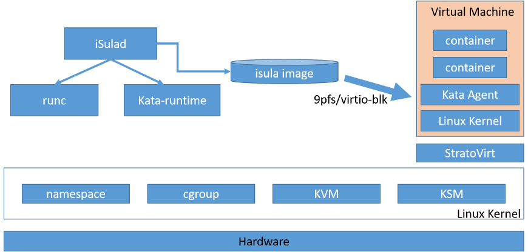

## Background

As a virtualization platform, StratoVirt uses a unified architecture to support three scenarios: virtual machines (VMs), containers, and serverless computing. StratoVirt has competitive advantages in virtualization security and lightweight overhead. This article describes how to use StratoVirt to run a virtual machine and how to run a secure container after the container connects to the iSulad container engine.

## Software and Hardware Requirements

### Minimum Hardware Requirements

- Processor architecture: Only AArch64 and x86\_64 processor architectures are supported. AArch64 requires ARMv8 or later and supports virtualization extension. x86\_64 supports VT-x.
- 2-core CPU
- 4 GiB memory
- 16 GiB available disk space

### Software

Operating system: openEuler 20.09 or later

## Installing StratoVirt

You can install StratoVirt in either of the following ways: 

If you only want to use StratoVirt to run a VM, you are advised to install the RPM package with Yum. You only need to install [openEuler 20.09][1] or later on a platform that meets the minimum hardware requirements and configure the openEuler Yum repository. Then, you can run the yum command to install the package.

If you want to learn more about StratoVirt. The way to compile and install is more suitable for you. As an open source project, our StratoVirt source code is stored on the [Gitee][2] platform. You can download the source code, understand its architecture, and even modify the code.

### Installing the RPM Package with Yum

Step 1: Run the **yum** command to install the tool.

```
[root@openeuler \~]# yum install -y stratovirt
```

Note: Before the installation, ensure that the openEuler Yum repository has been configured.

### Compiling and Installing StratoVirt

Step 1: Prepare the environment. Ensure that the Rust language environment and Cargo software have been installed successfully.

For details about how to install Rust, visit [https://www.rust-lang.org/tools/install][3].

Step 2: Compile the software.

```
[root@openeuler \~]# git clone https://gitee.com/openeuler/stratovirt.git
[root@openeuler \~]# cd stratovirt
[root@openeuler \~]# cargo build --release
```

The generated binary file is stored in the **target/release/stratovirt** directory.

## Running VMs on StratoVirt

Step 1: Prepare devices and tools.

```
[root@openeuler \~]# modprobe vhost\_vsock
[root@openeuler \~]# yum install nmap
```

Step 2: Create a PE kernel image.

```
[root@openeuler \~]# yum install git; yum install gcc; yum install make; yum install bison; yum install flex
[root@openeuler \~]# cd /home; git clone https://gitee.com/openeuler/kernel
[root@openeuler \~]# cd kernel; git checkout kernel-4.19
[root@openeuler \~]# cd /home; git clone https://gitee.com/openeuler/stratovirt.git
[root@openeuler \~]# cp stratovirt/docs/kernel\_config/config\_openeuler\_4.19\_aarch64 kernel/.config
[root@openeuler \~]# cd kernel; make –j vmlinux; objcopy -O binary vmlinux vmlinux.bin
```

**/home/kernel/vmlinux.bin** is the created kernel image.

Note: If the x86\_64 processor architecture is used, copy **stratovirt/docs/kernel\_config/config\_openeuler\_4.19\_x86\_64** to the kernel directory and rename it **.config**.

Step 3: Create a rootfs image in EXT4 format.

```
[root@openeuler \~]# cd /home
[root@openeuler \~]# dd if=/dev/zero of=./rootfs bs=1G count=5
[root@openeuler \~]# mkfs.ext4 ./rootfs
[root@openeuler \~]# mkdir /mnt/rootfs; mount /home/rootfs /mnt/rootfs
[root@openeuler \~]# cd /mnt/rootfs
[root@openeuler \~]# wget http://dl-cdn.alpinelinux.org/alpine/latest-stable/releases/aarch64/alpine-minirootfs-3.12.0-aarch64.tar.gz
[root@openeuler \~]# tar -zxvf alpine-minirootfs-3.12.0-aarch64.tar.gz; rm alpine-minirootfs-3.12.0-aarch64.tar.gz
[root@openeuler \~]# rm sbin/init; touch sbin/init && cat \> sbin/init \<\<EOF
# ! /bin/sh
mount -t devtmpfs dev /dev
mount -t proc proc /proc
mount -t sysfs sysfs /sys
ip link set up dev lo
exec /sbin/getty -n -l /bin/sh 115200 /dev/ttyS0
poweroff -f
EOF
[root@openeuler \~]# chmod +x sbin/init
[root@openeuler \~]# cd /home; umount /mnt/rootfs
```

**/home/rootfs** is the created rootfs image.

Note: To obtain the latest alpine-mini rootfs of the x86\_64 processor architecture, run the following commands:

```
[root@openeuler \~]# wget http://dl-cdn.alpinelinux.org/alpine/latest-stable/releases/x86\_64/alpine-minirootfs-3.12.0-x86\_64.tar.gz
[root@openeuler \~]# tar -zxvf alpine-minirootfs-3.12.0-x86\_64.tar.gz
[root@openeuler \~]# rm alpine-minirootfs-3.12.0-x86\_64.tar.gz
```

Step 4: Run the **stratovirt** command to run the VM.

```
[root@openeuler \~]# rm /tmp/stratovirt.socket
[root@openeuler \~]# stratovirt -kernel /home/kernel/vmlinux.bin -append console=ttyS0 root=/dev/vda rw reboot=k panic=1 -drive file=/home/rootfs,id=rootfs -api-channel unix:/tmp/stratovirt.socket -serial stdio
```

After the VM is started, the serial port logs of the kernel startup is displayed on the terminal, indicating that the VM is started successfully. The following is part of the VM startup logs:

```
[    0.000000] Booting Linux on physical CPU 0x0000000000 [0x481fd010]
[    0.000000] Linux version 4.19.152+ (root@localhost.localdomain) (gcc version (GCC)) #1 SMP Fri Oct 23 14:56:45 CST 2020
[    0.000000] Machine model: linux,dummy-virt
[    0.000000] earlycon: uart0 at MMIO 0x0000000040009000 (options '')
[    0.000000] bootconsole [uart0] enabled
...
...
[    0.113561] Freeing unused kernel memory: 576K
[    0.113957] Run /sbin/init as init process
/ \#
```

Note: For compilation and installation, use the binary file **stratovirt** in the corresponding path to run the VM.

## Interconnecting with iSulad to Run Secure Containers

iSulad is a container engine that is light, flexible, smart, and fast. You can click [here][4] to learn more. What is a secure container? To put it simply, a secure container is a lightweight, executable software package that has been isolated from other software or processes running on the same virtual or physical host.

The following figure shows the architecture of a secure container.



The containers shown in the preceding figure run on independent VMs. StratoVirt provides secure isolation at the virtualization layer. We will use the iSulad container engine, kata containers runtime, and StratoVirt virtualization platform to run a secure container. If you want to run secure containers on other openEuler versions or Linux platforms, you can find the corresponding method at [bilibili](https://space.bilibili.com/527064077/search/video?keyword=%E5%A6%82%E4%BD%95%E5%AE%89%E8%A3%85%E5%B9%B6%E4%BD%BF%E7%94%A8).

### Making Preparations

Step 1: Prepare devices and tools.

```
[root@openeuler \~]# modprobe vhost\_vsock
[root@openeuler \~]# yum install nmap
```

Step 2: Install iSulad and kata-containers.

```
[root@openeuler \~]# yum install iSulad; yum install kata-containers
```

Step 3: Add iSulad runtime.

```
[root@openeuler \~]# vi /etc/isulad/daemon.json     // Add the following content to the runtimes node:
"kata-runtime": {
	"path": "/usr/bin/kata-runtime"
}
```

Step 4: Configure the storage.

```
[root@openeuler \~]# dd if=/dev/zero of=/home/isula\_images bs=1G count=10
[root@openeuler \~]# losetup /dev/loop1 /home/isula\_images
[root@openeuler \~]# pvcreate /dev/loop1
[root@openeuler \~]# vgcreate isulaVG0 /dev/loop1
[root@openeuler \~]# lvcreate --wipesignatures y -n thinpool isulaVG0 -l 95%VG
[root@openeuler \~]# lvcreate --wipesignatures y -n thinpoolmeta isulaVG0 -l 1%VG
[root@openeuler \~]# lvconvert -y --zero n -c 512K --thinpool isulaVG0/thinpool --poolmetadata isulaVG0/thinpoolmeta
[root@openeuler \~]# vi /etc/lvm/profile/isulaVG0-thinpool.profile  // Add the following content:
activation {
	thin_pool_autoextend_threshold=80
	thin_pool_autoextend_percent=20
}
[root@openeuler \~]# vi /etc/isulad/daemon.json   // Change the values of storage-driver and storage-opts to the following:
"storage-driver": "devicemapper",
"storage-opts": [
	"dm.thinpooldev=/dev/mapper/isulaVG0-thinpool",
	"dm.fs=ext4",
	"dm.min_free_space=10%"
],
```

Step 5: Restart iSulad.

```
[root@openeuler \~]# systemctl daemon-reload; systemctl restart isulad
```

Run the **isula info** command. If the command output contains the following information, the isula storage driver has been configured successfully.

```
Storage Driver: devicemapper
```

### Configuring kata-containers

Step 1: Create a kernel image for kata-containers.

```
[root@openeuler ~]# cd /home
[root@openeuler ~]# git clone https://github.com/kata-containers/packaging.git
[root@openeuler ~]# cp packaging/kernel/configs/arm64_kata_kvm_4.19.x kernel/.config
[root@openeuler ~]# cd kernel; make –j vmlinux; objcopy -O binary vmlinux vmlinux.bin
[root@openeuler ~]# cp vmlinux.bin vmlinux_kata
```

Step 2: Modify the kata configuration.

```
[root@openeuler \~]# vi /usr/share/defaults/kata-containers/configuration.toml // Modify the following content:
[hypervisor.stratovirt]
path = "/home/stratovirt.sh"
kernel = "/home/kernel/vmlinux\_kata "
initrd = "/var/lib/kata/kata-containers-initrd.img"
block\_device\_driver = "virtio-mmio"
use\_vsock = true
enable\_netmon = false
internetworking\_model="none"
sandbox\_cgroup\_with\_emulator = false
```

### Running a Secure Container

Step 1: Create a running script.

```
[root@openeuler \~]# cat \> /home/stratovirt.sh \<\<EOF 

# !/bin/bash

export STRATOVIRT\_LOG\_LEVEL=info  # set log level which includes trace, debug, info, warn and error.
/usr/bin/stratovirt $@
EOF
[root@openeuler \~]# chmod +x /home/stratovirt.sh
```

Step 2: Run the container.

```
[root@openeuler \~]# isula run -tid --runtime=kata-runtime --net=none --name test busybox:latest sh
```

Run the **isula ps** command to check whether the secure container **test** is running properly. Then run the following command to access the container:

```
[root@openeuler \~]# isula exec –ti test sh
```


So far, the secure container runs successfully. You can operate the secure container in the same way as operating a regular container.

[1]:	https://www.openeuler.org/en/docs/20.09/docs/Installation/Installation.html
[2]:	https://gitee.com/openeuler/stratovirt
[3]:	https://www.rust-lang.org/tools/install
[4]:	https://docs.openeuler.org/en/docs/20.09/docs/Container/isulad-container-engine.html

