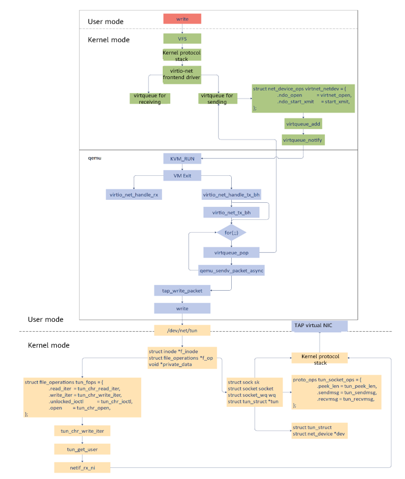

## Introduction

For conventional device simulation, a virtual machine (VM) cannot detect the device driver in the virtualization environment. Operations related to the network, storage, and I/O are directly performed by the VM kernel, QEMU, and the host kernel. This generates a lot of VM exits and entries, causing performance deterioration. However, virtio improves VM performance. In the virtio-net solution, the VM can detect its subset and load the virtio bus and device drivers.

The solution includes the front-end driver, back-end device, and virtio protocol. Serving as the frontend driver, the VM installs the virtio-net driver and loads the virtio-net backend device in QEMU, to receive the I/O requests from the frontend and parse the received data based on the transmission protocol. Then, QEMU controls the TAP device on a physical device to process requests and notify the frontend driver via the interrupt mechanism.

The following figure describes the process for sending the virtio-net network packet.



## virtio-net Backend

### Packet Receiving Process

When the NIC has data packets, the TAP device receives the packets first. In this case, the TAP device FD corresponding to virtio-net becomes readable. After detecting network data packets in epoll mode, QEMU invokes the callback function to receive the packets. The **virtio_net_receive** function copies the data to the receiving queue of the virtio NIC on the VM, and then inject an interrupt to the VM. In this way, the VM can detect the network data packets.

```c
qemu/hw/net/virtio-net.c
virtio_net_receive
	virtio_net_do_receive
		virtio_net_receive_rcu
```

The preceding code shows the function calling process of virtio-net. virtio-net calls the **virtio_net_receive_rcu** function to add network data packets to the virtio queue.

```c
virtio_net_receive_rcu {
    virtio_net_can_receive         // Determine whether virtio-net can receive packets based on the VM running status, as well as the queue and device status.
    virtio_net_has_buffers          // Check the buffer to avoid competition.
    receive_filter 		    // Filter network packets.
    
    while (offset < size) {
        elem = virtqueue_pop 	// Obtain a request from vring and transfer the information to the lem domain.
        len = iov_from_buf                // Copy packets to the buffer and write data to the guest physical address.
        virtqueue_fill                    // Update fields related to VRingAvail.ring[] after the data is written and the mapping is canceled.
    }
    
    virtqueue_flush           // Update idx of VRingUsed.ring to indicate that it can be reclaimed.
    virtio_notify                            // Inject an interrupt and notify the frontend VM.
}
```

### Packet Sending Process

The virtio NIC driver of the VM fills in the packets in the NIC buffer and writes the **queue notify** register. In this way, the VM returns to the **root** mode, and a VM exit is triggered and processed by the **virtio_mmio_write** thread of the QEMU vCPU.

```c
qemu/hw/net/virtio-net.c
virtio_net_add_queue
	virtio_net_handle_tx_bh
		qemu_bh_schedule
			virtio_net_tx_bh
				virtio_net_flush_tx
			virtio_queue_set_notification
```

In this step, **virtio_net_handle_tx_bh** is bound to **tx_vq**, and **qemu_bh_schedule** is called to run a specified function (**virtio_net_tx_bh** in this example). Finally, **virtio_net_flush_tx** is called to send packets.

```c
virtio_net_flush_tx
	for (;;) {
        elem = virtqueue_pop           // Obtain a request from vring.
        qemu_sendv_packet_async // Send packets from QEMU.
	}
```

During the execution of **virtio_net_flush_tx**, the packet elem is obtained and the TAP device FD is written. And then they are sent to the TAP device for transferring. The call chain for **qemu_sendv_packet_async** to send network packets is **qemu_sendv_packet_async** ->**qemu_net_queue_send_iov** ->**qemu_net_queue_flush** ->**qemu_net_queue_deliver**. The QEMU backend calls **tap_write_packet** -> **writev** to write data to the TAP character device.

In the driver of the kernel character device, **tun_chr_write_iter** is called to process network packets on the TCP/IP protocol stack.

### Device Creation

````c
virtio_net_class_init
	virtio_net_device_realize
	virtio_net_get_config
	virtio_net_get_features
	...
````

**virtio_net_device_realize** is called to initialize the virtio-net device.

```c
virtio_net_device_realize
	virtio_net_set_config_size
	virtio_init
	virtio_net_set_default_queue_size
	virtio_net_add_queue
	n->ctrl_vq = virtio_add_queue(virtio_net_handle_ctrl)
	qemu_new_nic
```

This function creates a **VirtIODevice**. **virtio_init** is used to initialize the device, and **virtio_net_add_queue** is called to initialize the queue. If the multi-queue feature is used, a **ctrl_vq** queue needs to be added as the control queue. Finally, **qemu_new_nic** creates a NIC on the VM, which corresponds to the backend TAP device.

### NIC Simulation

QEMU uses TAP as the network backend. A TAP device needs to be created on the host and added to bridge **br0**.

```shell
# brctl addbr br0 
# ip tuntap add dev tap0 mode tap
# brctl addif br0 tap0
# ip link set dev tap0 up
```

When running the **qemu** command to start the VM, pass the following parameters: **net**, **nic**, **model**, **netdev**, and **ifname**.

**nic** indicates the frontend VM NIC, **model** indicates the NIC type, **netdev** indicates the backend TAP device, and **ifname** indicates the TAP device name.

The main function of QEMU calls **net_init_clients** to initialize the network device and parses the **netdev** parameter.

```c
net_init_clients
	qemu_opts_foreach(qemu_find_opts("netdev"),net_init_netdev, NULL, errp))
		net_init_netdev
			net_client_init->net_client_init1 // Call different initialization functions based on the driver type.
				net_init_tap
					net_tap_init
						tap_open
```

**tap_open** opens the **/dev/net/tun** file and executes the file using **ioctl**.

```c
tap_open{
    fd = open(PATH_NET_TUN, O_RDWR)
    ioctl(fd, TUNGETFEATURES, &features)
    ioctl(fd, TUNSETVNETHDRSZ, &len)
    ioctl(fd, TUNSETIFF, (void *) &ifr)
}
```

Finally, a network packet is formed by using the complex network protocol stack in the host kernel, and is sent to the external network. The principle is as follows: The VM sends the network packet to the QEMU which does not have a network protocol stack. Therefore, QEMU converts the network packet into a file stream and writes the file stream to the **/dev/net/tun** character device. The kernel TUN/TAP character device driver receives the written file stream and sends it to the TUN/TAP virtual NIC driver. The driver converts the file stream into a network packet and sends it to the TCP/IP protocol stack. The TAP device sends a standard network packet.

## virtio-net Frontend

A network packet sent by the process of the VM calls the network protocol stack via the file system and socket to reach the network device layer. In this example, the virtio-net driver is used for sending the packet.

The following shows the definition of the registered **ops** function, in which **start_xmit** is specified as the send function. (or sending)

```c
kernel/drivers/net/virtio_net.c
static const struct net_device_ops virtnet_netdev = {
	.ndo_open            = virtnet_open,
	.ndo_stop   	     = virtnet_close,
	.ndo_start_xmit      = start_xmit,
	...
};
```

**start_xmit** is called to send **skb** to **virtqueue**, and then **virtqueue_kick** is called to instruct the QEMU backend to send the data packet.

```c
start_xmit{
	free_old_xmit_skbs // Destroy the **desc** processed by the backend.
    xmit_skb               // Send the packet.
    	sg_init_table
    	sg_set_buf(sq->sg, hdr, hdr_len); 				     // Enter scatterlist in the data packet header.
		num_sg = skb_to_sgvec(skb, sq->sg + 1, 0, skb->len);  // Enter scatterlist in the data packet.
    	virtqueue_add_outbuf // Write the **desc** descriptor table to sg table and the head desc information to vring.avail.
    virtqueue_kick_prepare(sq->vq) && virtqueue_notify(sq->vq) // Notify the QEMU backend.
}
```

When an I/O is written the request, QEMU triggers a VM exit, and then handles virtio-net-related processes.

## Process Summary

1. In the VM user mode, applications write and call the socket through the write system.
2. The written content is transferred to the network device driver (virtio-net) of the VM kernel through the VFS layer and kernel protocol stack.
3. **struct net_device_ops** in virtio-net specifies the function called to send network packets to **start_xmit**.
4. Two queues (virtqueue) exist between the virtio-net frontend driver and the QEMU backend driver. One is used for sending packets, and the other is used for receiving packets. **virtqueue_add** in **start_xmit** is called to put network packets in the sending queue and **virtqueue_notify** is called to notify QEMU.
5. QEMU is in the **KVM_RUN** state. After receiving the notification, QEMU runs the **VM exit** command to exit the client mode and enter the host mode. **virtio_net_handle_tx_bh** is called to send network packets.
6. In the for loop, **virtqueue_pop** is called to obtain the data to be sent in the queue, and **qemu_sendv_packet_async** is called to send the data.
7. QEMU calls **writev** to write data to the character device file and enters the host kernel.
8. In the host kernel, **write_iter** in **file_operations** of the character device file is called, that is, **tun_chr_write_iter** is called.
9. In **tun_chr_write_iter**, **tun_get_user** copies the network packet to be sent from QEMU to the host kernel, and **netif_rx_ni** calls the protocol stack of the host kernel to process the packet.
10. After the packet is processed, it is sent to the TAP virtual NIC. By far, the packet is sent to the host from the VM.
