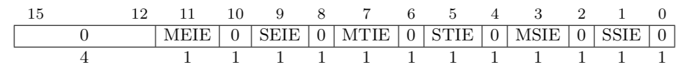
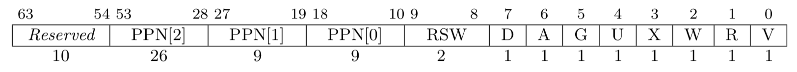

### RISC-V

The RISC-V architecture was forged in the University of California, Berkeley. Different from the x86 and ARM proprietary architectures, the RISC-V architecture is open-sourced under the BSD license, which allows users to freely use and modify source code and release the modified code as open-source or proprietary software. A conventional instruction set architecture (ISA) is incremental, under which new processors must implement not only new ISA extensions, but also all old extensions. The purpose is to maintain backward binary compatibility so that binary programs from decades ago can run on the latest processors correctly. As a result, the volume of the conventional ISA increases greatly over time. RISC-V is modularized. Its core is a basic ISA called RV32I that supports a complete software stack. RV32I is fixed and never changes, the stability of which facilitates compiler writers, operating system (OS) developers, and assembly language programmers. Modularity is realized based on optional standard extensions, which can be included in hardware based on requirements of applications.

### 1. RISC-V Privilege Levels

RISC-V defines three privilege modes: machine mode (M), supervisor mode (S), and user mode (U).


The M Mode is mandatory, and the other two modes are optional. Different modes can be combined to implement systems for different purposes.


* M: simple embedded systems
* M + U: simple embedded systems that can distinguish between user and machine modes to protect resources.
* M + S + U: systems running Unix-like OSs

### 2. RISC-V General-Purpose Registers

The basic integer instruction set is the most basic and only mandatory module of RISC-V. It implements a complete software compiler and supports modern OSs. RV32I is one of the integer instruction sets. It supports 32 general-purpose registers (GPRs). Each register has 32 bits and is represented by x0 to x31. The x0 register is reserved as constant 0. In assembly language, each register in the general-purpose register group has an alias.

| Register | ABI Name | Description |
| :------ | :------ | :------ |
| x0 | zero | Hard-wired zero |
| x1 | ra | Return address |
| x2 | sp | Stack pointer |
| x3 | gp | Global pointer |
| x4 | tp | Thread pointer |
| x5-7 | t0-2 | Temporaries |
| x8 | s0/fp | Saved register/frame pointer |
| x9 | s1 | Saved register |
| x10-11 | a0-1 | Function arguments/return values|
| x12-17 | a2-7 | Function arguments |
| x18-27 | s2-11 | Saved register |
| x28-31 | t3-6 | Temporaries |


### 3. RISC-V Control and Status Registers

In addition to GPRs, RISC-V defines a series of control and status registers (CSRs) for each privilege level. This section uses the M mode as an example to describe related CSRs.

* misa: ISA and extensions supported by hardware threads (harts), including integer, multiplication and division, atom, floating point number, double-precision floating point number, and compression instruction extensions.
* mhartid: hart ID.
* medeleg: By default, all exceptions are handled in M mode. When the medeleg bit is set to 1, the exception is directly handled in S mode or U mode.
* mideleg: By default, all interrupts are handled in M mode. When the mideleg bit is set to 1, the interrupt is directly handled in S mode or U mode.
* mtime: current clock count.
* mtimecmp: clock count comparator. When the current value in the mtime register is greater than the value in mtimecmp, a timer interrupt is triggered.
* mstatus: control status of the current processor, which includes the global interrupt enable bit, memory privilege level bit, and byte order control bit.
* mtvec: address to which the processor needs to jump when a trap occurs.
* mip: type of the interrupt to be processed. EIP indicates an external interrupt, TIP indicates a timer interrupt, and SIP indicates a software interrupt. When the interrupt bit is set to 1, this type of interrupt is to be processed.

* mie: type of interrupt that is currently enabled and ignored by the processor. EIP indicates an external interrupt, TIP indicates a timer interrupt, and SIP indicates a software interrupt. When the interrupt bit is set to 1, this type of interrupt can be responded by the processor.

* mscratch: pointer to a M mode hart-local context space.
* mepc: exception program counter.
* mtval: additional information about a trap, including the address where an exception occurs and the instruction that triggers the invalid instruction exception. For other traps, the value of mtval is 0.
* mcause: trap type. When the most significant bit is 1, the lower bit indicates the interrupt type. When the most significant bit is 0, the lower bit indicates the type of the exception or system call.

| Interrupt | Exception Code | Description |
| :------ | :------ | :------ |
| 1 | 0 | Reserved |
| 1 | 1 | Supervisor software interrupt |
| 1 | 2 | Reserved |
| 1 | 3 | Machine software interrupt |
| 1 | 4 | Reserved |
| 1 | 5 | Supervisor timer interrupt |
| 1 | 6 | Reserved |
| 1 | 7 | Machine timer interrupt |
| 1 | 8 | Reserved |
| 1 | 9 | Supervisor external interrupt |
| 1 | 10 | Reserved |
| 1 | 11 | Machine external interrupt |
| 1 | 12-15 | Reserved |
| 1 | ≥ 16| Available for platform use |
| 0 | 0 | Instruction address misaligned |
| 0 | 1 | Instruction access fault |
| 0 | 2 | Illegal instruction |
| 0 | 3 | Breakpoint |
| 0 | 4 | Load address misaligned |
| 0 | 5 | Load access fault |
| 0 | 6 | Store/AMO address misaligned |
| 0 | 7 | Store/AMO access fault |
| 0 | 8 | Environment call from U-mode |
| 0 | 9 | Environment call from S-mode |
| 0 | 10 | Reserved |
| 0 | 11 | Environment call from M-mode |
| 0 | 12 | Instruction page fault |
| 0 | 13 | Load page fault |
| 0 | 14 | Reserved |
| 0 | 15 | Store/AMO page fault |
| 0 | 16-23 | Reserved |
| 0 | 24-31 | Available for custom use |
| 0 | 32-47 | Reserved |
| 0 | 48-63 | Available for custom use |
| 0 | >=64 | Reserved |

### 4. RISC-V CPU Initialization

OpenSBI is an implementation of the M mode. This section uses OpenSBI as an example to describe CPU initialization in M mode. In a hardware hyper-threading processor, a processor core has multiple harts. Therefore, a processor core ID does not correspond to a hart ID. OpenSBI can be used as firmware to provide runtime services for software at other privilege levels. After the device is powered on, the OpenSBI firmware code is first loaded to initialize the CPU.

Each hart has its own context. The pointer to the context is stored in the mscratch register. OpenSBI allocates stack space based on the number of harts defined by the platform and the size of the hart stack, initializes the sbi_scratch structure for each hart in sequence, and then assigns the address of the sbi_scratch to the mscratch register. The sbi_scratch structure includes the address of the firmware in the memory, the entry address of the code to be executed in the next startup phase, and information such as arguments and privilege levels.

```c
/* Definition of the sbi_scratch structure */
struct sbi_scratch {
    /** OpenSBI firmware address */
    unsigned long fw_start;
    /** OpenSBI firmware size */
    unsigned long fw_size;
    /** Argument for the next startup phase */
    unsigned long next_arg1;
    /** Code entry for the next startup phase */
    unsigned long next_addr;
    /** Privilege mode for the next startup phase */
    unsigned long next_mode;
···
···
} __packed;
```


```c
_relocate_done:
···
···
    /* Allocates stack space based on the number of harts and the size of the hart stack. */
    la  tp, _fw_end
    mul a5, s7, s8
    add tp, tp, a5
   
_scratch_init:
    /*Initializes the t1 hart and points the pointer to the stack space of the t1 hart. */
    add tp, t3, zero
    mul a5, s8, t1
    sub tp, tp, a5
    li  a5, SBI_SCRATCH_SIZE
    sub tp, tp, a5

    /* Initializes the sbi_scratch structure of the t1 hart. */
    /* Initializes fw_start and fw_size. */
    la  a4, _fw_start
    la  a5, _fw_end
    mul t0, s7, s8
    add a5, a5, t0
    sub a5, a5, a4
    REG_S   a4, SBI_SCRATCH_FW_START_OFFSET(tp)
    REG_S   a5, SBI_SCRATCH_FW_SIZE_OFFSET(tp)
    /* Assigns the argument transferred in the next phase to next_arg1, which is usually the FDT address. */
    MOV_3R  s0, a0, s1, a1, s2, a2
    call    fw_next_arg1
    REG_S   a0, SBI_SCRATCH_NEXT_ARG1_OFFSET(tp)
    MOV_3R  a0, s0, a1, s1, a2, s2
    /* Assigns the entry address of the code of the next phase to next_addr. */
    MOV_3R  s0, a0, s1, a1, s2, a2
    call    fw_next_addr
    REG_S   a0, SBI_SCRATCH_NEXT_ADDR_OFFSET(tp)
    MOV_3R  a0, s0, a1, s1, a2, s2
    /* Assigns the privilege mode of the next phase to next_mode. */
    MOV_3R  s0, a0, s1, a1, s2, a2
    call    fw_next_mode
    REG_S   a0, SBI_SCRATCH_NEXT_MODE_OFFSET(tp)
    /* Initializes the next hart. */
    add t1, t1, t2
    blt t1, s7, _scratch_init
···
···
```

After the hart context is initialized, initialize the trap. All interrupts are disabled by clearing the mie and mip registers. The address of the trap handler is assigned to the mtvec register as the entry address of the primary control function of the trap service. When an interrupt occurs in the system, the trap handler is found through the mtvec register.


```c
_start_warm:
    /* Clears general-purpose registers. */
    li  ra, 0
    call    _reset_regs

    /* Disables interrupts and clears the mie and mip registers. */
    csrw    CSR_MIE, zero
    csrw    CSR_MIP, zero
···
···
    /* Sets the trap handler. */
    la  a4, _trap_handler
    csrw    CSR_MTVEC, a4

    /* Enters the startup phase. */
    csrr    a0, CSR_MSCRATCH
    call    sbi_init
```

Start harts. Randomly select a hart as the primary hart. Other harts enable the software interrupts by setting the MSIE bit in the mie register to 1 and then enter the wait for interrupt (WFI) status, waiting for the primary hart to send an interrupt. The primary hart is cold started and initialized. After the initialization is complete, it sends an inter-processor interrupt to wake up other harts, and then the code of the next phase is executed. If a bare-metal program is to be started, the next segment of code is user program code; if the kernel is to be started, the next segment of code is kernel code. The FDT address is transferred to the next segment of code as an argument to enter the next phase.


```c
void __noreturn sbi_init(struct sbi_scratch *scratch)
{
    bool coldboot           = FALSE;
    u32 hartid          = current_hartid();
···
···
    /* Randomly selects a hart as the primary hart and performs cold start. Other harts are warm started. */
    if (next_mode_supported && atomic_xchg(&coldboot_lottery, 1) == 0)
        coldboot = TRUE;

    if (coldboot)
        init_coldboot(scratch, hartid);
    else
        init_warmboot(scratch, hartid);
}

static void __noreturn init_warmboot(struct sbi_scratch *scratch, u32 hartid)
{
    int rc;
    unsigned long *init_count;
    const struct sbi_platform *plat = sbi_platform_ptr(scratch);
    /* Enables the inter-process interrupts, enters the WFI status, and waits until the cold start is complete. */
    wait_for_coldboot(scratch, hartid);
···
···
    /* Executes the code of the next phase. */
    sbi_hsm_prepare_next_jump(scratch, hartid);
    sbi_hart_switch_mode(hartid, scratch->next_arg1,
                 scratch->next_addr,
                 scratch->next_mode, FALSE);
}

static void __noreturn init_coldboot(struct sbi_scratch *scratch, u32 hartid)
{
    int rc;
    unsigned long *init_count;
    const struct sbi_platform *plat = sbi_platform_ptr(scratch);
    ···
    ···

    /* Initializes the terminal serial port. */
    rc = sbi_console_init(scratch);
    if (rc)
        sbi_hart_hang();

    /* Initializes the interrupt controller. */
    rc = sbi_platform_irqchip_init(plat, TRUE);
    if (rc) {
        sbi_printf("%s: platform irqchip init failed (error %d)\n",
               __func__, rc);
        sbi_hart_hang();
    }

    /* Inter-processor interrupt initialization */
    rc = sbi_ipi_init(scratch, TRUE);
    if (rc) {
        sbi_printf("%s: ipi init failed (error %d)\n", __func__, rc);
        sbi_hart_hang();
    }

    /* TLB initialization */
    rc = sbi_tlb_init(scratch, TRUE);
    if (rc) {
        sbi_printf("%s: tlb init failed (error %d)\n", __func__, rc);
        sbi_hart_hang();
    }

    /* Timer initialization */
    rc = sbi_timer_init(scratch, TRUE);
    if (rc) {
        sbi_printf("%s: timer init failed (error %d)\n", __func__, rc);
        sbi_hart_hang();
    }

    /* Registers the system call. */
    rc = sbi_ecall_init();
    if (rc) {
        sbi_printf("%s: ecall init failed (error %d)\n", __func__, rc);
        sbi_hart_hang();
    }

    /* Configures the physical memory protection mechanism. */
    rc = sbi_hart_pmp_configure(scratch);
    if (rc) {
        sbi_printf("%s: PMP configure failed (error %d)\n",
               __func__, rc);
        sbi_hart_hang();
    }

    /* Adjusts the FTD memory layout. */
    rc = sbi_platform_final_init(plat, TRUE);
    if (rc) {
        sbi_printf("%s: platform final init failed (error %d)\n",
               __func__, rc);
        sbi_hart_hang();
    }

    /* Sends a software interrupt to wake up other harts. */
    wake_coldboot_harts(scratch, hartid);

    /* Executes the code of the next phase. */
    init_count = sbi_scratch_offset_ptr(scratch, init_count_offset);
    (*init_count)++;
    sbi_hsm_prepare_next_jump(scratch, hartid);
    sbi_hart_switch_mode(hartid, scratch->next_arg1, scratch->next_addr,
                 scratch->next_mode, FALSE);
}

```


### 5. RISC-V Interrupts, Exceptions, and System Calls

RISC-V classifies traps into two types. One is the synchronous trap, which is generated during instruction execution, including address access exceptions, breakpoint exceptions, invalid instruction exceptions, unaligned address exceptions, and system calls. The other is the interrupt. RISC-V defines three types of standard interrupts: software interrupt, timer interrupt, and external interrupt.

When a trap occurs, the hardware sets the mpec register to the address of the instruction that triggers the trap, the mcause register to the source of the trap, the SIE bit of the mstatus register to 0 to disable the interrupt, the mtval register to the additional information of the trap, and the pc register to the entry address of the primary control function of the trap service pointed to by the stvec register.

OpenSBI sets the trap handler to the entry address of the primary control function of the trap service pointed to by the stvec register. The trap handler first stores the sp register on the exception stack, allocates the exception stack space by changing the value of the sp register, saves general-purpose registers, and then calls sbi_trap_handler to process the trap. After the trap processing is complete, the general-purpose registers and the sp register are restored.

```c
_trap_handler:
...
...
    /* Saves the sp register. */
    REG_S   sp, (SBI_TRAP_REGS_OFFSET(sp) - SBI_TRAP_REGS_SIZE)(t0)

    /* Allocates exception stack space. */
    add sp, t0, -(SBI_TRAP_REGS_SIZE)
    
    /* Saves general-purpose registers. */
    REG_S   zero, SBI_TRAP_REGS_OFFSET(zero)(sp)
    REG_S   ra, SBI_TRAP_REGS_OFFSET(ra)(sp)
    REG_S   gp, SBI_TRAP_REGS_OFFSET(gp)(sp)
    REG_S   tp, SBI_TRAP_REGS_OFFSET(tp)(sp)
    REG_S   t1, SBI_TRAP_REGS_OFFSET(t1)(sp)
    REG_S   t2, SBI_TRAP_REGS_OFFSET(t2)(sp)
    REG_S   s0, SBI_TRAP_REGS_OFFSET(s0)(sp)
    REG_S   s1, SBI_TRAP_REGS_OFFSET(s1)(sp)
    REG_S   a0, SBI_TRAP_REGS_OFFSET(a0)(sp)
    REG_S   a1, SBI_TRAP_REGS_OFFSET(a1)(sp)
    REG_S   a2, SBI_TRAP_REGS_OFFSET(a2)(sp)
    REG_S   a3, SBI_TRAP_REGS_OFFSET(a3)(sp)
    REG_S   a4, SBI_TRAP_REGS_OFFSET(a4)(sp)
    REG_S   a5, SBI_TRAP_REGS_OFFSET(a5)(sp)
    REG_S   a6, SBI_TRAP_REGS_OFFSET(a6)(sp)
    REG_S   a7, SBI_TRAP_REGS_OFFSET(a7)(sp)
    REG_S   s2, SBI_TRAP_REGS_OFFSET(s2)(sp)
    REG_S   s3, SBI_TRAP_REGS_OFFSET(s3)(sp)
    REG_S   s4, SBI_TRAP_REGS_OFFSET(s4)(sp)
    REG_S   s5, SBI_TRAP_REGS_OFFSET(s5)(sp)
    REG_S   s6, SBI_TRAP_REGS_OFFSET(s6)(sp)
    REG_S   s7, SBI_TRAP_REGS_OFFSET(s7)(sp)
    REG_S   s8, SBI_TRAP_REGS_OFFSET(s8)(sp)
    REG_S   s9, SBI_TRAP_REGS_OFFSET(s9)(sp)
    REG_S   s10, SBI_TRAP_REGS_OFFSET(s10)(sp)
    REG_S   s11, SBI_TRAP_REGS_OFFSET(s11)(sp)
    REG_S   t3, SBI_TRAP_REGS_OFFSET(t3)(sp)
    REG_S   t4, SBI_TRAP_REGS_OFFSET(t4)(sp)
    REG_S   t5, SBI_TRAP_REGS_OFFSET(t5)(sp)
    REG_S   t6, SBI_TRAP_REGS_OFFSET(t6)(sp)

    /* Calls sbi_trap_handler to process the trap. */
    add a0, sp, zero
    call    sbi_trap_handler
    
    /* Restore the general-purpose registers. */
    REG_L   ra, SBI_TRAP_REGS_OFFSET(ra)(sp)
    REG_L   gp, SBI_TRAP_REGS_OFFSET(gp)(sp)
    REG_L   tp, SBI_TRAP_REGS_OFFSET(tp)(sp)
    REG_L   t1, SBI_TRAP_REGS_OFFSET(t1)(sp)
    REG_L   t2, SBI_TRAP_REGS_OFFSET(t2)(sp)
    REG_L   s0, SBI_TRAP_REGS_OFFSET(s0)(sp)
    REG_L   s1, SBI_TRAP_REGS_OFFSET(s1)(sp)
    REG_L   a0, SBI_TRAP_REGS_OFFSET(a0)(sp)
    REG_L   a1, SBI_TRAP_REGS_OFFSET(a1)(sp)
    REG_L   a2, SBI_TRAP_REGS_OFFSET(a2)(sp)
    REG_L   a3, SBI_TRAP_REGS_OFFSET(a3)(sp)
    REG_L   a4, SBI_TRAP_REGS_OFFSET(a4)(sp)
    REG_L   a5, SBI_TRAP_REGS_OFFSET(a5)(sp)
    REG_L   a6, SBI_TRAP_REGS_OFFSET(a6)(sp)
    REG_L   a7, SBI_TRAP_REGS_OFFSET(a7)(sp)
    REG_L   s2, SBI_TRAP_REGS_OFFSET(s2)(sp)
    REG_L   s3, SBI_TRAP_REGS_OFFSET(s3)(sp)
    REG_L   s4, SBI_TRAP_REGS_OFFSET(s4)(sp)
    REG_L   s5, SBI_TRAP_REGS_OFFSET(s5)(sp)
    REG_L   s6, SBI_TRAP_REGS_OFFSET(s6)(sp)
    REG_L   s7, SBI_TRAP_REGS_OFFSET(s7)(sp)
    REG_L   s8, SBI_TRAP_REGS_OFFSET(s8)(sp)
    REG_L   s9, SBI_TRAP_REGS_OFFSET(s9)(sp)
    REG_L   s10, SBI_TRAP_REGS_OFFSET(s10)(sp)
    REG_L   s11, SBI_TRAP_REGS_OFFSET(s11)(sp)
    REG_L   t3, SBI_TRAP_REGS_OFFSET(t3)(sp)
    REG_L   t4, SBI_TRAP_REGS_OFFSET(t4)(sp)
    REG_L   t5, SBI_TRAP_REGS_OFFSET(t5)(sp)
    REG_L   t6, SBI_TRAP_REGS_OFFSET(t6)(sp)

...
...
    /* Restores the sp register. */
    REG_L   sp, SBI_TRAP_REGS_OFFSET(sp)(sp)
```

As a trap processing service, sbi_trap_handler reads the most significant bit of the mcause register to determine the trap type.

* When the most significant bit of the mcause register is 1, the trap type is interrupt. The exception code in the mcause register is read.
	* If the exception code is 7, it is a timer interrupt. In this case, the timer interrupt handler is called.
	* If the exception code is 3, it is a software interrupt. In this case, the software interrupt handler is called.
* When the most significant bit of the mcause register is 0, the trap type is exception or system call. The exception code in the mcause register is read.
	* If the exception code is 2, 4, or 6, it is an exception, and the corresponding exception handler is called.
	* If the exception code is 9 or 11, it is a system call, and the ecall handler is called.

```c
void sbi_trap_handler(struct sbi_trap_regs *regs)
{
...
...
    /** When the most significant bit of the mcause register is 1, the trap type is interrupt. **/
    if (mcause & (1UL << (__riscv_xlen - 1))) {
        mcause &= ~(1UL << (__riscv_xlen - 1));
        switch (mcause) {
        /** Timer interrupt **/
        case IRQ_M_TIMER:
            sbi_timer_process();
            break;
        /** Software interrupt **/
        case IRQ_M_SOFT:
            sbi_ipi_process();
            break;
        default:
            msg = "unhandled external interrupt";
            goto trap_error;
        };
        return;
    }

    /** When the most significant bit of the mcause register is 0, the trap type is exception or system call. **/
    switch (mcause) {
    /** Exception **/
    case CAUSE_ILLEGAL_INSTRUCTION:
        rc  = sbi_illegal_insn_handler(mtval, regs);
        msg = "illegal instruction handler failed";
        break;
    case CAUSE_MISALIGNED_LOAD:
        rc = sbi_misaligned_load_handler(mtval, mtval2, mtinst, regs);
        msg = "misaligned load handler failed";
        break;
    case CAUSE_MISALIGNED_STORE:
        rc  = sbi_misaligned_store_handler(mtval, mtval2, mtinst, regs);
        msg = "misaligned store handler failed";
        break;
    /** System call **/
    case CAUSE_SUPERVISOR_ECALL:
    case CAUSE_MACHINE_ECALL:
        rc  = sbi_ecall_handler(regs);
        msg = "ecall handler failed";
        break;
    default:
...
...
        break;
    };

trap_error:
    if (rc)
        sbi_trap_error(msg, rc, mcause, mtval, mtval2, mtinst, regs);
}

```

### 6. RISC-V Virtual Memory

Compared with the M mode, the S mode provides a page-based virtual memory system. The memory is divided into pages of a fixed size for address conversion and memory content protection. There are many RISC-V paging schemes. The Linux kernel uses the Sv39 implementation.

Sv39 supports 39-bit virtual memory address space. Bits 38-12 indicate the virtual page number, and bits 11-0 indicate the in-page offset. Each page is 4 KB. The physical memory address has 56 bits, where bits 55-12 are the physical page number. A 27-bit virtual page number is mapped to a 44-bit physical page number by using a three-level page table.


For Sv39, each page table entry (PTE) is 64 bits. Bits 63-54 are reserved. Bits 53-10 indicate the physical page number. Bits 9-0 describe the page status. **V** indicates whether the PTE is valid. Bits **R**, **W**, and **X** control permissions, which indicate read, write, and execute permissions of a page respectively. When **R**, **W**, and **X** are all 0s, the PTE is not a leaf PTE and points to the next-level page table. **U** indicates whether the page can be accessed in U mode. Software in U mode can access the page only when the **U** bit is **1**. The **G** bit controls global mapping. When the **G** bit is **1** and the PTE is not a leaf PTE, the next-level page table to which the PTE points is globally accessible. **A** indicates accessed. When the **A** bit is **1**, the page to which the PTE points has been accessed since the **A** bit is set to **0** last time. **D** indicates dirty. When the **D** bit is **1**, the page to which the PTE points has been modified since the **D** bit is set to **0** last time. The **RSW** bits are reserved.



A PTE at each level may be a leaf PTE. When the PTE of a three-level page table is a leaf PTE, the size of the page to which the PTE points is 4 KB. When the PTE of a two-level page table is a leaf PTE, the size of the page to which the PTE points is 2 MB. When the PTE of a single-level page table is a leaf PTE, the size of the page to which the PTE points is 1 GB.

The S mode uses the satp register to control the virtual memory paging system. satp has three fields. **MODE** enables paging and selects the number of page table levels. **ASID** is an address space identifier and can be used to reduce the overhead of context switches. **PPN** stores the base address of the page table.


When paging is enabled in the satp register, virtual addresses in S mode and U mode are mapped to physical addresses by traversing the page table from the root.

1. satp.PPN provides the base address of a single-level page table, and VA[31:22] provides the single-level page number. Therefore, the processor reads the PTE at (satp.PPN × 4096 + VA[31: 22] × 4).
2. The PTE includes the base address of a two-level page table, and VA[21:12] provides the two-level page number. Therefore, the processor reads the leaf PTE at (PTE.PPN × 4096 + VA[21: 12] × 4).
3. The **PPN** field of the leaf PTE and the in-page offset (the 12 least significant bits of the original virtual address) form the final result. The physical address is (leaf.PTE.PPN × 4096 + VA[11: 0]).


As the Linux kernel uses the Sv39 implementation, when the MMU option is enabled in the kernel, the physical address of the allocated page table array is read and transferred to the relocate function as an argument. The relocate function obtains the physical page number of the page table array, combines the physical page number with SATP MODE 39, and assigns the value to the satp register. Inside the CPU, the translation lookaside buffer (TLB) is used to cache the mapping between virtual page number and physical page number. When the satp register is modified, the corresponding value in the TLB becomes invalid. In S mode, sfence.vma is used to solve this problem. It notifies the processor that software may have modified the page table, and then the processor can refresh the TLB accordingly. After a value is assigned to the satp register, sfence.vma is used to update the TLB.


```c
#define PAGE_SHIFT (12)
#define SATP_MODE_39 _AC(0x8000000000000000, UL)
#define SATP_MODE SATP_MODE_39

#ifdef CONFIG_MMU
	/* Enables the virtual memory and reallocates the virtual addresses. */
	/* swapper_pg_dir is the base address of the page table. */
	la a0, swapper_pg_dir
	call relocate
#endif

.align 2
#ifdef CONFIG_MMU
relocate:
	/* Reallocates the return addresses. */
	li a1, PAGE_OFFSET
	la a2, _start
	sub a1, a1, a2
	add ra, ra, a1

	/* Calculates the value of the satp register. */
	srl a2, a0, PAGE_SHIFT
	li a1, SATP_MODE
	or a2, a2, a1
···
···
	/* Sets the value of the satp register and refresh the TLB. */
	csrw CSR_SATP, a2
	sfence.vma
```

### 7. References

1. [RISC-V spec](https://github.com/riscv/riscv-isa-manual/releases/download/Ratified-IMAFDQC/riscv-spec-20191213.pdf)
2. [RISC-V privileged spec](https://github.com/riscv/riscv-isa-manual/releases/download/Ratified-IMFDQC-and-Priv-v1.11/riscv-privileged-20190608.pdf)
3. [RISC-V-Reader-Chinese](http://riscvbook.com/chinese/RISC-V-Reader-Chinese-v2p1.pdf)
