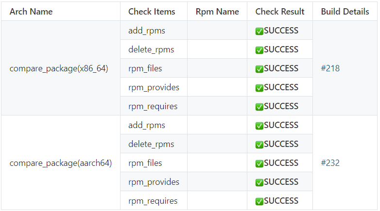
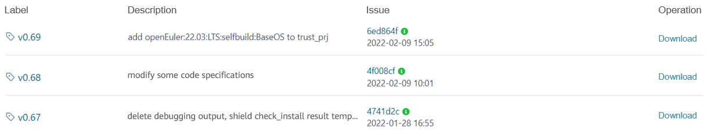
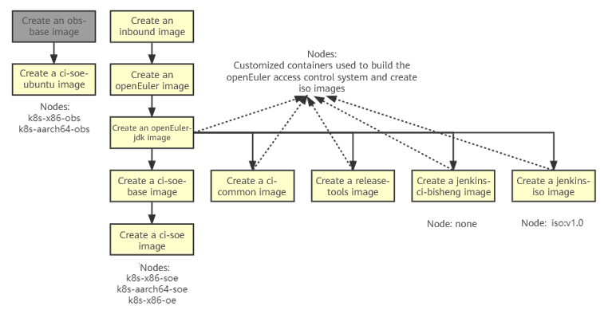

# 1 Introduction to the Access Control Function

## 1.1 Access Control

The code of the openEuler community is hosted on Gitee. To ensure the code quality, when you submit a pull request (PR) on Gitee, the access control system is automatically triggered to check the coding specifications and build, installation, and interface changes. Then, the access control check result is returned to the PR comment, helping you locate problems and maintainers review code.

For the open-source access control code, visit https://gitee.com/openeuler/openeuler-jenkins.

## 1.2 src-openEuler Access Control Check Items

### 1.2.1 Access Control Triggering Conditions

Submit a PR for the first time, leave a comment, or retest.  

  

### 1.2.2 Access Control Notification

  

Click the links to view real-time access control building logs.  

### 1.2.3 Access Control Check Results  

<b>Basic check items<b>


    


<b>Interface change check items<b>


    

Table 1 lists the six basic check items of the access control system. Interface change check items are separately displayed because there are many sub-items.  

### 1.2.4 Corresponding Code Locations of the Access Control Check Items

| Check Item                 | Function Description                | Code Location                                                |
| ----------------------- | ------------------------ | ------------------------------------------------------------ |
| check_binary_file       | Binary file check          | [check_binary_file.py](https://gitee.com/openeuler/openeuler-jenkins/blob/master/src/ac/acl/binary/check_binary_file.py) |
| check_package_license   | License validity check       | [check_spec.py](https://gitee.com/openeuler/openeuler-jenkins/blob/master/src/ac/acl/spec/check_spec.py), [Licenses.yaml](https://gitee.com/openeuler/openeuler-jenkins/blob/master/src/ac/acl/package_license/config/Licenses.yaml)|
| check_package_yaml_file | YAML file format check        | [check_yaml.py](https://gitee.com/openeuler/openeuler-jenkins/blob/master/src/ac/acl/package_yaml/check_yaml.py), [check_repo.py](https://gitee.com/openeuler/openeuler-jenkins/blob/master/src/ac/acl/package_yaml/check_repo.py)|
| check_spec_file         | SPEC file format check        | [check_spec.py](https://gitee.com/openeuler/openeuler-jenkins/blob/master/src/ac/acl/spec/check_spec.py) |
| check_build             | Package build check                  | [osc_build_k8s.py](https://gitee.com/openeuler/openeuler-jenkins/blob/master/src/build/osc_build_k8s.py)|
| check_install           | Checks whether the package after being built can be installed. | [extra_work.py](https://gitee.com/openeuler/openeuler-jenkins/blob/master/src/build/extra_work.py) |
| compare_package         | Checks interface changes in the 64-bit x86 environment. | [compare_package.py](https://gitee.com/openeuler/openeuler-jenkins/blob/master/src/utils/compare_package.py) |

In addition, the access control system supports the optional configuration of check items (check_code_style, check_package_license, check_package_yaml_file, and check_spec_file). The configuration file is stored in [ac.yaml](https://gitee.com/openeuler/openeuler-jenkins/blob/master/src/ac/framework/ac.yaml). Code related to the PR output of each check item is stored in [gitee_comment.py](https://gitee.com/openeuler/openeuler-jenkins/blob/master/src/build/gitee_comment.py).  

### 1.2.5 Basic Check Items and the Functions

| Check Item                 | Function                        | SUCCESS                                                      | FAILED              | WARNING                                         |
| ----------------------- | ---------------------------- | ------------------------------------------------------------ | ------------------- | ----------------------------------------------- |
| check_binary_file       | Checks whether binary files exist in the repository. | The repository does not contain .pyc, .jar, .ko, or .o file (including files in compressed packages but excluding files provided by the upstream community in the form of links). | The SUCCESS condition is not met.| N/A                                         |
| check_package_license   | Checks the license validity.          | All licenses are in the trustlist, and the source code is consistent with that of the licenses listed in the SPEC file.           | A license in the blocklist is found.  | All licenses are in the trustlist, but the source code is inconsistent with that of the licenses listed in the SPEC file.|
| check_package_yaml_file | Checks the YAML file format.               | The **version_control**, **src_repo**, **tag_prefix** and **separator** fields are complete, and the content of the **version_control** field is the same as the domain name specified in the **url** field in the SPEC file.| The SUCCESS condition is not met.| N/A                                         |
| check_spec_file         | Checks the validity of the SPEC file.             | If the version number remains unchanged, the release number must be incremented; if the version number changes, the release number must be set to 1. All patches must be used during compilation, and the **changelog** format must be correct.| The SUCCESS condition is not met.| N/A                                         |
| check_build             | Verifies the build result.                  | The RPM package is successfully built.                                               | The SUCCESS condition is not met.| N/A                                         |
| check_install           | Verifies the installation.                  | The RPM package is successfully installed.                                       | The SUCCESS condition is not met.| N/A                                         |

### 1.2.6 Interface Change Check Items and Functions

| Check Item      | Function                                       | SUCCESS                                                      | FAILED              | WARNING |
| ------------ | ------------------------------------------- | ------------------------------------------------------------ | ------------------- | ------- |
| add_rpms     | Checks whether RPM packages are added in the PR.                       | Compared with the last successfully merged PR in the same branch, no RPM package is added in the PR.                   | The SUCCESS condition is not met.| N/A |
| delete_rpms  | Checks whether the RPM package is deleted in the PR.                       | Compared with the last successfully merged PR in the same branch, no RPM package is deleted in the PR.                   | The SUCCESS condition is not met.| N/A |
| rpm_files    | Checks whether files are added to or deleted from RPM packages generated in the PR.     | Compared with the last successfully merged PR in the same branch, the file list of each RPM package remains unchanged. (File contents are not checked.) | The SUCCESS condition is not met.| N/A |
| rpm_provides | Checks whether the components in RPM packages generated in the PR change. | Compared with the last successfully merged PR in the same branch, the component names in each RPM package remain unchanged. | The SUCCESS condition is not met.| N/A |
| rpm_requires | Checks whether the dependencies of the RPM package generated in the PR change.       | Compared with the last successfully merged PR in the same branch, the dependency names of each RPM package remain unchanged. | The SUCCESS condition is not met.| N/A |
| check_abi    | Checks whether the binary interfaces (C++) of the RPM package generated in the PR change. | Compared with the last successfully merged PR in the same branch, the binary interfaces of each RPM package remain unchanged. | The SUCCESS condition is not met.| N/A |
| check_jabi   | Checks whether the binary interfaces (Java) of the RPM package generated in the PR change. | Compared with the last successfully merged PR in the same branch, the binary interfaces of each RPM package remain unchanged. | The SUCCESS condition is not met.| N/A |
| check_kabi   | Checks whether the binary interfaces (kernel) of the RPM package generated in the PR change. | Compared with the last successfully merged PR in the same branch, the binary interfaces of each RPM package remain unchanged. | The SUCCESS condition is not met.| N/A |

## 1.3 openEuler Access Control Check Items

### 1.3.1 Access Control Check Results


### 1.3.2 Access Control Code Locations Corresponding to the Check Items

| Check Item        | Function Description                       | Code Location                                                |
| -------------- | ------------------------------- | ------------------------------------------------------------ |
| check_code     | Coding specification check                   | [check_code.py](https://gitee.com/openeuler/openeuler-jenkins/blob/master/src/ac/acl/openlibing/check_code.py) |
| check_sca      | Code snippet scan                   | [check_sca.py](https://gitee.com/openeuler/openeuler-jenkins/blob/master/src/ac/acl/sca/check_sca.py) |
| x86-64/*repository_name* | Package build check in the 64-bit x86 environment | Implemented by maintainers and does not belong to the access control code.                              |
| aarch64/*repository_name*| Package build check in the AArch64 environment| Implemented by maintainers and does not belong to the access control code.                                                        |

In addition, the access control system supports the optional configuration of check items (check_openlibing and check_sca). The configuration file is stored in [ac.yaml](https://gitee.com/openeuler/openeuler-jenkins/blob/master/src/ac/framework/ac.yaml). Code related to the PR output of each check item is stored in [gitee_comment.py](https://gitee.com/openeuler/openeuler-jenkins/blob/master/src/build/gitee_comment.py).  

Currently, check_openlibing is implemented by calling the remote service (https://majun.osinfra.cn:8384/api/openlibing/codecheck), and check_sca is implemented by calling the remote service (https://sca-beta.osinafra.cn).  

# 2 FAQs and False Alarm Feedback  

## 2.1 Division of Access Control Responsibilities

| Responsibility                                               | Owner                                                        |
| ------------------------------------------------------------ | ------------------------------------------------------------ |
| General contact person for access control                    | [Zheng Yaohui](https://gitee.com/open_euler/dashboard/members/zhengyaohui) |
| Maintainers of the community repository                      | [Cao Zhi](https://gitee.com/open_euler/dashboard/members/georgecao), [Liu Qi](https://gitee.com/open_euler/dashboard/members/liuqi469227928), [Zhao Chunjiang](https://e.gitee.com/open_euler/members/trend/dakang_siji) |
| Maintenance personnel of the obs_meta repository             | [Dong Jie](https://e.gitee.com/open_euler/members/trend/dongjie110) |
| Maintenance personnel of the release_management repository   | [Dong Jie](https://e.gitee.com/open_euler/members/trend/dongjie110) |
| Maintenance personnel of single-repository access control for software packages | [Wang Huan](https://e.gitee.com/open_euler/members/trend/wanghuan158), [Cheng Shaowei](https://e.gitee.com/open_euler/members/trend/MementoMoriCheng), [Zheng Yaohui](https://gitee.com/open_euler/dashboard/members/zhengyaohui) |
| Infrastructure maintenance personnel (including OBS, Gitee, Jenkins basic services, hardware, and network) | [Cao Zhi](https://gitee.com/open_euler/dashboard/members/georgecao), [Liu Qi](https://gitee.com/open_euler/dashboard/members/liuqi469227928), [Zhao Chunjiang](https://e.gitee.com/open_euler/members/trend/dakang_siji) |
| OBS project maintenance personnel                            | [Wang Chong](https://gitee.com/open_euler/dashboard/members/wangchong1995924), [Xia Senlin](https://e.gitee.com/open_euler/members/trend/small_leek), [Zhou Xiaxiang](https://e.gitee.com/open_euler/members/trend/zhouxiaxiang) |
| Majun platform maintenance personnel                         | Zhang Yaxiong                          |

Note:   
1. The code snippet scan (check_sca) and coding specification check (check_code) in the software package single-repository access control check are implemented by calling the Majun platform service.  

2. The maintenance personnel responsible for single-repository access control of software packages are the contact persons of corresponding problems on the openEuler and src-openEuler platforms. For OBS or infrastructure service problems, contact the corresponding maintenance personnel. For common problems and solutions, see [Access Control Troubleshooting Manual](https://gitee.com/openeuler/openeuler-jenkins/blob/master/doc/%E9%97%A8%E7%A6%81%E9%97%AE%E9%A2%98%E6%8E%92%E6%9F%A5%E6%89%8B%E5%86%8C.md).

## 2.2 Access Control Result Feedback

If you have any doubts about access control results, contact the related owner. We will solve the problem as soon as possible. If the problem cannot be solved quickly, you can submit an issue to the access control repository ([https://gitee.com/openeuler/openeuler-jenkins](https://gitee.com/openeuler/openeuler-jenkins)) to track the progress. After that, you can provide feedback on false alarms through PR comments. The statistics help us do better in the future.

Format of comments for marking false alarms: **/ci_unmistake build_no** or **/ci_mistake build_no <mistake_type> <ci_mistake_stage>**.

Note:

1. **ci_mistake** is used to mark a false alarm, and **ci_unmistake** is used to withdraw the mark. Either **ci_mistake** or **ci_unmistake** must be specified.  
2. **build_no** indicates the build number of a trigger project. When the access control starts, the access control task link and build number are printed in the comment. One PR can have multiple build results. Therefore, the build numbers are used to distinguish the build results. This parameter is mandatory.  
3. **mistake_type** indicates the false alarm type. This parameter is optional. You can select **ci** (access control), **obs**, or **infra** (infrastructure) or leave it blank.  
4. **ci_mistake_stage** indicates the phase in which the false alarm is generated. This parameter is optional. You can select one or more items from check_binary_file, check_package_license, check_package_yaml_file, check_spec_file, check_build, check_install, compare_package, and build_exception, or leave it blank. All items except build_exception correspond to access control check items. build_exception indicates that the access control system runs abnormally (for example, the access control result is not returned).  
5. The sequence of **mistake_type** and **ci_mistake_stage** can be changed.  

# 3 Access Control Code Rollout Process

Perform the three steps in sequence: 1. Submit a PR to the access control code repository and contact a maintainer for merging; 2. Generate a tag for the submission (contact the maintainer); 3. Update the container image (contact access control personnel [Wang Huan](https://e.gitee.com/open_euler/members/trend/wanghuan158), [Wei Shaowei](https://e.gitee.com/open_euler/members/trend/MementoMoriCheng), [Zheng Yaohui](https://gitee.com/open_euler/dashboard/members/zhengyaohui)). In a few cases, the access control personnel need to modify the Jenkins configuration.

## 3.1 Submitting and Merging a PR

The access control code is stored in [https://gitee.com/openeuler/openeuler-jenkins](https://gitee.com/openeuler/openeuler-jenkins). Contact a maintainer to integrate the code.

## 3.2 Generating a Tag

Theoretically, a tag can be generated for each commit. However, because not all PRs need to be merged and rolled out immediately, you do not need to generate a tag for each commit.  

  

## 3.3 Generate a container image.  

Currently, the access control environment is included in the container image. Therefore, each time you update the access control code, you must update the container image code as well. The image version is distinguished by tags.  

# 4 Running Node Customization

## 4.1 Current Node/Image List

  

The following table lists the nodes related to access control.  

| Node                                                        | Project                                  |
| ------------------------------------------------------------ | -------------------------------------- |
| k8s-x86-soe and k8s-aarch64-soe                                | All access control projects in src-openEuler             |
| k8s-x86-oe                                                   | The trigger and comment projects in openEuler       |
| **k8s-x86-openeuler, k8s-x86-openeuler-20.03-lts, k8s-x86-openeuler-20.03-lts-sp1, k8s-x86-openeuler-20.03-lts-sp2, k8s-x86-openeuler-20.03-lts-sp3, k8s-x86-openeuler-20.09, k8s-x86-openeuler-21.03, k8s-aarch64-openeuler, k8s-aarch64-openeuler-20.03-lts, k8s-aarch64-openeuler-20.03-lts-sp1, k8s-aarch64-openeuler-20.03-lts-sp2, k8s-aarch64-openeuler-20.03-lts-sp3, k8s-aarch64-openeuler-20.09, k8s-aarch64-openeuler-21.03**| **x86-64 and aarch64 build projects in openEuler**|

Note:  
1. All projects in src-openEuler and the trigger and comment projects in openEuler are configured on the access control side and use the same environment. Therefore, the nodes are fixed.  

2. The code executed by the x86-64 and AArch64 build projects in openEuler is managed by the related SIGs and used in different environments. You can select the nodes listed **in bold**. To avoid impacting other Jenkins tasks, do not use other nodes.


## 4.2 Node Customization

You may need to customize access control nodes for some tasks.  

### 4.2.1 The base image lacks dependencies, and the dependency installation is time-consuming.

Dependencies can be installed during the running of the container environment provided by the access control system. Therefore, you are advised to run the **sudo yum install -y xxx** command in the running script to install a few dependencies. If you need to install a large number of dependencies, submit a dockerfile to the access control repository [https://gitee.com/openeuler/openeuler-jenkins](https://gitee.com/openeuler/openeuler-jenkins). The access control side reviews and integrates the dockerfile, creates an image, and then creates a running node.  

For details about the dockerfile format, visit https://gitee.com/openeuler/openeuler-jenkins/blob/master/src/dockerfile/release-tools-dockerfile. Generally, you only need to modify the first two statements.  

```
FROM swr.cn-north-4.myhuaweicloud.com/openeuler/openjdk/OPENJDK:TAG
RUN set -eux; \
    yum install -y python3-pip cpio bsdtar expect openssh sudo vim git strace python-jenkins python3-requests python-concurrent-log-handler python3-gevent python3-marshmallow python3-pyyaml python-pandas python-xlrd python-retrying python-esdk-obs-python git 
```

### 4.2.2 The base image version is not openEuler.

In addition to compiling the dockerfile, you need to provide the base image of the corresponding version.  

### 4.2.3 The server architecture does not meet requirements.

In addition to the preceding two requirements, you need to deploy a server of the corresponding architecture, and then perform steps 4.2.1 and 4.2.2. In this case, the access control code needs to be modified.  

