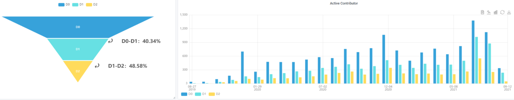

### Open source community operation metric design exploration

#### Preface

The developer operation process of the open source community is a process of expanding the community user and developer of open source projects. 
How to determine the changes in the developer community and how to determine the conversion rate of contributors is the key information we have always hoped to obtain from digital operations. Based on the actual operating experience of openEuler, this article defines the contributors of the open source community hierarchically, hoping to provide a new dimension to observe the health of the community through the data.

#### Introduction-funnel model

The operational perspective usually divides the developers whose code hosting platform (github.com or gitee.com) leaves a digital footprint on the project based on their contribution to the open source project, and implements different operating strategies for different developers.
Due to the particularity of the operating system open source community, during the practice of the openEuler project, it was found that developers from the openEuler official website, developers who download and install the operating system, and developers who update software packages on a daily basis do not need an account during the above operations. The inability to confirm the identity results in the inability to track, and during the operation process, only data statistics are performed for this part of the developers. Therefore, developers in the openEuler community are currently limited to developers who have interacted with the openEuler code repository on the code hosting platform, that is, developers who have entered the code repository.

The openEuler community divides developers into three levels:

1. **Code contributors (D2)**:  narrow contributors, only merged PR (Pull Request)
2. **Contributor (D1)**:  A contributor in a broad sense, a developer who merged a PR (Pull Request), submits an Issue, or comments on an issue or PR
3. **Developer (D0)**: Reach contributors, submit PR (Pull Request), submit Issue or comment on issue or PR, Star, Watch, or Fork the code repository

According to the above classification, the three levels of developers form an inclusive relationship from D0 to D2, thus forming a funnel model.

**Funnel chart**: showing the conversion rate of each layer
**Active**: Display the number of active developers at each level of the time series according to the time distribution
**By organization**: Display the number of people invested by each organization according to the distribution of the organization

#### Application-Operated for developers

Every developer participating in the community is a living individual rather than a cold number in the platform or KPI. Some students operating in the open source community are obsessed with digital operations and ignore the personality of the developer. Every developer is a customer of an operator, and needs to treat each developer's demands with a service mentality, and operate for developers rather than KPI operations.

**Code contributors (D2)**: Focus on the community growth path and career path of developers, and cultivate maintainer or Evangelist for the project-cultivate developer's **loyalty** to the community
**Contributor (D1)**: Pay attention to the developers' demands for the project's functions, assist the developers to use the project in actual production; solve the developer's communication with the community during the project's technical route and use process-enhance the developer's **trust** in the community
**Developer (D0)**: Belongs to the followers of the project. The focus of operation is to disseminate key information such as the technical characteristics of the project, landing cases and other key information to D0 developers, attracting them to conduct in-depth trials of the project-to capture the developer's **attention** to the community

At the same time, the changes in the community can also be observed based on the data of the funnel model combined with other operational data:

Developers participate in cycle changes in open source projects. The developers of open source projects are not stable. They are more like "hard-fought soldiers"-Where new contributors come from and where core contributors are lost, it is also the operator’s changes to the community situation
Observe whether the deep-seated culture and conflict of interest in the community will lead to changes in the role of the open source community, and which characteristics of developers are more likely to grow into the backbone of the community-the identification of key developers is the key for operators to improve operational efficiency

#### Summarize

The operation of the open source community requires complete data support. How to sort out the key model of developers in front of a large amount of data and improve operational efficiency is what openEuler has been exploring in depth. However, any model must conform to the technical characteristics and life cycle of the open source project itself. It is hoped that this model has certain reference significance for the operation of other open source projects.

