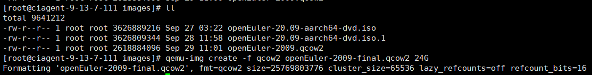
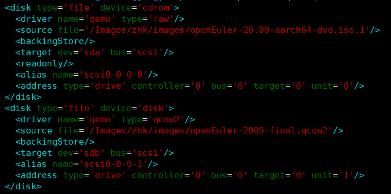
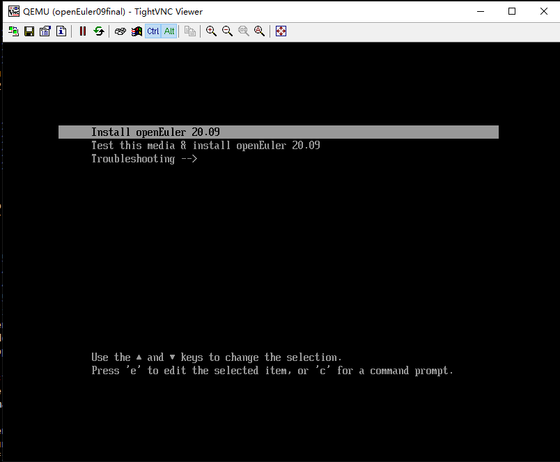
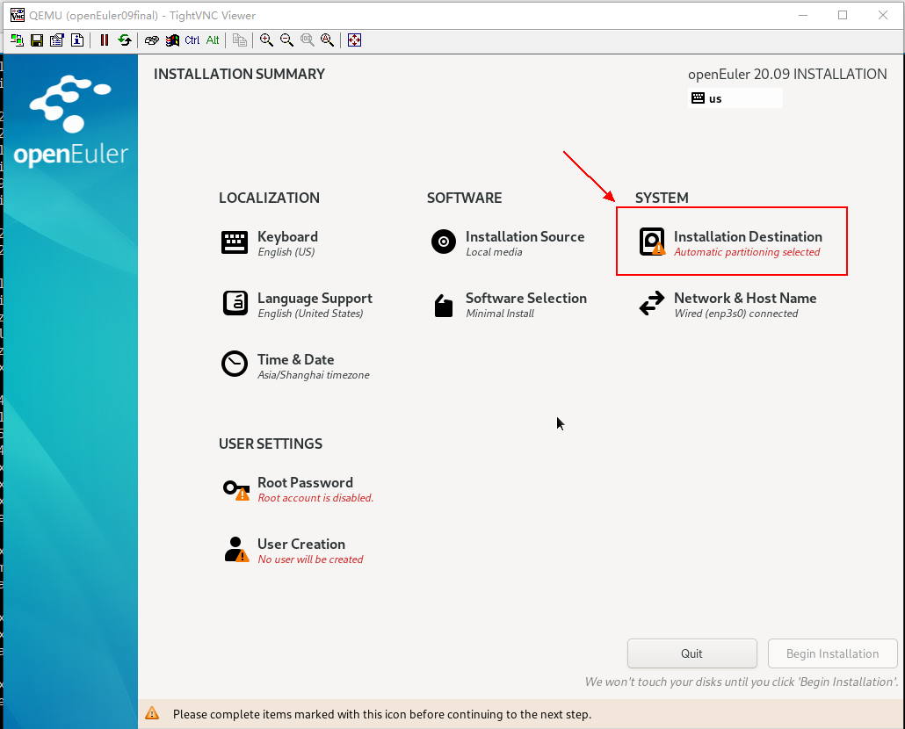
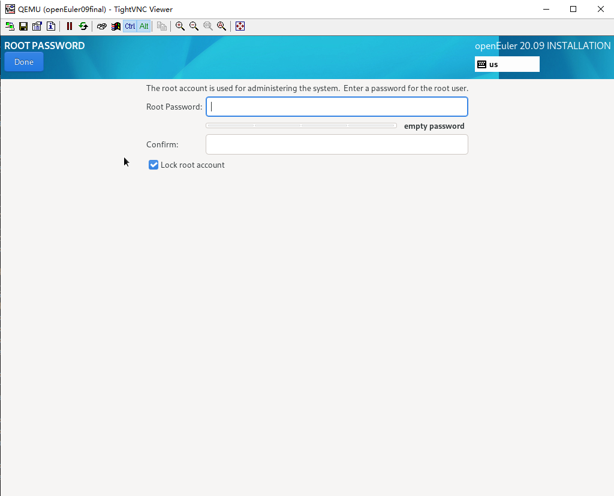

# Creating an openEuler Image

A virtual machine (VM) image is a file that contains a virtual drive that has been installed and can be used to start an OS. VM images are in different formats, including RAW and QCOW2. Compared with RAW images, QCOW2 images occupy less space and support snapshot, copy-on-write, AES encryption, and zlib compression. However, the performance of QCOW2 images is slightly lower than that of RAW images. This article describes how to create a VM image by using the qemu-img tool to create a QCOW2 image file as an example. The QCOW2 image file is a sparse file whose size increases only after the VM occupies the drive space. The size of a RAW image file does not dynamically increase. For the Ext4 file system that supports sparse files, the QCOW2 format is advantageous.

## Procedure

### 1. Downloading the ISO File

Run the **wget** command to download the file to the local host.

Or, visit the openEuler community:

[https://www.openeuler.org/en/download/](https://www.openeuler.org/en/download/)

As shown in the following figure, the required ISO file is successfully downloaded.



### 2. Creating an Image

1. Run the following command to install the qemu-img package:

```shell
yum install -y qemu-img root
```

2. 
Run the **create** command to create an image file.
```shell
qemu-img create -f <imgFormat> -o <fileOption> <fileName> <diskSize>
```

Note:

*imgFormat*: image format. The value can be **raw** or **qcow2**.

*fileOption*: file option, which sets the features of the image file, such as specifying a backend image file, compression, and encryption.

*fileName*: File name

*diskSize*: drive size, which specifies the size of the drive block device. Supported units include K, M, G, and T, indicating KiB, MiB, GiB, and TiB, respectively.


As shown in the preceding figure, an image file **openEuler-2009-final.qcow2** has been created. It is in QCOW2 format with a drive size of 24 GiB. Because it is a sparse file, its actual size is very small.

### 3. Installing the OS

#### Configuring the XML File

Prepare an XML file to define the VM. Set the boot mode to **cdrom**.


Configure two storage devices for the ISO and QCOW2 files, respectively.



Set other configuration items as required.

#### Starting the VM from the CD-ROM


#### Performing the Installation

Select **Install openEuler 20.09**, as shown in the following figure.



On the installation page, click **Continue**.


Click **Installation Destination**.



Select the created QCOW2 image file as the installation destination.


Set the password of the **root** user.


Enter the password.



The user is automatically created.


Then click **Begin Installation**. The automatic installation process starts.


#### Starting the VM from the Hard Drive

After the installation is complete, destroy the VM.


Modify the XML file by changing the boot mode from **cdrom** to **hd**.


Comment out or delete the ISO item in the boot option. Otherwise, the ISO file will be mounted as an extra CD-ROM and can be used as a Yum source.


Then, you can start the VM.

### 4. Installing RPM Packages

The installed OS may lack some RPM packages. You can install the packages in either of the following ways:

The first one is to add a Yum source to the **openEuler.repo** file in **/etc/yum.repos.d**. Check that the network segment of the VM is the same as that of the Yum source. Otherwise, the Yum source cannot be used, and you need to configure the VM NIC. You can also configure a local Yum source.


As shown in the preceding figure, the ISO file is mounted as a CD-ROM. After the VM is started, mount **/dev/sr0** to **/mnt**. In the **openEuler.repo** file in **/etc/yum.repos.d**, add the following configuration:


Alternatively, you can download or copy RPM packages to the VM for installation. Note that some RPM packages have dependencies that need to be downloaded as well. Select either of the preceding methods based on site requirements. If the RPM packages have dependencies, you are advised to configure a Yum source.
