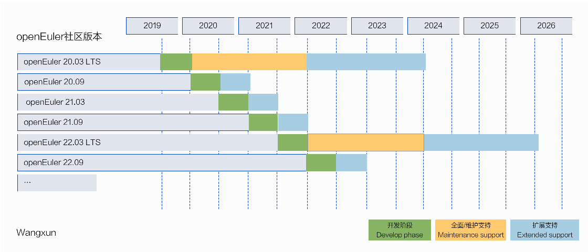

## lifecycle

openEuler releases are named by the edition number according to the year and month when to release. For example, openEuler 20.09 is released in September 2020.

The community version is divided into an LTS (long-term support) release and an innovative release.

- **LTS release**: released every 2 years, and community support is provided for 4 years starting the release date. The community's first LTS version, openEuler 20.03 LTS, was officially released in March 20th.

- **Community Innovation release**: released every 6 months between 2 LTS releases and 6 months' support is provided.

