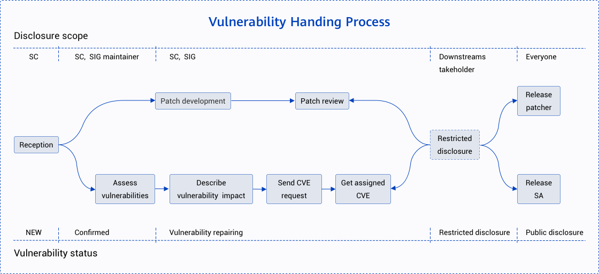
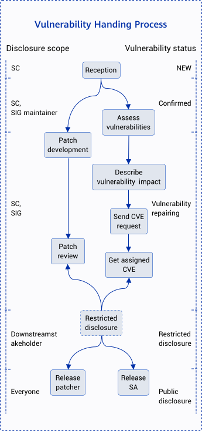

<ClientOnly>
  <security-reporting />
</ClientOnly>

## Vulnerability Response
The openEuler community attaches great importance to the community version security. The security committee of openEuler community is responsible for receiving, investigating, and disclosing security vulnerabilities related to the community. Researchers and industry organizations working on vulnerability prevention are encouraged to report the potential security vulnerabilities in the openEuler community to the security committee. The reported security issues or vulnerabilities will be quickly analyzed and resolved by the committee.

## Versions Supported
The vulnerability response process supports the LTS distribution of the openEuler community and its branch versions.

## Vulnerability Handling Process
Each security vulnerability is tracked and handled by a designated person. This person is a member of the security committee of openEuler community, who is responsible for tracking, resolving, and disclosing the vulnerability. The following flowchart shows the E2E vulnerability handling process.

## Vulnerability Reporting
We hope that you can report the potential vulnerability of an openEuler product to the openEuler community and work with us to resolve and disclose the vulnerability.

### Reporting Channel
You can send the potential security vulnerabilities of an openEuler product to the e-mail of the openEuler security team (<securities@openeuler.org>). Given that the vulnerability information is sensitive, you are advised to use the <a :href="$withBase('/vulnerability-reporting/public_key_securities.asc')" download>public GPG key</a> of the security team to encrypt the e-mail. 
The information of the security team members is described as follows:

+ Liu Jinggang [@ liujinggang09], <liujingang09@huawei.com>, <a :href="$withBase('/vulnerability-reporting/public_key_liujingang.asc')" download>public GPG key</a>
+ Yang Li [@yangli69393], <runningforever@gmail.com>
+ Yan Xiaobing [@yanxiaobing2020], <yanxiaobing@huawei.com>, <a :href="$withBase('/vulnerability-reporting/public_key_yanxiaobing.asc')" download>public GPG  key</a>
+ Zhu Jianwei @ zhujianwei001, <zhujianwei7@huawei.com>, <a :href="$withBase('/vulnerability-reporting/public_key_zhujianwei.asc')" download>public GPG key</a>

### Reporting Content
To quickly identify and verify suspected vulnerabilities, the reporting e-mail should include but is not limited to the following content:

+ Basic information: including the modules affected by the vulnerability, triggering conditions of the vulnerability, and impact on the system after the vulnerability is exploited.
+ Technical details: including system configuration, fault locating method, description of exploit, POC, and method and procedure of fault reproduction.
+ Suggestions on resolving the vulnerability.
+ Organization and contact information of the vulnerability reporter.
+ Reporter's possible plan for vulnerability disclosure.

### E-mail Response
We will respond to the reporting of suspected security vulnerabilities through e-mail within 48 hours and keep the reporter informed of the vulnerability handling progress.

## Vulnerability Severity Assessment
The Common Vulnerability Scoring System (CYSS) is widely used in the industry to assess vulnerability severity. Currently openEuler is using CVSS v3 to assess vulnerabilities, and such assessment focuses on the impact caused by the vulnerability in a preset attack scenario. The vulnerability severity assessment covers factors such as the exploit difficulty and the impact of vulnerability exploit on the confidentiality, integrity, and availability of the product. A score will be given after these factors are assessed.

### Assessment Criteria
The CVSS v3 adopted by the openEuler community assesses the impact of a vulnerability based on the following variables:

+ Attack vector (AV): indicating the remoteness of an attack and how to exploit this vulnerability.
+ Attack complexity (AC): describing the difficulty in executing an attack and the conditions for a successful attack.
+ User interaction (UI): determining whether the attack requires users' participation.
+ Permission required (PR): recording the level of user authorization required for a successful attack.
+ Scope (S): determining whether an attack can affect components of different permission levels.
+ Confidentiality (C): measuring the impact of unauthorized information disclosure.
+ Integrity (I): measuring the impact of information tampering.
+ Availability (A): measuring the impact on data access or services for users affected by the vulnerability.

### Assessment Principles
+ The severity of a vulnerability is assessed, not the risk of the vulnerability.
+ The assessment must be based on an attack scenario where the system confidentiality, integrity, and availability are affected by a successful attack.
+ When a security vulnerability has multiple attack scenarios, the attack scenario with the highest CVSS score (that is, with the greatest impact) shall prevail in the assessment.
+ When a library that is embedded or invoked has vulnerabilities, the assessment on its vulnerability severity should be based on an attack scenario, which is determined by the usage of the library in the product.
+ When a security defect does not trigger or affect the confidentiality/integrity/availability (CIA), the CVSS score is 0.

### Assessment Procedure
Perform this procedure to assess a vulnerability: 

+ Set a possible attack scenario and score based on this attack scenario.
+ Identify vulnerable components and affected components.
+ Select the value of the basic assessment indicator, and perform the vulnerability impact assessment based on the exploitable indicators (attack vector, attack complexity, permission required, user interaction, and scope) and affected indicators (confidentiality, integrity, and availability).

### Severity Rating
<table board="2" class="table table-bordered table-striped">     
      <thead>
          <tr>
              <th align="left" style="width:40px">Severity Rating</th>
              <th align="left" style="width:40px">Score</th>
          </tr>
          <tr>
              <td align="left">Critical</td>
              <td>9.0 - 10.0</td>
          </tr>
          <tr>
              <td align="left">High</td>
              <td>7.0 - 8.9</td>
          </tr>
           <tr>
              <td align="left">Medium</td>
              <td>4.0 - 6.9</td>
          </tr>
          <tr>
              <td align="left">Low</td>
              <td>0.1 - 3.9</td>
          </tr>
          <tr>
              <td align="left">None</td>
              <td>0.0</td>              
          </tr>          
      </thead>      
  </table>

### Scoring Difference Between National Vulnerability Database (NVD) and CVSS
The CVSS scoring is determined by a series of factors, including the version number of an affected component and how it is provided and used, as well as the platform and software compilation mode. The NVD scoring takes into account all scenarios where vulnerabilities are exploited. This assessment mode is not suitable for the open source openEuler, which is built based on the upstream community and mainly applies to server scenarios. As a result, openEuler will score all common vulnerabilities and exposures (CVEs) based on their specific impact. For the same CVE, the scoring by openEuler may be different from that by NVD.

## Vulnerability Disclosure
For the security of openEuler users, the openEuler community will not discuss, confirm, or disclose the security issues of an openEuler product until the vulnerability is investigated and resolved and the security announcement is issued. After a security vulnerability is resolved, the openEuler community will release a security announcement, with information including the technical details, CVE identifier, CVSS security score, and severity level of the vulnerability, as well as the affected and fixed versions. You can subscribe to security announcements of the openEuler community on the <a href="https://mailweb.openeuler.org/postorius/lists/sa-announce.openeuler.org/" download>sa-announce</a>.

