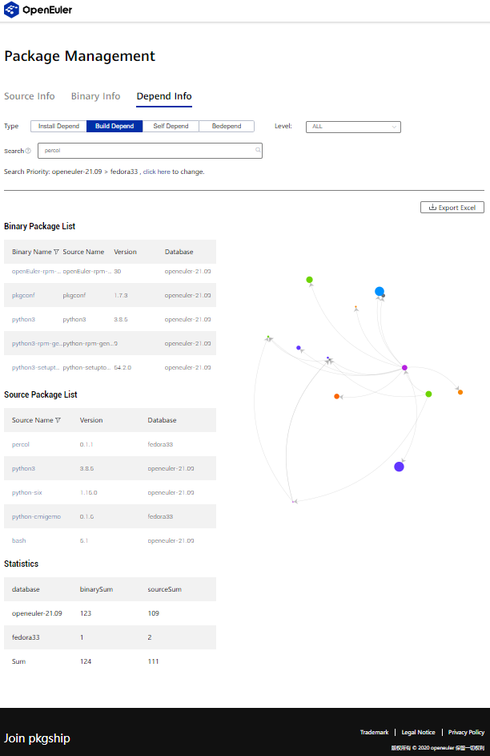
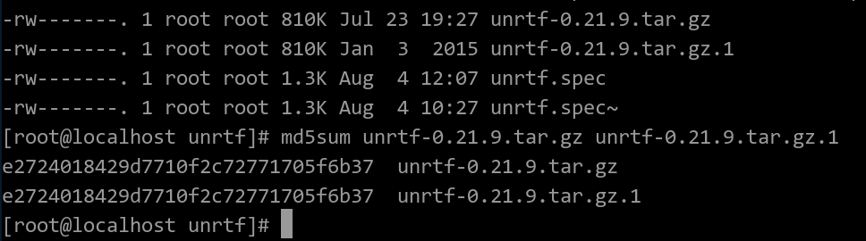
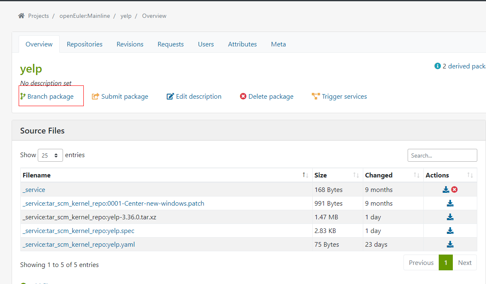
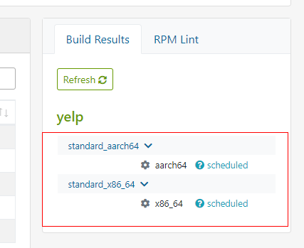

---

# Руководство по выгрузке программного пакета в сообщество openEuler

В данном руководстве описан метод выгрузки программного пакета на ресурс сообщества openEuler. Участникам проекта необходимо следовать данным инструкциям для обеспечения успешной выгрузки и эффективной работы сообщества.  

## 1\. Контрольный список требований

Прежде чем отправить запрос на принятие изменений кода (Pull Request; PR), убедитесь, что пакет программного обеспечения и соответствующие зависимости отвечают правилам приема, принятым в сообществе openEuler. В следующей таблице перечислен контрольный список требований.  

| Требование                                       | Описание                                                     |
| ------------------------------------------------ | ------------------------------------------------------------ |
| Нормализация                                     | ● В большинстве случаев фрагмент кода выгружается на src-openeuler только один раз. |
| Источник                                         | ● Исходный код необходимо загружать только с официального веб-сайта или хоста, адрес которого указывается на официальном веб-сайте. |
| Название программного обеспечения                | ● Название программного обеспечения должно совпадать с названием, приведенным на официальном веб-сайте или странице сообщества.<br />● В качестве названия запрещается использовать подмодуль, содержащийся в программного пакете. <br />● Если программное обеспечение представляет собой библиотеку для разработки на каком-либо языке программирования, можно добавить префиксы python- и perl- в целях стандартизации названий. |
| Статус сообщества                                | Не рекомендуется выгружать следующее программное обеспечение:                                                         <br>● программное обеспечение, выпущенное известным сообществом или организацией, обслуживание которого больше не осуществляется;                                                                                                                                  <br>● программное обеспечение, выпущенное отдельными пользователями или небольшим сообществом или организацией, у которого за последние два года нет новых выгруженных версий;<br />● программное обеспечение, выпущенное сообществом, текущий статус которого неясен; <br />● программное обеспечение, у которого проблемы не решались в течение последних шести месяцев. |
| Официальный веб-сайт (обязательное к выполнению) | ● Необходимо использовать официальный веб-сайт поставщика программного обеспечения. В отсутствии официального веб-сайта можно использовать веб-сайт проекта на основных платформах размещения исходного кода, например GitHub.                                                                                                                                          <br>● Запрещается использовать в качестве официального веб-сайта следующие хостинговые платформы: Maven, MvnRepository, SpringSource. |
| Информация о пакете программного обеспечения     | ● Для отслеживания исходного кода необходимо использовать официальный адрес загрузки пакета с кодом. <br />● Если требуется бинарный пакет, необходимо предоставить официальный адрес загрузки такого пакета. |
| Лицензия                                         | ● Убедитесь, что на выгружаемое программное обеспечение есть лицензия.                                             <br>● Убедитесь, что указанная лицензия совпадает с лицензией, содержащейся на официальном веб-сайте и в программном пакете.                                                                                                                 <br>● Соблюдайте осторожность, выгружая фрагмент открытого программного обеспечения, лицензия на которое относится к высокому риску. |
| Авторские права                                  | ● Предоставьте информацию об авторских правах, содержащуюся на официальном веб-сайте, ресурсе сообщества, хостинговой платформе размещения исходного кода, пакете с исходным кодом и пакете релиза. |

**Примечание.**

1. Нормализация: прежде чем выгрузить разные версии одного программного пакета, например MySQL и MySQL5, свяжитесь с техническим комитетом и SIG.
2. Подробнее о проверке лицензий, а также о белом и черном списках для защиты авторского права см. \[[Список лицензий](https://spdx.org/licenses/) [SPDX](https://spdx.org/licenses/)].  

## 2\. Анализ зависимостей программного пакета

Прежде чем отправить PR-запрос для выгрузки программного обеспечения, рекомендуется проанализировать зависимости программного пакета. Далее предложены несколько методов анализа.  

### 2.1. Использование pkgship

pkgship — это инструмент, разработанный командой openEuler для управления программными пакетами в сообществе openEuler. С помощью данного инструмента можно проанализировать зависимости разных версий ОС openEuler и программных пакетов Fedora, а также запросить бинарные пакеты и пакеты с исходным кодом. Загрузить pkgship можно здесь [pkgship](https://pkgmanage.openeuler.org/).  

#### 2.1.1. Онлайн-анализ

pkgship поддерживает четыре типа анализа зависимостей: **Install Depend**, **Build Depend**, **Self Depend**, **Bedepend**. Перед выгрузкой пакета программного обеспечения выполните анализ зависимостей в онлайн, используя инструмент pkgship, который позволит просмотреть зависимости установки и компиляции в формате Excel.  

  

**Выбор типа анализа:**  

На странице **Package Management** нажмите **Depend Info**, выберите корректный тип анализа зависимостей, введите имя пакета и выберите репозиторий, нажав **click here**.  

  

**Выбор ветки и исходного сообщества:**  

На открывшейся странице выберите нужную ветку и исходное сообщество и нажмите **OK**.  

  

**Запрос результатов:**  

Нажмите значок лупы, инструмент pkgship автоматически проанализирует зависимости в соответствии с заданными пользователем настройками.
  
  

**Анализ результатов запроса зависимостей:**  

Просмотрите список пакетов с исходным кодом в разделе **Source Package List**. Выгрузить необходимо те пакеты, у которых в пункте **Database** стоит значение **fedora33**.  

  

#### 2.1.2. Анализ зависимостей в локальном режиме

Инструмент pkgship также поддерживает локальный режим развертывания и анализа зависимостей источников, задаваемых пользователями. Подробнее см. на странице https://gitee.com/src-openeuler/pkgship.  

**Примечание.** 

В случае возникновения любой проблемы с использованием инструмента pkgship оставьте свой отзыв в [репозитории pkgship](https://gitee.com/openeuler/pkgship/issues).

### 2.2. Анализ зависимостей в исходном сообществе

В тех программных пакетах, в которых проанализировать зависимости с помощью инструмента pkgship нельзя, необходимо выполнить ручной анализ.

#### 2.2.1. Компиляционные зависимости

**Использование файла SPEC, предоставляемого исходным сообществом:**

Найдите компиляционные зависимости выгружаемого пакета по имени пакета с зависимостями, которое можно найти в поле **BuildRequires** в файле SPEC.

**Использование** **инструмента управления языками программирования и файла управления зависимостями:**

Если исходное сообщество не предоставляет файл SPEC, выполните анализ с помощью инструмента управления языками программирования и конкретного файла управления зависимостями. В следующей таблице перечислены типы файлов управления зависимостями для ряда языков программирования и соответствующие им менеджеры управления пакетами.

| Язык    | Менеджер управления пакетами | Тип файла                 |
| ------- | ---------------------------- | ------------------------- |
| C++     | CMake                        | Makefile                  |
| java    | maven pom                    | pom.xml                   |
| go      | go modules                   | go.mod                    |
| rust    | cargo                        | Cargo.toml                |
| ruby    | RubyGems                     | *.gemspec                 |
| python  | pip                          | requirements.txt/setup.py |
| Node.js | npm/yarn                     |                           |

**Инструменты для генерации файла SPEC:**

- Для пакетов на языке Python: [PyPorter](https://gitee.com/openeuler/pyporter)  
 
- Для пакетов на языке Ruby: [RubyPorter](https://gitee.com/openeuler/rubyporter)  

- Для пакетов Node.js: [nodejsporter](https://gitee.com/openeuler/nodejsporter)  

- Для пакетов на языке perlporter: [perlporter](https://gitee.com/openeuler/pyporter)  

**Примечание.** Сгенерировав файл, проверьте следующую информацию:

- Проверьте корректность описания программного обеспечения. (Поле для описания не должно быть пустым или содержать только имя пакета.)  
- Убедитесь, что соблюдены требования к стандартному оформлению, в частности, каждая часть в файле SPEC отделена пустыми строками. К примеру, пустые строки должны быть добавлены перед выражениями **%prep** и **%description**.  

#### 2.2.2. Установка и запуск зависимостей

**Использование файла SPEC, предоставляемого исходным сообществом:**

Найдите инсталляционные зависимости выгружаемого пакета по имени пакета с зависимостями, которое можно найти в поле **Requires** в файле SPEC.  

**Использование инструмента rpmbuild для анализа:**

```bash
rpm -a requires [package_name] 
```

Проверьте инсталляционные зависимости.  


## 3\. Самопроверка программного пакета

Анализ зависимостей и самопроверку программного пакета необходимо выполнять перед отправкой PR-запроса.  

### 3.1. Изменение файла SPEC

#### 3.1.1.  Правка формата и статическая проверка

- Измените последовательность ключевых слов.
- Измените **changelog**. **changelog** в файле SPEC нового программного пакета содержит только пакет **init**.  
- Исключите деликатные слова и сохраните комментарии к патчу, не содержащие деликатных слов. Как правило, сообщество openEuler не принимает контент от исходных сообществ Fedora и RHEL.  
- Измените поле **release**. Установите в поле **release** нового программного пакета значение **1** и при каждом последующем изменении файла SPEC изменяйте это значение на 1.  
- Проверьте список лицензий и убедитесь, что не выгружаете программные пакеты с лицензиями, несущими риски.  

#### 3.1.2.  Отслеживание источника получения кода

- Убедитесь, что URL-адрес официального веб-сайта, содержащийся в файле SPEC, рабочий, и к нему можно получить доступ через браузер.

- Убедитесь, что адрес загрузки пакета с исходным кодом (**source0**), содержащийся в файле SPEC, действительный, и пакет с ссылкой на источник совпадает с пакетом с исходным кодом данного программного обеспечения.
  
  - Если загруженный пакет с исходным кодом отличается от собранного пакета с исходным кодом, используйте для проверки загруженный пакет.
    
    - ```bash
      md5sum package name 1 package name 2   
      ```
    
      
  
    Убедитесь, что данные две последовательности символов совпадают.
    
  - Если ссылка на загрузку пакета **source0** не работает, найдите ссылку, которую можно использовать для версии, поддерживаемой исходным сообществом (подобным GitHub), для повторной проверки. (Можно найти в комментариях к исходному файлу SPEC.)  

### **3.2  rpmbuild**

Для проверки локальной компиляции воспользуйтесь инструментом rpmbuild.  

```bash
rpmbuild -ba [spec file]
```

Используйте параметр -ba для сборки бинарного пакета и пакета с исходным кодом в соответствии с файлом SPEC.  

### 3.3. Проверка компиляции [OBS](https://117.78.1.88/)

Несмотря на то, что для проверки локальной компиляции можно использовать инструмент rpmbuild, результаты такой проверки могут отличаться от результатов проверки компиляции OBS, поскольку среда OBS отлична от локальной среды. Поэтому прежде чем отправить запрос PR, найдите соответствующую ветвь от OBS и проверьте компиляцию.

#### 3.3.1. Конфигурирование среды OSC

Для настройки клиента OSC создайте файл **.oscrc** в каталоге **/root/**. Методы настройки OSC:

- Укажите IP-адрес в конфигурационном файле.  
  
    

- Используйте доменное имя в конфигурационном файле и добавьте соответствие между IP-адресом и доменным именем в **/etc/hosts**.
  
  
  
  

#### 3.3.2. Разработка и проверка OBS

- **Получение изменений и обновление локальной ветви**  

1. В нужной ветви выберите пакет программного обеспечения.  
 
       

2. В этой же ветви создайте новый пакет программного обеспечения.  
   
     

3. Создайте локальную ветвь.  

- **Компиляция OSC**
  
  1. Выполните следующую команду, чтобы загрузить сетевой репозиторий на локальный хост.  
     
     ```bash
     osc co home:xxxxx:branches:openEuler:Mainline software_package_name
     ```
  
  2. Перейдите на свою ветвь:   **home:xxxxx:branches:openEuler:Mainline/*название пакета программного обеспечения***
  
  3. Переместите файл SPEC и пакет TAR, соответствующий данному программному обеспечению, в свою ветвь. (Также необходимо выгрузить патчи и конфигурационные файлы.)  
  
  4. В связи с ограниченностью ресурсов OBS рекомендуется выполнить команду **osc build** для проверки локальной компиляции, прежде чем выгружать пакет в среду OBS для онлайн-компиляции. Эта операция позволит избежать повторной выгрузки и компиляции.  
     
     ```bash
     osc build
     ```
  
  5. Выполните команду **osc** для выгрузки локального файла в свою сетевую ветвь OBS.  
     
     ```bash
     osc add *
     osc ci
     ```
  
  6. Просмотрите результаты компиляции онлайн в своей ветви OBS.  
     
     

### 3.4. Проверка установки и удаления пакета программного обеспечения

- Убедитесь, что в данной среде не существует пакета другой версии.  
  
  ```bash
  rpm -e `rpm -qa | grep $fileName`
  ```

- Установите пакет программного обеспечения.
  
  ```bash
  rpm –ivh xxx-2.0.1-2.aarch64.rpm
  ```
  
  Команда **rpm** не выполняет автоматический поиск зависимостей. Поэтому установите заранее пакеты зависимостей для проверки.  

- Убедитесь, что данный пакет программного обеспечения можно удалить.  
  
  ```bash
  rpm –e xxx-2.0.1-2.aarch64.rpm
  ```

### 3.5. **Проверка базовых функций пакета программного обеспечения**  

**Пакет программного обеспечения с командными строками:**

```bash
rpm –qpl xxx.rpm 
```

Запросите команду и выполните ее, чтобы убедиться, что функция проверки работает корректно. (Новая команда помещается в каталог /usr/bin/.)

**Сервисный пакет программного обеспечения:**

```bash
systemctl start [service.name]
```

## 4\. Компиляция файла YAML  

openEuler-Advisor предназначен для автоматической проверки и составления рекомендаций по рутинным операциям с репозиториями артефактов сообщества openEuler. Чтобы инструмент openEuler-Advisor запускался автоматически, сконфигурируйте файл YAML в репозитории в соответствии с **[требованиями к файлам YAML](https://gitee.com/openeuler/openEuler-Advisor/blob/master/README.en.md)**.  

1. Создайте файл YAML. Имя файла YAML должно совпадать с именем файла SPEC.  

2. Отредактируйте файл YAML и добавьте информацию в следующие поля.  
   
   - **version\_control**: протокол управления версиями исходного репозитория. В настоящее время доступны значения **svn**, **git**, **hg**, **github**, **gnome**, **metacpan**, **pypi**. Если нужного протокола нет среди доступных значений, введите **NA**.  
   
   - **src\_repo:** фактический адрес исходного репозитория. Для загрузки соответствующего кода можно использовать **version\_control** и **src\_repo**.  
   
   - **tag\_prefix**: префикс версии в теге исходного репозитория. Если используется протокол git, командой **git tag** можно вывести все теги. Если тег с исходного репозитория — v1*0*1, параметру **tag\_prefix** необходимо задать значение **^v**. Информацию по корректной версии можно получить, сравнив **tag\_prefix**. Если формат тега изменен, используйте последний вариант формата.  
     
     В особых случаях используйте знак подстановки (\*) следующим образом:
     
     
     
     Пример.
     
     ```bash
     "selenium-(.*?)-alpha-(.*?)"
     ```

- **separator:** разделитель версий в теге. Если тег — v1*0*1, а параметр **separator** имеет значение **\_**, корректную версию 1.0.1 можно узнать, проанализировав код парсингом.  

  

## Справочная информация

[openEuler-Advisor](https://gitee.com/openeuler/openEuler-Advisor/blob/master/README.en.md)

[Репозиторий Gitee DisNight](https://gitee.com/disnight)