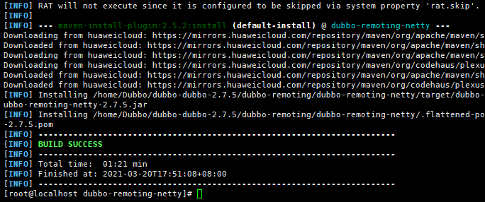
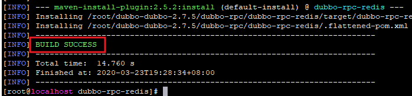
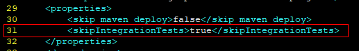

# Руководство по портированию Dubbo 2.7.5 (openEuler 20.03 LTS SP1)


## Введение

### Обзор

Dubbo — это высокопроизводительный сервисный фреймворк с открытым исходным кодом, предоставляемый компанией Alibaba, с помощью которого приложения выполняют ввод и вывод сервисных запросов через удаленный вызов процедур (RPC). Данный фреймворк легко интегрируется с фреймворком Spring. Фактически Dubbo представляет собой фреймворк RPC, основанный на Spring, который реализует удаленный вызов и управление сервисами.


### Рекомендуемая версия

Dubbo 2.7.5


## Требования к среде

### Аппаратное обеспечение

Требования к аппаратному обеспечению перечислены в [Табл. 1](https://support.huaweicloud.com/intl/en-us/prtg-dubbo-kunpengwebs/kunpengdubbo268_02_0002.html).

| Параметр              | Описание                   |
| --------------------- | -------------------------- |
| Центральный процессор | Процессор Kunpeng 920      |
| Сеть                  | Наличие доступа к Интернет |
| СХД                   | Нет требований             |
| Память                | Нет требований             |

### Операционная система

Требования к операционной системе перечислены в [Табл. 2](https://support.huaweicloud.com/intl/en-us/prtg-dubbo-kunpengwebs/kunpengdubbo268_02_0002.html).

| Параметр  | Версия                |
| --------- | --------------------- |
| openEuler | 20.03 LTS SP1 AArch64 |
| Ядро      | 4.19.90               |


## Конфигурирование среды компиляции

### Конфигурирование сервера DNS

```
# cat /etc/resolv.conf 
nameserver 114.114.114.114
nameserver 8.8.8.8
```

### Установка зависимостей

1. Загрузите и установите зависимости.

```
yum install java-1.8.0* tcl git gcc gcc-c++ make cmake libtool autoconf automake -y
```

2. Запросите версию Java.

```
[root@localhost ~]# java -version
openjdk version "1.8.0_272"
OpenJDK Runtime Environment Bisheng (build 1.8.0_272-b10)
OpenJDK 64-Bit Server VM Bisheng (build 25.272-b10, mixed mode)

```

### Установка Maven

1. Загрузите инсталляционный пакет Maven.

```
wget https://archive.apache.org/dist/maven/maven-3/3.6.3/binaries/apache-maven-3.6.3-bin.tar.gz
```

2. Разархивируйте инсталляционный пакет в указанный каталог.

```
tar -zxvf apache-maven-3.6.3-bin.tar.gz -C /opt/
```

3. Сконфигурируйте переменные среды Maven.

a. Добавьте путь к Maven в конце файла **/etc/profile**.

```
echo "MAVEN_HOME=/opt/apache-maven-3.6.3/" >> /etc/profile
echo 'export PATH=$MAVEN_HOME/bin:$PATH'  >> /etc/profile
```

b. Выполните операцию, чтобы измененные переменные среды вступили в силу.

```
source /etc/profile
```

4. Убедитесь, что конфигурация вступила в силу.

```
[root@localhost ~]# mvn -v
Apache Maven 3.6.3 (cecedd343002696d0abb50b32b541b8a6ba2883f)
Maven home: /opt/apache-maven-3.6.3
Java version: 1.8.0_272, vendor: Bisheng, runtime: /usr/lib/jvm/java-1.8.0-openjdk-1.8.0.272.b10-7.oe1.aarch64/jre
Default locale: en_US, platform encoding: UTF-8
OS name: "linux", version: "4.19.90-2012.4.0.0053.oe1.aarch64", arch: "aarch64", family: "unix"

```

5. В конфигурационном файле Maven измените локальный репозиторий, удаленный репозиторий и прокси.

Путь к конфигурационному файлу: **/opt/apache-maven-3.6.3/conf/settings.xml**

Сконфигурируйте сетевой прокси. Введите желаемые значения параметров **host**, **port**, **username** и **password**.

```
<proxies>
   <proxy>
     <id>my-proxy</id>
     <active>true</active>
     <protocol>https</protocol>
     <host>Proxy server URL</host>
     <port>Proxy server port</port>
     <username>User name</username>
     <password>Password</password>
     <nonProxyHosts>local.net|some.host.com</nonProxyHosts>
   </proxy>
   <proxy>
     <id>my-proxy1</id>
     <active>true</active>
     <protocol>http</protocol>
     <host>Proxy server URL</host>
     <port>Proxy server port</port>
     <username>User name</username>
     <password>Password</password>
     <nonProxyHosts>local.net|some.host.com</nonProxyHosts>
   </proxy>
</proxies>
```

Сконфигурируйте удаленный репозиторий.

```
<mirrors>
         <mirror>
                <id>huaweicloud</id>
                <mirrorOf>*</mirrorOf>
                <url>https://mirrors.huaweicloud.com/repository/maven/</url>
         </mirror>
</mirrors>
```

## Компиляция

### Получение исходного кода

```
mkdir /home/Dubbo && cd /home/Dubbo && wget https://github.com/apache/dubbo/archive/dubbo-2.7.5.tar.gz
&& tar -xvf dubbo-2.7.5.tar.gz
```

### Компиляция модуля dubbo-common

### Компиляция модуля dubbo-remoting-netty

1. Измените файл **NettyClientTest.java**.
   
   a. Откройте файл и замените значение **6000** в строке 76 значением **9000**.
   
   `vim /home/Dubbo/dubbo-dubbo-2.7.5/dubbo-remoting/dubbo-remoting-netty/src/test/java/org/apache/dubbo/remoting/transport/netty/NettyClientTest.java`
   
   
   b. Скомпилируйте модуль dubbo-remoting-netty.
   
   ```
   cd /home/Dubbo/dubbo-dubbo-2.7.5/dubbo-remoting/dubbo-remoting-netty && mvn install
   ```


Если на экране появится сообщение **BUILD SUCCESS**, значит модуль dubbo-remoting-netty скомпилирован.


### Компиляция модуля dubbo-rpc-redis

1. Получите пакет **embedded-redis-0.6.jar**, поддерживающий AArch64.

```
 mkdir -p /root/.m2/repository/com/github/kstyrc/embedded-redis/0.6/ && wget https://mirrors.huaweicloud.com/kunpeng/maven/com/github/kstyrc/embedded-redis/0.6/embedded-redis-0.6.jar -O /root/.m2/repository/com/github/kstyrc/embedded-redis/0.6/embedded-redis-0.6.jar
```

2. Скомпилируйте модуль dubbo-rpc-redis.

```
cd /home/Dubbo/dubbo-dubbo-2.7.5/dubbo-rpc/dubbo-rpc-redis/ && mvn install
```


Если на экране появится сообщение **BUILD SUCCESS**, значит модуль dubbo-rpc-redis скомпилирован.

### Компиляция модуля dubbo-remoting-etcd3

1. Установите Docker.

```
yum -y install docker
```

2. Настройте переменные среды.

```
echo "export TESTCONTAINERS_RYUK_DISABLED=true" >> /etc/profile && source /etc/profile
```

3. Измените файл **/root/.testcontainers.properties**.

```
echo "checks.disable=true" >>  /root/.testcontainers.properties
```

4. Замените пакет **jetcd-launcher-0.3.0.jar** пакетом, поддерживающим образ ARM64.

```
wget https://mirrors.huaweicloud.com/kunpeng/maven/io/etcd/jetcd-launcher/0.3.0/jetcd-launcher-0.3.0.jar -O /root/.m2/repository/io/etcd/jetcd-launcher/0.3.0/jetcd-launcher-0.3.0.jar
```

5. Скомпилируйте модуль dubbo-remoting-etcd3.

```
cd /home/Dubbo/dubbo-dubbo-2.7.5/dubbo-remoting/dubbo-remoting-etcd3/ && mvn install
```


Если на экране появится сообщение **BUILD SUCCESS**, значит модуль dubbo-remoting- etcd3 скомпилирован.

### Компиляция модуля dubbo-registry-consul

```
cd /home/Dubbo/dubbo-dubbo-2.7.5/dubbo-registry/dubbo-registry-consul/ && mvn install

```

Если во время компиляции появится сообщение «EmbeddedConsul Could not start Consul process in...», сохраните пакет **consul\_1.1.0\_linux\_arm64.zip** версии ARM64 в каталоге **local /tmp/embedded-consul-1.1.0**.

```
wget https://releases.hashicorp.com/consul/1.1.0/consul_1.1.0_linux_arm64.zip && unzip consul_1.1.0_linux_arm64.zip && mv consul /tmp/embedded-consul-1.1.0/consul
```

Затем повторно скомпилируйте модуль.


Если на экране появится сообщение **BUILD SUCCESS**, значит модуль dubbo-registry-consul скомпилирован.

### Изменение остальных конфигурационных файлов

1. Замените пакет **netty-all-4.1.25.Final.jar** в локальном репозитории.
   
   ```
   mkdir -p /root/.m2/repository/io/netty/netty-all/4.1.25.Final/ && wget https://mirrors.huaweicloud.com/kunpeng/maven/io/netty/netty-all/4.1.25.Final/netty-all-4.1.25.Final.jar -O  /root/.m2/repository/io/netty/netty-all/4.1.25.Final/netty-all-4.1.25.Final.jar
   ```

2. Измените файл **/home/Dubbo/dubbo-dubbo-2.7.5/dubbo-config/dubbo-config-api/pom.xml**.
   
   1. Откройте файл **pom.xml**.
      
      `vim /home/Dubbo/dubbo-dubbo-2.7.5/dubbo-config/dubbo-config-api/pom.xml`
   
   2. Добавьте следующий код. Сохраните файл и выйдите.
      
      - Добавьте следующий код в строку 31:
        
        ```
                <skipIntegrationTests>true</skipIntegrationTests>
        ```
        
        
      
      - Добавьте следующий код в строку 206:
        
        ```
            <build>
                <plugins>
                    <plugin>
                        <groupId>org.apache.maven.plugins</groupId>
                        <artifactId>maven-surefire-plugin</artifactId>
                        <configuration>
                            <skipTests>${skipIntegrationTests}</skipTests>
                        </configuration>
                    </plugin>
                </plugins>
            </build>
        ```
        
        

3. Измените файл **/home/Dubbo/dubbo-dubbo-2.7.5/dubbo-compatible/pom.xml**.
   
   1. Откройте файл **pom.xml**.
      
      `vim /home/Dubbo/dubbo-dubbo-2.7.5/dubbo-compatible/pom.xml`
   
   2. Добавьте следующий код. Сохраните файл и выйдите.
      
      - Добавьте следующий код в строку 30:
        
        ```
            <properties>
                <skipIntegrationTests>true</skipIntegrationTests>
            </properties>
        ```
        
        
      
      - Добавьте следующий код в строку 110:
        
        ```
            <build>
                <plugins>
                    <plugin>
                        <groupId>org.apache.maven.plugins</groupId>
                        <artifactId>maven-surefire-plugin</artifactId>
                        <configuration>
                            <skipTests>${skipIntegrationTests}</skipTests>
                        </configuration>
                    </plugin>
                </plugins>
            </build>
        ```
        
        


### Компиляция Dubbo 2.7.5

В конец строки 592 файла **/home/Dubbo/dubbo-dubbo-2.7.5/pom.xml** добавьте следующее содержание:

```
<configuration>
	<testFailureIgnore>true</testFailureIgnore>
</configuration>
```


Если на экране появится сообщение **BUILD SUCCESS**, значит Dubbo 2.7.5 скомпилирован.

Созданный после компиляции пакет **dubbo-2.7.5.jar** сохраняется в каталоге **dubbo-all/target**.