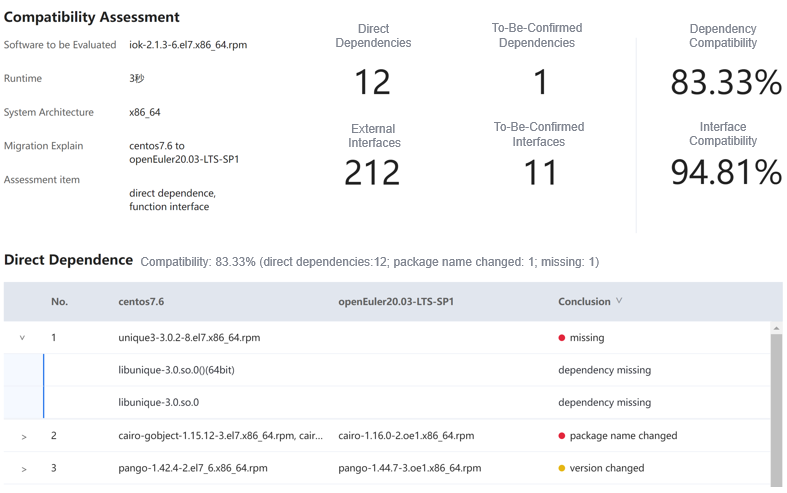
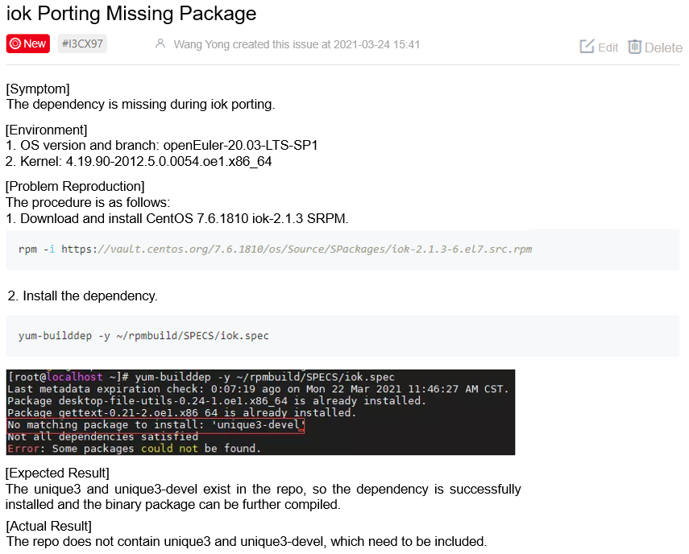

# Руководство по портированию iok 2.1.3 (openEuler 20.03 LTS SP1)

## Введение

> iok — это утилита для переназначения клавиш клавиатуры и отображения текста на языках Индии.

### Версия

> 2.1.3

### Руководство по установке

> [https://docs.openeuler.org/en/docs/20.03\_LTS\_SP1/docs/Installation/Installation.html](https://docs.openeuler.org/en/docs/20.03\_LTS\_SP1/docs/Installation/Installation.html)

### Проверка версии ОС

```shell
cat /etc/os-release
```

  

### Проверка совместимости

#### Загрузите iok-2.1.3 SRPM.

```
wget http://mirror.centos.org/centos/7/os/x86_64/Packages/iok-2.1.3-6.el7.x86_64.rpm
```

#### Загрузите x2openEuler.

```
wget https://repo.oepkgs.net/openEuler/rpm/openEuler-20.03-LTS-SP1/stable/contrib/x2openEuler/noarch/Packages/x2openEuler-1.0-1.noarch.rpm

User guide:
https://gitee.com/openeuler/docs/blob/stable2-20.03_LTS_SP1/docs/en/docs/thirdparty_migration/x2openEuleruseguide.md
```

#### Установите x2openEuler.

```
rpm -ivh x2openEuler-1.0-1.noarch.rpm
```

> Примечание. Пакет RPM может установить пользователь с правами администратора (**root)**. Для загрузки и установки зависимостей необходимо сетевое соединение. 
>
> Примечание. Установите зависимости, например **bzip2-devel,** следуя инструкциям.

```
su x2openEuler
x2openEuler redis-db -init
```

> Последовательно введите следующую информацию о базе данных Redis.
>
> IP-адрес: 127.0.0.1
> Порт: 6379
> Индекс базы данных (0-16): 0
> Пароль (шифруется инструментом): если пароль Redis не установлен или не заполнен, нажмите **Enter**.

```
x2openEuler init source_centos7.6-openEuler20.03-LTS-SP1.tar.gz
```

> Примечание. После установки x2openEuler с помощью пакета RPM в каталоге **/opt/x2openEuler** создается пакет с ресурсами по умолчанию (source\_centos7.6-openEuler20.03-LTS-SP1.tar.gz). Для поддержки оценки совместимости аппаратного обеспечения с операционными системами CentOS 8.2 и openEuler 20.03 LTS SP1 необходимо получить и импортировать соответствующий пакет со статическими ресурсами. Например, если пакетом ресурсов является **source\_centos8.2-openEuler20.03-LTS-SP1.tar.gz**, выполните команду **x2openEuler init source\_centos8.2-openEuler20.03-LTS-SP1.tar.gz**, чтобы импортировать пакет.

#### Выполните сканирование программы.

```
x2openEuler scan iok-2.1.3-6.el7.x86_64.rpm
The x2openEuler user must have the read permission on the file to be analyzed.
After the scan is complete, an HTML report is generated in the /opt/x2openEuler/output directory.
```

## Просмотр результатов оценки

Отчет с результатами оценки совместимости программного обеспечения состоит из трех частей: совместимость зависимостей, совместимость с интерфейсом C/C++ и совместимость с интерфейсом Java. Результат совместимости зависимостей показывает, какие прямые зависимости требуются во время установки программного обеспечения. Если совместимость зависимостей не 100%, установка не будет выполнена. Результат совместимости с интерфейсом показывает, к каким программным пакетам, динамическим библиотекам или интерфейсам системы идет обращение во время работы программы. Если совместимость с интерфейсом не 100%, вызов определенной функции может инициировать исключение. Некоторые результаты рекомендуется подтверждать вручную. Приоритет программных пакетов: пакеты, портированные в openEuler > пакеты, повторно вручную скомпилированные для openEuler > пакеты для CentOS.


> Результат: согласно отчету о зависимостях, прежде чем портировать iok в ОС openEuler 20.03 LTS SP1, необходимо устранить проблему с зависимостью unique3.

## Добавление зависимостей

- Создайте задачу по проблеме в репозитории [openEuler/oec-application repository](https://gitee.com/openeuler/oec-application).


- Отслеживайте задачу, пока отсутствующий пакет с зависимостью не будет включен в репозиторий YUM операционной системы openEuler 20.03 LTS SP1.

## Процесс компоновки

> После добавления отсутствующего пакета с зависимостью можно приступать к следующим операциям:

- Получите пакет CentOS 7.6.1810 SRPM для iok.
- Скомпонуйте бинарный пакет в openEuler 20.03 LTS SP1.

###Скомпонуйте бинарный пакет.

```shell
yum install -y rpm-build
```

- Установите пакет SRPM по сети.

```shell
rpm -i https://vault.centos.org/7.6.1810/os/Source/SPackages/iok-2.1.3-6.el7.src.rpm
```

- Установите зависимость.

```shell
yum-builddep -y ~/rpmbuild/SPECS/iok.spec
```

- Скомпонуйте бинарный пакет.

```shell
rpmbuild -bb ~/rpmbuild/SPECS/iok.spec
```

- Установите бинарный пакет.

```
rpm -i ~/rpmbuild/RPMS/x86_64/*.rpm
```

- Просмотрите бинарный пакет.

```
which iok
```