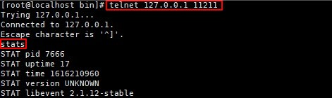

# Руководство по портированию Memcached 1.5.12

## Введение

#### Обзор

Memcached — это высокопроизводительный сервер кэширования объектов в оперативной памяти, разработанный основателем компании Danga Interactive и блог-платформы «Живой Журнал» Брэдом Фицпатриком (Brad Fitzpatric). Сервер используется для кэширования результатов запроса базы данных и сокращения времени доступа к базе данных, что повышает быстродействие и масштабируемость динамических веб-приложений.

Официальный веб-сайт Memcached: https://memcached.org/

Язык программирования: C.

Краткое описание: распределенная система кэширования объектов в оперативной памяти.

## Требования к среде

### Аппаратное обеспечение

В следующей таблице приведены требования к аппаратному обеспечению.  

| Параметр              | Описание                         |
| --------------------- | -------------------------------- |
| Сервер                | Сервер TaiShan 200 (модель 2280) |
| Центральный процессор | Процессор Kunpeng 920 5250       |
| Раздел диска          | Нет требований                   |

### Операционная система

В следующей таблице перечислены требования к операционной системе.  

| Параметр  | Версия                |
| --------- | --------------------- |
| openEuler | 20.03 LTS SP1 AArch64 |
| Ядро      | 4.19                  |

Проверьте текущую версию ОС.  

```
cat /etc/os-release
```

  

Подробную информацию об установке ОС openEuler см. в документе https://docs.openeuler.org/en/docs/20.03[\_LTS\_SP1/docs/Installation/Installation.html]().  

Примечание:

Рекомендуется выбрать режим установки «Server with GUI».

## Конфигурирование среды компиляции

Для компиляции Memcached необходимо подготовить следующие инструменты: компилятор на языке C, GNU, make, automake, libevent и libevent-devel.

1. Установите набор компиляторов GNU Compiler Collection (GCC). Если GCC уже установлен, пропустите этот шаг.  
   
   ```bash
   yum -y install gcc gcc-c++ kernel-devel 
   ```

2. Установите GNU make, Automake, unzip и Telnet. Если данные инструменты уже установлены, пропустите этот шаг.  
   
   ```bash
   yum -y install make automake unzip telnet
   ```

3. Установите libevent и libevent-devel.  
   
   ```bash
   yum -y install libevent libevent-devel
   ```

## Получение исходного кода

Если с сервера есть доступ к сети, загрузите пакет с исходным кодом, выполнив команду 
«wget https://github.com/memcached/memcached/archive/1.5.12.zip». Если доступа нет, перейдите на страницу https://github.com/memcached/memcached/archive/1.5.12.zip, загрузите пакет с исходным кодом и скопируйте его в каталог **/home** на сервере.

## Компиляция и установка Memcached

В приведенной процедуре компиляции и установки использован исходный код, загруженный на локальный ПК и затем выгруженный на сервер.

1. Распакуйте пакет с исходным кодом.  
   
   ```bash
   cd /home
   ```
   
   ```bash
   unzip 1.5.12.zip
   ```

2. Перейдите в каталог **memcached-1.5.12**.   
   
   ```bash
   cd memcached-1.5.12
   ```

3. Сконфигурируйте Memcached.  
   
   ```bash
   sh autogen.sh
   ```
   
   ```bash
   ./configure --prefix=/opt/memcached
   ```
   
   На этом шаге можно указать каталог установки Memcached, например **/opt/memcached**.  

4. Выполните операцию компиляции.  
   
   ```bash
   make -j60
   ```
   
   Для ускорения процесса компиляции **-j60** использует преимущества многоядерных процессоров.

5. Выполните установку.  
   
   ```bash
   make install
   ```

6. Перейдите в каталог установки Memcached — **/opt/memcached**. Если созданный каталог bin содержит исполняемый файл Memcached, установка успешно выполнена.  

7. Настройте переменные среды.  
   
   a. Добавьте к файлу **/etc/profile** следующую команду:  
   
   ```bash
   export PATH=/opt/memcached/bin/:$PATH
   ```
   
   b. Выполните операцию, чтобы переменные среды вступили в силу.  
   
   ```bash
   source /etc/profile
   ```

## Запуск и верификация Memcached  

- Запустите Memcached.  
  
  ```bash
  memcached -t 24 -p 11211 -u root -m 49152 -c 10240
  ```
  
  В следующей таблице перечислены параметры команды запуска.  

| Параметр | Описание                                                  | Значение по умолчанию                                        |
| -------- | --------------------------------------------------------- | ------------------------------------------------------------ |
| -t       | Счетчик потоков                                           | 4                                                            |
| -p       | Порт прослушивания TCP                                    | 11211                                                        |
| -u       | Пользователь, запускающий данный процесс                  | По умолчанию пользователь не имеет прав администратора (root). |
| -m       | Размер памяти (в МБ), выделенный под Memcached            | 64M                                                          |
| -c       | Максимальное количество параллельных соединений           | 1024                                                         |
| -d       | Данный параметр запускает процесс daemon в фоновом режиме | \-                                                           |

- Для подключения к Memcached запустите другое окно оболочки.  
  
  ```bash
  telnet 127.0.0.1 11211
  ```

- Подключившись, выполните команду stats для получения статистики по серверу Memcached.  
  
  ```bash
  stats
  ```
  
  


В [следующей таблице](https://support.huaweicloud.com/intl/en-us/prtg-kunpengwebs/kunpengmemcached_02_0006.html#kunpengmemcached_02_0006__table1896316817714) перечислены часто используемые команды stats.  

| Команда         | Описание                                                     |
| --------------- | ------------------------------------------------------------ |
| stats           | Команда выводит общую информацию Memcached, в том числе время запуска, объем сохраненных данных, коэффициент попадания в кэш и количество текущих соединений. |
| stats items     | Команда выводит информацию об элементах каждого слоя памяти (slab). |
| stats slabs     | Команда выводит детальную информацию о слоях памяти (slab).  |
| stats sizes     | Размер и количество всех элементов.                          |
| stats cachedump | Команда выводит фрагменты данных в одном слое. Если вводится 0, выводятся все данные в слое. |
| stats detail    | Команда включает и отключает операции (on/off) либо выводит (dump) подробные записи об операциях, таких как операции получения и настройки. |
| flush\_all      | Команда делает недействительными все элементы в памяти. Эта операция не приостанавливает работу сервера, поскольку память не освобождается, а существующие элементы помечаются как недействительные. |

Примечание:

Чтобы выйти из сеанса Telnet, выполните команду **quit**.  

```bash
quit
```

Помимо функции подключения к Memcached через сеанс Telnet и получения данных, в пакете с исходным кодом имеется ряд инструментальных скриптов, например memcached-tool, которые помещены в каталог скриптов.  

Подробную информацию об использовании memcached-tool см. в [следующей таблице](https://support.huaweicloud.com/intl/en-us/prtg-kunpengwebs/kunpengmemcached_02_0006.html#kunpengmemcached_02_0006__table15821759181818).  

| Команда                                       | Описание                                           |
| --------------------------------------------- | -------------------------------------------------- |
| ./memcached-tool localhost display            | Вывод информации о слоях памяти (slab).            |
| ./memcached-tool 10.0.0.5:11211 display       | Вывод информации о слоях памяти (slab).            |
| ./memcached-tool 10.0.0.5:11211 stats         | Вывод статистики кэширования в оперативной памяти. |
| ./memcached-tool 10.0.0.5:11211 settings      | Вывод настроек сервиса memcached.                  |
| ./memcached-tool 10.0.0.5:11211 sizes         | Размер и количество всех элементов.                |
| ./memcached-tool 10.0.0.5:11211 dump \[limit] | Ключи со значениями, полученные от каждого кэша.   |

