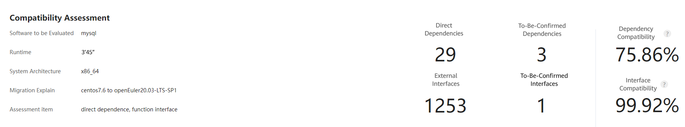

# Руководство по портированию базы данных MySQL 5.7.21 (openEuler 20.03 LTS SP1)

## 1\. Введение

В данном документе описывается метод развертывания базы данных MySQL в операционной системе openEuler 20.03 SP1.

MySQL — это защищенная, межплатформенная эффективная система базы данных, работающая с основными языками программирования, такими как PHP и Java. В данном документе используются виртуальные машины x86\_64. Для оценки совместимости MySQL 5.7.21 с ОС openEuler перед миграцией данных применяется инструмент x2openEuler.

Рекомендуется использовать версию MySQL 5.7.21.

> ПРИМЕЧАНИЕ. Данный документ составлен для версии MySQL 5.7.21. Однако его можно использовать для справки при портировании баз данных MySQL других версий.

## 2\. Среда

Аппаратное обеспечение

| Компонент              | Описание              |
| ---------------------- | --------------------- |
| Сервер                 | Сервер TaiShan 200    |
| Центральный процессор  | Процессор Kunpeng 920 |
| Карта RAID-контроллера | SAS3508               |
| NIC                    | Mellanox SP333        |
|                        | TM210                 |
|                        | TM280                 |
| Диск                   | 500 ГБ и больше       |

Операционные системы 

| Программное обеспечение | Версия              | Примечания                       |
| ----------------------- | ------------------- | -------------------------------- |
| ОС                      | CentOS 7.6.1810     | Актуальный сервер кластера MySQL |
| ОС                      | openEuler 20.03 SP1 | Целевой сервер                   |

Программные пакеты 

| Программное обеспечение | Версия |
| ----------------------- | ------ |
| mysql5                  | 5.7.21 |
| mysql5-common           | 5.7.21 |
| mysql5-embedded         | 5.7.21 |
| mysql5-embedded-devel   | 5.7.21 |
| mysql5-errmsg           | 5.7.21 |
| mysql5-libs             | 5.7.21 |
| mysql5-server           | 5.7.21 |
| mysql5-test             | 5.7.21 |


## 3\. Оценка совместимости программного обеспечения

Для оценки программных пакетов и интерфейсов скомпилированных бинарных программных модулей сообщество openEuler предлагает использовать инструмент [x2openEuler](https://repo.oepkgs.net/openEuler/rpm/openEuler-20.03-LTS-SP1/stable/contrib/x2openEuler/noarch/Packages/), который определяет необходимость адаптации прикладной программы и установку каких-либо зависимостей. Также инструмент выявляет, имеются ли какие-либо отличия между прототипами интерфейсов, к которым обращается программа, двух операционных систем.

Примечание. Получить скомпилированную бинарную программу, полностью совместимую с целевой ОС, довольно проблематично, поэтому всегда есть риск с работой памяти. И поскольку выявить эту проблему с помощью обычной верификации сложно, оценка совместимости программного обеспечения становится важной процедурой, которую необходимо выполнить перед портированием.

#### 3.1 Получите RPM-пакет MySQL и распакуйте его в каталог /opt/mysql.

```
wget -P /opt https://downloads.mysql.com/archives/get/p/23/file/mysql-5.7.21-1.el7.x86_64.rpm-bundle.tar
```

```
cd /opt/
mkdir mysql
tar -xf mysql-5.7.21-1.el7.x86_64.rpm-bundle.tar -C mysql
```

#### 3.2 Загрузите инструмент x2openEuler в каталог /opt/mysql.

```
cd /opt/mysql
wget https://repo.oepkgs.net/openEuler/rpm/openEuler-20.03-LTS-SP1/stable/contrib/x2openEuler/noarch/Packages/x2openEuler-1.0-1.noarch.rpm
```

#### 3.3 Установите инструмент.

```
cd /opt/mysql
rpm -ivh x2openEuler-1.0-1.noarch.rpm
```

> Примечание. Пакет RPM может установить пользователь с правами администратора (**root)**. Для загрузки и установки зависимостей необходимо сетевое соединение.
>
> Примечание. Установите зависимости, например **bzip2-devel,** следуя инструкциям.

```
su x2openEuler
x2openEuler redis-db -init
```

Последовательно введите следующую информацию о базе данных Redis. 

IP-адрес: 127.0.0.1
Порт: 6379
Индекс базы данных (0-16): 0
Пароль (пароль шифруется инструментом): если пароль Redis не установлен или не заполнен, нажмите **Enter**.

```
x2openEuler init source_centos7.6-openEuler20.03-LTS-SP1.tar.gz
```

> Примечание. После установки x2openEuler с помощью пакета RPM в каталоге **/opt/x2openEuler** создается пакет с ресурсами по умолчанию (source\_centos7.6-openEuler20.03-LTS-SP1.tar.gz). Для поддержки оценки совместимости аппаратного обеспечения с операционными системами CentOS 8.2 и openEuler 20.03 LTS SP1 необходимо получить и импортировать соответствующий пакет со статическими ресурсами. Например, если пакетом ресурсов является **source\_centos8.2-openEuler20.03-LTS-SP1.tar.gz**, выполните команду **x2openEuler init source\_centos8.2-openEuler20.03-LTS-SP1.tar.gz**, чтобы импортировать пакет.

#### 3.4 Выполните сканирование MySQL.

```
x2openEuler scan /opt/mysql/
The x2openEuler user must have the read permission on the file to be analyzed.
After the scan is complete, an HTML report is generated in the /opt/x2openEuler/output directory.
```

## 4\. Анализ результатов оценки

Отчет с результатами оценки совместимости программного обеспечения состоит из трех частей: совместимость зависимостей, совместимость с интерфейсом C/C++ и совместимость с интерфейсом Java. Результат совместимости зависимостей показывает, какие прямые зависимости требуются во время установки программного обеспечения. Если совместимость зависимостей не 100%, установка не будет выполнена. Результат совместимости с интерфейсом показывает, к каким программным пакетам, динамическим библиотекам или интерфейсам системы идет обращение во время работы программы. Если совместимость с интерфейсом не 100%, вызов определенной функции может инициировать исключение. Некоторые результаты рекомендуется подтверждать вручную. Приоритет программных пакетов: пакеты, портированные в openEuler > пакеты, повторно вручную скомпилированные для openEuler > пакеты для CentOS.

#### 4.1 Анализ отчета

```
Open and view the HTML report line by line. In the example below, the report shows that using the CentOS MySQL package on openEuler may cause the following risk:
One to-be-confirmed interface indicates that the MySQL series packages call libaio.so.1.0.1, and that the number of function parameters changes from 4 to 5. When the function is called, an exception may be triggered.

In addition, the report shows that three dependencies need to be confirmed. Manual confirmation confirms that they are self-closed-loop dependencies of the MySQL series packages. Therefore, the software installation is not affected.
```



#### 4.2 Рекомендации

```
Suggestion: To avoid function call risks, you are advised to use the MySQL 5.7.21 series software packages that have been compiled and released on the openEuler community.
https://repo.openeuler.org/openEuler-20.03-LTS-SP1/everything/x86_64/Packages/mysql5-5.7.21-3.oe1.x86_64.rpm
https://repo.openeuler.org/openEuler-20.03-LTS-SP1/everything/x86_64/Packages/mariadb-common-10.3.9-9.oe1.x86_64.rpm
https://repo.openeuler.org/openEuler-20.03-LTS-SP1/everything/x86_64/Packages/mysql5-common-5.7.21-3.oe1.x86_64.rpm
https://repo.openeuler.org/openEuler-20.03-LTS-SP1/everything/x86_64/Packages/mysql5-server-5.7.21-3.oe1.x86_64.rpm
https://repo.openeuler.org/openEuler-20.03-LTS-SP1/everything/x86_64/Packages/mysql5-errmsg-5.7.21-3.oe1.x86_64.rpm
https://repo.openeuler.org/openEuler-20.03-LTS-SP1/everything/x86_64/Packages/mecab-0.996-2.oe1.x86_64.rpm
```

## 5\. Установка базы данных MySQL

#### 5.1 Установка MySQL и настройка пароля

**(1) Установите службы MariaDB и MySQL.**

rpm -ivh mysql5-5.7.21-3.oe1.x86\_64.rpm mariadb-common-10.3.9-9.oe1.x86\_64.rpm mysql5-common-5.7.21-3.oe1.x86\_64.rpm mysql5-server-5.7.21-3.oe1.x86\_64.rpm mecab-0.996-2.oe1.x86\_64.rpm mysql5-errmsg-5.7.21-3.oe1.x86\_64.rpm

**(2) Запустите MySQL.**

systemctl start mysqld

**(3) Запросите статус MySQL.**

systemctl status mysqld

Если статус — Running, служба MySQL успешно запущена в работу.

```
root@vm-2p32g.2288hv5-2s44p-384g--b5-0 ~# systemctl status mysqld

● mysqld.service - MySQL 5.7 database server

  Loaded: loaded (/usr/lib/systemd/system/mysqld.service; disabled; vendor preset: disabled)

  Active: active (running) since Thu 2021-09-09 10:23:25 CST; 1 day 4h ago

 Process: 103715 ExecStartPre=/usr/libexec/mysql-check-socket (code=exited, status=0/SUCCESS)

 Process: 103738 ExecStartPre=/usr/libexec/mysql-prepare-db-dir mysqld.service (code=exited, sta>

 Process: 103773 ExecStart=/usr/libexec/mysqld --daemonize --basedir=/usr --pid-file=/run/mysqld>

 Process: 103803 ExecStartPost=/usr/libexec/mysql-check-upgrade (code=exited, status=0/SUCCESS)

 Main PID: 103775 (mysqld)

  Tasks: 37

  Memory: 188.4M

  CGroup: /system.slice/mysqld.service

​      └─103775 /usr/libexec/mysqld --daemonize --basedir=/usr --pid-file=/run/mysqld/mysqld.
```

**(4) Войдите в базу данных и измените пароль по умолчанию.**

mysql -uroot -p

a.     По умолчанию пароль не задан. Нажмите **Enter**, чтобы войти.

```
root@vm-2p32g.2288hv5-2s44p-384g--b5-0 /# mysql -uroot -p

Enter password: 

Welcome to the MySQL monitor. Commands end with ; or \g.

Your MySQL connection id is 2

Server version: 5.7.21 MySQL Community Server (GPL)

 
Copyright (c) 2000, 2018, Oracle and/or its affiliates. All rights reserved.

 
Oracle is a registered trademark of Oracle Corporation and/or its

affiliates. Other names may be trademarks of their respective

owners.


Type 'help;' or '\h' for help. Type '\c' to clear the current input statement.

mysql>
```

b.     Задайте пароль.

Измените пользователя 'user'@'localhost', определяемого по 'passward';

```
mysql> alter user 'root'@'localhost' identified by '123456';

Query OK, 0 rows affected (0.00 sec)

mysql> flush privileges;

Query OK, 0 rows affected (0.00 sec)

mysql>
```

> Чтобы настройки вступили в силу, необходимо выполнить команду **flush privileges**.

**(5) Проверьте пароль.**

Выйдите и снова войдите в службу MySQL, чтобы удостовериться в успешном изменении пароля.

```
root@vm-2p32g.2288hv5-2s44p-384g--b5-0 /# mysql -uroot -p

Enter password: 

Welcome to the MySQL monitor. Commands end with ; or \g.

Your MySQL connection id is 3

Server version: 5.7.21 MySQL Community Server (GPL)


Copyright (c) 2000, 2018, Oracle and/or its affiliates. All rights reserved.

 
Oracle is a registered trademark of Oracle Corporation and/or its

affiliates. Other names may be trademarks of their respective

owners.


Type 'help;' or '\h' for help. Type '\c' to clear the current input statement.


mysql>
```