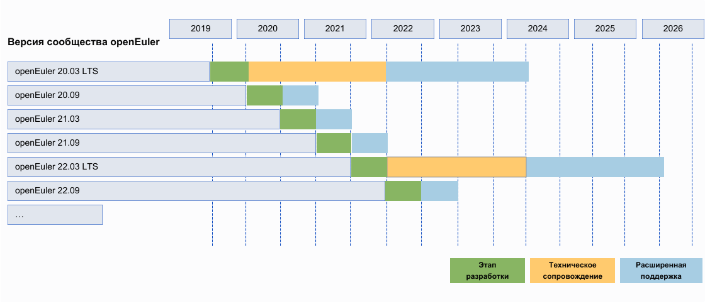

## Жизненный цикл

Релизам openEuler присваиваются имена по номеру издания в соответствии с годом и месяцем выпуска. Например, релиз openEuler 20.09 был выпущен в сентябре 2020 года.

Релизы сообщества классифицируются на релиз с долгосрочной поддержкой (LTS) и инновационный релиз.

- **Релиз LTS**. Данный релиз выпускается каждые 2 года, а поддержку сообщество предоставляет в течение 4 лет, начиная с даты выпуска. Первый релиз LTS сообщества openEuler 20.03 был официально выпущен в марте 2020 года.

- **Инновационный релиз сообщества.** Данный релиз выпускается каждые 6 месяцев между двумя релизами LTS, а поддержку сообщество предоставляет в течение 6 месяцев, начиная с даты выпуска. Следующий релиз будет выпущен в марте 2021 года.

