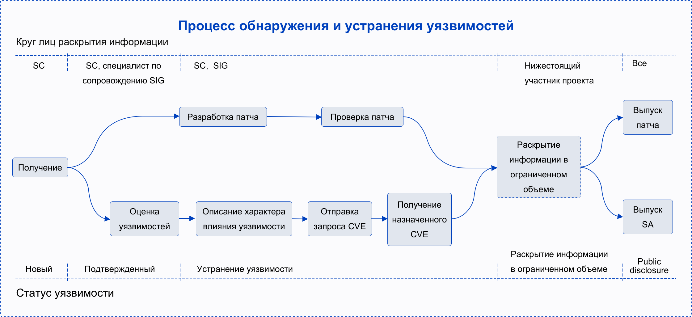
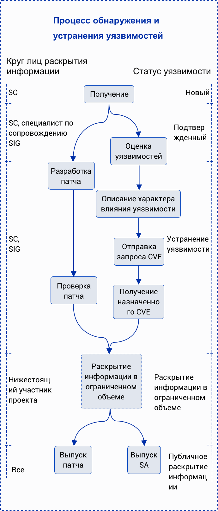

<ClientOnly>
  <security-reporting />
</ClientOnly>

## Меры по устранению уязвимостей
Сообщество openEuler придает большое значение вопросу безопасности выпускаемых версий. Комитет по безопасности openEuler выполняет функции приема информации о уязвимостях в системе безопасности сообщества, их изучения и раскрытия данной информации. Разработчикам и отраслевым организациям, занимающимся выявлением и устранением уязвимостей, рекомендуется сообщать о потенциальных проблемах в системе безопасности openEuler в комитет по безопасности. Комитет оперативно проанализирует и решит проблемы безопасности и устранит возникшие уязвимости.

## Поддерживаемые версии

Процесс принятия мер в ответ на уязвимости предусматривает использованием LTS-дистрибутивов сообщества openEuler и его веток.

## Процесс обнаружения и устранения уязвимостей

За отслеживание и устранение каждой уязвимости в системе безопасности отвечает отдельно назначенное лицо. Являясь членом комитета по безопасности сообщества openEuler, данный специалист отслеживает возникающие уязвимости, принимает меры для их устранения и передает информацию остальным участникам. На следующей блок-схеме показан комплексный процесс обнаружения и устранения уязвимостей.

## Сообщение об уязвимостях

Сообщество openEuler полагается на вашу готовность сообщать о потенциальных уязвимостях, обнаруженных в продукте openEuler, а также вашу помощь сообществу в их устранении и раскрытии информации.

### Способ передачи отчета об уязвимостях

Вы можете отправлять информацию о потенциальных уязвимостях, найденных в продукте openEuler, по электронной почте группы специалистов по безопасности openEuler (<openeuler-security@openeuler.org>). Учитывая, что информация об уязвимостях является конфиденциальной, рекомендуется для шифрования электронных сообщений использовать <a :href="$withBase('/vulnerability-reporting/public_key_openeuler_security.asc')" download>открытый PGP-ключ</a> данной группы. Информация о включенных в группу безопасности сотрудниках:

+ Лю Цзиньган (Liu Jingang) \[@liujingang09], <liujingang09@huawei.com>, <a :href="$withBase('/vulnerability-reporting/public_key_liujingang.asc')" download>открытый PGP-ключ</a>
+ Ян Ли (Yang Li) \[@yangli69393], <runningforever@gmail.com>
+ Янь Сяобин (Yan Xiaobing) \[@yanxiaobing2020], <yanxiaobing@huawei.com>, <a :href="$withBase('/vulnerability-reporting/public_key_yanxiaobing.asc')" download>открытый PGP-ключ</a>
+ Чжу Цзяньвэй (Zhu Jianwei) \[@zhujianwei001], <zhujianwei7@huawei.com>, <a :href="$withBase('/vulnerability-reporting/public_key_zhujianwei.asc')" download>открытый PGP-ключ</a>
+ Вэй Ган (Wei Gang) \[@gwei3], <11015100@qq.com>, <a :href="$withBase('/vulnerability-reporting/public_key_weigang.asc')" download>открытый PGP-ключ</a>
+ Го Сяоци (Guo Xiaoqi) \[@guoxiaoqi], <guoxiaoqi2@huawei.com>, <a :href="$withBase('/vulnerability-reporting/public_key_guoxiaoqi.asc')" download>открытый PGP-ключ</a>
+ Ян Лицзинь (Yang Lijin) \[@jinjin], <yanglijin@huawei.com>

### Содержание отчетов

Для оперативного выявления и проверки потенциальных уязвимостей отправляемый по электронной почте отчет должен содержать в том числе следующую информацию:

+ Основная информация: модули, подверженные влиянию уязвимости, условия ее возникновения и масштаб влияния на систему после ее использования.
+ Технические детали: конфигурация системы, метод обнаружения проблемы, описание эксплойта, POC-код, а также метод и процедура воспроизведения сценария проблемы.
+ Предложения по устранению уязвимости.
+ Организация и контактная информация лица, сообщившего об уязвимости.
+ Возможный план по раскрытию информации об уязвимости, предложенный сообщившим лицом.

### Ответ по электронной почте

Сообщество обязуется ответить на сообщения о потенциальных уязвимостях в системе безопасности по электронной почте в течение 48 часов и в дальнейшем информировать сообщившее лицо о ходе выполнения работ по устранению уязвимостей.

## Оценка степени серьезности уязвимости

Для оценки степени уязвимости в отрасли широко применяется система общей оценки уязвимости (Common Vulnerability Scoring System; CVSS). В настоящее время для оценки уязвимостей openEuler использует CVSS версии v3, и получаемая таким образом оценка акцентируется на степени влияния, которое оказывает уязвимость в спланированном сценарии атаки. Оценка степени уязвимости охватывает такие факторы, как сложность вредоносного кода и последствия его влияния на конфиденциальность, целостность и доступность продукта. Балл подсчитывается после оценки этих факторов.

### Критерии оценки

В системе CVSS версии v3, принятой сообществом openEuler, оцениваются последствия уязвимости на основе следующих переменных:

+ Вектор атаки (Attack vector; AV): определяет удаленность атаки и способ применения данной уязвимости.
+ Сложность атаки (Attack complexity; АС): описывает сложность атаки и условия для успешного ее применения.
+ Взаимодействие с пользователем (User interaction; UI): данный критерий определяет вовлечение пользователей в атаку.
+ Требуемые полномочия (Permission required; PR): уровень полномочий пользователя, необходимый для успешной атаки.
+ Область действия (Scope; S): данный критерий определяет вероятность воздействия атаки на компоненты с различными уровнями разрешений.
+ Конфиденциальность (Confidentiality; С): данный критерий измеряет степень влияния несанкционированного раскрытия информации.
+ Целостность (Integrity; I): данный критерий измеряет степень влияния незаконного искажения информации.
+ Доступность (Availability; A): данный критерий измеряет степень влияния уязвимости на доступ к данным или предоставляемые пользователям услуги.

### Принципы оценки

+ Принцип заключается в оценке степени серьезности уязвимости, а не риска ее возникновения.
+ Оценка должна учитывать сценарий, в котором атака затрагивает конфиденциальность, целостность и доступность системы.
+ Если уязвимость в системе безопасности реализуется посредством нескольких сценариев, то в оценке будет превалировать сценарий атаки с наивысшим баллом CVSS (т.е. с наибольшей степенью влияния).
+ Если во встроенной или вызванной библиотеке есть уязвимости, оценка степени серьезности уязвимости должна основываться на сценарии атаки, который определяется уровнем загруженности библиотеки в продукте.
+ Если уязвимость в системе безопасности не инициирует процедуру устранения и не влияет на конфиденциальность, целостность и доступность (confidentiality/integrity/availability; CIA), то балл по CVSS-системе равен 0.

### Процедура оценки

Для оценки уязвимости необходимо выполнить следующую процедуру:

+ Определите возможный сценарий выполнения атаки и подсчитайте балл на его основе.
+ Определите уязвимые компоненты и затронутые проблемой компоненты.
+ Выберите значение базового индикатора оценки и проведите оценку степени влияния уязвимости на основе критериев масштаба ее распространения (вектор атаки, сложность атаки, требуемые полномочия, взаимодействие с пользователем и область действия) и показателей масштаба затронутых областей (конфиденциальность, целостность и доступность).

### Оценка степени серьезности

<table board="2" class="table table-bordered table-striped">     
      <thead>
          <tr>
              <th align="left" style="width:40px">Severity Rating</th>
              <th align="left" style="width:40px">Score</th>
          </tr>
          <tr>
              <td align="left">Critical</td>
              <td>9.0 - 10.0</td>
          </tr>
          <tr>
              <td align="left">High</td>
              <td>7.0 - 8.9</td>
          </tr>
           <tr>
              <td align="left">Medium</td>
              <td>4.0 - 6.9</td>
          </tr>
          <tr>
              <td align="left">Low</td>
              <td>0.1 - 3.9</td>
          </tr>
          <tr>
              <td align="left">None</td>
              <td>0.0</td>              
          </tr>          
      </thead>      
  </table>
### Оценка различий между Национальной базой данных уязвимостей и CVSS

Оценка CVSS определяется рядом факторов, включая номер версии затронутого компонента и способ его предоставления и использования, а также метод компиляции платформы и программного обеспечения. При оценке посредством Национальной базы данных уязвимостей (NVD) учитываются все сценарии, в которых применяются вредоносные коды. Этот способ оценки не подходит сообществу openEuler разработчиков ПО с открытым исходным кодом, деятельность которого построена на деятельности вышестоящего сообщества, и применяется, в основном, в серверных сценариях. В результате, openEuler оценивает все общеизвестные уязвимости информационной безопасности (Common Vulnerabilities and Exposures; CVE) на основе степени их воздействия. Баллы, полученные в результате оценки openEuler и методом NVD, могут отличаться.

## Раскрытие информации об уязвимостях

В целях обеспечения безопасности пользователей продуктов openEuler сообщество openEuler не будет обсуждать и подтверждать проблемы с безопасностью любого продукта openEuler, а также раскрывать информацию о таких проблемах, пока данная уязвимость не будет изучена и устранена и пока не будет опубликовано соответствующее уведомление о безопасности. Устранив уязвимость, сообщество openEuler выпустит уведомление о безопасности, которое будет содержать в том числе такую информацию, как технические детали, идентификатор CVE, оценку безопасности CVSS и уровень серьезности уязвимости, а также версии, затронутые уязвимостью, и исправленные версии. Вы можете подписаться на получение уведомлений о безопасности от сообщества openEuler на странице <a href="https://mailweb.openeuler.org/postorius/lists/sa-announce.openeuler.org/" download>sa-announce</a>.Предоставляем также уведомления о безопасности в формате CVRF, которые можно получить по ссылке [Документация CVRF](https://repo.openeuler.org/security/data/cvrf/).

