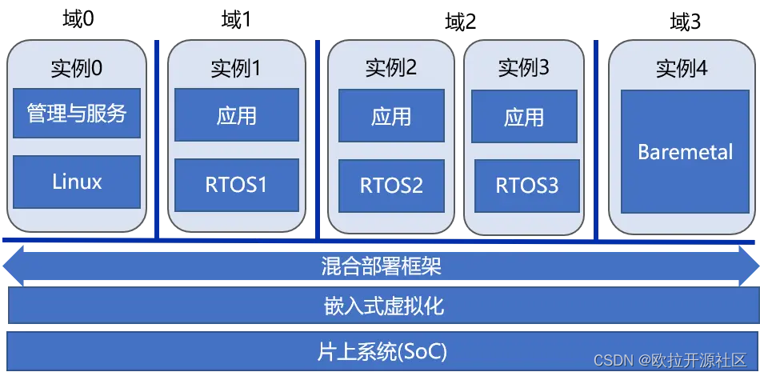
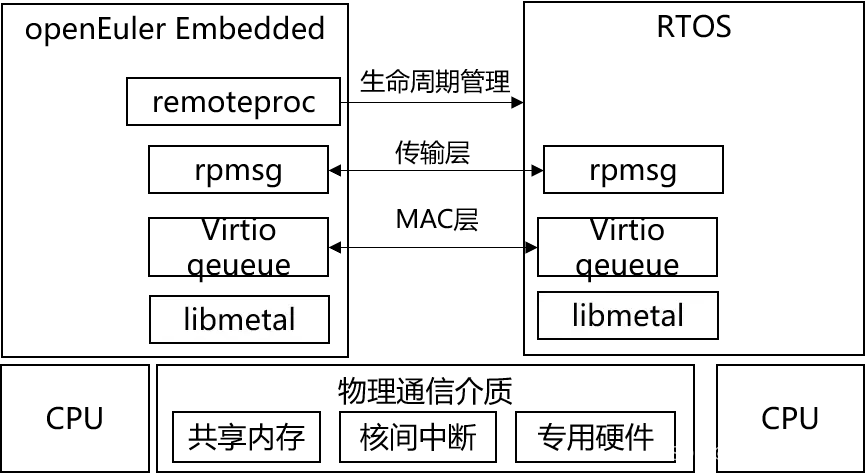
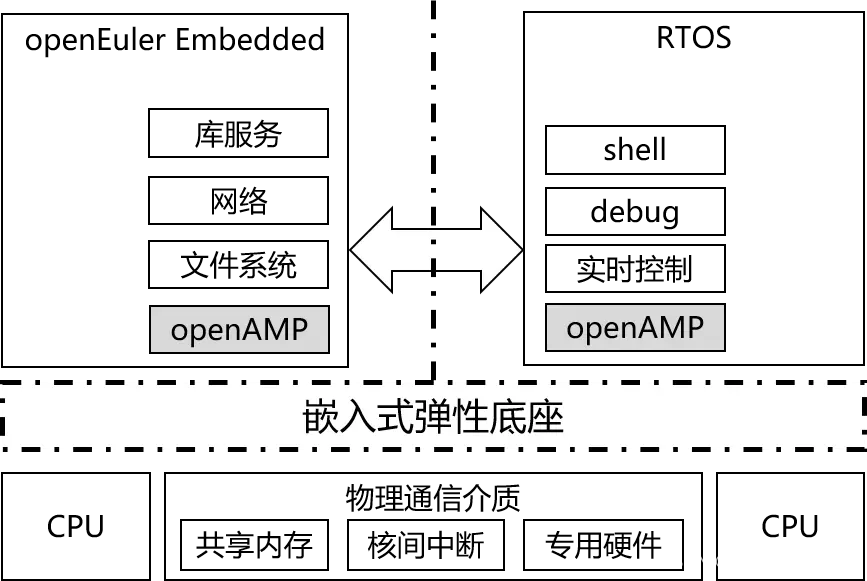

---
title: Embedded SIG | 多 OS 混合部署框架
date: 2022-06-28
tags:
    - Embedded
    - 嵌入式
archives: 2022-06
author: openEuler
summary: 在嵌入式场景中，虽然 Linux 已经得到了广泛应用，但并不能覆盖所有需求，例如高实时、高可靠、高安全的场合。这些场合往往是实时操作系统的用武之地。结合自身原有的特点，嵌入式系统未来演进的方向之一就是……
---

## 背景：混合关键性系统

在嵌入式场景中，虽然 Linux 已经得到了广泛应用，但并不能覆盖所有需求，例如高实时、高可靠、高安全的场合。这些场合往往是实时操作系统的用武之地。有些应用场景需要 Linux 的管理能力、丰富的生态又需要实时操作系统的高实时、高可靠、高安全，那么一种典型的设计是采用一颗性能较强的处理器运行 Linux 负责富功能，一颗微控制器 / DSP / 实时处理器运行实时操作系统负责实时控制或者信号处理，两者之间通过 I/O、网络或片外总线的形式通信。这种方式存在的问题是，硬件上需要两套系统、集成度不高，通信受限与片外物理机制的限制如速度、时延等，软件上 Linux 和实时操作系统两者之间是割裂的，在灵活性上、可维护性上存在改进空间。

受益于硬件技术的快速发展，嵌入式系统的硬件能力越来越强大，如单核能力不断提升、单核到多核、异构多核乃至众核的演进，虚拟化技术和可信执行环境（TEE）技术的发展和应用，未来先进封装技术会带来更高的集成度等等，使得在一个片上系统中（SoC）部署多个 OS 具备了坚实的物理基础。

同时，受应用需求的推动，如物联网化、智能化、功能安全与信息安全等等，整个嵌入式软件系统也越发复杂，全部由单一 OS 承载所有功能所面临的挑战越来越大。解决方式之一就是不同系统负责各自所擅长的功能，如 Windows 的 UI、Linux 的网络通信与管理、实时操作系统的高实时与高可靠等，而且还要易于开发、部署、扩展，实现的形式可以是容器、虚拟化等。

面对上述硬件和应用的变化，结合自身原有的特点，嵌入式系统未来演进的方向之一就是 **「混合关键性系统（MCS，Mixed Criticality System）」** , 这可以从典型的嵌入式系统 —— 汽车电子的最近发展趋势略见一斑。

「图 1」 
openEuler Embedded 中的混合关键性系统大致架构

从 openEuler Embedded 的角度，混合关键性系统的大致架构如图 1 所示，所面向的硬件是具有同构或异构多核的片上系统，从应用的角度看会同时部署多个 OS / 运行时，例如 Linux 负责系统管理与服务、1 个实时操作系统负责实时控制、1 个实时操作系统负责系统可靠、1 个裸金属运行时运行专用算法，全系统的功能是由各个 OS / 运行时协同完成。中间的「混合部署框架」和「嵌入式虚拟化」是具体的支撑技术。关键性（Criticality）狭义上主要是指功能安全等级，参考泛功能安全标准 IEC-61508，Linux 可以达到 SIL1 或 SIL2 级别，实时操作系统可以达到最高等级 SIL3；广义上，关键性可以扩展至实时等级、功耗等级、信息安全等级等目标。

在这样的系统中，需要解决如下几个问题：

 - 「高效地混合部署问题」：如何高效地实现多 OS 协同开发、集成构建、独立部署、独立升级。
 - 「高效地通信与协作问题」：系统的整体功能由各个域协同完成，因此如何高效地实现不同域之间高效、可扩展、实时、安全的通信。
 - 「高效地隔离与保护问题」：如何高效地实现多个域之间的强隔离与保护，使得出故障时彼此不互相影响，以及较小的可信基（Trust Compute
   Base）。
- 「高效地资源共享与调度问题」：如何在满足不同目标约束下（实时、功能安全、性能、功耗），高效地管理调度资源，从而提升硬件资源利用率。

对于上述问题，openEuler Embedded 的当前思路是 **「混合关键性系统 = 部署 + 隔离 + 调度」** ，即首先实现多 OS 的混合部署，再实现多 OS 之间的隔离与保护，最后通过混合关键性调度提升资源利用率，具体可以映射到 **「混合部署框架」** 和 **「嵌入式虚拟化」** 。混合部署框架解决 **「高效地混合部署问题」** 和 **「高效地通信与协作问题」** ，嵌入式虚拟化解决 **「高效地隔离与保护问题」** 和 **「高效地资源共享与调度问题」** 。

## 多 OS 混合部署框架

openEuler Embedded 中多 OS 混合部署框架的架构图如下所示，引入了开源框架 OpenAMP [1] 作为基础，并结合自身需要进一步创新。

「图 2」 
多 OS 混合部署框架的基础架构

在上述架构中，libmetal 提供屏蔽了不同系统实现的细节提供了统一的抽象，virtio queue 相当于网络协议中的 MAC 层提供高效的底层通信机制，rpmsg 相当于网络协议中的传输层提供了基于端点（endpoint）与通道 (channel）抽象的通信机制，remoteproc 提供生命周期管理功能包括初始化、启动、暂停、结束等。

在 openEuler Embedded 22.03 中，集成了 OpenAMP 相关支持，并与 openEuler 的 SIG Zephyr [2] 合作实现了 openEuler Embedded 与实时操作系统 Zephyr [3] 在 QEMU 平台上的混合部署，具体可以参考

多 OS 混合部署 Demo [4]

在此基础上，openEuler Embedded 的混合部署框架还会继续演进，包括对接更多的实时操作系统，如国产开源实时操作系统 RT-Thread [5]，实现如图 3 所示的多 OS 服务化部署并适时引入基于虚拟化技术的嵌入式弹性底座。

「图 3」 多 OS 服务化部署架构

在上述多 OS 服务化部署架构中，openEuler Embedded 是中心，主要对其他 OS 提供管理、网络、文件系统等通用服务，其他 OS 可以专注于其所擅长的领域，并通过 shell、log 和 debug 等通道与 Linux 丰富而强大维测体对接从而简化开发工作。

## 关注我们

Embedded 已经在  [openEuler社区](https://openeuler.org)开源。将开展一系列主题分享，如果您对 Embedded 的构建，应用感兴趣，欢迎围观和加入。

项目地址：<https://gitee.com/openeuler/yocto-meta-openeuler>

如果您对嵌入式应用感兴趣，欢迎关注 openEuler Embedded&Yocto SIG ，讨论 Embedded 和 Yocto 等相关技术。可以扫描下方二维码加入群聊。

## 引用

[1]<https://www.openampproject.org/>

[2]<https://gitee.com/openeuler/community/tree/master/sig/sig-Zephyr>

[3]<https://www.zephyrproject.org/>

[4]<https://gitee.com/openeuler/yocto-embedded-tools/tree/openEuler-22.03-LTS/mcs>

[5]<https://www.rt-thread.org/>
