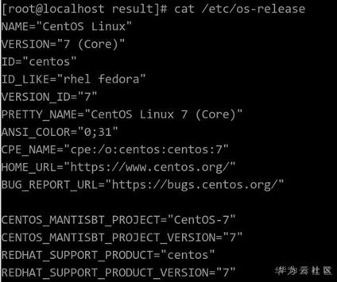
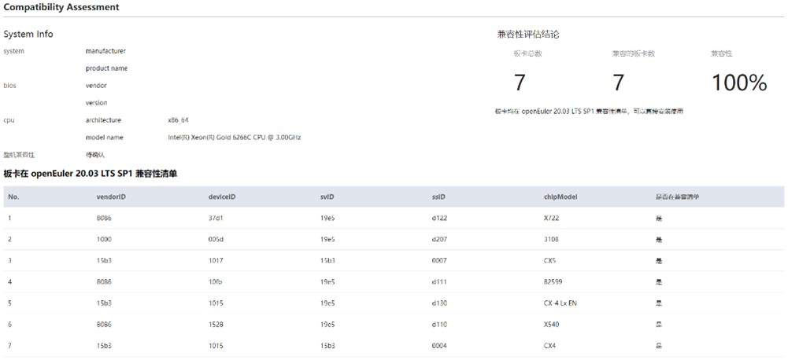

## 1 前言

作为一款免费的企业级 Linux 操作系统，自CentOS 8 宣布停止维护以来（2021年底），就引发行业的广泛关注。究其原因，不仅在于 CentOS 用户群体庞大，还在于迁移 CentOS 并不是简单的系统重新安装，而是需要对操作系统及其上搭载的应用软件和业务系统进行替代、适配、迁移和重构等。因此，如何高效安全且低风险地实现应用迁移，成为用户所关心的核心问题。

 
国内操作系统迁移方案很多，开源操作系统openEuler也是大家比较热议的话题之一。

openEuler 内核源于 Linux，它支持鲲鹏、X86等多种处理器，可充分释放计算芯片的潜能，广泛适用于数据库、大数据、云计算、人工智能等应用场景。openEuler 同时是兼容 CentOS 的国内主流开源操作系统之一，相较 CentOS ，openEuler对核内关键功能如进程调度、内存管理、IO读写进行了深度优化，同时在核外构筑了容器 iSula、虚拟化 StraitVirt、机密计算 SecGear、毕昇 JDK 等特性。

openEuler生态十分丰富。社区已有超过 300+ 伙伴加入，包含Intel、Marvel、新华三等知名企业，汇聚了从处理器、整机、基础软件、应用软件、行业客户等全产业链伙伴。当前已有国内外 14 家主流 OSV（麒麟、统信、麒麟信安、SUSE、普华等）均发布了基于 openEuler 的操作系统商业发行版；且发行产品已经广泛进入了政府、运营商、金融、电力等多个行业的核心系统。

今天，我们以X86硬件兼容性为例，来聊聊怎么将操作系统迁移为openEuler（本篇案例的版本为openEuler 20.03 LTS SP1）。


## 2 环境说明

硬件如下表：

| **项目** | **说明**                                    |
| ---------- | ----------------------------------------- |
| 服务器    | 2288H V5                                  |
| CPU    | Inter(R) Xeon(R) Gold 6266C CPU @ 3.00GHz |
| NIC卡   | CX5（CX5网卡是mellanox公司生产的一款网卡）              |
| RIAD卡  | LTS SAS 3108（3108raid卡是华为生产的一款raid卡）      |

操作系统如下所示：

| **项目**  | **说明**    |
| ---------------- | -------------- |
| Centos Linux | 7.9.2009（Core) |
| Kernel       | 3.10.0 x86_64 |

检查当前系统版本信息 `cat /etc/os-release`



## 3 软件运行和硬件兼容性评估工具：x2openEuler

openEuler社区提供了[x2openEuler工具](https://docs.openeuler.org/zh/docs/20.03_LTS_SP1/docs/thirdparty_migration/x2openEuleruseguide.html)，具有硬件评估、软件评估、系统配置评估的功能，其中硬件评估针对centos系统上正常运行的板卡在openEuler上兼容性，工具采集板卡信息生成html报告，直观快捷展示硬件的兼容性。
 
 下载x2openEuler工具：<https://www.openeuler.org/zh/other/migration/>


## 4 部署工具

```java
cd /opt/
rpm -ivh x2openEuler-2.0.0-1.x86_64.rpm
```

注意：安装rpm时需要使用root用户，且目前需要网络（用于下载安装依赖） 注意：根据提示安装依赖包如bzip2-devel等。

```java
su x2openEuler
x2openEuler redis-db -init
```

依次录入redis数据库的ip:127.0.0.1 端口：6379 数据库索引号（0-16）：0 密码（工具会对密码加密处理）：如果redis密码没有设置或者为空时，直接回车即可。

```java
x2openEuler init source_centos7.6-openEuler20.03-LTS-SP1.tar.gz
```

备注：x2openEuler使用rpm安装完成后会在`/opt/x2openEuler`目录下带有`source_centos7.6-openEuler20.03-LTS-SP1.tar.gz`这个默认资源包 需要支持`centos8.2`到`openEuler20.03-LTS-SP1`的评估，则需获取对应的静态资源包导入，如对应的资源包为`source_centos8.2-openEuler20.03-LTS-SP1.tar.gz`，导入此包命令：`x2openEuler init source_centos8.2-openEuler20.03-LTS-SP1.tar.gz`，请示情况选择对应的资源包。


## 5 硬件兼容性分析

```
x2openEuler hardware-analyse 
返回信息如下：
2021-11-30 09:41:20,865 - INFO - Log save directory: /var/log/x2openEuler
2021-11-30 09:41:20,887 - INFO - x2openEuler hardware-analyse
2021-11-30 09:41:20,888 INFO manager/get_param_config/179: Parameter configuration file loaded.
2021-11-30 09:41:20,905 INFO manager/get_regex_config/218: Regex pattern compiled.
2021-11-30 09:41:20,905 INFO manager/load_parsers/233: All builtin parsers loaded.
2021-11-30 09:41:20,905 INFO manager/load_parsers/236: All custom parsers loaded.
2021-11-30 09:41:21,254 INFO time_utils/wrapper/21: 0.35s taken for running function [get_data]
2021-11-30 09:41:21,269 WARNING list/parse_content/47: no data in ls_dev
2021-11-30 09:41:21,377 INFO time_utils/wrapper/21: 0.12s taken for running function [get_parsed_content]
2021-11-30 09:41:21,377 INFO manager/write_res/135: write to /opt/x2openEuler/_tmp_18ambppj_/run/9e81f536-517e-11ec-ae65-a01c8dfeddfa/sysconf/kernel_startup_param.json.
2021-11-30 09:41:21,378 INFO manager/write_res/135: write to /opt/x2openEuler/_tmp_18ambppj_/run/9e81f536-517e-11ec-ae65-a01c8dfeddfa/sysconf/syscall_interface.json.
2021-11-30 09:41:21,378 INFO manager/write_res/135: write to /opt/x2openEuler/_tmp_18ambppj_/run/9e81f536-517e-11ec-ae65-a01c8dfeddfa/sysconf/path.json.
2021-11-30 09:41:21,379 INFO manager/write_res/135: write to /opt/x2openEuler/_tmp_18ambppj_/run/9e81f536-517e-11ec-ae65-a01c8dfeddfa/sysconf/port.json.
2021-11-30 09:41:21,379 INFO manager/write_res/135: write to /opt/x2openEuler/_tmp_18ambppj_/run/9e81f536-517e-11ec-ae65-a01c8dfeddfa/sysconf/device_interface.json.
2021-11-30 09:41:21,380 INFO manager/write_res/135: write to /opt/x2openEuler/_tmp_18ambppj_/run/9e81f536-517e-11ec-ae65-a01c8dfeddfa/sysconf/linux_command.json.
2021-11-30 09:41:21,387 INFO manager/write_res/135: write to /opt/x2openEuler/_tmp_18ambppj_/run/9e81f536-517e-11ec-ae65-a01c8dfeddfa/sysconf/hardware_configure.json.
2021-11-30 09:41:21,396 INFO manager/write_res/135: write to /opt/x2openEuler/_tmp_18ambppj_/run/9e81f536-517e-11ec-ae65-a01c8dfeddfa/sysconf/proc.json.
2021-11-30 09:41:21,404 INFO manager/write_res/135: write to /opt/x2openEuler/_tmp_18ambppj_/run/9e81f536-517e-11ec-ae65-a01c8dfeddfa/sysconf/system_configure.json.
2021-11-30 09:41:21,408 INFO manager/write_res/135: write to /opt/x2openEuler/_tmp_18ambppj_/run/9e81f536-517e-11ec-ae65-a01c8dfeddfa/sysconf/system_service.json.
2021-11-30 09:41:21,412 INFO manager/write_res/135: write to /opt/x2openEuler/_tmp_18ambppj_/run/9e81f536-517e-11ec-ae65-a01c8dfeddfa/sysconf/kernel_configure.json.
2021-11-30 09:41:21,426 - INFO - Producing report...
2021-11-30 09:41:21,427 - INFO - Generate Success! The results are saved: /opt/x2openEuler/output/hw_compat_report-20211130094121.html
返回信息中，“/opt/x2openEuler/output/hw_compat_report-20211130094121.html“为评估报告文件。
```

## 6 硬件评估结果分析

硬件兼容性评估报告可直接展示每项板卡是否兼容以及整机是否兼容，有任意一项不在兼容清单里的则需要适配。



通过VID、DID、SVID、SSID四元组值可确定唯一一种板卡。从上面的截图可以看到，每一项板卡都可以在南向兼容性清单查询到，因此该硬件服务器从centos迁移到openEuler 20.03 LTS SP1可以实施。

原文链接：
<https://www.openeuler.org/zh/blog/randy1568/X86%20hardware%20compatibility%20assessment%20migration%20guide.html>

参考材料：
<https://www.openeuler.org/zh/other/migration/>


