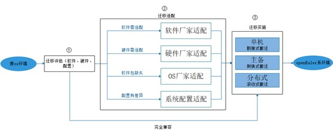
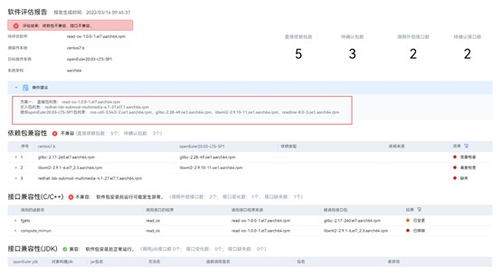
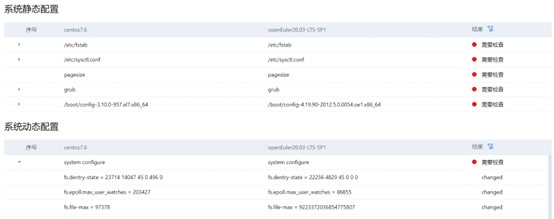
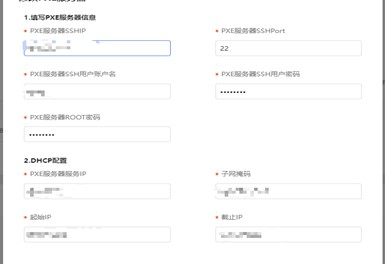

## 写在前面的话

去年年底，Centos 8 停止维护更新的消息，在业内掀起极大的关注。迁移CentOS也不是一件简单的事儿；不仅要对操作系统及其上搭载的应用软件和业务系统进行替代、适配、迁移和重构等，还要综合考虑其稳定性、安全性和灵活性，还有一些迁移成本、伙伴生态等等。

在进行一些调研后，我们使用了openEuler。其原因在于，首先操作系统openEuler内核源于Linux，支持场景多样，比较稳定易用。其次，它有比较完善的兼容评估与分析工具，减少我们部分工作。再有，它的伙伴生态发展比较不错，处理器、整机、基础软件、应用软件、行业客户等都能覆盖到，也有十来家主流osv基于 openEuler 操作系统发布了商业发行版。社区开发者也比较活跃，提及的疑问或需求都能给予一些支持。而且openEuler是开源的，从成本到应用，总体感觉比较不错。

下面，我来分享下从Centos迁移到openEuler的经验；希望对大家有帮助。


## 1. 迁移概述

### 1.1 迁移注意事项

**迁移关键问题：**

CentOS到openEuler，无论是内核、基础软件包都有了一定的变化。分析认为OS迁移面临的关键问题有三个：

   1. 已有软件是否可以在新系统运行，包括软件安装与功能是否存在问题
   2. 硬件与新OS是否兼容
   3. 已经做过的相关配置是否可以继承到新OS

迁移实施注意事项：
   1. 可能对现网业务有影响，请提前规划时间窗口和资源
   2. 现网数据请注意备份
   3. 建议严格按照文中描述的流程执行
   4. 现网业务建议专业人员实施迁移，建议联系操作系统厂家运维人员提供技术指导

### 1.2 迁移方案综述


操作系统和应用软件的迁移主要包含如下三步：

① 迁移评估（软件、硬性、配置）

② 迁移适配（软件适配、硬性适配、依赖缺失、配置差异）

③ 迁移实施（单机、主备、分布式）

openEuler社区的迁移工具x2openEuler提供了`①迁移评估能力`，根据评估结果，如果存在兼容性问题，参照本文中的`②迁移适配指导`，适配完成后开展`③迁移实施`；如果无兼容性问题，则直接开展`③迁移实施`，通用方案包含新增、扩容、原地替换三种场景以及单机、主备、分布式等软件形态。



## 2. 迁移评估

openEuler社区提供的[x2openEuler工具](https://repo.oepkgs.net/openEuler/rpm/openEuler-20.03-LTS-SP1/contrib/x2openEuler/)从如下角度分析并生成兼容性评估报告：

- 软件评估

  通过识别应用软件依赖的软件包清单信息，对rpm/tar/zip/gzip/jar/py/pyc/sh/bin应用进行扫描评估，并生成.html评估报告。

- 配置收集与评估

  支持对用户环境数据进行收集并生成json格式文件，支持收集硬件配置、配置接口、内核选项配置参数、系统配置参数（sysctl/proc/sys）、环境变量、服务、进程、端口、命令接口、系统调用项和设备驱动接口等信息，并完成配置信息分析评估。

- 硬件评估

  评估运行环境的整机（x86/aarch64）、整机板卡（RAID/NIC/FC/IB/GPU/SSD/TPM）是否在openEuler兼容性清单

工具详细使用方法和功能请参考[x2openEuler使用指南](https://docs.openeuler.org/zh/docs/20.03_LTS_SP1/docs/thirdparty_migration/x2openEuleruseguide.html)


### 2.1 安装迁移评估工具x2openEuler

根据架构下载最新版本工具

```
wget https://repo.oepkgs.net/openEuler/rpm/openEuler-20.03-LTS-SP1/contrib/x2openEuler/x86_64/Packages/x2openEuler-2.0.0-430.x86_64.rpm
```

安装x2openEuler工具

```
yum install x2openEuler-x.x-x.x86_64.rpm
```

### 2.2 应用软件兼容性评估

此处以评估read-os-1.0.0-1.el7.aarch64.rpm应用包并输出软件评估报告为例，请根据实际情况选择所需参数并替换为需要扫描的软件包或软件包目录。

```
x2openEuler scan read-os-1.0.0-1.el7.aarch64.rpm
```



根据报告提示，存在不兼容的依赖包和接口，请参考**本文3.1-3.2章节**完成适配。

### 2.3 硬件兼容性评估

此处以分析本地硬件资源信息为例，请根据实际情况选择分析本地硬件资源信息或外部导入硬件信息数据。

```
x2openEuler hardware-analyse
```


根据报告提示，存在不兼容的硬件，请参考**本文3.3章节**完成硬件适配。

### 2.4 配置兼容性评估

此处以评估本地配置信息为例，可根据实际情况选择所需参数并替换为需要进行评估的外部导入数据。

```
x2openEuler conf-analyse 
```



根据报告提示，存在有变化的配置需要检查，请参考**本文3.4章节**完成配置适配。

## 3.迁移适配

迁移适配工作从分析评估报告展开，针对报告里的错误详情实施不同的适配动作。

### 3.1 应用软件移植

以2.2章节`read-os-1.0.0-1.el7.aarch64.rpm评估报告`为例，从接口层面可知，调用的接口发生了变化，经过分析后该案例由于依赖了“已移除的接口”，


需要联系软件厂家或者自研软件责任方进行适配。

对于兼容的软件可直接使用。

### 3.2 OS软件包适配

以2.2章节`read-os-1.0.0-1.el7.aarch64.rpm评估报告`为例，发现依赖软件包中有缺失的包如下，


则需要参考[软件兼容性适配流程](https://gitee.com/openeuler/oec-application/blob/master/doc/openEuler%E7%A4%BE%E5%8C%BA%E5%BC%80%E6%BA%90%E8%BD%AF%E4%BB%B6%E9%80%82%E9%85%8D%E6%B5%81%E7%A8%8B.md)完成包引入。适配完成后，将软件包引入至软件仓库及根据需要刷新软件兼容性清单。

对于兼容的软件可直接使用。

### 3.3 硬件适配

以2.3章节`硬件评估报告`为例，“是否在兼容清单”存在“待确认”的硬件类型


需要参考[硬件兼容性测试服务](https://www.openeuler.org/zh/compatibility/hardware/)，引导硬件厂家或社区开展适配，适配完成后将适配驱动发布至软件所仓库及刷新兼容性清单。

“是否在兼容清单”为“是”的硬件表示已经过兼容性认证，直接执行下一步。

### 3.4 配置适配

分析配置评估报告，x2openEuler工具自动将系统配置分成静态和动态两种，用户仅需结合自身实际业务诉求和调优策略不同，对各项差异进行对比，选择需要修改的配置，编写自动化脚本，实现一键配置同步。

## 4.迁移实施（已有系统替换）

迁移实施前，需要提前熟悉软件部署架构及部署组网，针对性输出对应场景的迁移方案。目前 openEuler 提供主流场景的迁移方案，如大数据、分布式存储、虚拟化、容器、数据库软件，成功支撑多个行业用户完成迁移工作，具体迁移项目支撑请联系openEuler运维人员提供技术指导。搬迁实施过程主要包括停止业务、备份隔离、系统部署、配置同步、应用部署、业务割接核心步骤。

### 4.1停止业务

进行搬迁实施前需申请停机窗口和准备工作，根据业务场景和割接难度评估停机维护窗口。针对迁移实施中常见的单机、主备、分布式集群场景，不同应用软件可以做到短暂中断业务或完全不中断，具体场景需结合应用软件单独分析，常见的三种场景情况如下：

- 单机软件：业务中断，停机x小时

- 主备软件：不停机

- 分布式集群软件：不停机

### 4.2备份隔离

为保障搬迁过程业务应用安全性，防止搬迁过程信息的丢失，建议搬迁前做好备份，隔离是为了防止搬迁过程影响其他正常业务运行。针对不同业务场景执行容灾备份、网络隔离等可结合业务软件具体的特性进行实施，如Mysql数据库场景可通过xtrabackup等工具进行快速备份还原。

### 4.3系统部署

系统部署可使用系统部署工具进行自动化批量部署，大幅提升部署效率。部署过程可基于gkit工具搭建pxe服务器，同步配置文件后可快速完成安装过程：

1) 配置pxe服务器信息

   

2) 导入配置的模板，点击安装，自动配置pxe服务器

   

3) 确认Pxe服务状态为绿色，表示pxe服务器搭建完成

   

4) 进入服务器kvm，设置服务器从pxe启动并重启

   

5) 后续步骤自动完成，同步配置ip，OS安装完成

### 4.4配置同步

根据3.4章节完成适配动作，基于x2openEuler集成的配置工具，实现系统参数配置、服务状态配置等一键同步，确保基础运行环境及状态信息同步移植，保证业务搬迁后系统运行环境状态一致。

### 4.5应用部署

应用部署前可将需要部署的应用打包成RPM包形式，通过编写应用部署安装脚本，在实验环境上进行验证，确保部署脚本的准确性。进行基础验证后，将脚本批量拷贝到待部署的服务器执行，完成自动化应用部署。针对主流的开源软件，如大数据、数据库、虚拟化、容器等，openEuler已提供完备的rpm包，可直接应用和部署。

### 4.6业务割接

业务割接环节需要考虑应用软件自身特性，做到尽可能小的中断业务并高效的平滑搬迁。针对单机、主备、分布式集群软件，业务割接过程如下：

1. 单机软件

    该类软件迁移时，涉及到操作系统切换，基本上会中断业务，需要充分考虑迁移造成的中断影响，选择合适的窗口进行迁移，可考虑借助备用服务器，割接式迁移。割接完成后保留原节点x天观察新节点业务运行情况，x天后销毁原节点。

2. 主备软件

  该类软件迁移时，可不中断业务，先备后主，基于主备状态同步机制，平滑迁移。隔离备节点服务器，在备节点重新部署OS和业务，基于主备同步机制实现主备同步，然后通过主备倒换将升级OS后的备节点倒换成主节点，另一个节点以相同的方式进行OS升级。主备切换后观察新的主节点业务运行情况，x天后替换备节点。

3. 分布式集群软件

  该类软件迁移时，不中断业务，可以基于分布式软件自带的伸缩扩容机制，通过滚动替代的方式实现平滑迁移。将需要替换的节点进行隔离，然后重新部署新的OS，再加入到原有集群中。切换1/3数量节点后观察新的节点业务运行情况，x天后替换旧节点。

## 5.迁移实施（新增扩容）

### 5.1系统部署

系统部署可使用系统部署工具进行自动化批量部署，大幅提升部署效率。部署过程可基于gkit工具搭建pxe服务器，同步配置文件后可快速完成安装过程：

1. 配置pxe服务器信息

    

2. 导入配置的模板，点击安装，自动配置pxe服务器

   

3. 确认Pxe服务状态为绿色，表示pxe服务器搭建完成

    

4. 进入服务器kvm，设置服务器从pxe启动并重启

    

5. 后续步骤自动完成，同步配置ip，OS安装完成

### 5.2配置同步

根据【迁移适配】章节完成适配动作，基于x2openEuler集成的配置工具，实现系统参数配置、服务状态配置等一键同步，确保基础运行环境及状态信息同步移植，保证业务搬迁后系统运行环境状态一致。

### 5.3应用部署

应用部署前可将需要部署的应用打包成RPM包形式，通过编写应用部署安装脚本，在实验环境上进行验证，确保部署脚本的准确性。进行基础验证后，将脚本批量拷贝到待部署的服务器执行，完成自动化应用部署。针对主流的开源软件，如大数据、数据库、虚拟化、容器等，openEuler已提供完备的rpm包，可直接应用和部署。

## 6.总结

以上便是我的一些经验与方法，虽然过程中存在很多疑问，但好在社区开发者很热情，整体来说比较顺畅。分享这篇博客，也是希望能给朋友们带来一些帮助，一起交流交流。

参考链接：
<https://www.openeuler.org/zh/other/migration/>


